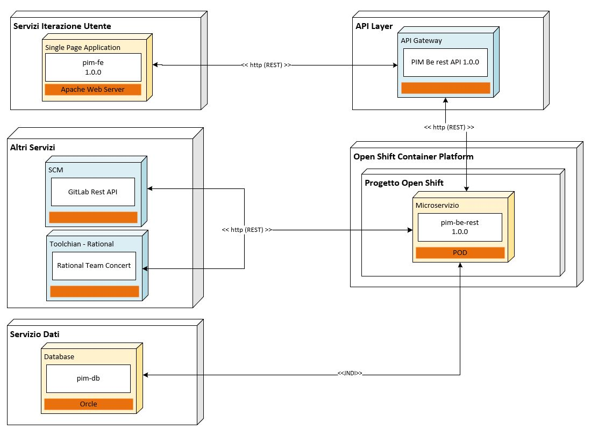

### 8.3. Diagramma dei componenti della soluzione comprensivo delle integrazioni

Di seguito è rappresentato il diagramma di tutte le componenti architetturali applicative che entrano in gioco (Figura 3) per poter soddisfare i requisiti di integrazione che devono essere previsti dalla soluzione in oggetto

Figura 3