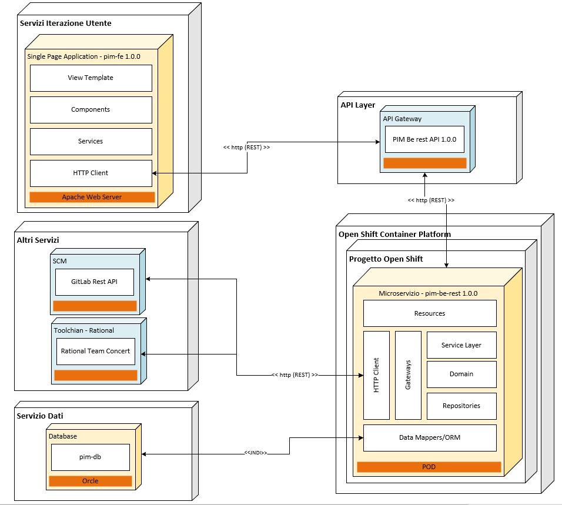
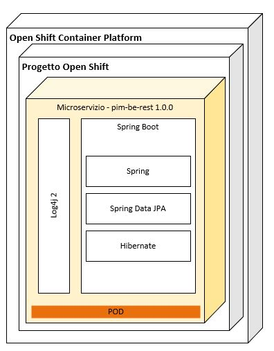

### 8.4. Diagramma dei componenti comprensivo dei layers applicativi

Di seguito in Figura 4 e 5 sono rappresentati alcuni zoom di dettaglio sui componenti di Single Page Application e di Microservizio per evidenziare i layers applicativi ed alcuni framework previsti per lo sviluppo che andranno a costituire i due prodotti oggetto di sviluppo. Questo tipo di approccio a layers consente di limitare l'accoppiamento e le duplicazioni funzionali, conferendo scalabilità e manutenibilità all'applicazione.

Figura 4

Figura 5