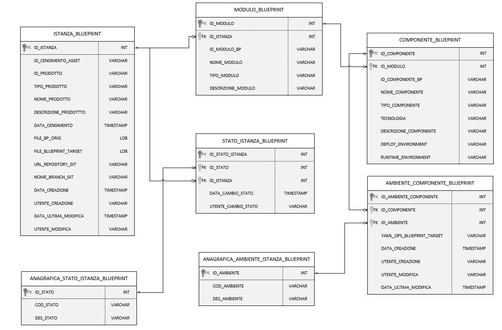

### 11. Modello dati della soluzione Product Infrastructure Management - PIM - FASE 1
Il modello logico dei dati della soluzione PIM ha il compito di organizzare e memorizzare le informazioni dell'applicazione secondo un modello entità relazione.

La base dati dell'applicazione è costituita da un insieme di tabelle che contengono i dei dati necessari alla gestione dell'applicazione e la memorizzazione delle informazioni riguardanti le blueprint architetturali nelle fasi previste dal workflow applicativo.

 

Di seguito sono descritte le tabelle e gli attibuti del modello dati:

 

### Tabella ISTANZA_BLUEPRINT

|    Attributo             |   Tipo    | Descrizione                                                                                 |
|  ----------------------  |  -------  | ------------------------------------------------------------------------------------------- | 
|   ID_ISTANZA             |    INT    | Identificativo autogenerato                                                                 |
|   ID_CENSIMENTO_ASSET    |  VARCHAR  | Identificativo del censimento del prodotto come assett su EA di RTC                         |
|   ID_PRODOTTO*            |  VARCHAR  | Valore dell'attributo *idProdotto* presente nella testata dell'istanza di blueprint imporata, fornita in input durante l'importazione |
|   TIPO_PRODOTTO*          |  VARCHAR  | Valore dell'attributo *tipoProdotto* presente nella testata dell'istanza di blueprint imporata, fornita in input durante l'importazione |
|   NOME_PRODOTTO*          |  VARCHAR  | Valore dell'attributo *nomeProdotto* presente nella testata dell'istanza di blueprint imporata, fornita in input durante l'importazione |
|   DESCRIZIONE_PRODOTTO*   |  VARCHAR  | Valore dell'attributo *descrizioneProdotto* presente nella testata dell'istanza di blueprint imporata, fornita in input durante l'importazione |
|   DATA_DENSIMENTO*        | TIMESTAMP | Valore dell'attributo *dataCensimento* presente nella testata dell'istanza di blueprint imporata, fornita in input durante l'importazione |
|   FILE_BLUEPRINT_ORIG    |   FILE    | File di istanza di bleuprint associato al censimento e recuperato da GitLab durante l'importazione    |
|   FILE_BLUEPRINT_TARGET  |   FILE    | File di istanza di bleuprint associato elaborato ed archiviato su GitLab con il passaggio di stato in *Archiviato*      |
|   URL_REPOSITORY_GIT     |  VARCHAR  | Valore del path/url del repository git dove presente il file archiviato, generata a partire da un base path url/*idProdotto* / configurazione-prodotto.git |
|   NOME_BRANCH_GIT        |  VARCHAR  | Valore del nome del branch del repository git dove presente il file archiviato. Requisito in fase di definizione, al momento valore fisso = master |
|   DATA_CREAZIONE         | TIMESTAMP | Data di creazione dell'occorrenza in tabella                                                |
|   UTENTE_CREAZIONE       |  VARCHAR  | Utente applicativo che ha eseguito la creazione dell'occorrenza in tabella                  |
|   DATA_ULTIMA_MODIFICA   | TIMESTAMP | Data di ultimo aggiornamento dell'occorrenza in tabella                                     |         
|   UTENTE_ULTIMA_MODIFICA |  VARCHAR  | Utente applicativo che ha eseguito l'ultimo aggiornamento dell'occorrenza in tabella        |

 
* L'interfaccia di scambio con il servizio RTC è in fase di definizione, gli attributi evidenziati sono parte di una prima ipotesi di interfaccia.  
  Il servizio dovrebbe ricevere in input il codice dell'evento di censimento dell'asset e fornire in output le informazioni evidenziate con il carattere * 
 
 

### Tabella ANAGRAFICA_STATO_ISTANZA_BLUEPRINT

|    Attributo               |   Tipo    | Descrizione                                                                                 |
|  ----------------------    |  -------  | ------------------------------------------------------------------------------------------- | 
|   ID_STATO                 |    INT    | Identificativo                                                                                |
|   COD_STATO                |    INT    | Codice dello stato applicativo dell'istanza di blueprint e delle relative versioni - ambiente |
|   DESCRIZIONE_STATO        |  VARCHAR  | Descrizione dello stato applicativo dell'istanza di blueprint e delle relative versioni - ambiente |

 
* I valori previsti in tabella sono quelli relativi agli stati previsti per le istanze di blueprint e descritti nella US 1 
  (Da Compilare | In Compilazione | Compilata | Archiviata | In Esercizio | Dismessa)

### [User Story - Id 1 - Statai Applicativi Istanza Blueprint](user_stories/us_1_stati_applicativi_istanza_blueprint.md)

 
 

### Tabella STATO_ISTANZA_BLUEPRINT

|    Attributo               |   Tipo    | Descrizione                                                                                 |
|  ----------------------    |  -------  | ------------------------------------------------------------------------------------------- | 
|   ID_STATO_ISTANZA         |    INT    | Identificativo autogenerato                                                                 |
|   ID_ISTANZA               |    INT    | Identificativo dell'occorrenza ISTANZA_BLUEPRINT a cui lo stato fa riferimento (chiave esterna ISTANZA_BLUEPRINT)   |
|   ID_STATO                 |    INT    | Identificativo dell'occorrenza ANAGRAFICA_STATO a cui l'istanza fa riferimento (chaive esterna ANAGRAFICA_STATO) |
|   DATA_CAMBIO_STATO        | TIMESTAMP | Data dell'inserimento dell'occorrenza in tabella, al primo inserimento ed ad ognicambio di stato  | 
|   UTENTE_CAMBIO_STATO      |  VARCHAR  | Utente che ha eseguito l'inserimento dell'occorrenza in tabella, al primo inserimento ed ad ognicambio di stato  |

 
 

### Tabella MODULO_BLUEPRINT

|    Attributo               |   Tipo    | Descrizione                                                                                 |
|  ----------------------    |  -------  | ------------------------------------------------------------------------------------------- | 
|   ID_MODULO                |    INT    | Identificativo autogenerato                                                                 |
|   ID_ISTANZA               |    INT    | Identificativo dell'occorrenza ISTANZA_BLUEPRINT a cui lo fa riferimento (chiave esterna ISTANZA_BLUEPRINT)   |
|   ID_MODULO_BP             |  VARCHAR  | Valore dell'attributo *idModulo* presente nella blueprint |
|   NOME_MODULO              |  VARCHAR  | Valore dell'attributo *nomeModulo* presente nella blueprint |
|   TIPO_MODULO              |  VARCHAR  | Valore dell'attributo *tipoModulo* presente nella blueprint |
|   DESCRIZIONER_MODULO      |  VARCHAR  | Valore dell'attributo *descrizioneModulo* presente nella blueprint |

 
 

### Tabella COMPONENTE_BLUEPRINT

|    Attributo               |   Tipo    | Descrizione                                                                                 |
|  ----------------------    |  -------  | ------------------------------------------------------------------------------------------- | 
|   ID_COMPONENTE            |    INT    | Identificativo autogenerato                                                                 |
|   ID_MODULO                |    INT    | Identificativo dell'occorrenza MODULO_BLUEPRINT a cui lo fa riferimento (chiave esterna MODULO_BLUEPRINT)   |
|   ID_COMPONENTE_BP         |  VARCHAR  | Valore dell'attributo *idComponente* presente nella blueprint |
|   NOME_COMPONENTE          |  VARCHAR  | Valore dell'attributo *nomeComponente* presente nella blueprint |
|   TIPO_COMPONENTE          |  VARCHAR  | Valore dell'attributo *tipoComponente* presente nella blueprint |
|   DESCRIZIONER_COMPONENTE  |  VARCHAR  | Valore dell'attributo *descrizioneComponente* presente nella blueprint |
|   TECNOLOGIA               |  VARCHAR  | Valore dell'attributo *tecnologia* presente nella blueprint |
|   DEPLOY_ENVIRONMENT       |  VARCHAR  | Valore dell'attributo *deployEnvironment* presente nella blueprint |
|   RUNTIME_ENVIRONMENT      |  VARCHAR  | Valore dell'attributo *runtimeEnvironment* presente nella blueprint |

 
 

### Tabella AMBIENTE_COMPONENTE_BLUEPRINT

|    Attributo                |   Tipo    | Descrizione                                                                                 |
|  ----------------------     |  -------  | ------------------------------------------------------------------------------------------- | 
|   ID_AMBIENTE_COMPONENTE    |    INT    | Identificativo autogenerato                                                                 |
|   ID_COMPONENTE             |    INT    | Identificativo dell'occorrenza COMPONENTE_BLUEPRINT a cui lo fa riferimento (chiave esterna COMPONENTE_BLUEPRINT)   |
|   ID_AMBIENTE               |    INT    | Identificativo dell'occorrenza ANAGRAFICA_AMBIENTE_ISTANZA_BLUEPRINT                        |
|   YAML_OPS_BLUEPRINT_TARGET |  VARCHAR  | Frammento YAML di configurazione del componente della blueprint |
|   DATA_CREAZIONE            | TIMESTAMP | Data di creazione dell'occorrenza in tabella                                                |
|   UTENTE_CREAZIONE          |  VARCHAR  | Utente applicativo che ha eseguito la creazione dell'occorrenza in tabella                  |
|   DATA_ULTIMA_MODIFICA      | TIMESTAMP | Data di ultimo aggiornamento dell'occorrenza in tabella                                     |         
|   UTENTE_ULTIMA_MODIFICA    |  VARCHAR  | Utente applicativo che ha eseguito l'ultimo aggiornamento dell'occorrenza in tabella        |

 
  

### Tabella ANAGRAFICA_AMBIENTE_ISTANZA_BLUEPRINT

|    Attributo               |   Tipo    | Descrizione                                                                                  |
|  ----------------------    |  -------  | -------------------------------------------------------------------------------------------  | 
|   ID_AMBIENTE              |    INT    | Identificativo                                                                               |
|   COD_AMBIENTE             |    INT    | Codice alfanumerico che idenfica l'ambiente                                                  |
|   DESCRIZIONE_AMBIENTE     |  VARCHAR  | Descrizione dell'ambiente di riferimento                                                     |

 
* I valori previsti in tabella sono quelli relativi agli ambienti previsti per le istanze di blueprint, di seguito sono elencati il codice e la descrizione
  (ci - Integrazione, coll - Collaudo, cert - Certificazione, prod - Produzione)

 
 

### Diagramma entità relazione

Di seguito il diagramma relativo al modello dati previsto per l'applicazione:

 

[Download file visio del diagramma](../files/modello_dati_pim.vsdx)