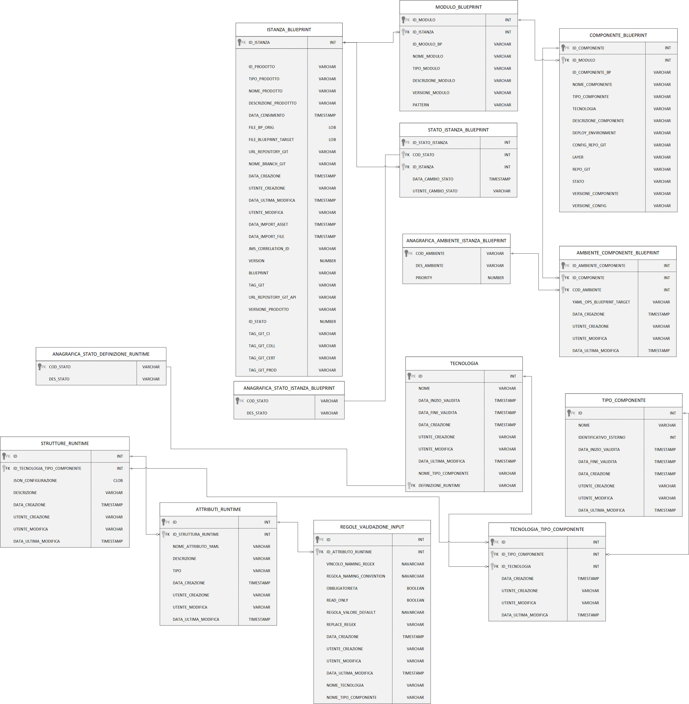

### 13 Modello dati della soluzione Product Infrastructure Management - PIM - FASE 3

Il modello logico dei dati della soluzione PIM ha il compito di organizzare e memorizzare le informazioni dell'applicazione secondo un modello entità relazione.

La base dati dell'applicazione è costituita da un insieme di tabelle che contengono i dei dati necessari alla gestione dell'applicazione e la memorizzazione delle informazioni riguardanti le infrastrutture di prodotto nelle fasi previste dal workflow applicativo.

 

Di seguito sono descritte le tabelle e gli attibuti del modello dati:

 

### Tabella ISTANZA_BLUEPRINT:

| Attributo              | Tipo      | Descrizione  |
| ---------------------- | --------- | ------------ |
| ID_ISTANZA             | INT       | Identificativo autogenerato |
| ID_PRODOTTO*           | VARCHAR   | Valore dell'attributo *idProdotto* presente nella testata dell'infrastruttura di prodotto importata, fornita in input durante l'importazione                                                                                             |
| TIPO_PRODOTTO*         | VARCHAR   | Valore dell'attributo *tipoProdotto* presente nella testata dell'infrastruttura di prodotto importata, fornita in input durante l'importazione                                                                                           |
| NOME_PRODOTTO*         | VARCHAR   | Valore dell'attributo *nomeProdotto* presente nella testata dell'infrastruttura di prodotto importata, fornita in input durante l'importazione                                                                                           |
| DESCRIZIONE_PRODOTTO*  | VARCHAR   | Valore dell'attributo *descrizioneProdotto* presente nella testata dell'infrastruttura di prodotto importata, fornita in input durante l'importazione                                                                                    |
| DATA_DENSIMENTO*       | TIMESTAMP | Valore dell'attributo *dataCensimento* presente nella testata dell'infrastruttura di prodotto importata, fornita in input durante l'importazione                                                                                         |
| FILE_BLUEPRINT_ORIG    | FILE      | File di infrastruttura di prodotto associato al censimento e recuperato da GitLab durante l'importazione                                                                                                                                |
| FILE_BLUEPRINT_TARGET  | FILE      | File di infrastruttura di prodotto associato elaborato ed archiviato su GitLab con il passaggio di stato in *Archiviato*                                                                                                                |
| URL_REPOSITORY_GIT     | VARCHAR   | Valore del path/url del repository git dove presente il file archiviato, generata a partire da un base path url/*idProdotto* / configurazione-prodotto.git |
| NOME_BRANCH_GIT        | VARCHAR   | Valore del nome del branch del repository git dove presente il file archiviato.      |
| DATA_CREAZIONE         | TIMESTAMP | Data di creazione dell'occorrenza in tabella                                                           |
| UTENTE_CREAZIONE       | VARCHAR   | Utente applicativo che ha eseguito la creazione dell'occorrenza in tabella             |
| DATA_ULTIMA_MODIFICA   | TIMESTAMP | Data di ultimo aggiornamento dell'occorrenza in tabella                         |
| UTENTE_ULTIMA_MODIFICA | VARCHAR   | Utente applicativo che ha eseguito l'ultimo aggiornamento dell'occorrenza in tabella                     |
| DATA_IMPORT_ASSET      | TIMESTAMP | Data di importazione dell'asset di infrastruttura di prodotto       |
| DATA_IMPORT_FILE       | TIMESTAMP | Data di importazione del file di infrastruttura di prodotto       |
| JMS_CORRELATION_ID     | VARCHAR   | JmsCorrelationId identificativo del messaggio in coda       |
| VERSION                | NUMBER    | Number versione       |
| BLUEPRINT              | VARCHAR   | Valore dell'attributo *blueprint* presente nella testate dell'infrastruttura di prodotto importata, fornita in input durante l'importazione      |
| TAG_GIT                | VARCHAR   | Tag Git per la definizione del file di infrastruttura definitivo (tutti i componenti di tutti gli ambienti compilati)               |
| URL_REPOSITORY_GIT_API | VARCHAR   | URL repository Git Api dove è contenuto il file di infrastruttura    |
| VERSIONE_PRODOTTO      | VARCHAR   | Valore dell'attributo *versioneProdotto* presente nella testata dell'infrastruttura di prodotto importata, fornita in input durante l'importazione         |
| ID_STATO               | NUMBER    | Identificativo dell'occorrenza ANAGRAFICA_STATO a cui l'istanza fa riferimento|
| TAG_GIT_CI             | VARCHAR   | Tag Git per la definizione dell'infrastruttura (completa o parziale) relativo all'ambiente CI|
| TAG_GIT_COLL           | VARCHAR   | Tag Git per la definizione dell'infrastruttura (completa o parziale) relativo all'ambiente COLL|
| TAG_GIT_CERT           | VARCHAR   | Tag Git per la definizione dell'infrastruttura (completa o parziale) relativo all'ambiente CERT|
| TAG_GIT_PROD           | VARCHAR   | Tag Git per la definizione dell'infrastruttura (completa o parziale) relativo all'ambiente PROD|

 
 

### Tabella ANAGRAFICA_STATO_ISTANZA_BLUEPRINT:

|    Attributo               |   Tipo    | Descrizione                                                                                 |
|  ----------------------    |  -------  | ------------------------------------------------------------------------------------------- |
|   COD_STATO                |    INT    | Codice dello stato applicativo dell'infrastrattura di prodotto e delle relative versioni - ambiente |
|   DESCRIZIONE_STATO        |  VARCHAR  | Descrizione dello stato applicativo dell'infrastrattura di prodotto e delle relative versioni - ambiente |

 
* I valori previsti in tabella sono quelli relativi agli stati previsti per le infrastrutture di prodotto e descritti nella US 1.1

[User Story - Id 1.1 - Stati Applicativi Infrastruttura di prodotto](../user_stories/us_1.1_stati_applicativi_infrastruttura_prodotto.md)

 
 

### Tabella STATO_ISTANZA_BLUEPRINT:

|    Attributo               |   Tipo    | Descrizione                                                                                 |
|  ----------------------    |  -------  | ------------------------------------------------------------------------------------------- | 
|   ID_STATO_ISTANZA         |    INT    | Identificativo autogenerato                                                                 |
|   ID_ISTANZA               |    INT    | Identificativo dell'occorrenza ISTANZA_BLUEPRINT a cui lo stato fa riferimento (chiave esterna ISTANZA_BLUEPRINT)|
|   COD_STATO                |    INT    | Identificativo dell'occorrenza ANAGRAFICA_STATO a cui l'istanza fa riferimento (chiave esterna ANAGRAFICA_STATO) |
|   DATA_CAMBIO_STATO        | TIMESTAMP | Data dell'inserimento dell'occorrenza in tabella, al primo inserimento ed ad ogni cambio di stato  | 
|   UTENTE_CAMBIO_STATO      |  VARCHAR  | Utente che ha eseguito l'inserimento dell'occorrenza in tabella, al primo inserimento ed ad ognicambio di stato  |

 
 

### Tabella MODULO_BLUEPRINT:

|    Attributo              |   Tipo    | Descrizione                                                                                 |
|  ----------------------   |  -------  | ------------------------------------------------------------------------------------------- | 
|   ID_MODULO               |    INT    | Identificativo autogenerato                                                                 |
|   ID_ISTANZA              |    INT    | Identificativo dell'occorrenza ISTANZA_BLUEPRINT a cui lo fa riferimento (chiave esterna ISTANZA_BLUEPRINT)   |
|   ID_MODULO_BP            |  VARCHAR  | Valore dell'attributo *idModulo* presente nell'infrastruttura |
|   NOME_MODULO             |  VARCHAR  | Valore dell'attributo *nomeModulo* presente nell'infrastruttura |
|   TIPO_MODULO             |  VARCHAR  | Valore dell'attributo *tipoModulo* presente nell'infrastruttura |
|   VERSIONE_MODULO         |  VARCHAR  | Versione modulo  |
|   PATTERN                 |  VARCHAR  | Valore dell'attributo *pattern* presente nell'infrastruttura di prodotto importata, fornita in input durante l'importazione |
|   DESCRIZIONE_MODULO      |  VARCHAR  | Valore dell'attributo *descrizioneModulo* presente nell'infrastruttura|

 
 

### Tabella COMPONENTE_BLUEPRINT:

|    Attributo               |   Tipo    | Descrizione                                                                                 |
|  ----------------------    |  -------  | ------------------------------------------------------------------------------------------- | 
|   ID_COMPONENTE            |    INT    | Identificativo autogenerato                                                                 |
|   ID_MODULO                |    INT    | Identificativo dell'occorrenza MODULO_BLUEPRINT a cui lo fa riferimento (chiave esterna MODULO_BLUEPRINT)   |
|   ID_COMPONENTE_BP         |  VARCHAR  | Valore dell'attributo *idComponente* presente nell'infrastruttura |
|   NOME_COMPONENTE          |  VARCHAR  | Valore dell'attributo *nomeComponente* presente nell'infrastruttura |
|   TIPO_COMPONENTE          |  VARCHAR  | Valore dell'attributo *tipoComponente* presente nell'infrastruttura |
|   DESCRIZIONE_COMPONENTE   |  VARCHAR  | Valore dell'attributo *descrizioneComponente* presente nell'infrastruttura |
|   DEPLOY_ENVIRONMENT       |  VARCHAR  | Valore dell'attributo *deployEnvironment* presente nell'infrastruttura|
|   CONFIG_REPO_GIT          |  VARCHAR  | Valore dell'attributo *config-repoGit* presente nell'infrastruttura  |
|   LAYER                    |  VARCHAR  | Valore dell'attributo *layer* presente nell'infrastruttura  |
|   REPO_GIT                 |  VARCHAR  | Valore del path/url del repository git dove presente il file archiviato, generata a partire da un base path url/*idProdotto* / configurazione-prodotto.git  |
|   STATO                    |  VARCHAR  | /  |
|   TECNOLOGIA               |  VARCHAR  | Tecnologia associata al componente infrastrutturale  |
|   VERSIONE_COMPONENTE      |  VARCHAR  | Valore dell'attributo *versioneComponente* presente nell'infrastruttura |
|   VERSIONE_CONFIG          |  VARCHAR  | Valore dell'attributo *versioneConfig* presente nell'infrastruttura  |

 
 

### Tabella AMBIENTE_COMPONENTE_BLUEPRINT:

|    Attributo                |   Tipo    | Descrizione                                                                                 |
|  ----------------------     |  -------  | ------------------------------------------------------------------------------------------- | 
|   ID_AMBIENTE_COMPONENTE    |    INT    | Identificativo autogenerato                                                                 |
|   ID_COMPONENTE             |    INT    | Identificativo dell'occorrenza COMPONENTE_BLUEPRINT a cui lo fa riferimento (chiave esterna COMPONENTE_BLUEPRINT)   |
|   AMBIENTE                  |  VARCHAR  | Valore dell'ambiente per cui è destinato il frammento di configurazione del componente dell'infrastruttura di prodotto (Integrazione | Collaudo | Certificazione | Esercizio) |
|   YAML_OPS_BLUEPRINT_TARGET |  VARCHAR  | Frammento YAML di configurazione del componente dell'infrastruttura di prodotto |
|   DATA_CREAZIONE            | TIMESTAMP | Data di creazione dell'occorrenza in tabella                                                |
|   UTENTE_CREAZIONE          |  VARCHAR  | Utente applicativo che ha eseguito la creazione dell'occorrenza in tabella                  |
|   DATA_ULTIMA_MODIFICA      | TIMESTAMP | Data di ultimo aggiornamento dell'occorrenza in tabella                                     |         
|   UTENTE_ULTIMA_MODIFICA    |  VARCHAR  | Utente applicativo che ha eseguito l'ultimo aggiornamento dell'occorrenza in tabella        |

 
  

### Tabella ANAGRAFICA_AMBIENTE_ISTANZA_BLUEPRINT:

|    Attributo               |   Tipo    | Descrizione                                                                                  |
|  ----------------------    |  -------  | -------------------------------------------------------------------------------------------  |
|   COD_AMBIENTE             |    INT    | Codice alfanumerico che idenfica l'ambiente                                                  |
|   DESCRIZIONE_AMBIENTE     |  VARCHAR  | Descrizione dell'ambiente di riferimento                                                     |
|   PRIORITY                 |  NUMBER   | Priorità/ordine da assegnare agli ambienti |

 
* I valori previsti in tabella sono quelli relativi agli ambienti previsti per le infrastrutture di prodotto, di seguito sono elencati il codice e la descrizione:
  (ci - Integrazione, coll - Collaudo, cert - Certificazione, prod - Produzione)

 
 

### Tabella TECNOLOGIA: (da aggiornare)
|Attributo  |Tipo  |Descrizione  |
|---------|---------|---------|
|ID     |INT         |Identificativo autogenerato           |
|NOME     |VARCHAR         |Nome della tecnologia gestita dall'applicativo         |
|DATA_CREAZIONE     |TIMESTAMP         |Data di creazione dell'occorrenza in tabella           |
|UTENTE_CREAZIONE     |VARCHAR         |Utente applicativo che ha eseguito la creazione dell'occorrenza in tabella         |
|UTENTE_MODIFICA     |VARCHAR          |Data di ultimo aggiornamento dell'occorrenza in tabella          |
|DATA_ULTIMA_MODIFICA     |TIMESTAMP         |Utente applicativo che ha eseguito l'ultimo aggiornamento dell'occorrenza in tabella         |
|NOME_TIPO_COMPONENTE|VARCHAR| Nome del tipo componente associato alla specifica tecnologia|
|HAVE_RUNTIME|CHAR |Valore necessario (1/0) per comprendere se la tecnologia ha una sezione di runtime environment compilabile|

 
 

### Tabella ANAGRAFICA_STATO_DEFINIZIONE_RUNTIME: (da aggiornare)

 
 

### Tabella TIPO_COMPONENTE: (da aggiornare)
|Attributo  |Tipo  |Descrizione  |
|---------|---------|---------|
|ID       |INT         |Identificativo autogenerato          |
|NOME     |VARCHAR         |Nome del componente gestito dall'applicativo         |
|DATA_CREAZIONE     |TIMESTAMP         |Data di creazione dell'occorrenza in tabella         |
|UTENTE_CREAZIONE     |VARCHAR         |Utente applicativo che ha eseguito la creazione dell'occorrenza in tabella           |
|UTENTE_MODIFICA     |VARCHAR          |Data di ultimo aggiornamento dell'occorrenza in tabella           |
|DATA_ULTIMA_MODIFICA     |TIMESTAMP         |Utente applicativo che ha eseguito l'ultimo aggiornamento dell'occorrenza in tabella         |

 
 

### Tabella TECNOLOGIA_TIPO_COMPONENTE: (da aggiornare)
|Attributo  |Tipo  |Descrizione  |
|---------|---------|---------|
|ID       |INT         |Identificativo autogenerato          |
|ID_TIPO_COMPONENTE|INT |Identificativo dell'occorrenza TIPO_COMPONENTE a cui lo stato fa riferimento (chiave esterna TIPO_COMPONENTE)    |
|ID_TECNOLOGIA   |INT   |Identificativo dell'occorrenza TECNOLOGIA a cui lo stato fa riferimento (chiave esterna TECNOLOGIA)    |
|DATA_CREAZIONE     |TIMESTAMP         |Data di creazione dell'occorrenza in tabella         |
|UTENTE_CREAZIONE     |VARCHAR         |Utente applicativo che ha eseguito la creazione dell'occorrenza in tabella           |
|UTENTE_MODIFICA     |VARCHAR          |Data di ultimo aggiornamento dell'occorrenza in tabella           |
|DATA_ULTIMA_MODIFICA     |TIMESTAMP         |Utente applicativo che ha eseguito l'ultimo aggiornamento dell'occorrenza in tabella         |

 
 

### Tabella STRUTTURE_RUNTIME: (da aggiornare)
|Attributo  |Tipo  |Descrizione  |
|---------|---------|---------|
|ID       |INT         |Identificativo autogenerato          |
|ID_TECNOLOGIA_TIPO_COMPONENTE|INT |Identificativo dell'occorrenza TECNOLOGIA_TIPO_COMPONENTE a cui lo stato fa riferimento (chiave esterna TECNOLOGIA_TIPO_COMPONENTE)  |
|JSON_CONFIGURAZIONE|CLOB|JSON per il salvataggio e caricamento del form dinamico |
|DESCRIZIONE|VARCHAR |Eventuale descrizione (Non obligatoria) |
|DATA_CREAZIONE     |TIMESTAMP         |Data di creazione dell'occorrenza in tabella         |
|UTENTE_CREAZIONE     |VARCHAR         |Utente applicativo che ha eseguito la creazione dell'occorrenza in tabella           |
|UTENTE_MODIFICA     |VARCHAR          |Data di ultimo aggiornamento dell'occorrenza in tabella           |
|DATA_ULTIMA_MODIFICA     |TIMESTAMP         |Utente applicativo che ha eseguito l'ultimo aggiornamento dell'occorrenza in tabella         |

 
 

### Tabella ATTRIBUTI_RUNTIME: (da aggiornare)
|Attributo  |Tipo  |Descrizione  |
|---------|---------|---------|
|ID       |INT         |Identificativo autogenerato          |
|ID_STRUTTURA_RUNTIME|INT|Identificativo dell'occorrenza STRUTTURE_RUNTIME a cui lo stato fa riferimento (chiave esterna STRUTTURE_RUNTIME) |
|NOME_ATTRIBUTO_YAML     |VARCHAR         |Nome dell'attributo contenuto nel file YAML         |
|DESCRIZIONE     |VARCHAR         |Eventuale descrizione specifica attribuita all'attributo YAML (Non obligatoria)         |
|TIPO|VARCHAR|Tipologia di attributo gestito (testuale, numerico, booleano) |
|DATA_CREAZIONE     |TIMESTAMP         |Data di creazione dell'occorrenza in tabella         |
|UTENTE_CREAZIONE     |VARCHAR         |Utente applicativo che ha eseguito la creazione dell'occorrenza in tabella           |
|UTENTE_MODIFICA     |VARCHAR          |Data di ultimo aggiornamento dell'occorrenza in tabella           |
|DATA_ULTIMA_MODIFICA     |TIMESTAMP         |Utente applicativo che ha eseguito l'ultimo aggiornamento dell'occorrenza in tabella         |
 
 
 

### Tabella REGOLE_VALIDAZIONE_INPUT: (da aggiornare)
|Attributo  |Tipo  |Descrizione  |
|---------|---------|---------|
|ID     |INT         |Identificativo autogenerato           |
|ID_ATTRIBUTI_RUNTIME     |INT         |Identificativo dell'occorrenza ATTRIBUTI_RUNTIME a cui lo stato fa riferimento (chiave esterna ATTRIBUTI_RUNTIME)          |
|VINCOLO_NAMING_REGEX     |VARCHAR         |Vincolo Naming Convention (Non obligatorio). Se non è stato specificato nessun vincolo il campo rimane vuoto (NULL)        |
|REGOLA_NAMING_CONVENTION |VARCHAR         |Regola Naming Convention (Non obligatoria). Se non è stata specificata nessuna regola di naming il campo rimane vuoto (NULL)         |
|OBLIGATORIETA'     |BOOLEAN         |Eventuale obligatorietà del valore (Specificare SI/NO)          |
|REGOLA_VALORE_DEFAULT     |VARCHAR         |Valore predefinito da applicare. (Non obligatorio) Se non è stato specificato nessun valore di default il campo rimane vuoto (NULL)         |
|DATA_CREAZIONE     |TIMESTAMP         |Data di creazione dell'occorrenza in tabella           |
|UTENTE_CREAZIONE     |VARCHAR         |Utente applicativo che ha eseguito la creazione dell'occorrenza in tabella         |
|UTENTE_MODIFICA     |VARCHAR          |Data di ultimo aggiornamento dell'occorrenza in tabella          |
|DATA_ULTIMA_MODIFICA     |TIMESTAMP   |Utente applicativo che ha eseguito l'ultimo aggiornamento dell'occorrenza in tabella         |
|NOME_TECNOLOGIA|VARCHAR |Nome della tecnologia associata alla regola di validazione |
|NOME_TIPO_COMPONENTE|VARCHAR |Nome del tipo componente associata alla regola di validazione |
|READ_ONLY|BOOLEAN|Eventuale valore di sola lettura (Specificare SI/NO)|
|REPLACE_REGEX|VARCHAR|Carattere/i da sostituire nel valore di default|

 
 

### Diagramma entità relazione

Di seguito il diagramma relativo al modello dati previsto per l'applicazione:

 

[Download file visio del diagramma](../files/modello_dati_pim_FASE3.vsdx)