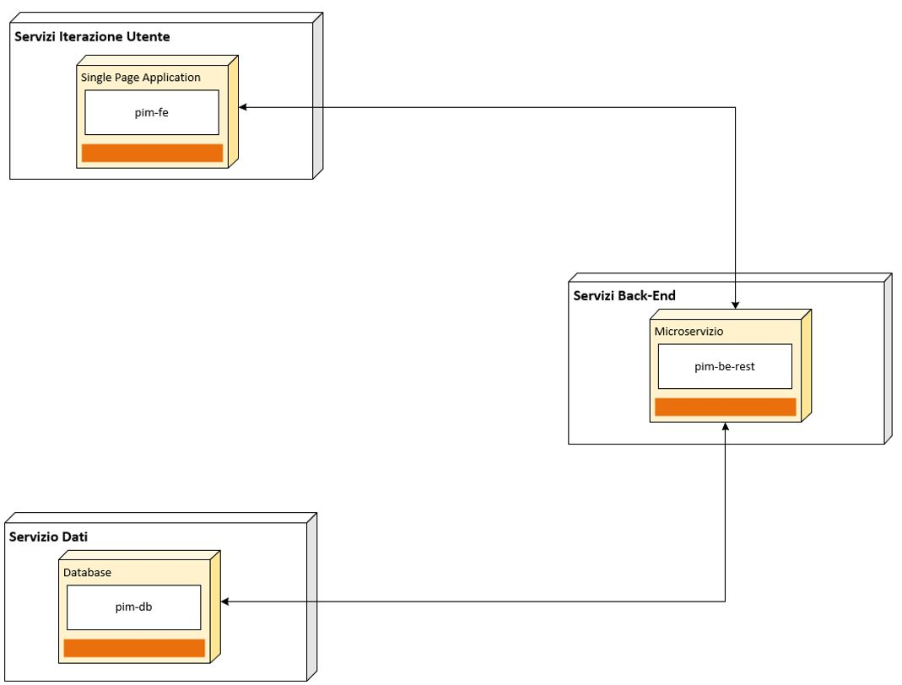

## 8. Soluzione Product Infrastructure Management - PIM

La soluzione prevede l’implementazione di un’applicazione che permetta l’erogazione delle funzionalità di alto livello indicate nel Par.4.2 mediante interfaccia web. Tali requisiti saranno oggetto di approfondimento durante le fasi di analisi di dettaglio e di review, saranno inoltre documentate in relative Feature e User Stories.

La soluzione dovrà coesistere ed all’occorrenza integrarsi nell’attuale processo ed ecosistema di applicazioni presenti per la gestione della *Toolchain*.

L’architettura di alto livello della soluzione prevede le componenti descritte di seguito e rappresentate nel diagramma in Figura 1:

-   Un modulo di front-end che implementa le funzionalità applicative di UI ed integrazione con il modulo di back-end

-   Un modulo di back-end che implementa le funzionalità applicative di gestione, la persistenza delle informazioni su base dati e le necessarie integrazioni con altri sistemi.

Figura 1