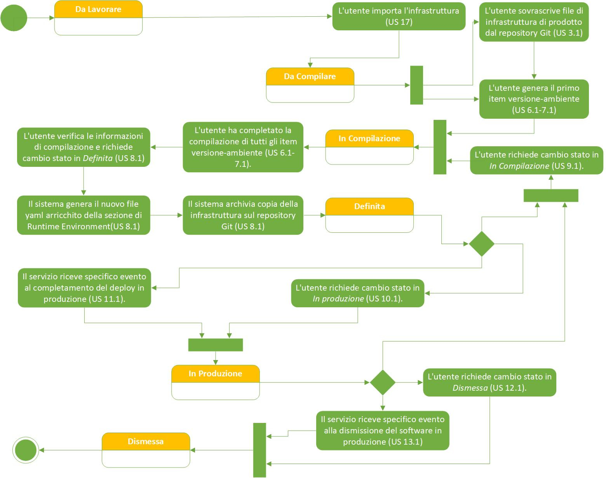

# User Story - Id 1.1 - Stati Applicativi Infrastruttura di prodotto

## Descrizione

- COME: utente con ruolo OPS o con ruolo ADMIN

- DEVO POTER: eseguire le funzionalità previste di gestione che prevedono il cambio di stato dell'infrastruttura di prodotto

- AL FINE DI: poter gestire correttamente il workflow previsto per la gestione del ciclo di vita dell'infrastruttura di prodotto
  
 

Di seguito sono riportate le descrizioni degli stati del workflow previsto per il ciclo di vita dell'infrastruttura di prodotto
 

| Stato           |  Descrizione                                                                               |  Trigger Cambio Stato|
|-----------------|--------------------------------------------------------------------------------------------|-------|
| Da Lavorare    |  Il file dell'infrastuttura di prodotto è pronto per essere lavorato con download dal repository GitLab. |Il file dell'infrastruttura di prodotto viene prelevato ed eliminato dalla coda per essere gestito: l'utente importa informazioni relative all'infrastruttura di prodotto direttamente dal repository GitLab  |
| Da Compilare    |  Il file dell'infrastruttura di prodotto è stato importato dal repository GitLab, la compilazione delle informazioni da parte dell'utente non è ancora iniziata. | L'utente ha scaricato il file. Quest'ultimo è pronto per essere compilato|
| In Compilazione |  Il file dell'infrastruttura di prodotto è stato identificato tra quelli importati a sistema ed è in corso la sua compilazione da parte dell'utente   |  L'utente genera il primo item versione-ambiente oppure clicca sullo specifico pulsante per fare avanzare il file nello stato *Infrastruttura Definita* |
| Definita      | Il file dell'infrastruttura di prodotto è stato definito dall'utente e contestualmente archiviato sul sistema SCM Git  | L'utente verifica le informazioni di compilazione e richiede cambio stato in *Definita* |
| In Esercizio    | Il software legato al ticket RTC di deploy è stato rilasciato in ambiente di esercizio  | L'utente richiede cambio stato in *In Esercizio* oppure Il servizio riceve specifico evento da altro sistema al completamento del deploy in esercizio  |
| Dismessa        | Il software rilasciato associato all'infrastruttura di prodotto è stata dismessa dall'ambiente di esercizio | L'utente richiede cambio stato in *Dismessa* oppure il servizio riceve specifico evento da altro sistema alla dismissione del software in esercizio     |

 
 

## Riferimenti

Di seguito i riferimenti e/o collegamenti ad altre US che prevedono un cambio di stato previto dal workflow

## Criteri di accettazione

Non Applicabile

## Controlli e vincoli

Non Applicabile

## Trigger

Non Applicabile

## Pre-Requisiti

Non Applicabile

## Data Model

Non Applicabile

## Diagrammi

Di seguito il diagrama a stati del workflow previsto per il ciclo di vita dell'Infrastruttura di prodotto.
 
 

 
[Download file visio del diagramma](../files/diagramma_stati_applicazione_pim_1.1.vsdx)
