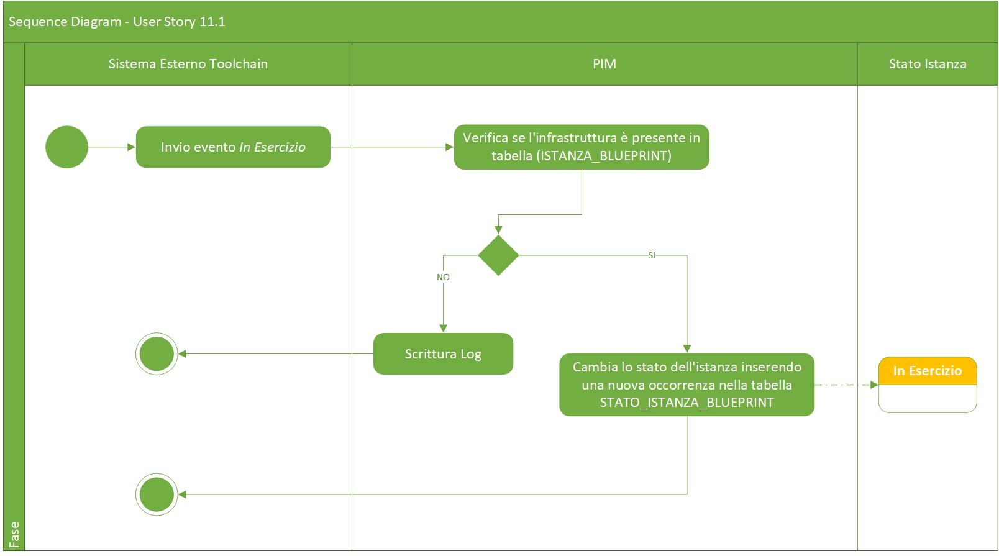

# User Story - Id 11.1 - Esercizio Infrastruttura di Prodotto - Ricezione Evento

## Descrizione

- COME: sistema di gestione delle infrastrutture di prodotto integrato nel processo di delivery

- DEVO POTER: gestire una evento di notifica per il passaggio di stato dell'infrastruttura di prodotto
  1. Il sistema riceve un messaggio REST con il quale viene richiesto un passaggio di stato per una specifica infrastruttura. 
  2. Il sistema: verifica lo stato dell'istanza se = *Definita* 
     2.1. Il sistema: cambia lo stato dell'istanza inserendo una nuova occorrenza nella tabella STATO_ISTANZA_BLUEPRINT con stato *In Esercizio* 
         Il dettaglio delle informazioni che il sistema deve persistere è stato modellato sulla struttura prevista del template delle infrastrutture e descritto nella sezione [Data Model della US](#data-model) 
 
- AL FINE DI: poter cambiare lo stato dell'infrastruttura di prodotto a seguito di un rilascio in esercizio del software del prodotto di riferimento.

## Riferimenti

Non definiti

## Criteri di accettazione

- DATO: un messaggio REST di cambio stato

- QUANDO: a seguito di un rilascio in esercizio del software del prodotto di riferimento

- QUINDI: 
  - Il sistema deve permettere di poter cambiare lo stato dell'infrastruttura di prodotto.
  - Al termine delle operazioni il sistema dovrà aver inserito una occorrenza nelle seguenti tabelle: STATO_ISTANZA_BLUEPRINT  

 

## Controlli e vincoli

Al momento sono previsti i seguenti controlli/vincoli:
- Il passaggio di stato a *In Esercizio* pùo essere eseguito solo per le istanze in stato *Definita*

## Trigger

Esigenza di indicare che il software afferente ad una specifica infrastruttura di prodotto è stata rilasciata in ambiente di esercizio.

## Pre-Requisiti

L'utente ha eseguito l'accesso autenticandosi sul portale intranet

## Data Model

Di seguito è descritta la porzione di modello dati a cui fa riferimento la funzionalità illustrata nella user story.  

### Tabella ISTANZA_BLUEPRINT:

| Attributo              | Tipo      | Descrizione  |
| ---------------------- | --------- | ------------ |
| ID_ISTANZA             | INT       | Identificativo autogenerato |
| ID_PRODOTTO*           | VARCHAR   | Valore dell'attributo *idProdotto* presente nella testata dell'infrastruttura di prodotto importata, fornita in input durante l'importazione                                                                                             |
| TIPO_PRODOTTO*         | VARCHAR   | Valore dell'attributo *tipoProdotto* presente nella testata dell'infrastruttura di prodotto importata, fornita in input durante l'importazione                                                                                           |
| NOME_PRODOTTO*         | VARCHAR   | Valore dell'attributo *nomeProdotto* presente nella testata dell'infrastruttura di prodotto importata, fornita in input durante l'importazione                                                                                           |
| DESCRIZIONE_PRODOTTO*  | VARCHAR   | Valore dell'attributo *descrizioneProdotto* presente nella testata dell'infrastruttura di prodotto importata, fornita in input durante l'importazione                                                                                    |
| DATA_DENSIMENTO*       | TIMESTAMP | Valore dell'attributo *dataCensimento* presente nella testata dell'infrastruttura di prodotto importata, fornita in input durante l'importazione                                                                                         |
| FILE_BLUEPRINT_ORIG    | FILE      | File di infrastruttura di prodotto associato al censimento e recuperato da GitLab durante l'importazione                                                                                                                                |
| FILE_BLUEPRINT_TARGET  | FILE      | File di infrastruttura di prodotto associato elaborato ed archiviato su GitLab con il passaggio di stato in *Archiviato*                                                                                                                |
| URL_REPOSITORY_GIT     | VARCHAR   | Valore del path/url del repository git dove presente il file archiviato, generata a partire da un base path url/*idProdotto* / configurazione-prodotto.git |
| NOME_BRANCH_GIT        | VARCHAR   | Valore del nome del branch del repository git dove presente il file archiviato.      |
| DATA_CREAZIONE         | TIMESTAMP | Data di creazione dell'occorrenza in tabella                                                           |
| UTENTE_CREAZIONE       | VARCHAR   | Utente applicativo che ha eseguito la creazione dell'occorrenza in tabella             |
| DATA_ULTIMA_MODIFICA   | TIMESTAMP | Data di ultimo aggiornamento dell'occorrenza in tabella                         |
| UTENTE_ULTIMA_MODIFICA | VARCHAR   | Utente applicativo che ha eseguito l'ultimo aggiornamento dell'occorrenza in tabella                     |
| DATA_IMPORT_ASSET      | TIMESTAMP | Data di importazione dell'asset di infrastruttura di prodotto       |
| DATA_IMPORT_FILE       | TIMESTAMP | Data di importazione del file di infrastruttura di prodotto       |
| JMS_CORRELATION_ID     | VARCHAR   | JmsCorrelationId identificativo del messaggio in coda       |
| VERSION                | NUMBER    | Number versione       |
| BLUEPRINT              | VARCHAR   | Valore dell'attributo *blueprint* presente nella testate dell'infrastruttura di prodotto importata, fornita in input durante l'importazione      |
| TAG_GIT                | VARCHAR   | Tag Git per la definizione del file di infrastruttura definitivo (tutti i componenti di tutti gli ambienti compilati)               |
| URL_REPOSITORY_GIT_API | VARCHAR   | URL repository Git Api dove è contenuto il file di infrastruttura    |
| VERSIONE_PRODOTTO      | VARCHAR   | Valore dell'attributo *versioneProdotto* presente nella testata dell'infrastruttura di prodotto importata, fornita in input durante l'importazione         |
| ID_STATO               | NUMBER    | Identificativo dell'occorrenza ANAGRAFICA_STATO a cui l'istanza fa riferimento|
| TAG_GIT_CI             | VARCHAR   | Tag Git per la definizione dell'infrastruttura (completa o parziale) relativo all'ambiente CI|
| TAG_GIT_COLL           | VARCHAR   | Tag Git per la definizione dell'infrastruttura (completa o parziale) relativo all'ambiente COLL|
| TAG_GIT_CERT           | VARCHAR   | Tag Git per la definizione dell'infrastruttura (completa o parziale) relativo all'ambiente CERT|
| TAG_GIT_PROD           | VARCHAR   | Tag Git per la definizione dell'infrastruttura (completa o parziale) relativo all'ambiente PROD|

 
 

### Tabella STATO_ISTANZA_BLUEPRINT

|    Attributo               |   Tipo    | Descrizione                                                                                 |
|  ----------------------    |  -------  | ------------------------------------------------------------------------------------------- | 
|   ID_STATO_ISTANZA         |    INT    | Identificativo autogenerato                                                                 |
|   ID_ISTANZA               |    INT    | Identificativo dell'occorrenza ISTANZA_BLUEPRINT a cui lo stato fa riferimento (chiave esterna ISTANZA_BLUEPRINT)|
|   COD_STATO                |    INT    | Identificativo dell'occorrenza ANAGRAFICA_STATO a cui l'istanza fa riferimento (chiave esterna ANAGRAFICA_STATO) |
|   DATA_CAMBIO_STATO        | TIMESTAMP | Data dell'inserimento dell'occorrenza in tabella, al primo inserimento ed ad ogni cambio di stato  | 
|   UTENTE_CAMBIO_STATO      |  VARCHAR  | Utente che ha eseguito l'inserimento dell'occorrenza in tabella, al primo inserimento ed ad ognicambio di stato  |

 
 

## Diagrammi

Di seguito il sequence diagram che illustra le azioni previste dalla User Story
 

 

[Download file visio del sequence diagram della user story ](../files/sequence_diagram_us_11.1.vsdx)
