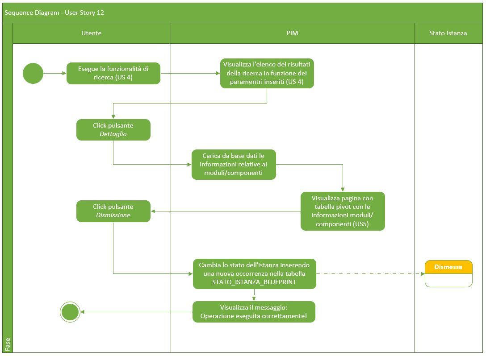
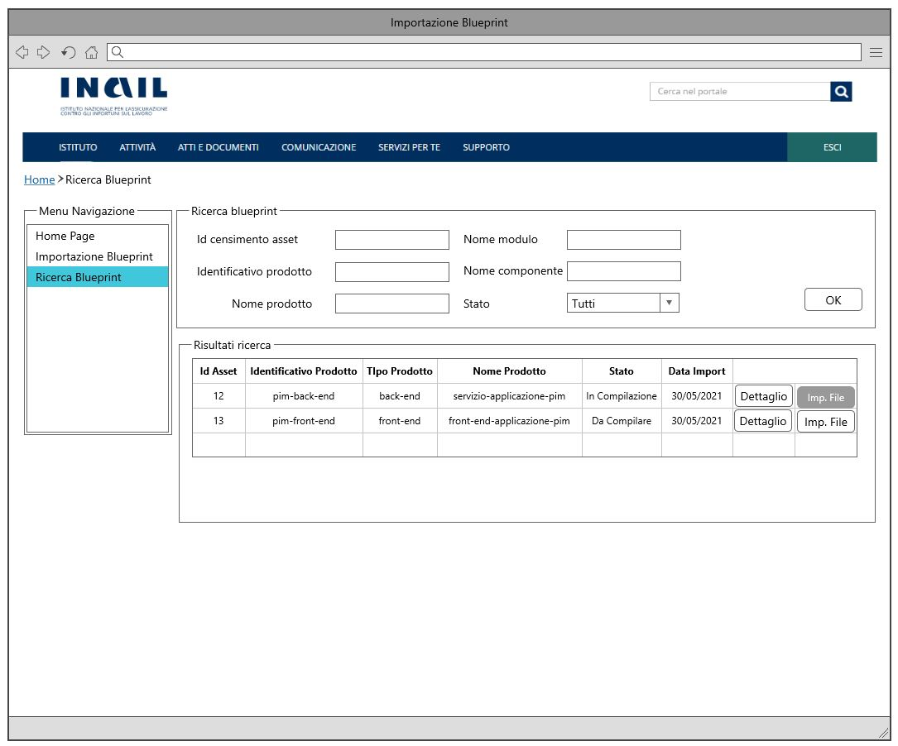
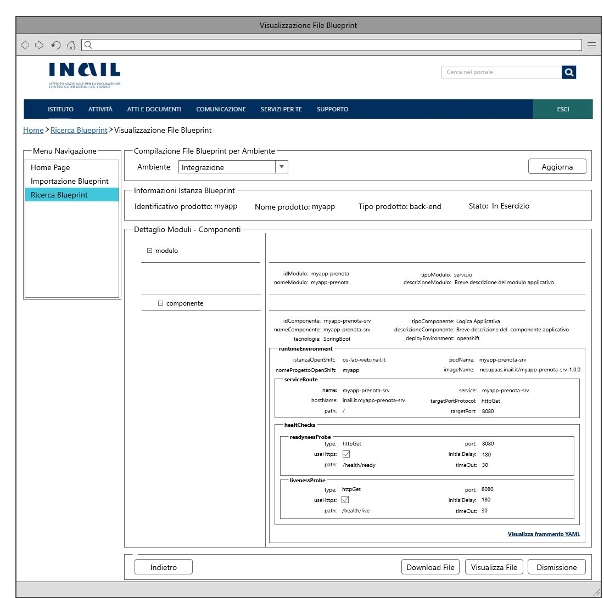
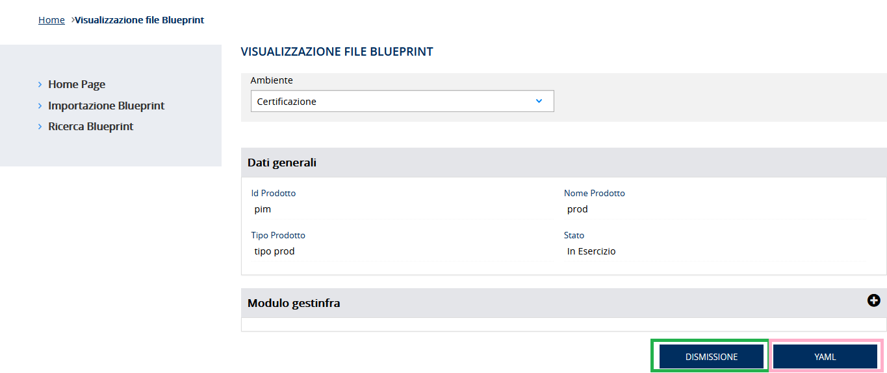
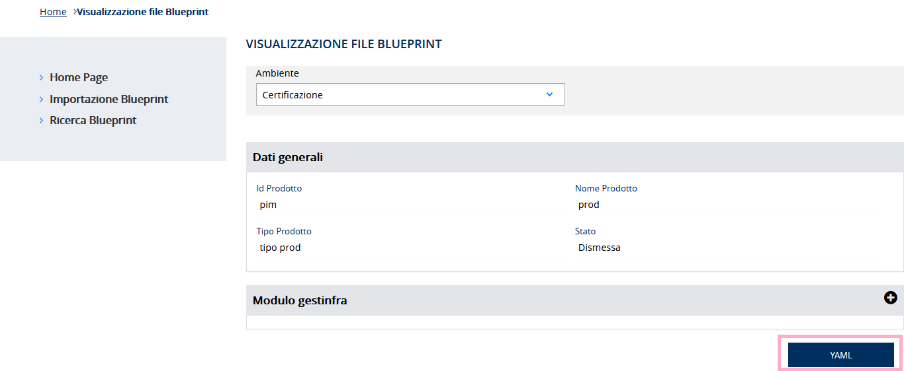

# User Story - Id 12 - Dismissione Istanza Blueprint

## Descrizione

- COME: utente con ruolo OPS o con ruolo ADMIN

- DEVO POTER: eseguire la funzionalità di compilazione delle configurazioni dei componenti definiti nel file dell'istanza di blueprint per uno specifico ambiente.
  1. Accedo alla funzionalità di Ricerca Istanza Blueprint [(US 4)](us_4_ricerca_istanza_blueprint.md) ed eseguo la funzionalità di ricerca per identificare l'evento di censimento asset oppure l'identificativo del prodotto/asset RTC di cui eseguire il cambio stato. [(UI 12.1)](#user-interface)
  2. Il sistema esegue la funzionalità di ricerca in archivio [(US 4)](us_4_ricerca_istanza_blueprint.md)
  3. Il sistema visualizza l'elenco dei risultati della ricerca in funzione dei paramentri inseriti [(US 4)](us_4_ricerca_istanza_blueprint.md) [(UI 12.2)](#user-interface)
  4. Identifico l'item di interesse dai risultati della ricerca: 
    4.1 clicco su apposito pulsante Dettaglio per una istanza in stato *In Esercizio*  [(UI 12.3)](#user-interface)
    4.2 il sistema esegue la [US 5](us_5_visualizzazione_istanza_blueprint.md) 
  5. Sulla pagina visualizzata, clicco il pulsante *Dismissione*, visibile solo se lo stato dell'istanza di blueprint è in stato *In Esercizio*.
  6. Il sistema: cambia lo stato dell'istanza inserendo una nuova occorrenza nella tabella STATO_ISTANZA_BLUEPRINT con stato *Dismessa* 
     Il dettaglio delle informazioni che il sistema deve persistere è stato modellato sulla struttura prevista del template delle blueprint e descritto nella sezione [Data Model della US](#data-model) 
  7. Il sistema visualizza il messaggio: "Operazione eseguita correttamente!" 
 
- AL FINE DI: poter cambiare lo stato dell'istanza della blueprint a seguito di una dismissione del software rilasciato in precedenza in esercizio.

## Riferimenti

Di seguito i riferimenti e/o collegamenti ad altre US citate in questa

### [User Story - Id 4 - Ricerca Istanza di Blueprint](user_stories/us_4_ricerca_istanza_blueprint.md)
### [User Story - Id 5 - Visualizzazione Istanza di Blueprint](user_stories/us_5_visualizzazione_istanza_blueprint.md)

## Criteri di accettazione

- DATO: un codice evento di censimento asset oppure ad un identificativo del prodotto/asset RTC

- QUANDO: l'utente OPS o ADMIN ha esigenza di segnalare un cambio di stato per l'istanza della blueprint a seguito di una dismissione del software rilasciato in precedenza in esercizio.

- QUINDI: 
  - Il sistema deve permettere di poter cambiare lo stato per l'istanza della blueprint.
  - Al termine delle operazioni il sistema dovrà aver inserito una occorrenza nelle seguenti tabelle: STATO_ISTANZA_BLUEPRINT  

 

## Controlli e vincoli

Al momento sono previsti i seguenti controlli/vincoli:
- Il passaggio di stato a *Dismessa* pùo essere eseguito solo per le istanze in stato *In Esercizio*

                         
 

## Trigger

Esigenza di indicare che il software afferente ad una specifica istanza di blueprint inprecedenza rilasciata in ambiente di esercizio è stata dismessa.

## Pre-Requisiti

L'utente ha eseguito l'accesso autenticandosi sul portale intranet

## Data Model

Di seguito è descritta la porzione di modello dati a cui fa riferimento la funzionalità illustrata nella user story.  

 
 

- Tabella ISTANZA_BLUEPRINT

|    Attributo             |   Tipo    | Descrizione                                                                                 |
|  ----------------------  |  -------  | ------------------------------------------------------------------------------------------- | 
|   ID_ISTANZA             |    INT    | Identificativo autogenerato                                                                 |
|   ID_CENSIMENTO_ASSET    |  VARCHAR  | Identificativo del censimento del prodotto come assett su EA di RTC                         |
|   ID_PRODOTTO*            |  VARCHAR  | Valore dell'attributo *idProdotto* presente nella testata dell'istanza di blueprint imporata, fornita in input durante l'importazione |
|   TIPO_PRODOTTO*          |  VARCHAR  | Valore dell'attributo *tipoProdotto* presente nella testata dell'istanza di blueprint imporata, fornita in input durante l'importazione |
|   NOME_PRODOTTO*          |  VARCHAR  | Valore dell'attributo *nomeProdotto* presente nella testata dell'istanza di blueprint imporata, fornita in input durante l'importazione |
|   DESCRIZIONE_PRODOTTO*   |  VARCHAR  | Valore dell'attributo *descrizioneProdotto* presente nella testata dell'istanza di blueprint imporata, fornita in input durante l'importazione |
|   DATA_DENSIMENTO*        | TIMESTAMP | Valore dell'attributo *dataCensimento* presente nella testata dell'istanza di blueprint imporata, fornita in input durante l'importazione |
|   FILE_BLUEPRINT_ORIG    |   FILE    | File di istanza di bleuprint associato al censimento e recuperato da GitLab durante l'importazione    |
|   FILE_BLUEPRINT_TARGET  |   FILE    | File di istanza di bleuprint associato elaborato ed archiviato su GitLab con il passaggio di stato in *Archiviato*      |
|   URL_REPOSITORY_GIT     |  VARCHAR  | Valore del path/url del repository git dove presente il file archiviato, generata a partire da un base path url/*idProdotto* / configurazione-prodotto.git |
|   NOME_BRANCH_GIT        |  VARCHAR  | Valore del nome del branch del repository git dove presente il file archiviato. Requisito in fase di definizione, al momento valore fisso = master |
|   DATA_CREAZIONE         | TIMESTAMP | Data di creazione dell'occorrenza in tabella                                                |
|   UTENTE_CREAZIONE       |  VARCHAR  | Utente applicativo che ha eseguito la creazione dell'occorrenza in tabella                  |
|   DATA_ULTIMA_MODIFICA   | TIMESTAMP | Data di ultimo aggiornamento dell'occorrenza in tabella                                     |         
|   UTENTE_ULTIMA_MODIFICA |  VARCHAR  | Utente applicativo che ha eseguito l'ultimo aggiornamento dell'occorrenza in tabella        |

 
 

### Tabella STATO_ISTANZA_BLUEPRINT

|    Attributo               |   Tipo    | Descrizione                                                                                 |
|  ----------------------    |  -------  | ------------------------------------------------------------------------------------------- | 
|   ID_STATO_ISTANZA         |    INT    | Identificativo autogenerato                                                                 |
|   ID_ISTANZA               |    INT    | Identificativo dell'occorrenza ISTANZA_BLUEPRINT a cui lo stato fa riferimento (chiave esterna ISTANZA_BLUEPRINT)   |
|   ID_STATO                 |    INT    | Identificativo dell'occorrenza ANAGRAFICA_STATO a cui l'istanza fa riferimento (chaive esterna ANAGRAFICA_STATO) |
|   DATA_CAMBIO_STATO        | TIMESTAMP | Data dell'inserimento dell'occorrenza in tabella, al primo inserimento ed ad ognicambio di stato  | 
|   UTENTE_CAMBIO_STATO      |  VARCHAR  | Utente che ha eseguito l'inserimento dell'occorrenza in tabella, al primo inserimento ed ad ognicambio di stato  |

 
 

## Diagrammi

Di seguito il sequence diagram che illustra le azioni previste dalla User Story
 

 

[Download file visio del sequence diagram della user story ](../files/sequence_diagram_us_12.vsdx)

 
 

## User Interface Mockup

- UI 12.1

 
 

- UI 12.2

 
 

- UI 12.3

 
 

## Interfaccia Applicativa con Correlazione Chiamate ai Metodi Corrispondenti

Di seguito è riportata l'interfaccia applicativa (screen) Dismissione Istanza Blueprint di PIM prodotta nella FASE1 con conseguente correlazione alla chiamata al metodo della specifica funzionalità evidenziata, al fine di agevolare lo sviluppo della FASE2 (in fase di definizione).

Per l'"Esercizio Istanza Blueprint", oggetto della corrente US, è possibile passare dallo stato "in esercizio" allo stato "dismissione" cliccando sul GREEN BOX "Dismissione" (solo se lo stato corrente si trova "in esercizio"). Al click del GREEN BOX "dismissione" verrà richiamato il metodo PUT dismetti.

Il risultato garantisce il passaggio allo stato successivo "Dismessa" con conseguente possibilità di poter procedere alla consultazione del file YAML  cliccando sul ROSE BOX "YAML" (vedi [User Story - Id 6 - Compilazione Istanza Blueprint](us_6_compilazione_istanza_blueprint.md)). 

Nella tabella in basso, viene mostrato un riepilogo con relativa chiamata al metodo di tutti i buttons presentati in queste interfacce con relativo PATH: 

|Colore di riferimento|Pulsante Definito nell'Applicativo  |Tipologia Chiamata  |Nome chiamata | Path |Note|
|---------|---------|---------|---------|---------|---------|
|GREEN|Dismissione |PUT |dismetti 1 |{{baseUrl}}/pim-api/blueprint/:id/dismetti |/|
|ROSE|YAML |/ |/ |/ |vedi [User Story - Id 6 - Compilazione Istanza Blueprint](us_6_compilazione_istanza_blueprint.md)|
