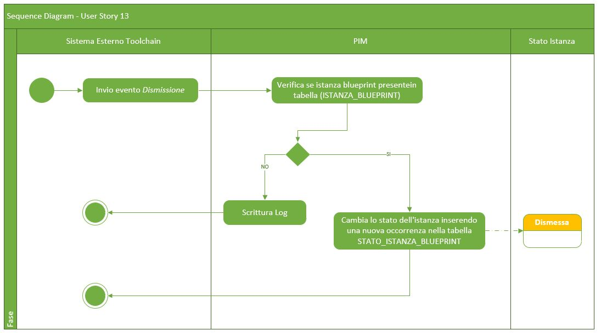

# User Story - Id 13 - Dismissione Istanza Blueprint

## Descrizione

- COME: sistema di gestione delle istanze delle blueprint integrato nel processo di delivery

- DEVO POTER: gestire una evento di notiifca per il passaggio di stato dell'istanza di blueprint
  1. Il sistema riceve un messaggio REST con il quale viene richiesto un pasaggio di stato per una specifica istanza di blueprint. Le informazioni contenute nel messaggio sono: Identificativo Prodotto, Identificativo Censimento Asset, Stato (*Dismissione*).
  2. Il sistema: verifica lo stato dell'istanza se = *In Esercizio* 
     2.1. Il sistema: cambia lo stato dell'istanza inserendo una nuova occorrenza nella tabella STATO_ISTANZA_BLUEPRINT con stato *Dismissione* 
         Il dettaglio delle informazioni che il sistema deve persistere è stato modellato sulla struttura prevista del template delle blueprint e descritto nella sezione [Data Model della US](#data-model) 
 
- AL FINE DI: poter cambiare lo stato dell'istanza della blueprint a seguito di una dismissione del software rilasciato in precedenza in esercizio.

## Riferimenti

## Criteri di accettazione

- DATO: un messaggio REST di cambio stato

- QUANDO: a seguito di una dismissione del software rilasciato in precedenza in esercizio.

- QUINDI: 
  - Il sistema deve permettere di poter cambiare lo stato per l'istanza della blueprint.
  - Al termine delle operazioni il sistema dovrà aver inserito una occorrenza nelle seguenti tabelle: STATO_ISTANZA_BLUEPRINT  

 

## Controlli e vincoli

Al momento sono previsti i seguenti controlli/vincoli:
- Il passaggio di stato a *Dismessa* pùo essere eseguito solo per le istanze in stato *In Esercizio*

                         
 

## Trigger

Esigenza di indicare che il software afferente ad una specifica istanza di blueprint inprecedenza rilasciata in ambiente di esercizio è stata dismessa.

## Pre-Requisiti

L'utente ha eseguito l'accesso autenticandosi sul portale intranet

## Data Model

Di seguito è descritta la porzione di modello dati a cui fa riferimento la funzionalità illustrata nella user story.  

 
 

- Tabella ISTANZA_BLUEPRINT

|    Attributo             |   Tipo    | Descrizione                                                                                 |
|  ----------------------  |  -------  | ------------------------------------------------------------------------------------------- | 
|   ID_ISTANZA             |    INT    | Identificativo autogenerato                                                                 |
|   ID_CENSIMENTO_ASSET    |  VARCHAR  | Identificativo del censimento del prodotto come assett su EA di RTC                         |
|   ID_PRODOTTO*            |  VARCHAR  | Valore dell'attributo *idProdotto* presente nella testata dell'istanza di blueprint imporata, fornita in input durante l'importazione |
|   TIPO_PRODOTTO*          |  VARCHAR  | Valore dell'attributo *tipoProdotto* presente nella testata dell'istanza di blueprint imporata, fornita in input durante l'importazione |
|   NOME_PRODOTTO*          |  VARCHAR  | Valore dell'attributo *nomeProdotto* presente nella testata dell'istanza di blueprint imporata, fornita in input durante l'importazione |
|   DESCRIZIONE_PRODOTTO*   |  VARCHAR  | Valore dell'attributo *descrizioneProdotto* presente nella testata dell'istanza di blueprint imporata, fornita in input durante l'importazione |
|   DATA_DENSIMENTO*        | TIMESTAMP | Valore dell'attributo *dataCensimento* presente nella testata dell'istanza di blueprint imporata, fornita in input durante l'importazione |
|   FILE_BLUEPRINT_ORIG    |   FILE    | File di istanza di bleuprint associato al censimento e recuperato da GitLab durante l'importazione    |
|   FILE_BLUEPRINT_TARGET  |   FILE    | File di istanza di bleuprint associato elaborato ed archiviato su GitLab con il passaggio di stato in *Archiviato*      |
|   URL_REPOSITORY_GIT     |  VARCHAR  | Valore del path/url del repository git dove presente il file archiviato, generata a partire da un base path url/*idProdotto* / configurazione-prodotto.git  |
|   NOME_BRANCH_GIT        |  VARCHAR  | Valore del nome del branch del repository git dove presente il file archiviato. Requisito in fase di definizione, al momento valore fisso = master |
|   DATA_CREAZIONE         | TIMESTAMP | Data di creazione dell'occorrenza in tabella                                                |
|   UTENTE_CREAZIONE       |  VARCHAR  | Utente applicativo che ha eseguito la creazione dell'occorrenza in tabella                  |
|   DATA_ULTIMA_MODIFICA   | TIMESTAMP | Data di ultimo aggiornamento dell'occorrenza in tabella                                     |         
|   UTENTE_ULTIMA_MODIFICA |  VARCHAR  | Utente applicativo che ha eseguito l'ultimo aggiornamento dell'occorrenza in tabella        |

 
 

### Tabella STATO_ISTANZA_BLUEPRINT

|    Attributo               |   Tipo    | Descrizione                                                                                 |
|  ----------------------    |  -------  | ------------------------------------------------------------------------------------------- | 
|   ID_STATO_ISTANZA         |    INT    | Identificativo autogenerato                                                                 |
|   ID_ISTANZA               |    INT    | Identificativo dell'occorrenza ISTANZA_BLUEPRINT a cui lo stato fa riferimento (chiave esterna ISTANZA_BLUEPRINT)   |
|   ID_STATO                 |    INT    | Identificativo dell'occorrenza ANAGRAFICA_STATO a cui l'istanza fa riferimento (chaive esterna ANAGRAFICA_STATO) |
|   DATA_CAMBIO_STATO        | TIMESTAMP | Data dell'inserimento dell'occorrenza in tabella, al primo inserimento ed ad ognicambio di stato  | 
|   UTENTE_CAMBIO_STATO      |  VARCHAR  | Utente che ha eseguito l'inserimento dell'occorrenza in tabella, al primo inserimento ed ad ognicambio di stato  |

 
 

## Diagrammi

Di seguito il sequence diagram che illustra le azioni previste dalla User Story
 

 

[Download file visio del sequence diagram della user story ](../files/sequence_diagram_us_13.vsdx)
