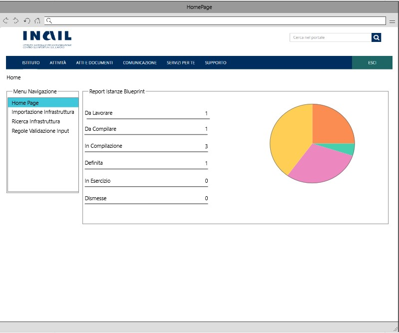

# User Story - Id 14.1 - Home Page Dashboard

## Descrizione

- COME: utente con ruolo OPS o con ruolo ADMIN

- DEVO POTER: avere la possibilità di visualizzare un riepilogo della numerosità delle occorrenze presenti a sistema
  1. Accedo alla funzionalità mediante apposita voce di menu
  2. Il sistema PIM propone una pagina web con un riepilogo della numerosità delle occorrenze presenti a sistema suddivise per stato [(UI 14.1)](#user-interface). Ogni stato è cliccabile attraverso un collegamento alla funzionalità di importazione per lo stato *Da lavorare* (vedi [US. 17](us_17_Importazione_infrastruttura_logica_di_Prodotto_(gestione_evento_su_coda_AMQ).md)) e ricerca per tutti gli altri stati (vedi [US. 4.1](us_4.1_ricerca_infrastruttura.md)) in modo da agevolare la navigazione all'interno del sistema.

- AL FINE DI: poter monitorare l'avanzamento delle infrastrutture di prodotto in lavorazione. Questa funzionalità rappresenta l'entry-point della navigazione applicativa.

## Riferimenti

Di seguito i riferimenti e/o collegamenti ad altre US citate in questa

### [User Story - Id 17 - Importazione Infrastruttura Logica Di Prodotto (Gestione Evento su Coda AMQ)](us_17_Importazione_infrastruttura_logica_di_Prodotto_(gestione_evento_su_coda_AMQ).md)
### [User Story - Id 4.1 - Ricerca Infrastruttura](us_4.1_ricerca_infrastruttura.md)

## Criteri di accettazione

- DATO: un set di infrastrutture di prodotto presenti in archivio

- QUANDO: l'utente OPS o ADMIN esegue l'accesso all'applicazione

- QUINDI: il sistema deve permettere la visualizzazione di un riepilogo della numerosità delle occorrenze presenti a sistema

## Controlli e vincoli

Non presente/i

## Trigger

Esigenza di visualizzare un riepilogo della numerosità delle occorrenze presenti a sistema per poter monitorare l'avanzamento delle infrastrutture di prodotto in lavorazione.

## Pre-Requisiti

L'utente ha eseguito l'accesso autenticandosi sul portale intranet

## Data Model

Di seguito è descritta la porzione di modello dati a cui fa riferimento la funzionalità illustrata nella user story.  
Al termine dell'operazione di importazione il sistema dovrà aver inserito una occorrenza nelle seguenti tabelle.

### Tabella ISTANZA_BLUEPRINT:

| Attributo              | Tipo      | Descrizione  |
| ---------------------- | --------- | ------------ |
| ID_ISTANZA             | INT       | Identificativo autogenerato |
| ID_PRODOTTO*           | VARCHAR   | Valore dell'attributo *idProdotto* presente nella testata dell'infrastruttura di prodotto importata, fornita in input durante l'importazione                                                                                             |
| TIPO_PRODOTTO*         | VARCHAR   | Valore dell'attributo *tipoProdotto* presente nella testata dell'infrastruttura di prodotto importata, fornita in input durante l'importazione                                                                                           |
| NOME_PRODOTTO*         | VARCHAR   | Valore dell'attributo *nomeProdotto* presente nella testata dell'infrastruttura di prodotto importata, fornita in input durante l'importazione                                                                                           |
| DESCRIZIONE_PRODOTTO*  | VARCHAR   | Valore dell'attributo *descrizioneProdotto* presente nella testata dell'infrastruttura di prodotto importata, fornita in input durante l'importazione                                                                                    |
| DATA_DENSIMENTO*       | TIMESTAMP | Valore dell'attributo *dataCensimento* presente nella testata dell'infrastruttura di prodotto importata, fornita in input durante l'importazione                                                                                         |
| FILE_BLUEPRINT_ORIG    | FILE      | File di infrastruttura di prodotto associato al censimento e recuperato da GitLab durante l'importazione                                                                                                                                |
| FILE_BLUEPRINT_TARGET  | FILE      | File di infrastruttura di prodotto associato elaborato ed archiviato su GitLab con il passaggio di stato in *Archiviato*                                                                                                                |
| URL_REPOSITORY_GIT     | VARCHAR   | Valore del path/url del repository git dove presente il file archiviato, generata a partire da un base path url/*idProdotto* / configurazione-prodotto.git |
| NOME_BRANCH_GIT        | VARCHAR   | Valore del nome del branch del repository git dove presente il file archiviato.      |
| DATA_CREAZIONE         | TIMESTAMP | Data di creazione dell'occorrenza in tabella                                                           |
| UTENTE_CREAZIONE       | VARCHAR   | Utente applicativo che ha eseguito la creazione dell'occorrenza in tabella             |
| DATA_ULTIMA_MODIFICA   | TIMESTAMP | Data di ultimo aggiornamento dell'occorrenza in tabella                         |
| UTENTE_ULTIMA_MODIFICA | VARCHAR   | Utente applicativo che ha eseguito l'ultimo aggiornamento dell'occorrenza in tabella                     |
| DATA_IMPORT_ASSET      | TIMESTAMP | Data di importazione dell'asset di infrastruttura di prodotto       |
| DATA_IMPORT_FILE       | TIMESTAMP | Data di importazione del file di infrastruttura di prodotto       |
| JMS_CORRELATION_ID     | VARCHAR   | JmsCorrelationId identificativo del messaggio in coda       |
| VERSION                | NUMBER    | Number versione       |
| BLUEPRINT              | VARCHAR   | Valore dell'attributo *blueprint* presente nella testate dell'infrastruttura di prodotto importata, fornita in input durante l'importazione      |
| TAG_GIT                | VARCHAR   | Tag Git per la definizione del file di infrastruttura definitivo (tutti i componenti di tutti gli ambienti compilati)               |
| URL_REPOSITORY_GIT_API | VARCHAR   | URL repository Git Api dove è contenuto il file di infrastruttura    |
| VERSIONE_PRODOTTO      | VARCHAR   | Valore dell'attributo *versioneProdotto* presente nella testata dell'infrastruttura di prodotto importata, fornita in input durante l'importazione         |
| ID_STATO               | NUMBER    | Identificativo dell'occorrenza ANAGRAFICA_STATO a cui l'istanza fa riferimento|
| TAG_GIT_CI             | VARCHAR   | Tag Git per la definizione dell'infrastruttura (completa o parziale) relativo all'ambiente CI|
| TAG_GIT_COLL           | VARCHAR   | Tag Git per la definizione dell'infrastruttura (completa o parziale) relativo all'ambiente COLL|
| TAG_GIT_CERT           | VARCHAR   | Tag Git per la definizione dell'infrastruttura (completa o parziale) relativo all'ambiente CERT|
| TAG_GIT_PROD           | VARCHAR   | Tag Git per la definizione dell'infrastruttura (completa o parziale) relativo all'ambiente PROD|

 
 

### Tabella STATO_ISTANZA_BLUEPRINT

|    Attributo               |   Tipo    | Descrizione                                                                                 |
|  ----------------------    |  -------  | ------------------------------------------------------------------------------------------- | 
|   ID_STATO_ISTANZA         |    INT    | Identificativo autogenerato                                                                 |
|   ID_ISTANZA               |    INT    | Identificativo dell'occorrenza ISTANZA_BLUEPRINT a cui lo stato fa riferimento (chiave esterna ISTANZA_BLUEPRINT)|
|   COD_STATO                |    INT    | Identificativo dell'occorrenza ANAGRAFICA_STATO a cui l'istanza fa riferimento (chiave esterna ANAGRAFICA_STATO) |
|   DATA_CAMBIO_STATO        | TIMESTAMP | Data dell'inserimento dell'occorrenza in tabella, al primo inserimento ed ad ogni cambio di stato  | 
|   UTENTE_CAMBIO_STATO      |  VARCHAR  | Utente che ha eseguito l'inserimento dell'occorrenza in tabella, al primo inserimento ed ad ognicambio di stato  |

 
 

## Diagrammi

Non presente/i

## User Interface Mockup

- UI 14.1

