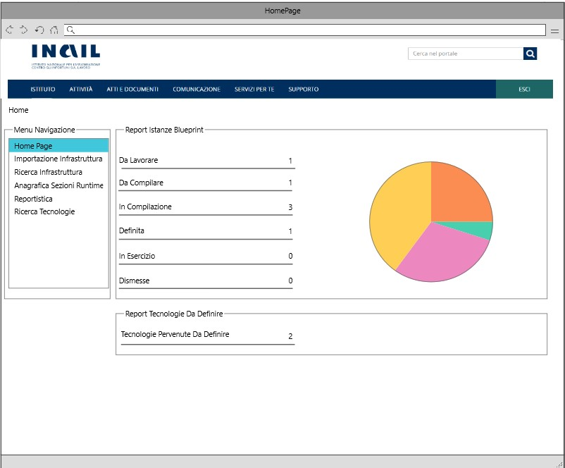

# User Story - Id 14.2 - Home Page Dashboard

## Descrizione

- COME: utente con ruolo OPS o con ruolo ADMIN

- DEVO POTER: avere la possibilità di visualizzare un riepilogo della numerosità delle occorrenze (stati infrastrutture/tecnologie pervenute) presenti a sistema
  1. accedo alla funzionalità mediante apposita voce di menu;
  2. il sistema PIM propone una pagina web con un riepilogo della numerosità delle occorrenze presenti a sistema suddivise per stato [(UI 14.2.1)](#user-interface). Ogni stato è cliccabile dall'utente attraverso un collegamento alla funzionalità di importazione per lo stato *Da lavorare* (vedi [US. 17](us_17_Importazione_infrastruttura_logica_di_Prodotto_(gestione_evento_su_coda_AMQ).md)) e ricerca per tutti gli altri stati (vedi [US. 4.1](us_4.1_ricerca_infrastruttura.md)) in modo da agevolare la navigazione all'interno del sistema;
  3. il sistema, inoltre, mostra  un riepilogo numerico (contatore) delle nuove tecnologie pervenute "Da Definire" all'interno dell'applicativo PIM (vedi [US. 22](us_22_integrazione_api_RMP_tipologia_componente_tecnologia.md)). Lo stato "Tecnologie Pervenute Da Definire" è cliccabile dall'utente con conseguente collegamento alla funzionatà di *Ricerca Tecnologie* (vedi [US 23](us_23_ricerca_tipo_componente_tecnologia_stato.md)) al fine di mostrare tutte le tecnologie con stato "Da Definire";
  
- AL FINE DI: poter monitorare l'avanzamento delle infrastrutture di prodotto in lavorazione e mostrare l'eventuale ingresso delle nuove tecnologie pervenute all'interno dell'applicativo. Questa funzionalità rappresenta l'entry-point della navigazione applicativa.

## Riferimenti

Di seguito i riferimenti e/o collegamenti ad altre US citate in questa

- [User Story - Id 4.1 - Ricerca Infrastruttura](us_4.1_ricerca_infrastruttura.md)

- [User Story - Id 17 - Importazione Infrastruttura Logica Di Prodotto (Gestione Evento su Coda AMQ)](us_17_Importazione_infrastruttura_logica_di_Prodotto_(gestione_evento_su_coda_AMQ).md)

- [User Story - Id 22 - Integrazione API dell'applicativo RMP per la condivisione delle informazioni di Tipologia Componente/Tecnologia previste](us_22_integrazione_api_RMP_tipologia_componente_tecnologia.md)

- [User Story - Id 23 - Ricerca Tipologie Componenti, Tecnologie, Stato e modifica Stato](us_23_ricerca_tipo_componente_tecnologia_stato.md)

## Criteri di accettazione

- DATO: un set di infrastrutture di prodotto presenti in archivio e tecnologie pervenute da RMP;

- QUANDO: l'utente OPS o ADMIN esegue l'accesso all'applicazione;

- QUINDI: il sistema deve permettere la visualizzazione di un riepilogo della numerosità delle occorrenze presenti a sistema e permettere la visualizzazione delle nuove tecnologie pervenute all'interno dell'applicativo.

## Controlli e vincoli

N/A

## Trigger

Esigenza di visualizzare un riepilogo della numerosità delle occorrenze presenti a sistema per poter monitorare l'avanzamento delle infrastrutture di prodotto in lavorazione;

Esigenza di visualizzare le nuove tecnologie pervenute all'interno dell'applicativo PIM da RMP.

## Pre-Requisiti

L'utente ha eseguito l'accesso autenticandosi sul portale intranet

## Data Model

Di seguito è descritta la porzione di modello dati (solo titolo tabelle utilizzate) a cui fa riferimento la funzionalità illustrata nella user story:  

- Tabella ISTANZA_BLUEPRINT

- Tabella STATO_ISTANZA_BLUEPRINT

- Tabella TECNOLOGIA

- Tabella ANAGRAFICA_STATO_DEFINIZIONE_RUNTIME

Consultare [Modello dati della soluzione Product Infrastructure Management - PIM - FASE 3](../pages/modello_dati_FASE3.md) per ulteriori approfondimenti sul modello dati predisposto per la FASE 3.

## Diagrammi

Non presente/i

## User Interface Mockup

- UI 14.2.1

