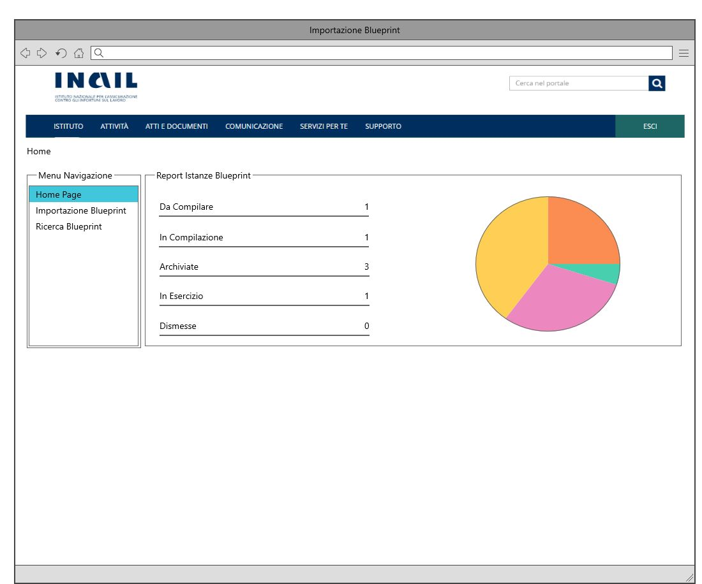
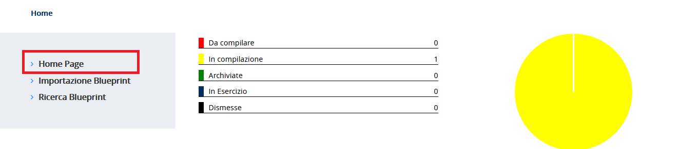

# User Story - Id 14 - Home Page Dashboard

## Descrizione

- COME: utente con ruolo OPS o con ruolo ADMIN

- DEVO POTER: avere la possibilità di visualizzare un riepilogo della numerosità delle occorrenze presenti a sistema
  1. Accedo alla funzionalità mediante apposita voce di menu
  2. Il sistema PIM propone una pagina web con un riepilogo della numerosità delle occorrenze presenti a sistema suddivise per stato [(UI 14.1)](#user-interface)

- AL FINE DI: poter monitorare l'avanzamnento delle istanze di blueprint in lavorazione. Questa funzionalità rappresenta l'entry-point della navigazione applicativa.

## Riferimenti

Di seguito i riferimenti e/o collegamenti ad altre US citate in questa

## Criteri di accettazione

- DATO: un set di istanze di blueprint presenti in archivio

- QUANDO: l'utente OPS o ADMIN esegue l'accesso all'applicazione

- QUINDI: il sistema deve permettere la visualizzazione di un riepilogo della numerosità delle occorrenze presenti a sistema

## Controlli e vincoli

Non presente/i

## Trigger

Esigenza di visualizzare un riepilogo della numerosità delle occorrenze presenti a sistema per poter monitorare l'avanzamento delle infrastrutture di prodotto in lavorazione.

## Pre-Requisiti

L'utente ha eseguito l'accesso autenticandosi sul portale intranet

## Data Model

Di seguito è descritta la porzione di modello dati a cui fa riferimento la funzionalità illustrata nella user story.  
Al termine dell'operazione di importazione il sistema dovrà aver inserito una occorrenza nelle seguenti tabelle.

- Tabella ISTANZA_BLUEPRINT

|    Attributo             |   Tipo    | Descrizione                                                                                 |
|  ----------------------  |  -------  | ------------------------------------------------------------------------------------------- | 
|   ID_ISTANZA             |    INT    | Identificativo autogenerato                                                                 |
|   ID_CENSIMENTO_ASSET    |  VARCHAR  | Identificativo del censimento del prodotto come assett su EA di RTC                         |
|   ID_PRODOTTO*            |  VARCHAR  | Valore dell'attributo *idProdotto* presente nella testata dell'istanza di blueprint imporata, fornita in input durante l'importazione |
|   TIPO_PRODOTTO*          |  VARCHAR  | Valore dell'attributo *tipoProdotto* presente nella testata dell'istanza di blueprint imporata, fornita in input durante l'importazione |
|   NOME_PRODOTTO*          |  VARCHAR  | Valore dell'attributo *nomeProdotto* presente nella testata dell'istanza di blueprint imporata, fornita in input durante l'importazione |
|   DESCRIZIONE_PRODOTTO*   |  VARCHAR  | Valore dell'attributo *descrizioneProdotto* presente nella testata dell'istanza di blueprint imporata, fornita in input durante l'importazione |
|   DATA_DENSIMENTO*        | TIMESTAMP | Valore dell'attributo *dataCensimento* presente nella testata dell'istanza di blueprint imporata, fornita in input durante l'importazione |
|   FILE_BLUEPRINT_ORIG    |   FILE    | File di istanza di bleuprint associato al censimento e recuperato da GitLab durante l'importazione    |
|   FILE_BLUEPRINT_TARGET  |   FILE    | File di istanza di bleuprint associato elaborato ed archiviato su GitLab con il passaggio di stato in *Archiviato*      |
|   URL_REPOSITORY_GIT     |  VARCHAR  | Valore del path/url del repository git dove presente il file archiviato, generata a partire da un base path url/*idProdotto* / configurazione-prodotto.git |
|   NOME_BRANCH_GIT        |  VARCHAR  | Valore del nome del branch del repository git dove presente il file archiviato. Requisito in fase di definizione, al momento valore fisso = master |
|   DATA_CREAZIONE         | TIMESTAMP | Data di creazione dell'occorrenza in tabella                                                |
|   UTENTE_CREAZIONE       |  VARCHAR  | Utente applicativo che ha eseguito la creazione dell'occorrenza in tabella                  |
|   DATA_ULTIMA_MODIFICA   | TIMESTAMP | Data di ultimo aggiornamento dell'occorrenza in tabella                                     |         
|   UTENTE_ULTIMA_MODIFICA |  VARCHAR  | Utente applicativo che ha eseguito l'ultimo aggiornamento dell'occorrenza in tabella        |

 
* L'interfaccia di scambio con il servizio RTC è in fase di definizione, gli attributi evidenziati sono parte di una prima ipotesi di interfaccia.  
  Il servizio dovrebbe ricevere in input il codice dell'evento di censimento dell'asset e fornire in output le informazioni evidenziate con il carattere * 
 
 

- Tabella STATO_ISTANZA_BLUEPRINT

|    Attributo               |   Tipo    | Descrizione                                                                                 |
|  ----------------------    |  -------  | ------------------------------------------------------------------------------------------- | 
|   IS_STATO_ISTANZA         |    INT    | Identificativo autogenerato                                                                 |
|   ID_ISTANZA               |    INT    | Identificativo dell'occorrenza ISTANZA_BLUEPRINT a cui lo stato fa riferimento (chiave esterna ISTANZA_BLUEPRINT)   |
|   ID_STATO                 |    INT    | Identificativo dell'occorrenza ANAGRAFICA_STATO a cui l'istanza fa riferimento (chaive esterna ANAGRAFICA_STATO) |
|   DATA_CAMBIO_STATO        | TIMESTAMP | Data dell'inserimento dell'occorrenza in tabella, al primo inserimento ed ad ognicambio di stato  | 
|   UTENTE_CAMBIO_STATO      |  VARCHAR  | Utente che ha eseguito l'inserimento dell'occorrenza in tabella, al primo inserimento ed ad ognicambio di stato  |

 
 

## Diagrammi

Non presente/i

## User Interface Mockup

- UI 14.1

 

## Interfaccia Applicativa con Correlazione Chiamate ai Metodi Corrispondenti

Di seguito è riportata l' interfaccia applicativa (screen) dell'Homepage di PIM prodotta nella FASE1 con conseguente correlazione alla chiamata al metodo della specifica funzionalità evidenziata, al fine di agevolare lo sviluppo BACK-END della FASE2 (in fase di definizione).

Al click del RED BOX "Homepage" verrà richiamato il metodo: GET Report Istanze Blueprint.

Nella tabella in basso, viene mostrato un riepilogo con relativa chiamata al metodo di tutti i buttons presentati in questa interfaccia con relativo PATH: 

|Colore di riferimento|Pulsante Definito nell'Applicativo  |Tipologia Chiamata  |Nome chiamata | Path |Note|
|---------|---------|---------|---------|---------|---------|
|RED|Homepage     |GET         |Report Istanze Blueprint | {{baseUrl}}/pim-api/blueprint/reportIstanzeBlueprint |/|