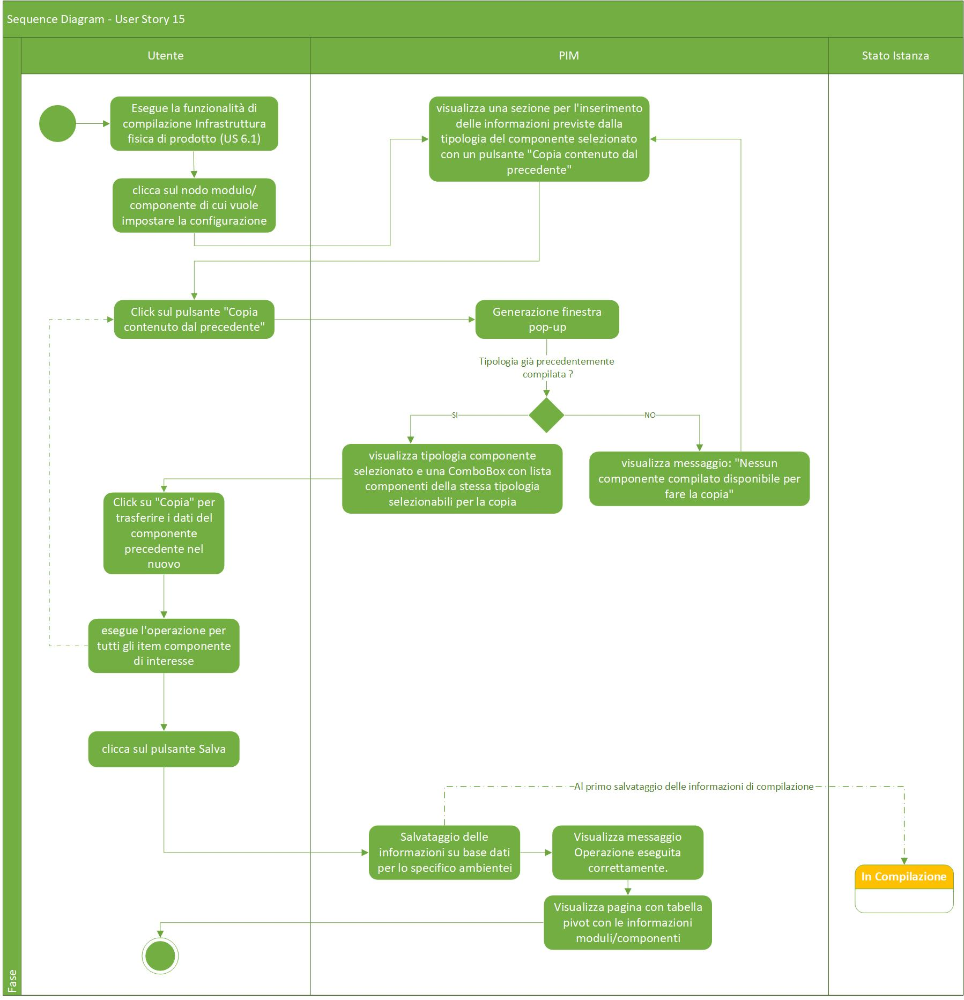
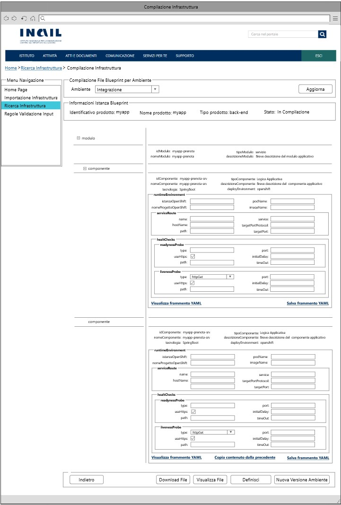
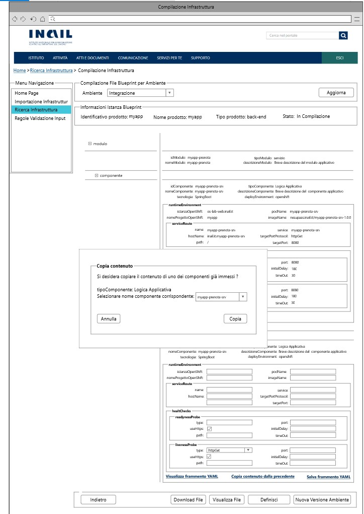

# User Story - Id 15 - Copia Dati Componente

## Descrizione

- COME: utente con ruolo OPS o con ruolo ADMIN

- DEVO POTER: eseguire la funzionalità di copia delle configurazioni dei componenti da un altro componente definito della stessa tipologia nel file dell'infrastruttura di prodotto, per uno specifico ambiente

1. Accedo alla funzionalità di Compilazione infrastruttura fisica di Prodotto ([US 6.1](us_6.1_compilazione_infrastruttura_fisica_di_prodotto.md)) ed eseguo la rispettiva funzionalità al fine di permettere l'inserimento delle informazioni previste dalla tipologia del componente selezionato.
2. Qualora sussistano le determinate condizioni specificate nell' ([US 6.1](us_6.1_compilazione_infrastruttura_fisica_di_prodotto.md)), per ogni item di componente il sistema deve permettere l'inserimento delle informazioni per uno specifico ambiente selezionato definite per il frammento YAML di configurazione per la tipologia del componente per le casistiche previste [(vedi Controlli e vincoli)](#controlli-e-vincoli).
3. Se sussistono più item di componenti, il sistema deve garantire la compilazione semi-automatica (copia) dei contenuti per un altro componente specificato della stessa tipologia.[(UI 15.1)](#user-interface)
4. Clicco sul primo componente di cui si vuole impostare la configurazione
5. Se il componente cliccato rientra in una delle tipologie gestite  
    5.1. Il sistema visualizza una riga sottostante con una sezione per l'inserimento delle informazioni previste dalla tipologia del componente selezionato ed un pulsante Salva, per il salvataggio delle informazioni relative ad una singola tipologia compilata.
6. Al termine delle operazioni di inserimento delle informazioni di una singola tipologia di componente è possibile salvare il contenuto cliccando sul pulsante Salva.
7. La gestione delle operazioni successiva al click del pulsante "Salva" è analoga all'([US 6.1](us_6.1_compilazione_infrastruttura_fisica_di_prodotto.md)). 
8. Dopo aver salvato le informazioni, il sistema persiste il singolo frammento YAML e l'ambiente di riferimento in tabella AMBIENTE_COMPONENTE_BLUEPRINT per il singolo item di configurazione componente compilato dall'utente.
9. Si procede, dopo aver effettuato il salvataggio del primo componente, alla compilazione del componente successivo (o dei componenti successivi).
10. L'inserimento delle informazioni del componente successivo (o dei componenti successivi) può avvenire semi automaticamente cliccando sul pulsante "Copia contenuto dal precedente".
11. Se il componente selezionato rientra in una delle stesse tipologie di componenti già compilate  
    11.1. Al click del pulsante "Copia contenuto dal precedente" il sistema genera una finestra Popup dove è possibile visualizzare la tipologia di componente selezionato e una ComboBox che include il nominativo dei componenti disponibili selezionabile dall'utente (compatibili con la stessa tipologia componente).[(UI 15.2)](#user-interface) 
    11.2. Nella finistra Popup, dopo aver selezionato il componente, è possibile cliccare sul pulsante "Copia" per poter importare i dati, copiati dall'altro componente della medesima tipologia.  

    **N.B: I valori dei campi associati a determinati valori di default impostati nella sezione “Regole Validazione Input” (vedi US:18.1/18.2/18.3/18.4) e specifici per il componente selezionato NON verranno sovrascritti dal componente dal quale si sta effettuando la copia.**  
    
12. Se il componente selezionato non è stato ancora compilato 
    12.1. Al click del pulsante "Copia contenuto dal precedente" il sistema genera una messaggio di errore che informa l'utente che non esiste nessun componente compilato per poter effettuare la copia.
13. Al termine delle operazioni di inserimento è possibile salvare cliccando nuovamente sul pulsante Salva.
14. La gestione delle operazioni successiva al click del pulsante "Salva" è analoga all'([US 6.1](us_6.1_compilazione_infrastruttura_fisica_di_prodotto.md)).
15. Il sistema persiste il nuovo frammento YAML e l'ambiente di riferimento in tabella AMBIENTE_COMPONENTE_BLUEPRINT per il singolo item di configurazione componente compilato dall'utente.
Il dettaglio delle informazioni che il sistema deve persistere è stato modellato sulla struttura prevista del template dell'infrastruttura logica di prodotto e descritto nella sezione [Data Model della US](#data-model).

- AL FINE DI: poter velocizzare la definizione degli item di configurazione dei componenti definiti nel file dell'infrastruttura logica di prodotto per uno specifico ambiente.

## Riferimenti

Di seguito i riferimenti e/o collegamenti ad altre US citate in questa

### [User Story - Id 6.1 - Compilazione Infrastruttura fisica di prodotto](us_6.1_compilazione_infrastruttura_fisica_di_prodotto.md)
### [User Story - Id 16 - Compilazione Tipi di Componenti e Naming Convention](us_16_compilazione_tipi_di_componenti_e_naming_convention.md)

## Criteri di accettazione

- DATO: un opportuno file YAML

- QUANDO: l'utente OPS o ADMIN deve importare il file di un infrastruttura logica di prodotto associata

- QUINDI: il sistema deve permettere:
  - la compilazione delle configurazioni dei componenti definiti nel file dell'infrastruttura logica di prodotto per uno specifico ambiente
  - la compilazione semi-automatica delle configurazioni dei componenti (nel caso di più componenti della stessa tipologia) definiti nel file dell'infrastruttura logica di prodotto per uno specifico ambiente
  - al termine delle operazioni di compilazione il sistema dovrà aver inserito almeno una occorrenza nelle seguenti tabelle: AMBIENTE_COMPONENTE_BLUEPRINT

## Controlli e vincoli

La funzionalità di compilazione è utilizzabile solo per le infrastrutture logiche di prodotto importate in stato *Da Compilare*, *In Compilazione*.  
Il risultato del comportamento sul click del pulsante *Dettaglio* dipende dallo stato in cui si trova l'infrastruttura logica di prodotto.  
Nel caso di stato *Da Compilare*, *In Compilazione* la navigazione mi condurrà alla funzionalità di compilazione.  
Nel caso di stato *Definita*, *In Esercizio*, *Dismessa* la navigazione mi condurrà alla funzionalità di visualizzazione. [US 5](us_5_visualizzazione_istanza_blueprint.md)

Di seguito è riportata l'attuale tipologia di componenti/tecnologie previsti:
 

| Tipo Componente        | Tecnologia   |  
-----------------------  | -------------|
| Logica Applicativa BE  | springboot   |
| Logica Applicativa BE  | nodejs       |
| Logica Applicativa BE  | dotnet       |
| SPA                    | angular      |
| CDN                    | js-css-html  |
| Api Sincrone           | openapi3     |
| Code Request Esterna   | amq          |  
| Evento Esterno Pub     | amq          |
| Evento Esterno Sub     | amq          |
| Dati SQL               | oracle       |
| Dati SQL               | sqlserver    |
| Dati SQL               | db2luw       |
| Dati SQL               | postgresql   |
| Dati NoSQL             | mongodb      |

 

Per le casisitiche contrassegnate in scope dovrà essere prevista la possibilità di eseguire la compilazione delle configurazione del componente da parte dell'utente.
 
I riferimenti alle informazioni di dettaglio sugli attributi previsti per i frammenti yaml delle specifiche tipologie sono riportati nella [User Story - Id 16 - Compilazione Tipi di Componenti e Naming Convention](us_16_compilazione_tipi_di_componenti_e_naming_convention.md).

 
 

## Trigger

Esigenza di compilazione più immediata delle configurazioni dei componenti definiti nel file dell'infrastruttura logica di prodotto per uno specifico ambiente

## Pre-Requisiti

L'utente ha eseguito l'accesso autenticandosi sul portale intranet

## Data Model

Di seguito è descritta la porzione di modello dati a cui fa riferimento la funzionalità illustrata nella user story.  
La lettura dei dati per la visualizzazione della tabella pivot viene eseguita accedendo in lettura alle tabelle MODULO_BLUEPRINT, COMPONENTE_BLUEPRINT, AMBIENTE_COMPONENTE_BLUEPRINT  
Al termine delle operazioni di compilazione il sistema dovrà aver inserito almeno una occorrenza nelle seguenti tabelle: AMBIENTE_COMPONENTE_BLUEPRINT

 

### tabella ANAGRAFICA_AMBIENTE_ISTANZA_BLUEPRINT

|    Attributo               |   Tipo    | Descrizione                                                                                  |
|  ----------------------    |  -------  | -------------------------------------------------------------------------------------------  |
|   COD_AMBIENTE             |    INT    | Codice alfanumerico che idenfica l'ambiente                                                  |
|   DESCRIZIONE_AMBIENTE     |  VARCHAR  | Descrizione dell'ambiente di riferimento                                                     |
|   PRIORITY                 |  NUMBER   | Priorità/ordine da assegnare agli ambienti |

 
* I valori previsti in tabella sono quelli relativi agli ambienti previsti per le infrastrutture di prodotto, di seguito sono elencati il codice e la descrizione
  (CI - Integrazione, COLL - Collaudo, CERT - Certificazione, PROD - Produzione)

 
 

### Tabella MODULO_BLUEPRINT:

|    Attributo              |   Tipo    | Descrizione                                                                                 |
|  ----------------------   |  -------  | ------------------------------------------------------------------------------------------- | 
|   ID_MODULO               |    INT    | Identificativo autogenerato                                                                 |
|   ID_ISTANZA              |    INT    | Identificativo dell'occorrenza ISTANZA_BLUEPRINT a cui lo fa riferimento (chiave esterna ISTANZA_BLUEPRINT)   |
|   ID_MODULO_BP            |  VARCHAR  | Valore dell'attributo *idModulo* presente nell'infrastruttura |
|   NOME_MODULO             |  VARCHAR  | Valore dell'attributo *nomeModulo* presente nell'infrastruttura |
|   TIPO_MODULO             |  VARCHAR  | Valore dell'attributo *tipoModulo* presente nell'infrastruttura |
|   VERSIONE_MODULO         |  VARCHAR  | Versione modulo  |
|   PATTERN                 |  VARCHAR  | Valore dell'attributo *pattern* presente nell'infrastruttura di prodotto importata, fornita in input durante l'importazione |
|   DESCRIZIONE_MODULO      |  VARCHAR  | Valore dell'attributo *descrizioneModulo* presente nell'infrastruttura|

 
 

### Tabella COMPONENTE_BLUEPRINT:

|    Attributo               |   Tipo    | Descrizione                                                                                 |
|  ----------------------    |  -------  | ------------------------------------------------------------------------------------------- | 
|   ID_COMPONENTE            |    INT    | Identificativo autogenerato                                                                 |
|   ID_MODULO                |    INT    | Identificativo dell'occorrenza MODULO_BLUEPRINT a cui lo fa riferimento (chiave esterna MODULO_BLUEPRINT)   |
|   ID_COMPONENTE_BP         |  VARCHAR  | Valore dell'attributo *idComponente* presente nell'infrastruttura |
|   NOME_COMPONENTE          |  VARCHAR  | Valore dell'attributo *nomeComponente* presente nell'infrastruttura |
|   TIPO_COMPONENTE          |  VARCHAR  | Valore dell'attributo *tipoComponente* presente nell'infrastruttura |
|   DESCRIZIONE_COMPONENTE   |  VARCHAR  | Valore dell'attributo *descrizioneComponente* presente nell'infrastruttura |
|   DEPLOY_ENVIRONMENT       |  VARCHAR  | Valore dell'attributo *deployEnvironment* presente nell'infrastruttura|
|   CONFIG_REPO_GIT          |  VARCHAR  | Valore dell'attributo *config-repoGit* presente nell'infrastruttura  |
|   LAYER                    |  VARCHAR  | Valore dell'attributo *layer* presente nell'infrastruttura  |
|   REPO_GIT                 |  VARCHAR  | Valore del path/url del repository git dove presente il file archiviato, generata a partire da un base path url/*idProdotto* / configurazione-prodotto.git |
|   STATO                    |  VARCHAR  | /  |
|   TECNOLOGIA               |  VARCHAR  | Tecnologia associata al componente infrastrutturale  |
|   VERSIONE_COMPONENTE      |  VARCHAR  | Valore dell'attributo *versioneComponente* presente nell'infrastruttura |
|   VERSIONE_CONFIG          |  VARCHAR  | Valore dell'attributo *versioneConfig* presente nell'infrastruttura  |

 
 

### Tabella AMBIENTE_COMPONENTE_BLUEPRINT 

|    Attributo                |   Tipo    | Descrizione                                                                                 |
|  ----------------------     |  -------  | ------------------------------------------------------------------------------------------- | 
|   ID_AMBIENTE_COMPONENTE    |    INT    | Identificativo autogenerato                                                                 |
|   ID_COMPONENTE             |    INT    | Identificativo dell'occorrenza COMPONENTE_BLUEPRINT a cui lo fa riferimento (chiave esterna COMPONENTE_BLUEPRINT)   |
|   COD_AMBIENTE                  |  VARCHAR  | Valore dell'ambiente per cui è destinato il frammento di configurazione del componente dell'infrastruttura di prodotto (Integrazione | Collaudo | Certificazione | Esercizio) |
|   YAML_OPS_BLUEPRINT_TARGET |  VARCHAR  | Frammento YAML di configurazione del componente dell'infrastruttura di prodotto |
|   DATA_CREAZIONE            | TIMESTAMP | Data di creazione dell'occorrenza in tabella                                                |
|   UTENTE_CREAZIONE          |  VARCHAR  | Utente applicativo che ha eseguito la creazione dell'occorrenza in tabella                  |
|   DATA_ULTIMA_MODIFICA      | TIMESTAMP | Data di ultimo aggiornamento dell'occorrenza in tabella                                     |         
|   UTENTE_ULTIMA_MODIFICA    |  VARCHAR  | Utente applicativo che ha eseguito l'ultimo aggiornamento dell'occorrenza in tabella        |

 
 

## Diagrammi

Di seguito il sequence diagram che illustra le azioni previste dalla User Story:

 

 

[Download file visio del sequence diagram della user story ](../files/sequence_diagram_us_15.vsdx)

 
 

## User Interface

-UI 15.1

 
 

- UI 15.2

 
 

## Correlazione Chiamate ai Metodi Corrispondenti

Di seguito sono riportate le chiamate ai metodi della specifica funzionalità evidenziata con relativo path e descrizione, al fine di agevolare lo sviluppo della FASE2:

|Funzionalità|Tipologia Chiamata|Path |Descrizione|
|---------|---------|---------|---------|
|Necessaria al caricamento della ComboBox "Nome Componente" nel Pop-Up Copia Componente|GET|{{baseUrl}}/pim-api/blueprint/componente/:idComponente/:codAmbiente|L’API invia al sistema la richiesta per estrarre la lista di idComponente e idCodiceAmbiente di tutti i componenti compatibili per tipoComponente, modulo e ambiente (Parametro tecnologia opzionale)|
|Necessaria per effettuare la copia dei dati (Button Copia) nel Pop-Up Copia Componente|GET|{{baseUrl}}/pim-api/ambiente/:id|L’API invia al sistema la richiesta per estrarre la struttura dello specifico ambiente|