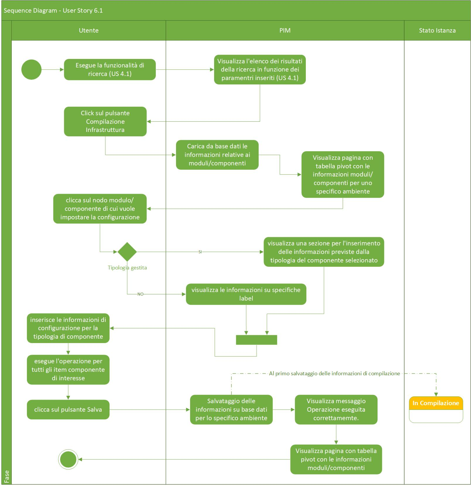

# User Story - Id 16 - Compilazione Tipi di Componenti e Naming Convention

## Descrizione

- COME: utente con ruolo OPS o con ruolo ADMIN

- DEVO POTER: eseguire la funzionalità di compilazione delle configurazioni per le differenti tipologie componenti definiti nel file dell'infrastuttura di prodotto per uno specifico ambiente.
  
1. Accedo alla funzionalità di Compilazione infrastruttura fisica di Prodotto ([US 6.1](us_6.1_compilazione_infrastruttura_fisica_di_prodotto.md)) ed eseguo la rispettiva funzionalità al fine di permettere l'inserimento delle informazioni previste dalla tipologia del componente selezionato.
2. Qualora sussistano le determinate condizioni specificate nell' ([US 6.1](us_6.1_compilazione_infrastruttura_fisica_di_prodotto.md)), per ogni item di componente il sistema deve permettere l'inserimento delle informazioni per uno specifico ambiente selezionato definite per il frammento YAML di configurazione per la tipologia del componente per le casistiche previste [(vedi Controlli e vincoli)](#controlli-e-vincoli).
3. Per ogni item di componente, il sistema deve garantire la compilazione di ogni tipologia (di componente) rispettando le informazioni riportate nelle tabelle in basso (Vedi [Dati/Informazioni Compilazione per le Differenti Tipologie di Componenti (Runtime Environment)](#datiinformazioni-compilazione-per-le-differenti-tipologie-di-componenti-runtime-environment)) e gestite attraverso le funzionalità CRUD (vedi US: 18.1/18.2/18.3/18.4)
4. Clicco sul primo componente di cui si vuole impostare la configurazione 
5. Se il componente cliccato rientra in una delle tipologie gestite  
    5.1. Il sistema visualizza una riga sottostante con una sezione per l'inserimento delle informazioni previste dalla tipologia del componente selezionato ed un pulsante Salva, per il salvataggio delle informazioni relative ad una singola tipologia compilata.   
    **N.B 1: Durante la fase di compilazione, verranno garantiti una serie di aiuti alla compilazione solo nel caso in cui verranno precaricate nella sezione “Regole Validazione Input” (vedi US:18.1/18.2/18.3/18.4) una serie di informazioni tra cui: valore di default, vincolo naming regex, obligatorietà, sola lettura, ecc.**  
    **N.B 2: Se i campi non vengono compilati (condizione di obbligatorietà non rispettata) e/o non vengono compilati correttamente (inserimento di un carattere non gestito) e/o non vengono valorizzati nel modo corretto (non rispettato valore di default/vincolo naming regex) secondo quanto preventivamente riportato in “Regole Validazione Input" (vedi US:18.1/18.2/18.3/18.4) verranno generati degli errori, visibili in elenco nella parte a destra della finestra popup o nella parte sottostante del campo.**  
6.  Se il nodo cliccato non rientra in una delle tipologie gestite  
    6.1. (Vedi ([US 6.1](us_6.1_compilazione_infrastruttura_fisica_di_prodotto.md)) )
7. La gestione delle operazioni successiva al click del pulsante "Salva" è analoga all'([US 6.1](us_6.1_compilazione_infrastruttura_fisica_di_prodotto.md)).
8. Dopo aver salvato le informazioni, il sistema persiste il singolo frammento YAML e l'ambiente di riferimento in tabella AMBIENTE_COMPONENTE_BLUEPRINT per il singolo item di configurazione componente compilato dall'utente.
9. Si procede, dopo aver effettuato il salvataggio del primo componente, all'eventuale compilazione del componente successivo (o dei componenti successivi).

- AL FINE DI: poter definire gli item di configurazione per le differenti tipologie di componenti definiti nel file dell'infrastruttura logica di prodotto per uno specifico ambiente.

## Riferimenti

Di seguito i riferimenti e/o collegamenti ad altre US citate in questa

### [User Story - Id 6.1 - Compilazione Infrastruttura fisica di prodotto](us_6.1_compilazione_infrastruttura_fisica_di_prodotto.md)
### [User Story - Id 18.1 - Gestione Naming Convention (Funzionalità CRUD (CREATE))](us_18.1_gestione_naming_convention_(funzionalità_CRUD_create).md)
### [User Story - Id 18.2 - Gestione Naming Convention (Funzionalità CRUD (READ))](us_18.2_gestione_naming_convention_(funzionalità_CRUD_read).md)
### [User Story - Id 18.3 - Gestione Naming Convention (Funzionalità CRUD (UPDATE))](us_18.3_gestione_naming_convention_(funzionalità_CRUD_update).md)
### [User Story - Id 18.4 - Gestione Naming Convention (Funzionalità CRUD (DELETE))](us_18.4_gestione_naming_convention_(funzionalità_CRUD_delete).md)

## Criteri di accettazione

- DATO: un opportuno file YAML

- QUANDO: l'utente OPS o ADMIN deve importare un infrastruttura logica di prodotto

- QUINDI: il sistema deve permettere:
  - la compilazione delle differenti configurazioni dei componenti definiti nel file dell'infrastruttura logica di prodotto per uno specifico ambiente
  - al termine delle operazioni di compilazione il sistema dovrà aver inserito almeno una occorrenza nelle seguenti tabelle: AMBIENTE_COMPONENTE_BLUEPRINT

## Controlli e vincoli

La funzionalità di compilazione è utilizzabile solo per le infrastruttura logica di prodotto importate in stato *Da Compilare*, *In Compilazione*.  
Il risultato del comportamento sul click del pulsante *Dettaglio* dipende dallo stato in cui si trova l'infrastruttura logica di prodotto.  
Nel caso di stato *Da Compilare*, *In Compilazione* la navigazione mi condurrà alla funzionalità di compilazione.  
Nel caso di stato *Archiviata*, *In Esercizio*, *Dismessa* la navigazione mi condurrà alla funzionalità di visualizzazione. [US 5](us_5_visualizzazione_istanza_blueprint.md)

Di seguito è riportata l'attuale tipologia di componenti/tecnologie previsti con il collegamento diretto alla tipologia di componente per la visualizzazione dei dettagli sugli attributi previsti per i frammenti yaml delle specifiche tipologie: 
 

| Tipo Componente        | Tecnologia   |  
-----------------------  | -------------|
| [Logica Applicativa BE](#tipologia-componente-logica-applicativa-be)  | springboot   |
| [Logica Applicativa BE](#tipologia-componente-logica-applicativa-be)  | nodejs       |
| [Logica Applicativa BE](#tipologia-componente-logica-applicativa-be)  | dotnet       |
| [SPA](#tipologia-componente-spa)                    | angular      |
| [CDN](#tipologia-componente-cdn)                    | js-css-html  |
| [Api Sincrone](#tipologia-componente-api-sincrone)          | openapi3     |
| [Code Request Esterna](#tipologia-componente-code-request-esterna)   | amq          |  
| [Evento Esterno Pub](#tipologia-componente-evento-esterno-pub)    | amq          |
| [Evento Esterno Sub](#tipologia-componente-evento-esterno-sub)      | amq          |
| [Dati SQL](#tipologia-componente-dati-sql)               | oracle       |
| [Dati SQL](#tipologia-componente-dati-sql)               | sqlserver    |
| [Dati SQL](#tipologia-componente-dati-sql)               | db2luw       |
| [Dati SQL](#tipologia-componente-dati-sql)               | postgresql   |
| [Dati NoSQL](#tipologia-componente-dati-nosql)           | mongodb      |

 

Per le casisitiche contrassegnate in scope dovrà essere prevista la possibilità di eseguire la compilazione delle configurazione del componente da parte dell'utente.
 

## Dati/Informazioni Compilazione per le Differenti Tipologie di Componenti (Runtime Environment)

In ogni tabella presentata in basso è possibile classificare per ogni tipologia componente la tecnologia adoperata, il nome specifico per l'attributo YAML, la descrizione, l'eventuale Naming Convention con opportuna regola, i vincoli valori (specificati in un apposita tabella in basso, vedi [Vincoli Valori](#vincoli-valori)), la corrente Label visualizzata nell'applicativo, la tipologia di Input, i valori di default, l'obligatorietà e i valori possibili supportati dall'attributo.

N.B Le seguenti tabelle fanno capo ai nomi attributi riportati nell'applicativo come: RUNTIME ENVIRONMENT. Tutti gli attributi delineati come NO RUNTIME ENVIRONMENT non sono stati inclusi.

***

### **Tipologia componente:** Logica applicativa BE

### **Tecnologia:** springboot/nodejs/dotnet

| |Tipologia Componente  |Tecnologia  |Nome Attributo YAML  |Descrizione  |Naming Conv.  |Regola N.C  |Vincoli Valori  |Nome Label Applicazione  |Tipo Input  |Valore di Default |Obligatorio |Valori Possibili |
|---------|---------|---------|---------|---------|---------|---------|---------|---------|---------|---------|---------|---------|
|1|Logica Applicativa BE     |springboot/nodejs/dotnet         |nomeProgettoOpenShift     |nome progetto Open Shift che ospita il microservizio         |SI     | [idProdotto] |1,3         |Nome Progetto OpenShift       |Testuale     |[idProdotto]         |x        |[idProdotto]         |
|2|Logica Applicativa BE     |springboot/nodejs/dotnet         |nomeDeploymentConfig      |nome del file deploymentConfig         |SI     | [idComponente] |2,3         |*Attualmente mancante - da aggiungere*         |Testuale     |[idComponente]         |x        |[idComponente]         | 
|3|Logica Applicativa BE     |springboot/nodejs/dotnet         |configMapPod              |elenco config maps associate al POD, tipicamente al minimo 2 item        |NO     |/|/         |Config MapPod        | No input      |/        |        |/        |
|4|Logica Applicativa BE     |springboot/nodejs/dotnet         |configMapPod/configMap              |tipicamente la config-map fornita da dev come item di properties del ticket RTC, l'applicazione dovrà generare un file di config-map per OCP a partire dal file recuperato dal ticket RTC, archiviarlo sul repository git e salvare il link.       |NO     |/ |/         |Config Map        |No input     |/         |        |/        |
|5|Logica Applicativa BE     |springboot/nodejs/dotnet         |configMapPod/configMap/urlGit     |link al file di config-map, generato a partire dai files di properties caricati su ticket RTC (sta migrando da RAM a Git)        |NO     |/ |/         |Url Git       |URL     | /         |x        |/        |
|6|Logica Applicativa BE     |springboot/nodejs/dotnet         |configMapPod/configMap/source     |link al file di config-map, generato a partire dai files di properties caricati su ticket RTC (sta migrando da RAM a Git)         |SI     |[idProdotto]-[idComponente]-config |/         |Source       |Testuale     | [idProdotto]-[idComponente]-config         |        | [idProdotto]-[idComponente]-config       |
|7|Logica Applicativa BE     |springboot/nodejs/dotnet         |configMapPod/configMap/mounthPath      |path di mount del file delle config map (informazione attualmente indicata nella scheda tecnica)        |SI     |/deployments/config |/         |Mounth Path  |Testuale     |/deployments/config         |        |/deployments/config         |
|8|Logica Applicativa BE     |springboot/nodejs/dotnet         |configMapPod/secretConfigMap      |tipicamente la config-map dei secrets, fornita da dev come item di properties del ticket RTC, l'applicazione dovrà generare un file di config-map per OCP a partire dal file recuperato dal ticket RTC, archiviarlo sul repository git e salvare il link.        |NO     |/ |/         |Config Map Secret |No input      |/         |        |/ |
|9|Logica Applicativa BE     |springboot/nodejs/dotnet         |configMapPod/secretConfigMap/urlGit     |link al file di secret-config-map, generato a partire dai files di properties caricati su ticket RTC (sta migrando da RAM a Git)        |NO     |/ |/         |Url Git       |URL     | /         |x        |/        |
|10|Logica Applicativa BE     |springboot/nodejs/dotnet         |configMapPod/secretConfigMap/source     |link al file di secret-config-map, generato a partire dai files di properties caricati su ticket RTC (sta migrando da RAM a Git)         |SI     |[idProdotto]-[idComponente]-secret |/         |Source       |Testuale     | [idProdotto]-[idComponente]-secret         |        | [idProdotto]-[idComponente]-secret       |
|11|Logica Applicativa BE     |springboot/nodejs/dotnet         |configMapPod/secretConfigMap/mounthPath      |path di mount del file delle config map (informazione attualmente indicata nella scheda tecnica)        |SI     |/deployments/config |/         |Mounth Path  |Testuale     |/deployments/config         |        |/deployments/config         |
|12|Logica Applicativa BE     |springboot/nodejs/dotnet         |routing     |Necessità dell'oggetto route        |NO     |Valori: SI, NO; NO per default |/         |Route Enabled       |CheckBox     |NO         |x        |SI/NO         |
|13|Logica Applicativa BE     |springboot/nodejs/dotnet         |routing/route     |Nome dell'oggetto Route del POD, runtime environment in funzione della RouteSINO        |SI     |[idComponente] |9         |Name       |Testuale     |[idComponente]  |x        |[idComponente]         |
|14|Logica Applicativa BE     |springboot/nodejs/dotnet         |routing/hostName     |nome publico dell'hostname per la rotta, se non specificato sarà autogenerato da OCP, runtime environment in funzione della RouteSINO        |SI     |[idComponente]-[idProdotto].[istanzaOpenShift] |9         |Host Name       |Testuale     |[idComponente]-[idProdotto].[istanzaOpenShift]          |x        |[idComponente]-[idProdotto].[istanzaOpenShift]        |
|15|Logica Applicativa BE     |springboot/nodejs/dotnet         |routing/service     |nome del servizio verso cui instradare        |SI     |[idComponente]|/         |Service       |Testuale     |[idComponente]     |x        |[idComponente]         |
|16|Logica Applicativa BE     |springboot/nodejs/dotnet         |routing/targetPortProtocol     |protocollo per la porta target per il traffico dati (da verificare)        |NO     |/|/         |Target Port Protocol       |Testuale     |/         |x        |/        |
|17|Logica Applicativa BE     |springboot/nodejs/dotnet         |routing/targetPort     |porta target per il traffico dati (default=8080)       |NO     |/|/         |Target Port      |Numerico     |8080         |x        |8080/ecc        |
|18|Logica Applicativa BE     |springboot/nodejs/dotnet         |routing/path|     path monitorato per l'instradamento del traffico verso il servizio  |NO |default: /|/ |Path|Testuale|/|x|/|
|19|Logica Applicativa BE     |springboot/nodejs/dotnet         |healtChecks     |informazioni per il monitoring dello stato dei POD (informazione attualmente indicata nella scheda tecnica)       |NO     |/|/         |Healt Checks     |No input     |/         |        |/        |
|20|Logica Applicativa BE     |springboot/nodejs/dotnet         |healthChecks/livenessProbe     |tipologia di healtCheck      |NO     |/|/         |Liveness Probe     |No input     |/         |        |/       |
|21|Logica Applicativa BE     |springboot/nodejs/dotnet         |healthChecks/livenessProbe/protocolType     |tipo di protocollo della chiamata healthCheck       |NO     |/|/         |Type      |ComboBox     |httpGet         |x        |httpGet/tcpSocket        |
|22|Logica Applicativa BE     |springboot/nodejs/dotnet         |healthChecks/livenessProbe/useHttps     |indica se previsto protocollo https, valido solo per type:httpGet       |NO     |/|/         |Use Https     |CheckBox     |False         |x        |True/False        |
|23|Logica Applicativa BE     |springboot/nodejs/dotnet         |healthChecks/livenessProbe/path     |path della URL per la request di healtCheck del microservizio (es: /health/ready)       |NO     |/|/         |Path     |Testuale     |Health         |x        |Health/Ready/ecc       |
|24|Logica Applicativa BE     |springboot/nodejs/dotnet         |healthChecks/livenessProbe/port     |numero di porta della URL per la request di healtCheck del microservizio      |NO     |/|/         |Port     |Numerico     |/         |x        |/       |
|25|Logica Applicativa BE     |springboot/nodejs/dotnet         |healthChecks/livenessProbe/initialDelay     |durata in secondi del tempo di attesa per l'avvio del container per l'inizio delle chiamate di check      |NO     |/|/         |Initial Delay     |Time     |/         |x        |/       |
|26|Logica Applicativa BE     |springboot/nodejs/dotnet         |healthChecks/livenessProbe/timeOut     |durata in secondi del tempo di attesa per la chiamate di probe, se il tempo di attesa viene superato la probe si considera fallita      |NO     |/|/         |Timeout     |Time     |/         |x        |/       |
|27|Logica Applicativa BE     |springboot/nodejs/dotnet         |healthChecks/readynessProbe     |tipologia di healtCheck      |NO     |/|/         |Readyness Probe     |No input     |/         |        |/       |
|28|Logica Applicativa BE     |springboot/nodejs/dotnet         |healthChecks/readynessProbe/protocolType     |tipo di protocollo della chiamata healtCheck      |NO     |/|/         |Type       |ComboBox      |httpGet         |x        |httpGet/tcpSocket       |
|29|Logica Applicativa BE     |springboot/nodejs/dotnet         |healthChecks/readynessProbe/useHttps     |indica se previsto protocollo https, valido solo per type:httpGet      |NO     |/|/         |Use Https      |CheckBox      |False         |x        |True/False       |
|30|Logica Applicativa BE     |springboot/nodejs/dotnet         |healthChecks/readynessProbe/path     |path della URL per la request di healtCheck del microservizio (es: /health/live)     |NO     |/|/         |Path      |ComboBox      |Health         |x        |Health/Live/ecc      |
|31|Logica Applicativa BE     |springboot/nodejs/dotnet         |healthChecks/readynessProbe/port     |numero di porta della URL per la request di healtCheck del microservizio     |NO     |/|/         |Port      |Numerico      |/         |x        |/      |
|32|Logica Applicativa BE     |springboot/nodejs/dotnet         |healthChecks/readynessProbe/initialDelay     |durata in secondi del tempo di attesa per l'avvio del container per l'inizio delle chiamate di check      |NO     |/|/         |Initial Delay     |Time     |/         |x        |/       |
|33|Logica Applicativa BE     |springboot/nodejs/dotnet         |healthChecks/readynessProbe/timeOut     |durata in secondi del tempo di attesa per la chiamate di probe, se il tempo di attesa viene superato la probe si considera fallita      |NO     |/|/         |Timeout     |Time     |/         |x        |/       |

***

### **Tipologia componente:** SPA

### **Tecnologia:** angular

||Tipologia Componente  |Tecnologia  |Nome Attributo YAML  |Descrizione  |Naming Conv.  |Regola N.C  |Vincoli Valori  |Nome Label Applicazione  |Tipo Input  |Valore di Default |Obligatorio |Valori Possibili |
|---------|---------|---------|---------|---------|---------|---------|---------|---------|---------|---------|---------|---------|
|1|SPA    |angular         |nomeSPA      |Nome della Single Page Application         |SI     |[idProdotto] |/         |Nome SPA         |Testuale     |[idProdotto]           |x        |[idProdotto]         |
|2|SPA    |angular         |contesto      |Il contesto è la parte dell'url da concatenare a fqdn.  Es. https://ciportale.inail.it/app/[contesto]        |SI     |[idProdotto] |/         |Contesto         |Testuale     |[idProdotto]           |x        |[idProdotto]         |
|3|SPA    |angular         |fqdnIntranet      |**Intranet**   CI=https://ciportale.inail.it/appintra/   Collaudo=https://collportale.inail.it/appintra/  Certificazione=https://certportale.inail.it/appintra/   Produzione=https://www.inail.it/appintra     |NO     |/ |/         |FQDN Intranet         |URL     |https://ciportale.inail.it/appintra/          |x        | CI=https://ciportale.inail.it/appintra/   Collaudo=https://collportale.inail.it/appintra/  Certificazione=https://certportale.inail.it/appintra/   Produzione=https://www.inail.it/appintra |
|4|SPA    |angular         |fqdnInternet      |**Internet**  CI=https://ciportale.inail.it/app/   Collaudo=https://collportale.inail.it/app/   Certificazione=https://certportale.inail.it/app/  Produzione=https://www.inail.it/app/    |NO     |/ |/         |FQDN Internet         |URL     |https://ciportale.inail.it/app/   |x        | CI=https://ciportale.inail.it/app/   Collaudo=https://collportale.inail.it/app/   Certificazione=https://certportale.inail.it/app/  Produzione=https://www.inail.it/app/ |

***

### **Tipologia componente:** CDN

### **Tecnologia:** js-css-html

||Tipologia Componente  |Tecnologia  |Nome Attributo YAML  |Descrizione  |Naming Conv.  |Regola N.C  |Vincoli Valori  |Nome Label Applicazione  |Tipo Input  |Valore di Default |Obligatorio |Valori Possibili |
|---------|---------|---------|---------|---------|---------|---------|---------|---------|---------|---------|---------|---------|
|1|CDN    |js-css-html         |nomeCDN      |/         |SI     |[idProdotto]-cdn |/         |NomeCDN         |Testuale     |[idProdotto]-cdn          |x        |[idProdotto]-cdn         |
|2|CDN     |js-css-html         |fqdn      | ambiente=URL di esposizione   CI=cdnci.inailcloud.it   Collaudo=cdncoll.inailcloud.it   Certificazione=cdncert.inailcloud.it   Produzione=cdn.inailcloud.it         |NO     |/ |/         |FQDN         |URL     |URL di esposizione          |x        | ambiente=URL di esposizione   CI=cdnci.inailcloud.it   Collaudo=cdncoll.inailcloud.it   Certificazione=cdncert.inailcloud.it   Produzione=cdn.inailcloud.it       |

***

### **Tipologia componente:** Api Sincrone

### **Tecnologia:** openapi3

||Tipologia Componente  |Tecnologia  |Nome Attributo YAML  |Descrizione  |Naming Conv.  |Regola N.C  |Vincoli Valori  |Nome Label Applicazione  |Tipo Input  |Valore di Default |Obligatorio |Valori Possibili |
|---------|---------|---------|---------|---------|---------|---------|---------|---------|---------|---------|---------|---------|
|1|Api Sincrone     |openapi3         |cluster         |Es.Collaudo         |NO         |/           |/        |Cluster         |Testuale         |Collaudo         |x        |Collaudo/ecc         |
|2|Api Sincrone     |openapi3         |cluster_url         |Es. https://collportale.inail.it       |NO     |/       |/         |Url           |URL      |https://collportale.inail.it          |x         |https://collportale.inail.it/ecc            |
|3|Api Sincrone     |openapi3         |compid_nome          |AU.tipologiche.api.tipologiche/CODalphanum (PriKey)  (CODalphanum: codice alfanumerico di 4/5 cifre in fase di definizione)         |SI     |[idComponente]/CODalphanum |/         |Nome        |Testuale     |[idComponente]/CODalphanum         |x        |[idComponente]/CODalphanum        |
|4|Api Sincrone     |openapi3         |compid_descrizione         |Es. AU Servizio Tipologiche - descrizione del componente  |NO     |da toolchain |         |Descrizione         |Testuale     |/         |x        |/         |
|5|Api Sincrone     |openapi3         |compid_apig_url_pub         |Es. https://collportale.inail.it/ api/au/persona/tipologiche         |SI     |[cluster]/[tipoComponente]/ [idProdotto]/[idModulo]/[idModulo]    [cluster_url]/[tipoComponente]/ [idProdotto]/[idModulo]/[idComponente] |/         |Api Gateway Url Publisher          |URL     |[cluster]/[tipoComponente]/ [idProdotto]/[idModulo]/[idModulo]    [cluster_url]/[tipoComponente]/ [idProdotto]/[idModulo]/[idComponente]         |x        |[cluster]/[tipoComponente]/ [idProdotto]/[idModulo]/[idModulo]    [cluster_url]/[tipoComponente]/ [idProdotto]/[idModulo]/[idComponente]         |
|6|Api Sincrone     |openapi3         |compid_pdd_url_pub          |Es.  https://spc.test.inail.it/pdd/api-id_auth_channel_02/2.au.persona.tipologiche         |SI     |cluster_pdd_url/pdd/tipo_componente-id_auth_channel_02/ [idProdotto].[idModulo].[idComponente] |/         |Porte di Dominio Url Publisher         |URL     |cluster_pdd_url/pdd/tipo_componente-id_auth_channel_02/ [idProdotto].[idModulo].[idComponente]         |x        |cluster_pdd_url/pdd/tipo_componente-id_auth_channel_02/ [idProdotto].[idModulo].[idComponente]         |
|7|Api Sincrone     |openapi3         |compid_apim_url_pub         |Es.  https://apicoll.inailcloud.it/irestgw/ apcit/au.persona.tipologiche         |SI     |cluster_apim_url/irestgw/nome_progetto_client/ [idProdotto].[idModulo].[idComponente] |/         |Api Management Url Publisher         |URL     |cluster_apim_url/irestgw/nome_progetto_client/ [idProdotto].[idModulo].[idComponente]         |x        |cluster_apim_url/irestgw/nome_progetto_client/ [idProdotto].[idModulo].[idComponente]      |
|8|Api Sincrone     |openapi3         |compid_categoria      |Es. AU         |SI     |[idProdotto] |/         |Categoria         |Testuale     |[idProdotto]          |x        |[idProdotto]         |

***

### **Tipologia componente:** Client Apig

### **Tecnologia:** json

||Tipologia Componente  |Tecnologia  |Nome Attributo YAML  |Descrizione  |Naming Conv.  |Regola N.C  |Vincoli Valori  |Nome Label Applicazione  |Tipo Input  |Valore di Default |Obligatorio |Valori Possibili |
|---------|---------|---------|---------|---------|---------|---------|---------|---------|---------|---------|---------|---------|
|1|Client Apig     |json         |compid_client_name      |Es. ClientAU         |SI     |Client[idProdotto] |/         |Name Client         |Testuale     |Client[idProdotto]          |x        |Client[idProdotto]         |
|2|Client Apig     |json         |compid_client_batch_name   |Es. BATCH_ClientAU        |SI     |BATCH_Client[idProdotto] |/         |Name Batch Client         |Testuale     |BATCH_Client[idProdotto]         |x        |BATCH_Client[idProdotto]        |

***

### **Tipologia componente:** Code Request Esterna

### **Tecnologia:** amq

||Tipologia Componente  |Tecnologia  |Nome Attributo YAML  |Descrizione  |Naming Conv.  |Regola N.C  |Vincoli Valori  |Nome Label Applicazione  |Tipo Input  |Valore di Default |Obligatorio |Valori Possibili |
|---------|---------|---------|---------|---------|---------|---------|---------|---------|---------|---------|---------|---------|
|1|Code Request Esterna     |amq         |nomeCoda      |Il nome della coda è definito da DEV.[nomeCoda] deve descrivere la funzione che dovrà svolgere         |SI     |[idProdotto].[idModulo].que.[nomeCoda] |5,6         |Nome Coda         |Testuale     |[idProdotto].[idModulo].que.[nomeCoda]         |x        |[idProdotto].[idModulo].que.[nomeCoda]        |
|2|Code Request Esterna     |amq         |nomeAddress      |address deve coincidere con [nomeCoda]         |SI     |[nomeCoda] |/         |Nome Address         |Testuale     |[nomeCoda]         |x        |[nomeCoda]         |
|3|Code Request Esterna     |amq         |routingType      |Anycast         |NO     |/ |/         |Routing Type         |Testuale     |Anycast         |x        |Anycast         |
|4|Code Request Esterna     |amq         |urlBroker        |Coppia IP: porta, endpoint sul quale il broker espone il servizio. Al momento in fase di deploy viene utilizzato l'IP; è da valutare l'utilizzo del hostname:   CI/LAB     : cofamq01.inail.it      tcp://10.1.60.172:61616   COLL       : cofamqtest.inail.it    tcp:/10.1.79.15:61616   CERT:        - Master : cefamq01.inail.it      tcp://10.1.97.69:61616   - Slave  : cesamq02.inail.it      tcp://10.1.97.70:61617   PROD       :   - Master : prfamq01.inail.it      tcp://10.1.31.38:61616   - Slave  : prsamq01.inail.it      tcp://10.1.31.40:61617         |NO     |/ |/         |Broker URL         |Testuale - INDIRIZZO IP      |CI/LAB     : cofamq01.inail.it      tcp://10.1.60.172:61616         |x        |CI/LAB - COLL - CERT(Master/Slave) - PROD(Master/Slave)         |

***

### **Tipologia componente:** Evento Esterno Pub

### **Tecnologia:** amq

||Tipologia Componente  |Tecnologia  |Nome Attributo YAML  |Descrizione  |Naming Conv.  |Regola N.C  |Vincoli Valori  |Nome Label Applicazione  |Tipo Input  |Valore di Default |Obligatorio |Valori Possibili |
|---------|---------|---------|---------|---------|---------|---------|---------|---------|---------|---------|---------|---------|
|1|Evento Esterno Pub     |amq         |routingType      |Multicast         |NO     |/ |/         |Routing Type         |Testuale     |Multicast         |x        |Multicast         |
|2|Evento Esterno Pub    |amq         |nomeAddress     |/         |SI     |[idProdotto].[idModulo].pub.[nomeevento] |/         |Address         |Testuale     |[idProdotto].[idModulo].pub.[nomeevento]  |x           |[idProdotto].[idModulo].pub.[nomeevento]  |
|3|Evento Esterno Pub/Evento Esterno Sub     |amq         |urlBroker      |Coppia IP:porta, endpoint sul quale il broker espone il servizio. Al momento in fase di deploy viene utilizzato l'IP è da valutare l'utilizzo del hostname     CI/LAB: cofamq01.inail.it      tcp://10.1.60.172:61616  COLL       : cofamqtest.inail.it    tcp://10.1.79.15:61616    CERT       :  - Master : cefamq01.inail.it      tcp://10.1.97.69:61616   - Slave  : cesamq02.inail.it      tcp://10.1.97.70:61617     PROD       : - Master : prfamq01.inail.it      tcp://10.1.31.38:61616   - Slave  : prsamq01.inail.it      tcp://10.1.31.40:61617         |NO     |/ |/         |Broker Url         |URL     |/         |x        |/         |

***

### **Tipologia componente:** Evento Esterno Sub

### **Tecnologia:** amq

||Tipologia Componente  |Tecnologia  |Nome Attributo YAML  |Descrizione  |Naming Conv.  |Regola N.C  |Vincoli Valori  |Nome Label Applicazione  |Tipo Input  |Valore di Default |Obligatorio |Valori Possibili |
|---------|---------|---------|---------|---------|---------|---------|---------|---------|---------|---------|---------|---------|
|1|Evento Esterno Sub     |amq         |routingType      |Multicast         |NO     |/ |/         |Routing Type         |Testuale     |Multicast         |x        |Multicast         |
|2|Evento Esterno Sub     |amq         |urlBroker      |Coppia IP:porta, endpoint sul quale il broker espone il servizio. Al momento in fase di deploy viene utilizzato l'IP è da valutare l'utilizzo del hostname     CI/LAB: cofamq01.inail.it      tcp://10.1.60.172:61616  COLL       : cofamqtest.inail.it    tcp://10.1.79.15:61616    CERT       :  - Master : cefamq01.inail.it      tcp://10.1.97.69:61616   - Slave  : cesamq02.inail.it      tcp://10.1.97.70:61617     PROD       : - Master : prfamq01.inail.it      tcp://10.1.31.38:61616   - Slave  : prsamq01.inail.it      tcp://10.1.31.40:61617         |NO     |/ |/         |Broker Url         |URL     |/         |x        |/         |
|3|Evento Esterno Sub     |amq         |nomeCoda      |/         |SI     |[idProdotto sub].[idModulo sub].sub.[idProdotto].[idModulo].[nomeevento] |/         |Nome coda         |Testuale     |[idProdotto sub].[idModulo sub].sub.[idProdotto].[idModulo].[nomeevento]          |x        |[idProdotto sub].[idModulo sub].sub.[idProdotto].[idModulo].[nomeevento]         |

***

### **Tipologia componente:** Dati SQL

### **Tecnologia:** oracle

||Tipologia Componente  |Tecnologia  |Nome Attributo YAML  |Descrizione  |Naming Conv.  |Regola N.C  |Vincoli Valori  |Nome Label Applicazione  |Tipo Input  |Valore di Default |Obligatorio |Valori Possibili |
|---------|---------|---------|---------|---------|---------|---------|---------|---------|---------|---------|---------|---------|
|1|Dati SQL     |oracle         |nomePDB          |/         |SI     |PDB[idProdotto]<acronimo_ambiente>   CI: integrazione   CO: collaudo   CE: certificazione   PR: produzione   VERIFICARE SE ID PRODOTTO E' MAIUSCOLO |7         |Nome PDB         |Testuale     |PDB[idProdotto]CI         |x        |PDB[idProdotto]<acronimo_ambiente>  |
|2|Dati SQL     |oracle         |nomeSchema    |/         |SI     |[idComponente] |6         |Nome Schema         |Testuale     |[idComponente]          |x        |[idComponente]         |
|3|Dati SQL     |oracle         |tablespace    |/         |SI     |Nel caso di un unico tablespace per la componente:   TS_[idComponente]   Nel caso di più tablespace per la stessa componente:   TS_[nomeTablespace] |8         |TableSpace         |Testuale     |TS_[idComponente]   TS_[nomeTablespace]         |x        |TS_[idComponente]   TS_[nomeTablespace]         |
|4|Dati SQL     |oracle         |hostname    |Valore da impostare nel caso OracleScan=false        |NO     |/ |/         |Hostname         |Testuale     |/         |        |/         |
|5|Dati SQL     |oracle         |service_name    |Valore da impostare nel caso OracleScan=false        |NO     |/ |/         |service_name         |Testuale     |/         |        |/         |
|6|Dati SQL     |oracle         |porta    |/       |NO     |/ |/         |porta         |Testuale     |/         |x        |/         |
|7|Dati SQL     |oracle         |oracleScan    |composto da 2 hostname e 2 servizi   (in DR sui 2 siti)         |NO     |Valori: true, false; false per default |/         |Oracle Scan         |CheckBox     |False         |x        |False/True         |
|8|Dati SQL     |oracle         |oracleScan/hostname1    |/         |NO     |/ |/         |Host Name 1         |Testuale     |/         |        |/         |
|9|Dati SQL     |oracle         |oracleScan/hostname2    |/         |NO     |/ |/         |Host Name 2         |Testuale     |/         |        |/         |
|10|Dati SQL     |oracle        |oracleScan/service_name1    |/         |NO     |/ |/         |Service Name 1         |Testuale     |/         |        |/         |
|11|Dati SQL     |oracle        |oracleScan/service_name2    |/         |NO     |/ |/         |Service Name 2         |Testuale     |/         |        |/         |
|12|Dati SQL     |oracle        |oracleScan/Porta    |/         |NO     |/ |/         |Port Number         |Testuale     |/         |        |/         |

***

### **Tipologia componente:** Dati SQL

### **Tecnologia:** sqlserver

||Tipologia Componente  |Tecnologia  |Nome Attributo YAML  |Descrizione  |Naming Conv.  |Regola N.C  |Vincoli Valori  |Nome Label Applicazione  |Tipo Input  |Valore di Default |Obligatorio |Valori Possibili |
|---------|---------|---------|---------|---------|---------|---------|---------|---------|---------|---------|---------|---------|
|1|Dati SQL     |sqlserver         |nomeIstanzaDB      |Non è possibile definire una regola, più prodotti in una istanza         |NO     |/ |/         |Nome Istanza DB         |Testuale     |/         |x        |/         |
|2|Dati SQL     |sqlserver         |ipistanzaDB      |/         |NO     |/ |/         |IP istanza DB         |Testuale    |/         |x        |/         |
|3|Dati SQL     |sqlserver         |nomeDB      |/         |SI     |DB[idProdotto]<acronimo_ambiente>   CO: collaudo   CE: certificazione   PR: produzione |6         |Nome DB         |Testuale     |DB[idProdotto]CO         |x        |DB[idProdotto]CO   DB[idProdotto]CE   DB[idProdotto]PR         |
|4|Dati SQL     |sqlserver         |connectionString      |Esempio:jdbc:weblogic:sqlserver://PRFILSQ17-V3.inailservizi.inail.pri:1433/nomeDB         |NO     |/ |/         |Connection String         |Testuale     |jdbc:weblogic:sqlserver://PRFILSQ17-V3.inailservizi.inail.pri:1433/nomeDB         |x        |jdbc:weblogic:sqlserver://PRFILSQ17-V3.inailservizi.inail.pri:1433/NomeDB       |
|5|Dati SQL     |sqlserver         |nomeSchema      |L'attuale gestione prevede un unico nomeSchema di default         |SI     |[idComponente] |/         |Nome Schema         |Testuale     |[idComponente]             |x        |[idComponente]         |

***

### **Tipologia componente:** Dati SQL

### **Tecnologia:** db2luw

||Tipologia Componente  |Tecnologia  |Nome Attributo YAML  |Descrizione  |Naming Conv.  |Regola N.C  |Vincoli Valori  |Nome Label Applicazione  |Tipo Input  |Valore di Default|Obligatorio |Valori Possibili |
|---------|---------|---------|---------|---------|---------|---------|---------|---------|---------|---------|---------|---------|
|1|Dati SQL     |db2luw         |nomeDB      |ATTUALE SITUAZIONE (AS IS)   Per gli ambienti rehosting abbiamo i seguenti layer DB   <Layer_ambiente>: GW, PS   GW = DB Gateway   PS = DB Purescale  |SI     |DB<Layer_ambiente><acronimo_ambiente><progressivo_numerico>    <acronimo_ambiente>:   COL: collaudo   CER: certificazione   PRO: produzione    <progressivo_numerico>:   1 digit: da 1 a 9 |11         |Nome DB         |Testuale     |DBGWCOL<progressivo_numerico>         |x        |DB<Layer_ambiente><acronimo_ambiente><progressivo_numerico>|
|2|Dati SQL     |db2luw         |nomeDB      |Nome Database         |SI     |DB<primi_3_caratteri_di_idProdotto><progressivo_numerico><acronimo_ambiente>     <acronimo_ambiente>:   CI: Integrazione   CO: collaudo   CE: certificazione   PR: produzione    <progressivo_numerico>:   1 digit: da 1 a 9 |11         |Nome DB        |Testuale     |DB<primi_3_caratteri_di_idProdotto><progressivo_numerico>CI         |x        |DB<primi_3_caratteri_di_idProdotto><progressivo_numerico><acronimo_ambiente>   |
|3|Dati SQL     |db2luw         |nomeSchema      |Primi 7 caratteri del [idComponente] seguito da un digit: 0,..,1.   Ad esempio nel caso protocollo1 sarà protoco1         |SI     |/ |11         |Nome Schema         |Testuale     |<primi_7_caratteri_di_idComponente><digit_0...1>         |x        |<primi_7_caratteri_di_idComponente><digit_0...1>         |
|4|Dati SQL     |db2luw         |nomeUtenza      |Primi 6 caratteri del [idComponente].  Ad esempio nel caso protocollo1 sarà protoc         |SI     |/ |11         |Nome Utenza         |Testuale     |<primi_6_caratteri_di_idComponente>           |x        |<primi_6_caratteri_di_idComponente>         |
|5|Dati SQL     |db2luw         |tablespaceDati      |Ogni schema ha 3 tablespace di default: dati, indici e LOB         |SI     |TS_<*nomeSchema*>_<*tipologia_tablespace*>[*__<partizionamento*>]P<*progressivo*>    <*tipologia_tablespace*>:   DAT = per dati   IDX = per indici   LOB= per dati di tipo lob   [__<*partizionamento*>]:   opzionale    P<*id_prog_part*> <*progressivo*>:   2 digit da 1 a 99 |/         |Tablespace Dati         |Testuale     |TS_<*nomeSchema*>_DAT[_P<*id_prog_part*>]         |x        |TS_<*nomeSchema*>_DAT[_P<*id_prog_part*>]     N.B vedi Descrizione e Regola          |
|6|Dati SQL     |db2luw         |tablespaceIDX      |Ogni schema ha 3 tablespace di default: dati, indici e LOB         |SI     |TS_<*nomeSchema*>_<*tipologia_tablespace*>[*__<partizionamento*>]P<*progressivo*>    <*tipologia_tablespace*>:   DAT = per dati   IDX = per indici   LOB= per dati di tipo lob   [__<*partizionamento*>]:   opzionale    P<*id_prog_part*> <*progressivo*>:   2 digit da 1 a 99 |/         |Tablespace IDX         |Testuale     |TS_<*nomeSchema*>_IDX[_P<*id_prog_part*>]         |x        |TS_<*nomeSchema*>_IDX[_P<*id_prog_part*>]     N.B vedi Descrizione e Regola          |
|7|Dati SQL     |db2luw         |tablespaceLOB      |Ogni schema ha 3 tablespace di default: dati, indici e LOB         |SI     |TS_<*nomeSchema*>_<*tipologia_tablespace*>[*__<partizionamento*>]P<*progressivo*>    <*tipologia_tablespace*>:   DAT = per dati   IDX = per indici   LOB= per dati di tipo lob   [__<*partizionamento*>]:   opzionale    P<*id_prog_part*> <*progressivo*>:   2 digit da 1 a 99 |/         |Tablespace LOB         |Testuale     |TS_<*nomeSchema*>_LOB[_P<*id_prog_part*>]        |x        |TS_<*nomeSchema*>_LOB[_P<*id_prog_part*>]     N.B vedi Descrizione e Regola          |
|8|Dati SQL     |db2luw         |connectionString      |IP/hostname,porta,nomeDB         |NO     |Collaudo  url: jdbc:db2://10.1.85.147:50000/ngpcol2     Certificazione   url: jdbc:db2://10.1.90.145:50000/ngpcer2    Produzione:   url:jdbc:db2://10.1.12.245:51000/ngppro2 |/         |Connection String         |URL     |jdbc:db2://10.1.85.147:50000/ngpcol2          |x        | jdbc:db2://10.1.85.147:50000/ngpcol2   jdbc:db2://10.1.90.145:50000/ngpcer2   jdbc:db2://10.1.12.245:51000/ngppro2         |

***

### **Tipologia componente:** Dati SQL

### **Tecnologia:** postgresql

||Tipologia Componente  |Tecnologia  |Nome Attributo YAML  |Descrizione  |Naming Conv.  |Regola N.C  |Vincoli Valori  |Nome Label Applicazione  |Tipo Input  |Valore di Default |Obligatorio |Valori Possibili |
|---------|---------|---------|---------|---------|---------|---------|---------|---------|---------|---------|---------|---------|
|1|Dati SQL     |postgresql         |nomeDB      |/         |SI     |DB_[idProdotto]<acronimo_ambiente>   CO: collaudo   CE: certificazione   PR: produzione |10        |Nome DB         |Testuale     |DB_[idProdotto]CO         |x        |DB_[idProdotto]<acronimo_ambiente>     |
|2|Dati SQL     |postgresql         |nomeSchema      |/         |SI     |[idComponente] |6         |Nome Schema         |Testuale     |[idComponente]           |x        |[idComponente]         |
|3|Dati SQL     |postgresql         |nomeUtenza      |/         |SI     |[idComponente] |6         |Nome Utenza         |Testuale     |[idComponente]           |x        |[idComponente]         |
|4|Dati SQL     |postgresql         |tablespace      |/         |SI     |Nel caso di un unico tablespace per la componente: TS_[idComponente]   Nel caso di più tablespace per la stessa componente: TS_[nomeTablespace] |/         |Tablespace         |Testuale     |TS_[idComponente]   TS_[nomeTablespace]          |x        |TS_[idComponente]   TS_[nomeTablespace]       |
|5|Dati SQL     |postgresql         |nomeServer      |Hostname del ServerDB         |SI     |/  |/         |Nome Server         |Testuale     |/         |x        |/         |
|6|Dati SQL     |postgresql         |ruoloServer      |Valori possibili: Master\Slave\Pgpool   (poi all’interno del pgpool si possono operare delle scelte su come fare il balancing)         |SI     |/ |/         |RuoloServer         |ComboBox     |Master         |x        |Master   Slave   Pgpool         |
|7|Dati SQL     |postgresql         |porta      |/         |NO     |/ |/         |Porta         |Numerico     |/         |x        |/         |
|8|Dati SQL     |postgresql         |connectionString      |Esempio: jdbc:postgresql://<*nomeServer*>:9999/<*nomeDB*>         |NO     |/ |/         |Connection String         |Testuale     |jdbc:postgresql://<*nomeServer*>:9999/<*nomeDB*>          |x        |jdbc:postgresql://<*nomeServer*>:9999/<*nomeDB*>         |
|9|Dati SQL     |postgresql         |ipServer      |Esempio: jdbc:postgresql://IPserver:9999/nomeDB        |NO     |/ |/         |Ip Server         |Testuale     |jdbc:postgresql://IPserver:9999/nomeDB         |x        |jdbc:postgresql://IPserver:9999/NomeDB         |

***

### **Tipologia componente:** Dati NoSQL

### **Tecnologia:** mongodb

||Tipologia Componente  |Tecnologia  |Nome Attributo YAML  |Descrizione  |Naming Conv.  |Regola N.C  |Vincoli Valori  |Nome Label Applicazione  |Tipo Input  |Valore di Default |Obligatorio |Valori Possibili |
|---------|---------|---------|---------|---------|---------|---------|---------|---------|---------|---------|---------|---------|
|1|Dati NoSQL     |mongodb         |nomeServer      |Sono i server del cluster di MongoDB         |NO     |/  |/         |Nome Server         |Testuale     |/         |x        |/         |
|2|Dati NoSQL     |mongodb         |ruoloServer      |Valori possibili: Primario/Secondario/Arbitro/Hidden         |NO     |/  |/         |Ruolo Server         |ComboBox     |Primario         |x        |Primario   Secondario   Arbitro   Hidden         |
|3|Dati NoSQL     |mongodb         |replicaSet      |Tipologia replica: ReplicaSet/Shard         |SI     |Repl-[idProdotto]  |/         |Replica Set         |Testuale     |Repl-[idProdotto]         |x        |Repl-[idProdotto]         |
|4|Dati NoSQL     |mongodb         |connectionString      |Esempio: jdbc:mongodb://<*nomeServer*>:portaServer/<*nomeDB*>        |NO     |/  |/         |Connection string         |Testuale      |jdbc:mongodb://<*nomeServer*>:portaServer/<*NomeDB*>           |x        |jdbc:mongodb://<*nomeServer*>:portaServer/<*nomeDB*>          |
|5|Dati NoSQL     |mongodb         |portaServer      |/        |NO     |/  |/         |Porta Server         |Numerico      |/         |x        |/        |
|6|Dati NoSQL     |mongodb         |nomeDB      |/        |SI     |DB_[idProdotto]<acronimo_ambiente>   CO: collaudo   CE: certificazione   PR: produzione  |10         |NomeDB         |Testuale      |DB_[idProdotto]CO            |x        |DB_[idProdotto]<acronimo_ambiente>        |
|7|Dati NoSQL     |mongodb         |nomeUtenza      |Da chiarire la gestione         |NO     |/ |/         |Nome Utenza         |Testuale     |/          |x        |/         |

## Vincoli Valori

|Id       |Descrizione Vincolo Valore  |
|---------|---------|
|1        |Lunghezza max 16 caratteri         |
|2        |Lunghezza max 32 caratteri         |
|3        |Consentiti caratteri alfanumeri lowercase [a-z][a-z0-9]+, il nome deve iniziare con una lettera. Il separatore utilizzabile è il segno meno "-"         |
|4        |Lunghezza max 63 caratteri         |
|5        |Consentite solo lettere lowercase         |
|6        |Lunghezza max 30 caratteri         |
|7        |Lunghezza max PDB 18 caratteri, VINCOLA IL NOME DEL PRODOTTO         |
|8        |Lunghezza max 22 caratteri per il [nome componente], Oracle prevede Lunghezza max 30 caratteri per gli oggetti         |
|9        |lunghezza massima: 32 caratteri, stringa alfanumerica minuscola [a-z][a-z0-9]+, separatore concesso: segno meno (“-”)         |
|10       |Lunghezza max 30 caratteri, non utilizzare il segmo meno "-", usare il carattere underscore "_"         |
|11       |https://www.ibm.com/docs/en/db2/11.1?topic=apis-naming-conventions    |

## Trigger

Esigenza di compilazione delle configurazioni dei differenti tipi di componenti definiti nel file dell'infrastruttura logica di prodotto per uno specifico ambiente

## Pre-Requisiti

L'utente ha eseguito l'accesso autenticandosi sul portale intranet

## Data Model

Di seguito è descritta la porzione di modello dati a cui fa riferimento la funzionalità illustrata nella user story.  
La lettura dei dati per la visualizzazione della tabella pivot viene eseguita accedendo in lettura alle tabelle MODULO_BLUEPRINT, COMPONENTE_BLUEPRINT, AMBIENTE_COMPONENTE_BLUEPRINT  
Al termine delle operazioni di compilazione il sistema dovrà aver inserito almeno una occorrenza nelle seguenti tabelle: AMBIENTE_COMPONENTE_BLUEPRINT

 

### Tabella  ANAGRAFICA_AMBIENTE_ISTANZA_BLUEPRINT

|    Attributo               |   Tipo    | Descrizione                                                                                  |
|  ----------------------    |  -------  | -------------------------------------------------------------------------------------------  | 
|   COD_AMBIENTE             |    INT    | Codice alfanumerico che idenfica l'ambiente                                                  |
|   DESCRIZIONE_AMBIENTE     |  VARCHAR  | Descrizione dell'ambiente di riferimento                                                     |
|   PRIORITY                 |  NUMBER   | Priorità/ordine da assegnare agli ambienti |

 
* I valori previsti in tabella sono quelli relativi agli ambienti previsti per le infrastrutture di prodotto, di seguito sono elencati il codice e la descrizione
  (ci - Integrazione, coll - Collaudo, cert - Certificazione, prod - Produzione)

 
 

### Tabella MODULO_BLUEPRINT:

|    Attributo              |   Tipo    | Descrizione                                                                                 |
|  ----------------------   |  -------  | ------------------------------------------------------------------------------------------- | 
|   ID_MODULO               |    INT    | Identificativo autogenerato                                                                 |
|   ID_ISTANZA              |    INT    | Identificativo dell'occorrenza ISTANZA_BLUEPRINT a cui lo fa riferimento (chiave esterna ISTANZA_BLUEPRINT)   |
|   ID_MODULO_BP            |  VARCHAR  | Valore dell'attributo *idModulo* presente nell'infrastruttura |
|   NOME_MODULO             |  VARCHAR  | Valore dell'attributo *nomeModulo* presente nell'infrastruttura |
|   TIPO_MODULO             |  VARCHAR  | Valore dell'attributo *tipoModulo* presente nell'infrastruttura |
|   VERSIONE_MODULO         |  VARCHAR  | Versione modulo  |
|   PATTERN                 |  VARCHAR  | Valore dell'attributo *pattern* presente nell'infrastruttura di prodotto importata, fornita in input durante l'importazione |
|   DESCRIZIONE_MODULO      |  VARCHAR  | Valore dell'attributo *descrizioneModulo* presente nell'infrastruttura|

 
 

### Tabella COMPONENTE_BLUEPRINT:

|    Attributo               |   Tipo    | Descrizione                                                                                 |
|  ----------------------    |  -------  | ------------------------------------------------------------------------------------------- | 
|   ID_COMPONENTE            |    INT    | Identificativo autogenerato                                                                 |
|   ID_MODULO                |    INT    | Identificativo dell'occorrenza MODULO_BLUEPRINT a cui lo fa riferimento (chiave esterna MODULO_BLUEPRINT)   |
|   ID_COMPONENTE_BP         |  VARCHAR  | Valore dell'attributo *idComponente* presente nell'infrastruttura |
|   NOME_COMPONENTE          |  VARCHAR  | Valore dell'attributo *nomeComponente* presente nell'infrastruttura |
|   TIPO_COMPONENTE          |  VARCHAR  | Valore dell'attributo *tipoComponente* presente nell'infrastruttura |
|   DESCRIZIONE_COMPONENTE   |  VARCHAR  | Valore dell'attributo *descrizioneComponente* presente nell'infrastruttura |
|   DEPLOY_ENVIRONMENT       |  VARCHAR  | Valore dell'attributo *deployEnvironment* presente nell'infrastruttura|
|   CONFIG_REPO_GIT          |  VARCHAR  | Valore dell'attributo *config-repoGit* presente nell'infrastruttura  |
|   LAYER                    |  VARCHAR  | Valore dell'attributo *layer* presente nell'infrastruttura  |
|   REPO_GIT                 |  VARCHAR  | Valore del path/url del repository git dove presente il file archiviato, generata a partire da un base path url/*idProdotto* / configurazione-prodotto.git  |
|   STATO                    |  VARCHAR  | /  |
|   TECNOLOGIA               |  VARCHAR  | Tecnologia associata al componente infrastrutturale  |
|   VERSIONE_COMPONENTE      |  VARCHAR  | Valore dell'attributo *versioneComponente* presente nell'infrastruttura |
|   VERSIONE_CONFIG          |  VARCHAR  | Valore dell'attributo *versioneConfig* presente nell'infrastruttura  |

 
 

### AMBIENTE_COMPONENTE_BLUEPRINT 

|    Attributo                |   Tipo    | Descrizione                                                                                 |
|  ----------------------     |  -------  | ------------------------------------------------------------------------------------------- | 
|   ID_AMBIENTE_COMPONENTE    |    INT    | Identificativo autogenerato                                                                 |
|   ID_COMPONENTE             |    INT    | Identificativo dell'occorrenza COMPONENTE_BLUEPRINT a cui lo fa riferimento (chiave esterna COMPONENTE_BLUEPRINT)   |
|   COD_AMBIENTE                  |  VARCHAR  | Valore dell'ambiente per cui è destinato il frammento di configurazione del componente dell'infrastruttura di prodotto (Integrazione | Collaudo | Certificazione | Esercizio) |
|   YAML_OPS_BLUEPRINT_TARGET |  VARCHAR  | Frammento YAML di configurazione del componente dell'infrastruttura di prodotto |
|   DATA_CREAZIONE            | TIMESTAMP | Data di creazione dell'occorrenza in tabella                                                |
|   UTENTE_CREAZIONE          |  VARCHAR  | Utente applicativo che ha eseguito la creazione dell'occorrenza in tabella                  |
|   DATA_ULTIMA_MODIFICA      | TIMESTAMP | Data di ultimo aggiornamento dell'occorrenza in tabella                                     |         
|   UTENTE_ULTIMA_MODIFICA    |  VARCHAR  | Utente applicativo che ha eseguito l'ultimo aggiornamento dell'occorrenza in tabella        |

 

## Diagrammi

Di seguito il sequence diagram che illustra le azioni previste dalla User Story (Analogo al diagramma della ([US 6.1](us_6.1_compilazione_infrastruttura_fisica_di_prodotto.md)))
 

 

[Download file visio del sequence diagram della user story ](../files/sequence_diagram_us_6.1.vsdx)

 
 
