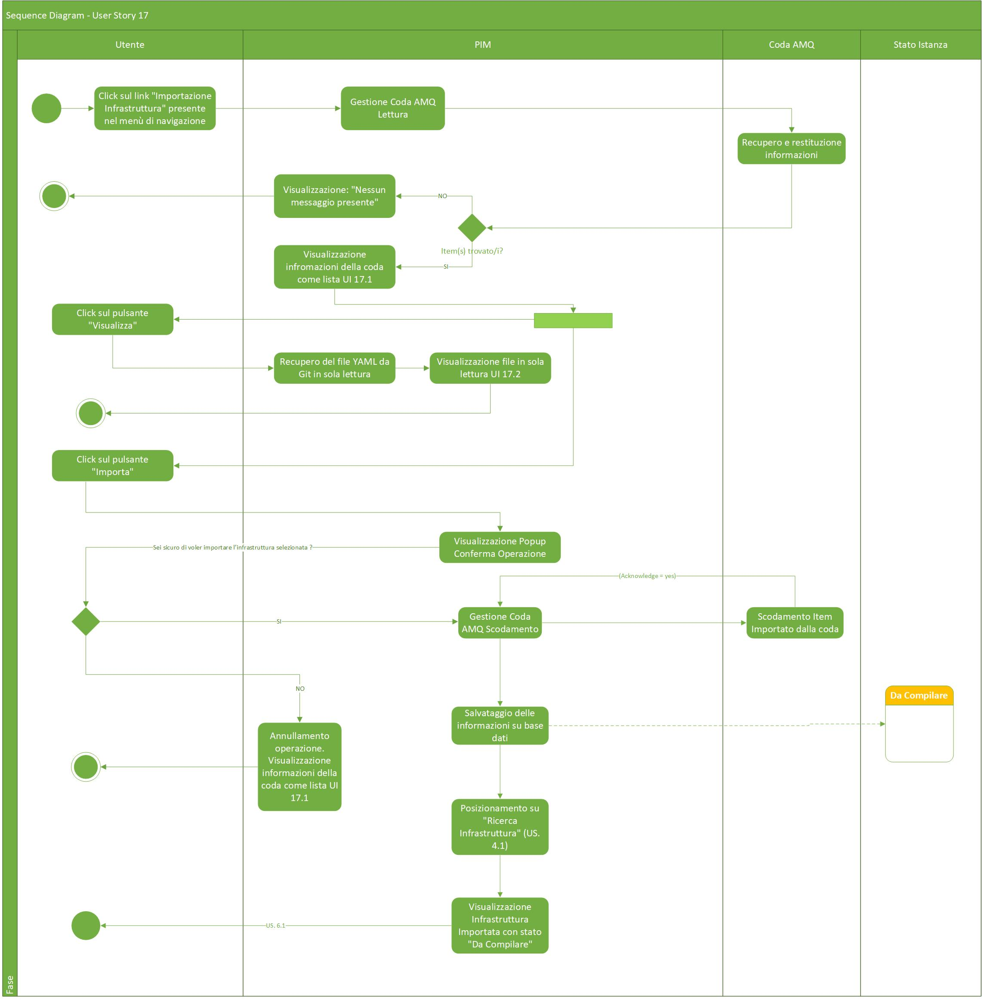
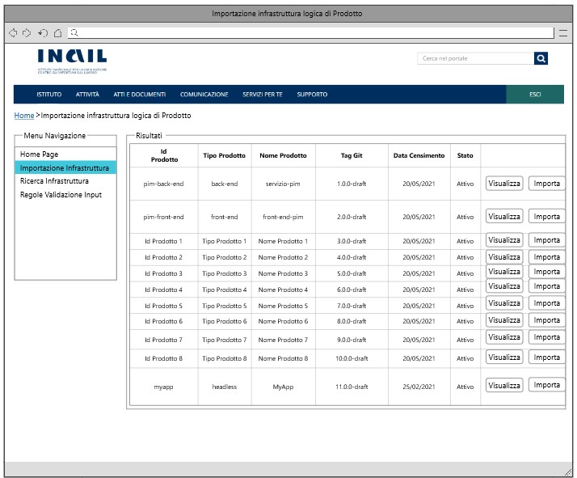
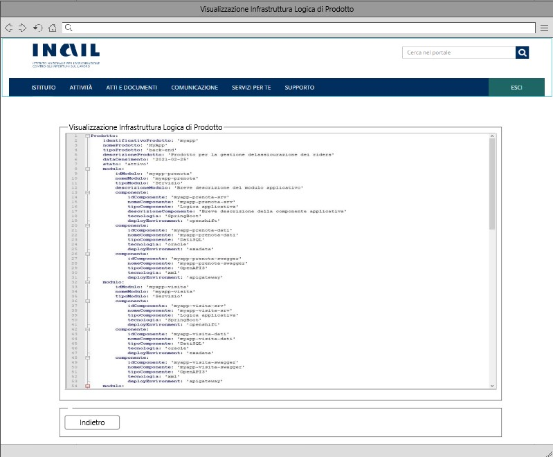

# User Story - Id 17 - Importazione Infrastruttura Logica Di Prodotto (Gestione Evento su Coda AMQ)

## Descrizione

- COME: utente con ruolo OPS o con ruolo ADMIN

- DEVO POTER: eseguire la funzionalità di importazione dell'infrastuttura logica di prodotto adoperando una gestione degli eventi su coda AMQ.
  1. Accedo alla funzionalità mediante apposita voce di menu "Importazione infrastruttura logica di prodotto"
  2. Il sistema PIM al click dell'apposito button "Importazione infrastruttura logica di prodotto" propone una maschera con un elenco raffigurante gli items contenuti all'interno della coda AMQ  ([UI. 17.1](#user-interface-mockup))
  3. Le informazioni rappresentate sono le stesse mostrate nella sezione [Criteri di accettazione](#criteri-di-accettazione) eccetto l'info *urlRepoGit* che non è mostrata come informazione prioritaria ma sarà necessaria per l'importazione e la visualizzazione. 
  4. Al click sulla maschera "Importazione infrastruttura logica di prodotto" il sistema si configura per andare in lettura su una coda(coda JMS) e si predispone per la visualizzazione dei messaggi contenuti nella coda.  
  5. Se è presente almeno un messaggio in coda allora:  
    5.1. il sistema garantirà la possibilità di poter procedere alla visualizzazione e successivamente all'importazione.  
    5.2. Per visualizzare il contenuto del file YAML (prima di importarlo) basterà cliccare sull'apposito pulsante "Visualizza". ([UI. 17.2](#user-interface-mockup))    
        5.2.1 Il sistema:  
        5.2.2 Invia una richiesta al microservizio al fine di poter visualizzare il file YAML in sola lettura. 
        5.2.3 Il microservizio utilizza il repositoty su GitLab per poter reperire il file YAML  
        5.2.4 Una nuova finestra mosterà il file completo in sola lettura con la possibilità di poter tornare indietro e procedere successivamente con l'importazione.  
    5.3. Per confermare l'importazione e la visualizzazione delle informazioni specificate all'interno della coda basterà cliccare sull'apposito pulsante "Importa e visualizza". ([UI. 17.1](#user-interface-mockup))  
    5.4. Il sistema visualizza una finestra Popup con il messaggio: "Conferma Operazione. Sei sicuro di voler importare e visualizzare l'infrastruttura selezionata?" SI / NO    
        5.4.1. Se clicco su NO il sistema annulla l'operazione e procede come al punto 2  
        5.4.2. Se clicco su SI il sistema:    
            5.4.2.1. Esegue il consumer del messaggio: la coda viene svuotata di quel specifico messaggio importato (Scodamento/Estrazione).  
            5.4.2.2. Effettua una chiamata ad un operazione di microservizio con il quale viene reperito l'id di correlazione (campo nascosto contenuto all'interno del JSON rilasciato dal microservizio quando verranno restituite le info sulla coda).  
            5.4.2.3. Viene pescato dall'elenco l'item che presenta l'id di correlazione uguale a quello ricevuto in input comprensivo dell'endpoint di GitLab. 
            5.4.2.4. Persiste le informazioni in base dati. 
            Per l'evento importato il sistema crea una occorrenza nelle tabelle ISTANZA_BLUEPRINT e STATO_ISTANZA_BLUEPRINT 
            Il valore dello stato dell'occorrenza inserita in STATO_ISTANZA_BLUEPRINT è *Da Compilare*. 
            Il dettaglio delle informazioni che il sistema deve persistere é descritto nella sezione [Data Model della US](#data-model) 
            5.4.2.5. Infine, il sistema si posiziona su "Visualizzazione Infrastruttura" ([US 5.1](us_5.1_visualizzazione_infrastruttura_prodotto.md)) mostrando l'infrastruttura appena importata e pronta per essere compilata nello stato *Da Compilare*.
6. Se nessun messaggio è presente in coda allora:  
    6.1. il sistema mostra una lista vuota, riportando il messaggio: "Nessun messaggio presente".  

- AL FINE DI: poter importare a sistema
  - le informazioni necessarie a stabilire un collegamento tra le informazioni applicative;
  - il file di infrastruttura logica di Prodotto associato al ticket (File infrastruttura logica di Prodotto) e poter così gestire il workflow previsto per la gestione del ciclo di vita dell'infrastruttura logica di Prodotto. Questa funzionalità rappresenta lo step di entry-point del workflow applicativo previsto ([US. 1.1](us_1.1_stati_applicativi_infrastruttura_prodotto.md))

## Riferimenti

Di seguito i riferimenti e/o collegamenti ad altre US citate in questa

### [User Story - Id 1.1 - Stati Applicativi Infrastruttura di prodotto](us_1.1_stati_applicativi_infrastruttura_prodotto.md)
### [User Story - Id 5.1 - Visualizzazione Infrastruttura di prodotto](us_5.1_visualizzazione_infrastruttura_prodotto.md)

## Criteri di accettazione

- DATO: un opportuno file YAML  

- QUANDO: l'utente OPS o ADMIN deve importare un infrastruttura logica di Prodotto

- QUINDI: il sistema deve permettere
  - l'importazione delle informazioni necessarie al collegamento e alla gestione dell'infrastruttura logica di Prodotto 
  - la visualizzazione delle informazioni prima della conferma dell'importazione**:
    - *idProdotto*: identificativo del prodotto
    - *tipoProdotto*: tipologia del prodotto
    - *nomeProdotto*: nome del prodotto
    - *descrizioneProdotto*: descrizione del prodotto
    - *dataCensimento*: data censimento su EA del prodotto
    - *stato*: stato del prodotto (es: attivo) 
    - *urlRepoGit*: url http del repository (Non visualizzato ma necessario)
    - *urlRepoGitApi*: indirizzo http del dell’api del repository dove è presente il file
    - *tagGit*: il valore del tag git a cui si deve fare riferimento per il prelievo del file
  - l'esecuzione dell'importazione in archivio delle informazioni, mediante utilizzo della coda precedentemente descritta  
  - al termine dell'operazione di importazione il sistema dovrà aver inserito una occorrenza nelle seguenti tabelle: ISTANZA_BLUEPRINT, STATO_ISTANZA_BLUEPRINT
  - il valore dello stato dell'occorrenza inserita in STATO_ISTANZA_BLUEPRINT deve essere: *Da Compilare*.
   
    
## Controlli e vincoli

Non presente/i

## Trigger

Esigenza di importazione delle infrastrutture logiche di prodotto architetturali.

## Pre-Requisiti

L'utente ha eseguito l'accesso autenticandosi sul portale intranet.

## Data Model

Di seguito è descritta la porzione di modello dati a cui fa riferimento la funzionalità illustrata nella user story.  
Al termine dell'operazione di importazione il sistema dovrà aver inserito una occorrenza nelle seguenti tabelle.

### Tabella ISTANZA_BLUEPRINT:

| Attributo              | Tipo      | Descrizione  |
| ---------------------- | --------- | ------------ |
| ID_ISTANZA             | INT       | Identificativo autogenerato |
| ID_PRODOTTO*           | VARCHAR   | Valore dell'attributo *idProdotto* presente nella testata dell'infrastruttura di prodotto importata, fornita in input durante l'importazione                                                                                             |
| TIPO_PRODOTTO*         | VARCHAR   | Valore dell'attributo *tipoProdotto* presente nella testata dell'infrastruttura di prodotto importata, fornita in input durante l'importazione                                                                                           |
| NOME_PRODOTTO*         | VARCHAR   | Valore dell'attributo *nomeProdotto* presente nella testata dell'infrastruttura di prodotto importata, fornita in input durante l'importazione                                                                                           |
| DESCRIZIONE_PRODOTTO*  | VARCHAR   | Valore dell'attributo *descrizioneProdotto* presente nella testata dell'infrastruttura di prodotto importata, fornita in input durante l'importazione                                                                                    |
| DATA_DENSIMENTO*       | TIMESTAMP | Valore dell'attributo *dataCensimento* presente nella testata dell'infrastruttura di prodotto importata, fornita in input durante l'importazione                                                                                         |
| FILE_BLUEPRINT_ORIG    | FILE      | File di infrastruttura di prodotto associato al censimento e recuperato da GitLab durante l'importazione                                                                                                                                |
| FILE_BLUEPRINT_TARGET  | FILE      | File di infrastruttura di prodotto associato elaborato ed archiviato su GitLab con il passaggio di stato in *Archiviato*                                                                                                                |
| URL_REPOSITORY_GIT     | VARCHAR   | Valore del path/url del repository git dove presente il file archiviato, generata a partire da un base path url/*idProdotto* / configurazione-prodotto.git |
| NOME_BRANCH_GIT        | VARCHAR   | Valore del nome del branch del repository git dove presente il file archiviato.      |
| DATA_CREAZIONE         | TIMESTAMP | Data di creazione dell'occorrenza in tabella                                                           |
| UTENTE_CREAZIONE       | VARCHAR   | Utente applicativo che ha eseguito la creazione dell'occorrenza in tabella             |
| DATA_ULTIMA_MODIFICA   | TIMESTAMP | Data di ultimo aggiornamento dell'occorrenza in tabella                         |
| UTENTE_ULTIMA_MODIFICA | VARCHAR   | Utente applicativo che ha eseguito l'ultimo aggiornamento dell'occorrenza in tabella                     |
| DATA_IMPORT_ASSET      | TIMESTAMP | Data di importazione dell'asset di infrastruttura di prodotto       |
| DATA_IMPORT_FILE       | TIMESTAMP | Data di importazione del file di infrastruttura di prodotto       |
| JMS_CORRELATION_ID     | VARCHAR   | JmsCorrelationId identificativo del messaggio in coda       |
| VERSION                | NUMBER    | Number versione       |
| BLUEPRINT              | VARCHAR   | Valore dell'attributo *blueprint* presente nella testate dell'infrastruttura di prodotto importata, fornita in input durante l'importazione      |
| TAG_GIT                | VARCHAR   | Tag Git per la definizione del file di infrastruttura definitivo (tutti i componenti di tutti gli ambienti compilati)               |
| URL_REPOSITORY_GIT_API | VARCHAR   | URL repository Git Api dove è contenuto il file di infrastruttura    |
| VERSIONE_PRODOTTO      | VARCHAR   | Valore dell'attributo *versioneProdotto* presente nella testata dell'infrastruttura di prodotto importata, fornita in input durante l'importazione         |
| ID_STATO               | NUMBER    | Identificativo dell'occorrenza ANAGRAFICA_STATO a cui l'istanza fa riferimento|
| TAG_GIT_CI             | VARCHAR   | Tag Git per la definizione dell'infrastruttura (completa o parziale) relativo all'ambiente CI|
| TAG_GIT_COLL           | VARCHAR   | Tag Git per la definizione dell'infrastruttura (completa o parziale) relativo all'ambiente COLL|
| TAG_GIT_CERT           | VARCHAR   | Tag Git per la definizione dell'infrastruttura (completa o parziale) relativo all'ambiente CERT|
| TAG_GIT_PROD           | VARCHAR   | Tag Git per la definizione dell'infrastruttura (completa o parziale) relativo all'ambiente PROD|

 
 

### Tabella STATO_ISTANZA_BLUEPRINT

|    Attributo               |   Tipo    | Descrizione                                                                                 |
|  ----------------------    |  -------  | ------------------------------------------------------------------------------------------- | 
|   ID_STATO_ISTANZA         |    INT    | Identificativo autogenerato                                                                 |
|   ID_ISTANZA               |    INT    | Identificativo dell'occorrenza ISTANZA_BLUEPRINT a cui lo stato fa riferimento (chiave esterna ISTANZA_BLUEPRINT)|
|   COD_STATO                |    INT    | Identificativo dell'occorrenza ANAGRAFICA_STATO a cui l'istanza fa riferimento (chiave esterna ANAGRAFICA_STATO) |
|   DATA_CAMBIO_STATO        | TIMESTAMP | Data dell'inserimento dell'occorrenza in tabella, al primo inserimento ed ad ogni cambio di stato  | 
|   UTENTE_CAMBIO_STATO      |  VARCHAR  | Utente che ha eseguito l'inserimento dell'occorrenza in tabella, al primo inserimento ed ad ognicambio di stato  |

 
 

## Diagrammi

Di seguito il sequence diagram che illustra le azioni previste dalla User Story
 

 

[Download file visio del sequence diagram della user story ](../files/sequence_diagram_us_17.1.vsdx)

 
 

## User Interface Mockup

- UI 17.1

 
 

- UI 17.2

## Correlazione Chiamate ai Metodi Corrispondenti

Di seguito sono riportate le chiamate ai metodi della specifica funzionalità evidenziata con relativo path e descrizione, al fine di agevolare lo sviluppo della FASE2.

|Funzionalità|Tipologia Chiamata|Path |Descrizione|
|---------|---------|---------|---------|
|Necessaria alla visualizzazione del file YAML (Button Visualizza)|GET      |{{baseUrl}}/pim-api/asset/:jmsCorrelationId|L’API invia al sistema la richiesta per la visualizzazione del FileBluePrint presente sul repository|
|Necessaria all'importazione del file YAML (Button Importa)|POST     |{{baseUrl}}/pim-api/asset/:jmsCorrelationId|L’API invia al sistema la richiesta per l'importazione e persistenza dello specifico messaggio in coda |
|Necessaria alla cancellazione del messaggio in coda (Scodamento) (Operazione associata al click del button Importa)|DEL      |{{baseUrl}}/pim-api/asset/:jmsCorrelationId|L’API invia al sistema la richiesta per l'eliminazione dello specifico messaggio in coda |
|Necessaria al caricamento della lista dei messaggi presenti in coda (Button Importazione Infrastruttura)|GET      |{{baseUrl}}/pim-api/asset/list|L’API invia al sistema la richiesta per la visualizzazione della lista dei messaggi presenti in coda|

 
Per poter inviare un messaggio nel sistema:

|Funzionalità|Tipologia Chiamata|Path |Descrizione|
|---------|---------|---------|---------|
|Necessaria all'invio del messaggio in coda nel sistema         |POST         |{{baseUrl}}/pim-api/amq/send         |L'API inoltra il body con la struttura del messaggio al sistema         |

Body di ESEMPIO:  

{  
    "idProdotto": "servizi_per_la_release_management_platform",  
    "nomeProdotto": "Servizi per la Release Management Platform",  
    "tipoProdotto": "headless",  
    "descrizioneProdotto": "Il prodotto espone le api necessarie ad erogare le funzionalita...",  
    "dataCensimento": "2022-03-14",  
    "stato": "attivo",  
    "urlRepoGit": "https://gitlab-os-lab.inail.it/pimui/configurazione-infrastrutturale-prodotto",  
    "urlRepoGitApi": "https://gitlab-os-lab.inail.it/api/v4/projects/pimui%2Fconfigurazione-infrastrutturale-prodotto/repository/files/configurazione.yml/raw?ref=17.0.0-draft",  
    "tagGit": "17.0.0-draft"  
}