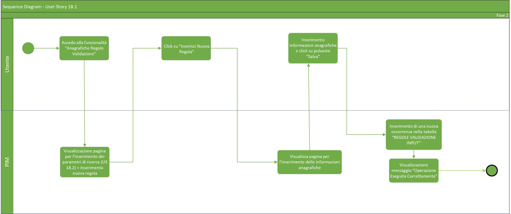
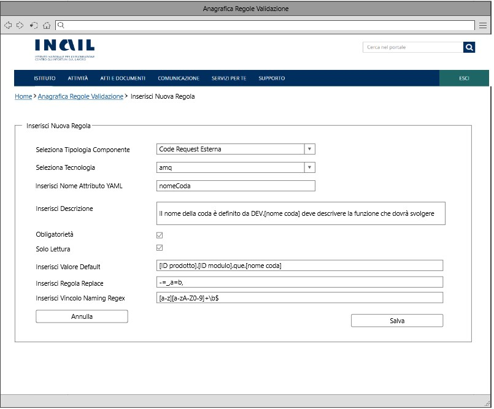

# User Story - Id 18.1 - Gestione Naming Convention (Funzionalità CRUD (CREATE)) - Regole Validazione Input

## Descrizione

- COME: utente con ruolo ADMIN;

- DEVO POTER: eseguire la funzionalità di inserimento delle informazioni necessarie alla validazione INPUT e di conseguenza all'applicazione delle eventuali regole di Naming (raccolti nell'([US 16](us_16_compilazione_tipi_di_componenti_e_naming_convention.md));

1. Dall'apposita voce di menu *Anagrafica Regole Validazione* accedo alla funzionalità di ricerca delle informazioni anagrafiche ([US 18.2 - (Funzionalità CRUD (READ))](us_18.2_gestione_naming_convention_(funzionalità_CRUD_read).md));
2. Il sistema visualizza la pagina web della funzionalità di ricerca ([UI 18.1.1](#user-interface-mockup));
3. Clicco su apposito pulsante *Inserisci Nuova Regola*;
4. Il sistema visualizza la pagina web relativa all'inserimento delle informazioni anagrafiche come rappresentato in figura ([UI 18.1.2](#user-interface-mockup));
5. Inserisco le informazioni relative alla definizione dell'item di anagrafica:
   
    |    Campo Input             |   Tipo                    | Ob. | Descrizione                                                                                 |
    |  ----------------------    |  -----------------------  | --- | --------------------------------------------------------------------------------------- | 
    |   Tipologia Componente     |    Elenco di selezione    | SI |Tipologia del componente per il quale i valori presenti nella colonna di selezione dovranno essere caricati dalla tabella TIPO_COMPONENTE con contenuto predefinito e precaricato all'accesso della pagina |
    |   Tecnologia               |    Elenco di selezione    | SI |Tecnologie associate ad una specifica Tipologia  componente per il quale i valori presenti nella colonna di selezione dovranno essere caricati dalla tabella TECNOLOGIA con contenuto predefinito e precaricato in funzione della selezione operata sull'elenco Tipologia Componente  |
    |   Nome Attributo YAML      |    Stringa testo libero   | SI | Nome dell'attributo yaml al quale devono essere applicate le regole indicate|
    |   Descrizione              |    Stringa testo libero   | NO | Descrizione dell'attributo yaml |
    |   Obbligatorietà           |    Booleano               | NO*| Indica se il campo è obligatorio, valore di dafault = false ---- (obligatorio al minimo uno tra i valori NO*) |
    |   Solo Lettura             |    Booleano               | NO | Indica se il campo è di solo lettura, valore di default = false|
    |   Regola valore default    |    Stringa testo libero   | NO*| La stringa che contiene la regola relativa ad un eventuale valore di default ---- (obligatorio al minimo uno tra i valori NO*) |
    |   Regola Replace           |    Stringa testo libero   | NO | La stringa che contiene un eventuale carattere da sostituire nel valore di default (es: _=-,a=b)       | 
    |   Vincolo Naming Regex     |    Stringa testo libero   | NO| La stringa che contiene il vincolo Naming Regex necessaria alla valorizzazione del campo a seconda che la stringa segua o meno un certo pattern (es: ^[a-z][a-zA-Z0-9-/.]+\b$) |

6. Ultimate le operazioni di digitazione dati clicco sull'apposito pulsante *Salva*;
7. Il sistema esegue un inserimento nella tabella REGOLE_VALIDAZIONE_INPUT;
8. Il sistema visualizza un messaggio di *Operazione eseguita correttamente*;
9. Il sistema visualizza la pagina web della funzionalità di ricerca.

- AL FINE DI: inserire il nome attributo, l'eventuale vincolo di naming regex, l'eventuale valore di default, l'eventuale regola di replace, l'eventuale descrizione, l'eventuale obligatorietà/solo lettura a sistema associati al determinato componente/tecnologia.

## Riferimenti

Di seguito i riferimenti e/o collegamenti ad altre US citate in questa:

[User Story - Id 16 - Compilazione Tipi di Componenti e Naming Convention](us_16_compilazione_tipi_di_componenti_e_naming_convention.md)  
[User Story - Id 18.2 - Gestione Naming Convention (Funzionalità CRUD (READ))](us_18.2_gestione_naming_convention_(funzionalità_CRUD_read).md)

## Criteri di accettazione

- DATO: una tipologia componente, una tecnologia, un nome attributo, un eventuale descrizione, un eventuale vincolo di naming regex, un eventuale valore di default, un eventuale regolo di replace, un eventuale condizione di obligatorietà/sola lettura;  

- QUANDO: l'utente OPS o ADMIN deve inserire le informazioni(vincolo naming regex, obligatorietà, valori di default, ecc) relative ad un determinato componente e a una determinata tecnologia; 

- QUINDI: il sistema deve permettere:
  - l'immissione di un componente associato ad una tecnologia;
  - la creazione e l'immissione di un nome attributo;
  - la creazione e l'immissione di un eventuale descrizione;
  - la creazione e l'immissione dell'eventuale vincolo di naming regex;
  - la creazione e l'immissione dell'eventuale valore di default;
  - la creazione e l'immissione dell'eventuale regola di replace;
  - la creazione e l'immissione dell'eventuale obligatorietà;
  - la creazione e l'immissione dell'eventuale sola lettura;
  - al termine delle operazioni di inserimento il sistema dovrà aver inserito una occorrenza nella tabella: REGOLE_VALIDAZIONE_INPUT.

## Controlli e vincoli

Quando avviene l'inserimento di una occorenza in REGOLA_VALIDAZIONE_INPUT deve essere valorizzato il tipo di componente, il tipo di tecnologia, il nome attributo e almeno uno tra obligatorietà e valore di default.

Un campo per essere impostato in sola lettura (non modificabile) è necessario che sia stato inserito un valore di default; diversamente, in fase di inserimento, verrà generato un errore.  

Il valore di default può essere impostato nella sezione "Regola Valore Default" in tre diverse tipologie:  

|Tipologia  |Valore di Default Impostato In Regole Validazione Input  |Valore di Default Mostrato In Compilazione   |Descrizione  |
|---------|---------|---------|---------|
|Valore statico     |Es. 1: 8080   Es. 2: Multicast         |Es. 1: 8080   Es. 2: Multicast         |Il valore viene riportato in sede di compilazione senza effettuare nessuna conversione.    L’inserimento in sede di compilazione di un valore diverso da quello impostato in questa sezione comporta la generazione di un errore.         |
|Valore da sostituire     |Es. 1: [idProdotto]   Es. 2: Client[idComponente]       |Es.1: servizi_per_la_release   Es. 2: Clientdatabase_component      |Il valore viene riportato in sede di compilazione convertendo quello che viene individuato all’interno di [ ... ] e lasciando il resto invariato.    L’inserimento in sede di compilazione di un valore diverso da quello impostato in questa sezione comporta la generazione di un errore.        |
|Carattere speciale [*]     |Es. 1: [idProdotto]-[asterisco*]   Es. 2: [asterisco*][idComponente]   |Es.1: servizi_per_la_release-PROVA   Es.2: TESTdatabase_component  |Il carattere speciale garantisce l’immissione, in sede di compilazione, di una qualsiasi stringa o carattere nella stessa posizione del carattere [asterisco*].    L’inserimento in sede di compilazione di un valore diverso da quello impostato in questa sezione per la parte antecedente l’ [asterisco*] comporta la generazione di un errore.        |

## Trigger

Esigenza di inserimento del nome attributo, del vincolo di naming regex, del valore di default, della regola di replace, della descrizione e dell'obligatorietà/solo lettura associati ad un determinato componente/tecnologia.

## Pre-Requisiti

L'utente ha eseguito l'accesso autenticandosi sul portale intranet.

Nelle tabelle TIPO_COMPONENTE e TECNOLOGIA devono essere state caricate e relazionate le seguenti informazioni:

| Tipo Componente        | Tecnologia   |  
-----------------------  | -------------|
| Logica Applicativa BE  | springboot   |
| Logica Applicativa BE  | nodejs       |
| Logica Applicativa BE  | dotnet       |
| SPA                    | angular      |
| CDN                    | js-css-html  |
| Api Sincrone           | openapi3     |
| Code Request Esterna   | amq          |  
| Evento Esterno Pub     | amq          |
| Evento Esterno Sub     | amq          |
| Dati SQL               | oracle       |
| Dati SQL               | sqlserver    |
| Dati SQL               | db2luw       |
| Dati SQL               | postgresql   |
| Dati NoSQL             | mongodb      |

## Data Model

Di seguito è descritta la porzione di modello dati a cui fa riferimento la funzionalità illustrata nella user story.  

### Tabella TIPO_COMPONENTE: 

|Attributo  |Tipo  |Descrizione  |
|---------|---------|---------|
|ID       |INT         |Identificativo autogenerato          |
|NOME     |VARCHAR         |Nome del componente gestito dall'applicativo         |
|DATA_CREAZIONE     |TIMESTAMP         |Data di creazione dell'occorrenza in tabella         |
|UTENTE_CREAZIONE     |VARCHAR         |Utente applicativo che ha eseguito la creazione dell'occorrenza in tabella           |
|UTENTE_MODIFICA     |VARCHAR          |Data di ultimo aggiornamento dell'occorrenza in tabella           |
|DATA_ULTIMA_MODIFICA     |TIMESTAMP         |Utente applicativo che ha eseguito l'ultimo aggiornamento dell'occorrenza in tabella         |

### Tabella TECNOLOGIA: 

|Attributo  |Tipo  |Descrizione  |
|---------|---------|---------|
|ID     |INT         |Identificativo autogenerato           |
|ID_TIPO_COMPONENTE     |INT         |Identificativo dell'occorrenza TIPO_COMPONENTE a cui lo stato fa riferimento (chiave esterna TIPO_COMPONENTE)         |
|NOME     |VARCHAR         |Nome della tecnologia gestita dall'applicativo         |
|DATA_CREAZIONE     |TIMESTAMP         |Data di creazione dell'occorrenza in tabella           |
|UTENTE_CREAZIONE     |VARCHAR         |Utente applicativo che ha eseguito la creazione dell'occorrenza in tabella         |
|UTENTE_MODIFICA     |VARCHAR          |Data di ultimo aggiornamento dell'occorrenza in tabella          |
|DATA_ULTIMA_MODIFICA     |TIMESTAMP         |Utente applicativo che ha eseguito l'ultimo aggiornamento dell'occorrenza in tabella         |
|NOME_TIPO_COMPONENTE|VARCHAR| Nome del tipo componente associato alla specifica tecnologia|
|HAVE_RUNTIME|CHAR |Valore necessario (1/0) per comprendere se la tecnologia ha una sezione di runtime environment compilabile|

### Tabella REGOLE_VALIDAZIONE_INPUT:

|Attributo  |Tipo  |Descrizione  |
|---------|---------|---------|
|ID     |INT         |Identificativo autogenerato           |
|ID_TIPO_COMPONENTE     |INT         |Identificativo dell'occorrenza TIPO_COMPONENTE a cui lo stato fa riferimento (chiave esterna TIPO_COMPONENTE)          |
|ID_TECNOLOGIA     |INT         |Identificativo dell'occorrenza TECNOLOGIA a cui lo stato fa riferimento (chiave esterna TECNOLOGIA)          |
|NOME_ATTRIBUTO_YAML     |NAVARCHAR         |Nome dell'attributo contenuto nel file YAML         |
|DESCRIZIONE     |NAVARCHAR         |Eventuale descrizione specifica attribuita all'attributo YAML (Non obligatoria)         |
|VINCOLO_NAMING_REGEX     |NAVARCHAR         |Vincolo Naming Convention (Non obligatorio). Se non è stato specificato nessun vincolo il campo rimane vuoto (NULL)        |
|REGOLA_NAMING_CONVENTION |NAVARCHAR         |Regola Naming Convention (Non obligatoria). Se non è stata specificata nessuna regola di naming il campo rimane vuoto (NULL)         |
|OBLIGATORIETA'     |BOOLEAN         |Eventuale obligatorietà del valore (Specificare SI/NO)          |
|REGOLA_VALORE_DEFAULT     |NAVARCHAR         |Valore predefinito da applicare. (Non obligatorio) Se non è stato specificato nessun valore di default il campo rimane vuoto (NULL)         |
|DATA_CREAZIONE     |TIMESTAMP         |Data di creazione dell'occorrenza in tabella           |
|UTENTE_CREAZIONE     |VARCHAR         |Utente applicativo che ha eseguito la creazione dell'occorrenza in tabella         |
|UTENTE_MODIFICA     |VARCHAR          |Data di ultimo aggiornamento dell'occorrenza in tabella          |
|DATA_ULTIMA_MODIFICA     |TIMESTAMP   |Utente applicativo che ha eseguito l'ultimo aggiornamento dell'occorrenza in tabella         |
|NOME_TECNOLOGIA|VARCHAR |Nome della tecnologia associata alla regola di validazione |
|NOME_TIPO_COMPONENTE|VARCHAR |Nome del tipo componente associata alla regola di validazione |
|READ_ONLY|BOOLEAN|Eventuale valore di sola lettura (Specificare SI/NO)|
|REPLACE_REGEX|VARCHAR|Carattere/i da sostituire nel valore di default|

## Diagramma Entità Relazione

Di seguito il diagramma relativo al modello dati previsto per la gestione della Naming Convention mediante le funzionalità CRUD:

 

 

## Diagrammi

Di seguito il sequence diagram che illustra le azioni previste dalla User Story:

 

 

[Download file visio del sequence diagram della user story ](../files/sequence_diagram_us_18.1.vsdx)

 
 

## User Interface Mockup

- UI 18.1.1

 
 

- UI 18.1.2

## Correlazione Chiamate ai Metodi Corrispondenti

Di seguito sono riportate le chiamate ai metodi della specifica funzionalità evidenziata con relativo path e descrizione, al fine di agevolare lo sviluppo della FASE2.

|Funzionalità|Tipologia Chiamata|Path |Descrizione|
|---------|---------|---------|---------|
|Necessaria per effettuare il salvataggio della nuova regola di validazione (Button Salva)         |POST         |{{baseUrl}}/pim-api/validazione/regolevalidazioneinput         |L’API invia al sistema la richiesta per effettuare l'inserimento di una nuova regola di validazione input |
|Necessaria al caricamento della ComboBox TipoComponente/Tecnologia|GET|{{baseUrl}}/pim-api/validazione/tipocomponente/list|L’API invia al sistema la richiesta della lista di Tipocomponente|
