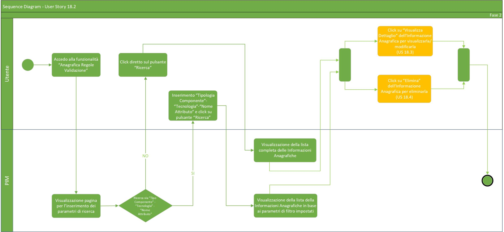
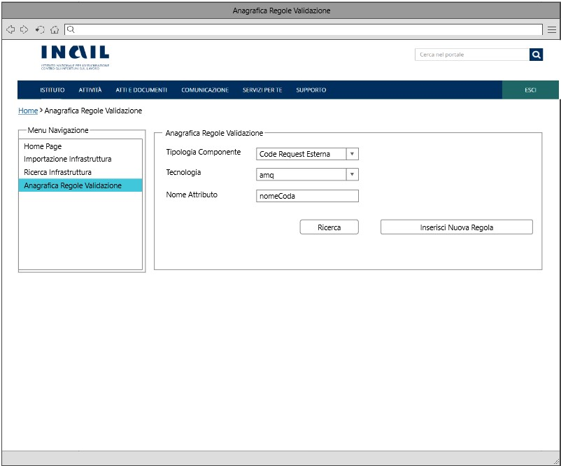
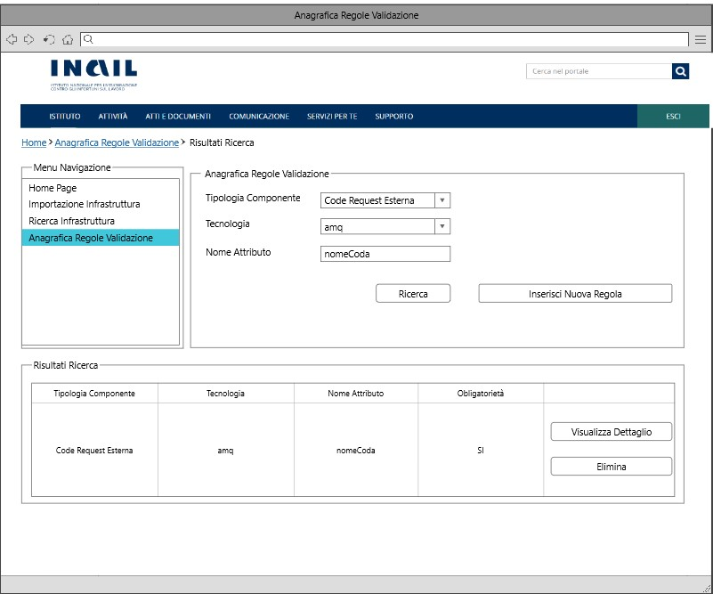

# User Story - Id 18.2 - Gestione Naming Convention (Funzionalità CRUD (READ)) - Regole Validazione Input 

## Descrizione

- COME: utente con ruolo ADMIN;

- DEVO POTER: eseguire la funzionalità di ricerca delle informazioni inerenti alle regole di validazione inserite a sistema (raccolte nell'([US 16](us_16_compilazione_tipi_di_componenti_e_naming_convention.md)) delineando come campi di filtro l'oppurtuna tipologia di componente, la tecnologia e il nome attributo;

1. Dall'apposita voce di menu *Anagrafica Regole Validazione* accedo alla funzionalità di ricerca delle informazioni anagrafiche;
2. Il sistema visualizza la pagina web della funzionalità di ricerca ([UI 18.2.1](#user-interface-mockup));
3. Ricerca associata a Tipologia Componente, Tecnologia e Nome Attributo YAML: 
    3.1. Inserisco le informazioni relative a Tipologia Componente, Tecnologia e Nome Attributo YAML (Campi di FILTRO); 
   (Tipologia Componente e Tecnologia si presentano sotto forma di una ComboBox con le occorrenze già precaricate a sistema e relazionate tra loro come indicato nella ([US 18.1](us_18.1_gestione_naming_convention_(funzionalità_CRUD_create).md))); 
    3.2. Clicco su apposito pulsante *Ricerca*; 
    3.3. Il sistema esegue una query sulla base dati interna PIM per il recupero delle informazioni legate al criterio di ricerca; 
    3.4. Il sistema visualizza in basso tutte le occorrenze individuate secondo i parametri di ricerca impostati come rappresentato in figura ([UI 18.2.2](#user-interface-mockup)); 
4. Ricerca in base a differenti criteri: 
    4.1. Non è obligatorio la valorizzazione di tutti i campi (ad esempio può essere inserito anche solo la Tipologia Componente associata alla tecnologia, senza valorizzare il campo Nome Attributo); 
    4.2. Inserisco le informazioni da valorizzare o clicco direttamente su apposito pulsante *Ricerca*; 
    4.3. Il sistema esegue una query sulla base dati interna PIM per il recupero delle informazioni legate al criterio di ricerca; 
    4.4. Il sistema visualizza in basso tutte le occorrenze individuate secondo i parametri di ricerca impostati come rappresentato in figura ([UI 18.2.2](#user-interface-mockup)); 
5. Il sistema garantirà inoltre la possibilità di visualizzare/effettuare un aggiornamento delle regole di validazione cliccando sull'apposito pulsante *Visualizza Dettaglio* (vedi [US 18.3](us_18.3_gestione_naming_convention_(funzionalità_CRUD_update).md)) o effettuare una cancellazione completa cliccando sull'apposito pulsante *Elimina* (vedi [US 18.4](us_18.4_gestione_naming_convention_(funzionalità_CRUD_delete).md)).

- AL FINE DI: ricercare tutte le regole di validazione inserite a sistema associate ad una specifica tipologia componente e tecnologia.

## Riferimenti

Di seguito i riferimenti e/o collegamenti ad altre US citate in questa:

[User Story - Id 16 - Compilazione Tipi di Componenti e Naming Convention](us_16_compilazione_tipi_di_componenti_e_naming_convention.md)  
[User Story - Id 18.3 - Gestione Naming Convention (Funzionalità CRUD (UPDATE))](us_18.3_gestione_naming_convention_(funzionalità_CRUD_update).md)  
[User Story - Id 18.4 - Gestione Naming Convention (Funzionalità CRUD (DELETE))](us_18.4_gestione_naming_convention_(funzionalità_CRUD_delete).md)

## Criteri di accettazione

- DATO: un determinato componente, una determinata tecnologia e un nome attributo;

- QUANDO: l'utente OPS o ADMIN deve ricercare le informazioni(naming regex, obligatorietà, valori di default, ecc);

- QUINDI: il sistema deve permettere:
  - la ricerca e la visualizzazione delle informazioni presenti in tabella REGOLE_VALIDAZIONE_INPUT.
  
## Controlli e vincoli

Per poter valorizzare la ricerca non è necessario inserire nelle apposite sezioni la tipologia componente, la tecnologia ad esso associata e il nome attributo YAML. Non inserendo nessuna occorrenza nelle sezioni e cliccando sull'apposito pulsante *Ricerca*, la ricerca verrà comunque effettuata mostrando tutte le regole immesse a sistema.  
Tipologia componente, tecnologia e nome attributo si configurano importanti nel momento in cui è necessario perfezionare la suddetta.

## Trigger

Esigenza di ricerca delle regole di validazione associati ad un determinato componente/tecnologia/nome attributo.

## Pre-Requisiti

L'utente ha eseguito l'accesso autenticandosi sul portale intranet.

Nelle tabelle TIPO_COMPONENTE e TECNOLOGIA devono essere state caricate e relazionate le seguenti informazioni:

| Tipo Componente        | Tecnologia   |  
-----------------------  | -------------|
| Logica Applicativa BE  | springboot   |
| Logica Applicativa BE  | nodejs       |
| Logica Applicativa BE  | dotnet       |
| SPA                    | angular      |
| CDN                    | js-css-html  |
| Api Sincrone           | openapi3     |
| Code Request Esterna   | amq          |  
| Evento Esterno Pub     | amq          |
| Evento Esterno Sub     | amq          |
| Dati SQL               | oracle       |
| Dati SQL               | sqlserver    |
| Dati SQL               | db2luw       |
| Dati SQL               | postgresql   |
| Dati NoSQL             | mongodb      |

## Data Model

Di seguito è descritta la porzione di modello dati a cui fa riferimento la funzionalità illustrata nella user story.  

### Tabella TIPO_COMPONENTE: 

|Attributo  |Tipo  |Descrizione  |
|---------|---------|---------|
|ID       |INT         |Identificativo autogenerato          |
|NOME     |VARCHAR         |Nome del componente gestito dall'applicativo         |
|DATA_CREAZIONE     |TIMESTAMP         |Data di creazione dell'occorrenza in tabella         |
|UTENTE_CREAZIONE     |VARCHAR         |Utente applicativo che ha eseguito la creazione dell'occorrenza in tabella           |
|UTENTE_MODIFICA     |VARCHAR          |Data di ultimo aggiornamento dell'occorrenza in tabella           |
|DATA_ULTIMA_MODIFICA     |TIMESTAMP         |Utente applicativo che ha eseguito l'ultimo aggiornamento dell'occorrenza in tabella         |

### Tabella TECNOLOGIA: 

|Attributo  |Tipo  |Descrizione  |
|---------|---------|---------|
|ID     |INT         |Identificativo autogenerato           |
|ID_TIPO_COMPONENTE     |INT         |Identificativo dell'occorrenza TIPO_COMPONENTE a cui lo stato fa riferimento (chiave esterna TIPO_COMPONENTE)         |
|NOME     |VARCHAR         |Nome della tecnologia gestita dall'applicativo         |
|DATA_CREAZIONE     |TIMESTAMP         |Data di creazione dell'occorrenza in tabella           |
|UTENTE_CREAZIONE     |VARCHAR         |Utente applicativo che ha eseguito la creazione dell'occorrenza in tabella         |
|UTENTE_MODIFICA     |VARCHAR          |Data di ultimo aggiornamento dell'occorrenza in tabella          |
|DATA_ULTIMA_MODIFICA     |TIMESTAMP         |Utente applicativo che ha eseguito l'ultimo aggiornamento dell'occorrenza in tabella         |
|NOME_TIPO_COMPONENTE|VARCHAR| Nome del tipo componente associato alla specifica tecnologia|
|HAVE_RUNTIME|CHAR |Valore necessario (1/0) per comprendere se la tecnologia ha una sezione di runtime environment compilabile|

### Tabella REGOLE_VALIDAZIONE_INPUT:

|Attributo  |Tipo  |Descrizione  |
|---------|---------|---------|
|ID     |INT         |Identificativo autogenerato           |
|ID_TIPO_COMPONENTE     |INT         |Identificativo dell'occorrenza TIPO_COMPONENTE a cui lo stato fa riferimento (chiave esterna TIPO_COMPONENTE)          |
|ID_TECNOLOGIA     |INT         |Identificativo dell'occorrenza TECNOLOGIA a cui lo stato fa riferimento (chiave esterna TECNOLOGIA)          |
|NOME_ATTRIBUTO_YAML     |NAVARCHAR         |Nome dell'attributo contenuto nel file YAML         |
|DESCRIZIONE     |NAVARCHAR         |Eventuale descrizione specifica attribuita all'attributo YAML (Non obligatoria)         |
|VINCOLO_NAMING_REGEX     |NAVARCHAR         |Vincolo Naming Convention (Non obligatorio). Se non è stato specificato nessun vincolo il campo rimane vuoto (NULL)        |
|REGOLA_NAMING_CONVENTION |NAVARCHAR         |Regola Naming Convention (Non obligatoria). Se non è stata specificata nessuna regola di naming il campo rimane vuoto (NULL)         |
|OBLIGATORIETA'     |BOOLEAN         |Eventuale obligatorietà del valore (Specificare SI/NO)          |
|REGOLA_VALORE_DEFAULT     |NAVARCHAR         |Valore predefinito da applicare. (Non obligatorio) Se non è stato specificato nessun valore di default il campo rimane vuoto (NULL)         |
|DATA_CREAZIONE     |TIMESTAMP         |Data di creazione dell'occorrenza in tabella           |
|UTENTE_CREAZIONE     |VARCHAR         |Utente applicativo che ha eseguito la creazione dell'occorrenza in tabella         |
|UTENTE_MODIFICA     |VARCHAR          |Data di ultimo aggiornamento dell'occorrenza in tabella          |
|DATA_ULTIMA_MODIFICA     |TIMESTAMP   |Utente applicativo che ha eseguito l'ultimo aggiornamento dell'occorrenza in tabella         |
|NOME_TECNOLOGIA|VARCHAR |Nome della tecnologia associata alla regola di validazione |
|NOME_TIPO_COMPONENTE|VARCHAR |Nome del tipo componente associata alla regola di validazione |
|READ_ONLY|BOOLEAN|Eventuale valore di sola lettura (Specificare SI/NO)|
|REPLACE_REGEX|VARCHAR|Carattere/i da sostituire nel valore di default|
## Diagramma Entità Relazione

Di seguito il diagramma relativo al modello dati previsto per la gestione della Naming Convention mediante le funzionalità CRUD:

 

 

## Diagrammi

Di seguito il sequence diagram che illustra le azioni previste dalla User Story:

 

 

[Download file visio del sequence diagram della user story ](../files/sequence_diagram_us_18.2.vsdx)

 
 

## User Interface Mockup

- UI 18.2.1

 
 

- UI 18.2.2

## Correlazione Chiamate ai Metodi Corrispondenti

Di seguito sono riportate le chiamate ai metodi della specifica funzionalità evidenziata con relativo path e descrizione, al fine di agevolare lo sviluppo della FASE2.

|Funzionalità|Tipologia Chiamata|Path |Descrizione|
|---------|---------|---------|---------|
|Necessaria per effettuare la ricerca della regola di validazione (Button Ricerca)         |GET         |{{baseUrl}}/pim-api/validazione/regolevalidazioneinput         |L’API invia al sistema la richiesta della lista delle regole di validazione input    |
|Necessaria per effettuare la ricerca della regola di validazione in base a idTipoComponente, idTecnologia e Field Name (Opzionale) (Button Ricerca)         |GET         |{{baseUrl}}/pim-api/validazione/regolevalidazioneinput/:idTipoComponente/:idTecnologia        |L’API invia al sistema la richiesta della lista delle regole di validazione input  |
|Necessaria al caricamento della ComboBox TipoComponente/Tecnologia|GET|{{baseUrl}}/pim-api/validazione/tipocomponente/list|L’API invia al sistema la richiesta della lista di Tipocomponente|
