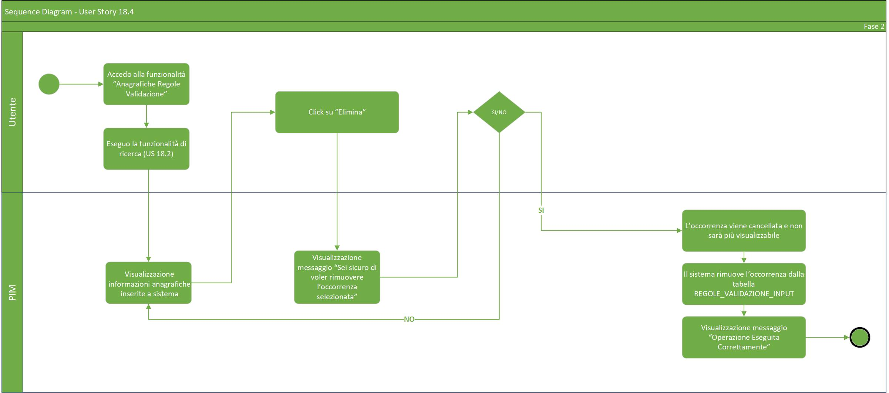

# User Story - Id 18.4 - Gestione Naming Convention (Funzionalità CRUD (DELETE)) - Regole Validazione Input

## Descrizione

- COME: utente con ruolo ADMIN;

- DEVO POTER: eseguire la funzionalità di cancellazione delle informazioni (Nome Attributo, Descrizione, vincolo Naming Regex, Valore Default, Condizione di Obligatorietà, ecc) precedentemente immesse a sistema;

1. Dall'apposita voce di menu *Anagrafica Regole Validazione* accedo alla funzionalità di ricerca delle informazioni anagrafiche ([US 18.2 - (Funzionalità CRUD (READ))](us_18.2_gestione_naming_convention_(funzionalità_CRUD_read).md));
2. Il sistema visualizza la pagina web della funzionalità di ricerca ([UI 18.4.1](#user-interface-mockup));
3. Eseguo la funzionalità specificata nella ([US 18.2 - (Funzionalità CRUD (READ))](us_18.2_gestione_naming_convention_(funzionalità_CRUD_read).md));
4. Dopo che il sistema visualizza tutte le occorrenze individuate secondo i parametri di ricerca impostati come rappresentato in figura ([UI 18.4.2](#user-interface-mockup)) sarà possibile cliccare sull'apposito pulsante *Elimina*;
5. Il sistema visualizza un messaggio: *Sei sicuro di voler rimuovere l'occorrenza selezionata ? SI/NO*;  
    5.1 Se clicco su *SI* l'occorrenza viene cancellata e non sarà più visualizzabile;  
        5.1.1 Il sistema rimuove l'occorrenza dalla tabella: REGOLE_VALIDAZIONE_INPUT;  
        5.1.2 Il sistema visualizza un messaggio di *Operazione eseguita correttamente*;  
    5.2 Se clicco su *NO* il sistema visualizza nuovamente la pagina web della funzionalità di ricerca.  

- AL FINE DI: rimuovere la regola di naming sull'attributo YAML associata al determinato componente/tecnologia.

## Riferimenti

Di seguito i riferimenti e/o collegamenti ad altre US citate in questa:

[User Story - Id 18.2 - Gestione Naming Convention (Funzionalità CRUD (READ))](us_18.2_gestione_naming_convention_(funzionalità_CRUD_read).md)

## Criteri di accettazione

- DATO: almeno un risultato nell'operazione di ricerca Anagrafiche Regole Validazione

- QUANDO: l'utente OPS o ADMIN deve cancellare le informazioni (nome attributo, regole di naming regex, obligatorietà, valori di default, ecc) relative ad un determinato componente/tecnologia.

- QUINDI: il sistema deve permettere:
  - la cancellazione completa delle informazioni sopra specificate;
  - al termine dell'operazione di cancellazione il sistema dovrà aver rimosso l'occorrenza dalla tabella: REGOLE_VALIDAZIONE_INPUT.

## Controlli e vincoli

Per poter effettuare la cancellazione è necessario che sia stata inserita almeno un occorrenza nella tabella REGOLA_VALIDAZIONE_INPUT.

## Trigger

Esigenza di cancellazione della regola di Naming sull'attributo YAML associata ad un determinato componente/tecnologia.

## Pre-Requisiti

L'utente ha eseguito l'accesso autenticandosi sul portale intranet.

## Data Model

Di seguito è descritta la porzione di modello dati a cui fa riferimento la funzionalità illustrata nella user story.  

### Tabella TIPO_COMPONENTE: 

|Attributo  |Tipo  |Descrizione  |
|---------|---------|---------|
|ID       |INT         |Identificativo autogenerato          |
|NOME     |VARCHAR         |Nome del componente gestito dall'applicativo         |
|DATA_CREAZIONE     |TIMESTAMP         |Data di creazione dell'occorrenza in tabella         |
|UTENTE_CREAZIONE     |VARCHAR         |Utente applicativo che ha eseguito la creazione dell'occorrenza in tabella           |
|UTENTE_MODIFICA     |VARCHAR          |Data di ultimo aggiornamento dell'occorrenza in tabella           |
|DATA_ULTIMA_MODIFICA     |TIMESTAMP         |Utente applicativo che ha eseguito l'ultimo aggiornamento dell'occorrenza in tabella         |

### Tabella TECNOLOGIA: 

|Attributo  |Tipo  |Descrizione  |
|---------|---------|---------|
|ID     |INT         |Identificativo autogenerato           |
|ID_TIPO_COMPONENTE     |INT         |Identificativo dell'occorrenza TIPO_COMPONENTE a cui lo stato fa riferimento (chiave esterna TIPO_COMPONENTE)         |
|NOME     |VARCHAR         |Nome della tecnologia gestita dall'applicativo         |
|DATA_CREAZIONE     |TIMESTAMP         |Data di creazione dell'occorrenza in tabella           |
|UTENTE_CREAZIONE     |VARCHAR         |Utente applicativo che ha eseguito la creazione dell'occorrenza in tabella         |
|UTENTE_MODIFICA     |VARCHAR          |Data di ultimo aggiornamento dell'occorrenza in tabella          |
|DATA_ULTIMA_MODIFICA     |TIMESTAMP         |Utente applicativo che ha eseguito l'ultimo aggiornamento dell'occorrenza in tabella         |
|NOME_TIPO_COMPONENTE|VARCHAR| Nome del tipo componente associato alla specifica tecnologia|
|HAVE_RUNTIME|CHAR |Valore necessario (1/0) per comprendere se la tecnologia ha una sezione di runtime environment compilabile|

### Tabella REGOLE_VALIDAZIONE_INPUT:

|Attributo  |Tipo  |Descrizione  |
|---------|---------|---------|
|ID     |INT         |Identificativo autogenerato           |
|ID_TIPO_COMPONENTE     |INT         |Identificativo dell'occorrenza TIPO_COMPONENTE a cui lo stato fa riferimento (chiave esterna TIPO_COMPONENTE)          |
|ID_TECNOLOGIA     |INT         |Identificativo dell'occorrenza TECNOLOGIA a cui lo stato fa riferimento (chiave esterna TECNOLOGIA)          |
|NOME_ATTRIBUTO_YAML     |NAVARCHAR         |Nome dell'attributo contenuto nel file YAML         |
|DESCRIZIONE     |NAVARCHAR         |Eventuale descrizione specifica attribuita all'attributo YAML (Non obligatoria)         |
|VINCOLO_NAMING_REGEX     |NAVARCHAR         |Vincolo Naming Convention (Non obligatorio). Se non è stato specificato nessun vincolo il campo rimane vuoto (NULL)        |
|REGOLA_NAMING_CONVENTION |NAVARCHAR         |Regola Naming Convention (Non obligatoria). Se non è stata specificata nessuna regola di naming il campo rimane vuoto (NULL)         |
|OBLIGATORIETA'     |BOOLEAN         |Eventuale obligatorietà del valore (Specificare SI/NO)          |
|REGOLA_VALORE_DEFAULT     |NAVARCHAR         |Valore predefinito da applicare. (Non obligatorio) Se non è stato specificato nessun valore di default il campo rimane vuoto (NULL)         |
|DATA_CREAZIONE     |TIMESTAMP         |Data di creazione dell'occorrenza in tabella           |
|UTENTE_CREAZIONE     |VARCHAR         |Utente applicativo che ha eseguito la creazione dell'occorrenza in tabella         |
|UTENTE_MODIFICA     |VARCHAR          |Data di ultimo aggiornamento dell'occorrenza in tabella          |
|DATA_ULTIMA_MODIFICA     |TIMESTAMP   |Utente applicativo che ha eseguito l'ultimo aggiornamento dell'occorrenza in tabella         |
|NOME_TECNOLOGIA|VARCHAR |Nome della tecnologia associata alla regola di validazione |
|NOME_TIPO_COMPONENTE|VARCHAR |Nome del tipo componente associata alla regola di validazione |
|READ_ONLY|BOOLEAN|Eventuale valore di sola lettura (Specificare SI/NO)|
|REPLACE_REGEX|VARCHAR|Carattere/i da sostituire nel valore di default|

## Diagramma Entità Relazione

Di seguito il diagramma relativo al modello dati previsto per la gestione della Naming Convention mediante le funzionalità CRUD:

 

 

## Diagrammi

Di seguito il sequence diagram che illustra le azioni previste dalla User Story:

 

 

[Download file visio del sequence diagram della user story ](../files/sequence_diagram_us_18.4.vsdx)

 
 

## User Interface Mockup

- UI 18.4.1

 
 

- UI 18.4.2

## Correlazione Chiamate ai Metodi Corrispondenti

Di seguito sono riportate le chiamate ai metodi della specifica funzionalità evidenziata con relativo path e descrizione, al fine di agevolare lo sviluppo della FASE2.

|Funzionalità|Tipologia Chiamata|Path |Descrizione|
|---------|---------|---------|---------|
|Necessaria per effettuare la cancellazione della regola di validazione (Button Elimina)         |DEL         |{{baseUrl}}/pim-api/validazione/regolevalidazioneinput         |L’API invia al sistema la richiesta per effettuare l'eliminazione di una nuova regola di validazione input    |