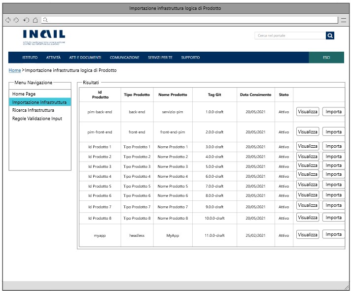

# User Story - Id 19 - Gestione Evento di Variazione Infrastruttura

## Descrizione

- COME: utente con ruolo OPS o con ruolo ADMIN

- DEVO POTER: eseguire la funzionalità di importazione dell'infrastuttura logica di prodotto.
    1. Accedo alla funzionalità "Importazione infrastruttura logica di prodotto (gestione evento su coda AMQ)" [(US. 17)](us_17_Importazione_infrastruttura_logica_di_Prodotto_(gestione_evento_su_coda_AMQ).md).
    2. Se è presente almeno un messaggio in coda allora:  
        2.1  il sistema garantisce la possibilità di poter importare l'infrastruttura selezionata cliccando sull'apposito pulsante "Importa". ([UI. 19.1](#user-interface-mockup))  
        2.2  il sistema visualizza una finestra Popup con il messaggio: "Conferma Operazione. Sei sicuro di voler importare l'infrastruttura selezionata?" SI / NO    
        2.2.1. Se clicco su NO il sistema annulla l'operazione.  
        2.2.2. Se clicco su SI il sistema:     
            2.2.2.1. Oltre ad eseguire le operazioni specificate nella [(US. 17)](us_17_Importazione_infrastruttura_logica_di_Prodotto_(gestione_evento_su_coda_AMQ).md), attraverso l'operazione di scodamento il sistema verifica la presenza di una infrastruttura utilizzando come chiave logica *identificativoProdotto* e Versione *tagGit*.  
            2.2.2.2. Nel caso in cui il file di infrastruttura sia stato già precedentemente lavorato/definito e abbia di conseguenza delle sezioni di runtime environment già compilate il sistema deve garantire l'importazione effettuando un controllo sull'*identificativoProdotto* e Versione *tagGit*.   
            2.2.2.3. Nello specifico:   
                2.2.2.3.1. se l'infrastruttura che si vuole importare non è mai stata precedentemente importata/lavorata con le sezioni di runtime environment vuote il sistema effettua l'importazione tenendo conto dell'*identificativoProdotto* e della versione *tagGit* inizializzato (versione 1.0.0.X);  
                2.2.2.3.2. se l'infrastruttura che si vuole importare sia stata già precedentemente lavorata il sistema garantisce in ogni caso l'importazione andando ad effettuare un controllo sull'*identificativoProdotto* e sulla versione *tagGit* che in questo caso sarà impostato in una versione successiva alla 1.0.0.X;  
                2.2.2.3.3. il sistema riconosce l'*identificativoProdotto* e la versione del *tagGit* successiva alla 1.0.0.X e di conseguenza (in questo secondo caso) vengono importate non solo le informazioni di moduli e componenti come per la versione iniziale ma anche le sezioni Runtime Environment già presenti nel file di infrastruttura (la variazione può comportare anche l'eliminazione di un modulo o componente);  
                2.2.2.3.4. Quando l'infrastruttura viene importata oltre a caricare la nuova sezione dei componenti e dei moduli nel sistema deve popolare anche la sezione di runtime environment sul DB in modo tale da poter compilare le precedenti sezioni con i valori reperiti dalla base dati;  
                2.2.2.3.5. Le operazioni successive all'importazione di una infrastruttura importata per la prima volta o già precedentemente lavorata sono analoghe a quelle riportate nella [(US. 17)](us_17_Importazione_infrastruttura_logica_di_Prodotto_(gestione_evento_su_coda_AMQ).md).   
- AL FINE DI: poter importare a sistema: 
    - i file di infrastruttura con le sezioni di runtime environment vuote (importate per la prima volta); 
    - i file di infrastruttura che sono stati già precedentemente compilati e che abbiamo quindi delle sezioni di runtime già definite in una versione precedente.  
    
## Riferimenti

Di seguito i riferimenti e/o collegamenti ad altre US citate in questa:

[User Story - Id 17 - Importazione Infrastruttura Logica Di Prodotto (Gestione Evento su Coda AMQ)](us_17_Importazione_infrastruttura_logica_di_Prodotto_(gestione_evento_su_coda_AMQ).md)

## Criteri di accettazione

- DATO: un opportuno file YAML  

- QUANDO: l'utente OPS o ADMIN deve importare un infrastruttura logica di Prodotto

- QUINDI: il sistema deve permettere
  - l'importazione delle informazioni necessarie al collegamento e alla gestione dell'infrastruttura logica di Prodotto 
  - la visualizzazione delle informazioni prima della conferma dell'importazione**:
    - *identificativoProdotto*: identificativo del prodotto
    - *tipoProdotto*: tipologia del prodotto
    - *nomeProdotto*: nome del prodotto
    - *descrizioneProdotto*: descrizione del prodotto
    - *dataCensimento*: data censimento su EA del prodotto
    - *stato*: stato del prodotto (es: attivo) 
    - *urlRepoGit*: url http del repository (Non visualizzato ma necessario)
    - *urlRepoGitApi*: indirizzo http del dell’api del repository dove è presente il file
    - *tagGit*: il valore del tag git a cui si deve fare riferimento per il prelievo del file
  - l'esecuzione dell'importazione in archivio delle informazioni, mediante utilizzo della coda precedentemente descritta  
  - al termine dell'operazione di importazione il sistema dovrà aver inserito una occorrenza nelle seguenti tabelle: ISTANZA_BLUEPRINT, STATO_ISTANZA_BLUEPRINT
  - il valore dello stato dell'occorrenza inserita in STATO_ISTANZA_BLUEPRINT deve essere: *Da Compilare*.
   
    

## Controlli e vincoli

Non presente/i

## Trigger

Esigenza di importazione delle infrastrutture logiche di prodotto architetturali importate per la prima volta o già precedentemente importate nel sistema. 

## Pre-Requisiti

L'utente ha eseguito l'accesso autenticandosi sul portale intranet.

## Data Model

Di seguito è descritta la porzione di modello dati a cui fa riferimento la funzionalità illustrata nella user story.  
Al termine dell'operazione di importazione il sistema dovrà aver inserito una occorrenza nelle seguenti tabelle.

### Tabella ISTANZA_BLUEPRINT:

| Attributo              | Tipo      | Descrizione  |
| ---------------------- | --------- | ------------ |
| ID_ISTANZA             | INT       | Identificativo autogenerato |
| ID_PRODOTTO*           | VARCHAR   | Valore dell'attributo *idProdotto* presente nella testata dell'infrastruttura di prodotto importata, fornita in input durante l'importazione                                                                                             |
| TIPO_PRODOTTO*         | VARCHAR   | Valore dell'attributo *tipoProdotto* presente nella testata dell'infrastruttura di prodotto importata, fornita in input durante l'importazione                                                                                           |
| NOME_PRODOTTO*         | VARCHAR   | Valore dell'attributo *nomeProdotto* presente nella testata dell'infrastruttura di prodotto importata, fornita in input durante l'importazione                                                                                           |
| DESCRIZIONE_PRODOTTO*  | VARCHAR   | Valore dell'attributo *descrizioneProdotto* presente nella testata dell'infrastruttura di prodotto importata, fornita in input durante l'importazione                                                                                    |
| DATA_DENSIMENTO*       | TIMESTAMP | Valore dell'attributo *dataCensimento* presente nella testata dell'infrastruttura di prodotto importata, fornita in input durante l'importazione                                                                                         |
| FILE_BLUEPRINT_ORIG    | FILE      | File di infrastruttura di prodotto associato al censimento e recuperato da GitLab durante l'importazione                                                                                                                                |
| FILE_BLUEPRINT_TARGET  | FILE      | File di infrastruttura di prodotto associato elaborato ed archiviato su GitLab con il passaggio di stato in *Archiviato*                                                                                                                |
| URL_REPOSITORY_GIT     | VARCHAR   | Valore del path/url del repository git dove presente il file archiviato, generata a partire da un base path url/*idProdotto* / configurazione-prodotto.git |
| NOME_BRANCH_GIT        | VARCHAR   | Valore del nome del branch del repository git dove presente il file archiviato.      |
| DATA_CREAZIONE         | TIMESTAMP | Data di creazione dell'occorrenza in tabella                                                           |
| UTENTE_CREAZIONE       | VARCHAR   | Utente applicativo che ha eseguito la creazione dell'occorrenza in tabella             |
| DATA_ULTIMA_MODIFICA   | TIMESTAMP | Data di ultimo aggiornamento dell'occorrenza in tabella                         |
| UTENTE_ULTIMA_MODIFICA | VARCHAR   | Utente applicativo che ha eseguito l'ultimo aggiornamento dell'occorrenza in tabella                     |
| DATA_IMPORT_ASSET      | TIMESTAMP | Data di importazione dell'asset di infrastruttura di prodotto       |
| DATA_IMPORT_FILE       | TIMESTAMP | Data di importazione del file di infrastruttura di prodotto       |
| JMS_CORRELATION_ID     | VARCHAR   | JmsCorrelationId identificativo del messaggio in coda       |
| VERSION                | NUMBER    | Number versione       |
| BLUEPRINT              | VARCHAR   | Valore dell'attributo *blueprint* presente nella testate dell'infrastruttura di prodotto importata, fornita in input durante l'importazione      |
| TAG_GIT                | VARCHAR   | Tag Git per la definizione del file di infrastruttura definitivo (tutti i componenti di tutti gli ambienti compilati)               |
| URL_REPOSITORY_GIT_API | VARCHAR   | URL repository Git Api dove è contenuto il file di infrastruttura    |
| VERSIONE_PRODOTTO      | VARCHAR   | Valore dell'attributo *versioneProdotto* presente nella testata dell'infrastruttura di prodotto importata, fornita in input durante l'importazione         |
| ID_STATO               | NUMBER    | Identificativo dell'occorrenza ANAGRAFICA_STATO a cui l'istanza fa riferimento|
| TAG_GIT_CI             | VARCHAR   | Tag Git per la definizione dell'infrastruttura (completa o parziale) relativo all'ambiente CI|
| TAG_GIT_COLL           | VARCHAR   | Tag Git per la definizione dell'infrastruttura (completa o parziale) relativo all'ambiente COLL|
| TAG_GIT_CERT           | VARCHAR   | Tag Git per la definizione dell'infrastruttura (completa o parziale) relativo all'ambiente CERT|
| TAG_GIT_PROD           | VARCHAR   | Tag Git per la definizione dell'infrastruttura (completa o parziale) relativo all'ambiente PROD|

 
 

### Tabella STATO_ISTANZA_BLUEPRINT

|    Attributo               |   Tipo    | Descrizione                                                                                 |
|  ----------------------    |  -------  | ------------------------------------------------------------------------------------------- | 
|   ID_STATO_ISTANZA         |    INT    | Identificativo autogenerato                                                                 |
|   ID_ISTANZA               |    INT    | Identificativo dell'occorrenza ISTANZA_BLUEPRINT a cui lo stato fa riferimento (chiave esterna ISTANZA_BLUEPRINT)|
|   COD_STATO                |    INT    | Identificativo dell'occorrenza ANAGRAFICA_STATO a cui l'istanza fa riferimento (chiave esterna ANAGRAFICA_STATO) |
|   DATA_CAMBIO_STATO        | TIMESTAMP | Data dell'inserimento dell'occorrenza in tabella, al primo inserimento ed ad ogni cambio di stato  | 
|   UTENTE_CAMBIO_STATO      |  VARCHAR  | Utente che ha eseguito l'inserimento dell'occorrenza in tabella, al primo inserimento ed ad ognicambio di stato  |

 
 

## Diagrammi

Di seguito il sequence diagram che illustra le azioni previste dalla User Story
 

 

[Download file visio del sequence diagram della user story ](../files/sequence_diagram_us_17.1.vsdx)

 
 

## User Interface Mockup

- UI 19.1

 
 
