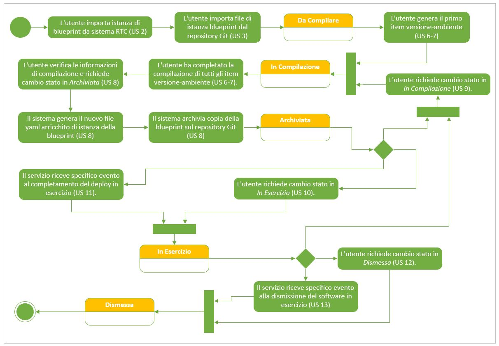

# User Story - Id 1 - Stati Applicativi Istanza Blueprint

## Descrizione

- COME: utente con ruolo OPS o con ruolo ADMIN

- DEVO POTER: eseguire le funzionalità previste di gestione che prevedono il cambio di stato dell'istanza di blueprint

- AL FINE DI: poter gestire correttamente il workflow previsto per la gestione del ciclo di vita dell'istanza di blueprint
  
 

Di seguito sono riportate le descrizioni degli stati del workflow previsto per il ciclo di vita dell'Istanza di blueprint
 

| Stato           |  Descrizione                                                                               |  Trigger Cambio Stato|
|-----------------|--------------------------------------------------------------------------------------------|-------|
| Da Compilare    |  Il file dell'istanza di blueprint è stato importato dal sistema RTC a partire dal ticket, la compilazione delle informazioni file da parte dell'utente non è ancora iniziata. | L'utente importa informazioni istanza blueprint da sistema RTC [(US 2)](us_2_importazione_istanza_blueprint.md) e del file dal reposiroty Git [(US 3)](us_3_importazione_file_istanza_blueprint.md) |
| In Compilazione |  Il file dell'istanza di blueprint è stato identificato tra quelli importati a sistema ed è in corso la sua compilazione da parte dell'utente   |  L'utente genera il primo item versione-ambiente [(US 6)](us_6_compilazione_istanza_blueprint.md) oppure clicca sullo specifico pulsante per Istanze Blueprint in stato *Archiviata* o *In Esercizio* [(US 9)](us_9_compilazione_istanza_blueprint_back.md)   |
| Archiviata      | Il file dell'istanza di blueprint è stato archiviato sul sistema SCM Git  | L'utente verifica le informazioni di compilazione e richiede cambio stato in *Archiviata* [(US 8)](us_8_archiviazione_istanza_blueprint.md) |
| In Esercizio    | Il software legato al ticket RTC di deploy è stato rilasciato in ambiente di esercizio  | L'utente richiede cambio stato in *In Esercizio*S [(US 10)](us_10_esercizio_istanza_blueprint.md) oppure Il servizio riceve specifico evento da altro sistema al completamento del deploy in esercizio [(US 11)](us_11_esercizio_istanza_blueprint_ricezione_evento.md)  |
| Dismessa        | Il software rilasciato associato all'istanza di blueprint è stata dismesso dall'ambiente di esercizio|L'utente richiede cambio stato in *Dismessa* [(US 12)](us_12_dismissione_istanza_blueprint.md) oppure Il servizio riceve specifico evento da altro sistema alla dismissione del software in esercizio [(US 13)](us_13_dismissione_istanza_blueprint_ricezione_evento.md)     |

 
 

## Riferimenti

Di seguito i riferimenti e/o collegamenti ad altre US che prevedono un cambio di stato previto dal workflow

### [User Story - Id 2 - Importazione Istanza di Blueprint](../user_stories/us_2_importazione_istanza_blueprint.md)
### [User Story - Id 3 - Importazione File Istanza di Blueprint](../user_stories/us_3_importazione_file_istanza_blueprint.md)
### [User Story - Id 6 - Compilazione Istanza di Blueprint](../user_stories/us_6_compilazione_istanza_blueprint.md)
### [User Story - Id 8 - Archiviazione Istanza di Blueprint](../user_stories/us_8_archiviazione_istanza_blueprint.md)
### [User Story - Id 9 - Compilazione Istanza Blueprint - Back In Compilazione](../user_stories/us_9_compilazione_istanza_blueprint_back.md)
### [User Story - Id 10 - Esercizio Istanza di Blueprint](../user_stories/us_10_esercizio_istanza_blueprint.md)
### [User Story - Id 11 - Esercizio Istanza di Blueprint - Ricezione Evento](../user_stories/us_11_esercizio_istanza_blueprint_ricezione_evento.md)
### [User Story - Id 12 - Dismissione Istanza di Blueprint](../user_stories/us_12_dismissione_istanza_blueprint.md)
### [User Story - Id 13 - Dismissione Istanza di Blueprint - Ricezione Evento](../user_stories/us_12_dismissione_istanza_blueprint_ricezione_evento.md)
### [User Story - Id 14 - Home Page - Dashboard](../user_stories/us_14_home_page_dashboard.md)

 
 

## Criteri di accettazione

Non Applicabile

## Controlli e vincoli

Non Applicabile

## Trigger

Non Applicabile

## Pre-Requisiti

Non Applicabile

## Data Model

Non Applicabile

## Diagrammi

Di seguito il diagrama a stati del workflow previsto per il ciclo di vita dell'Istanza di blueprint  
 

 
[Download file visio del diagramma](../files/diagramma_stati_applicazione_pim.vsdx)
