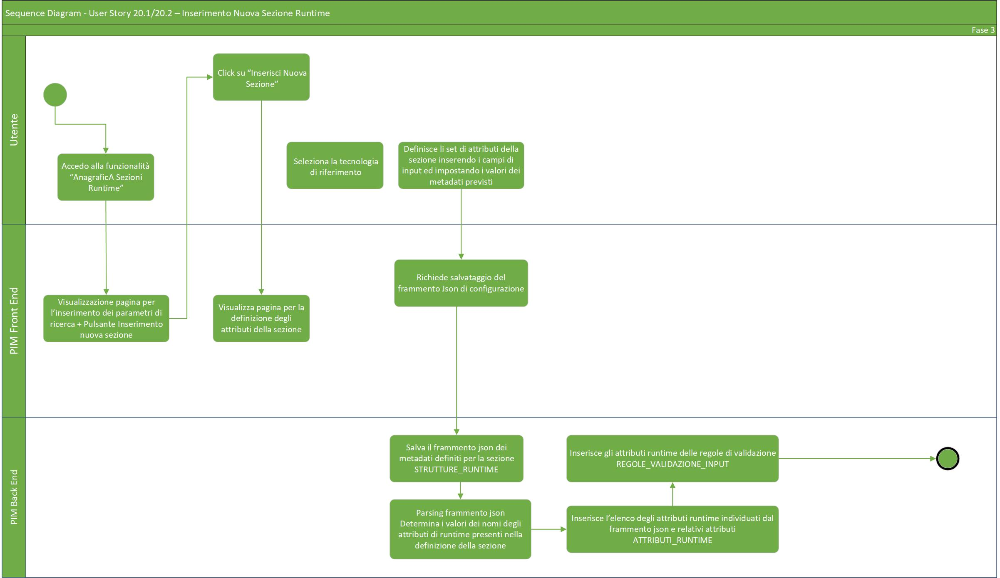
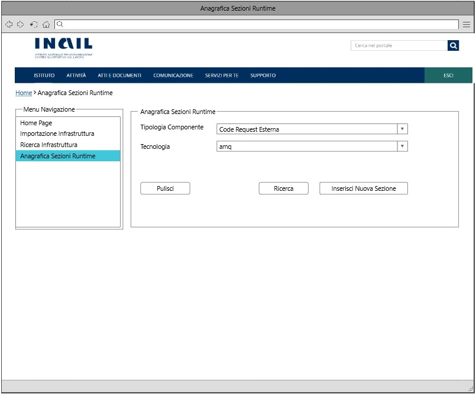
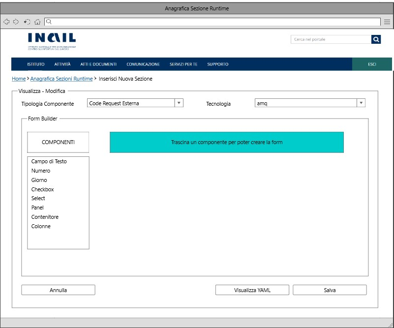
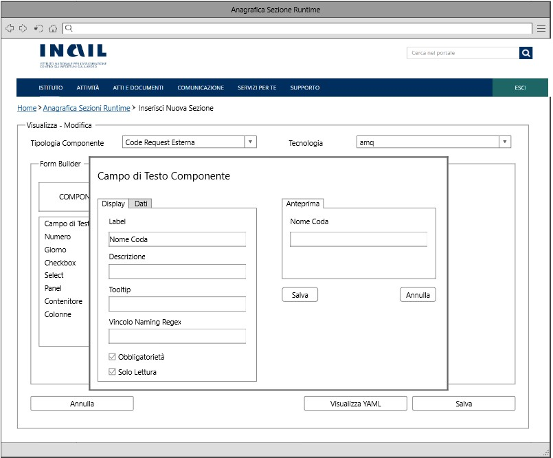
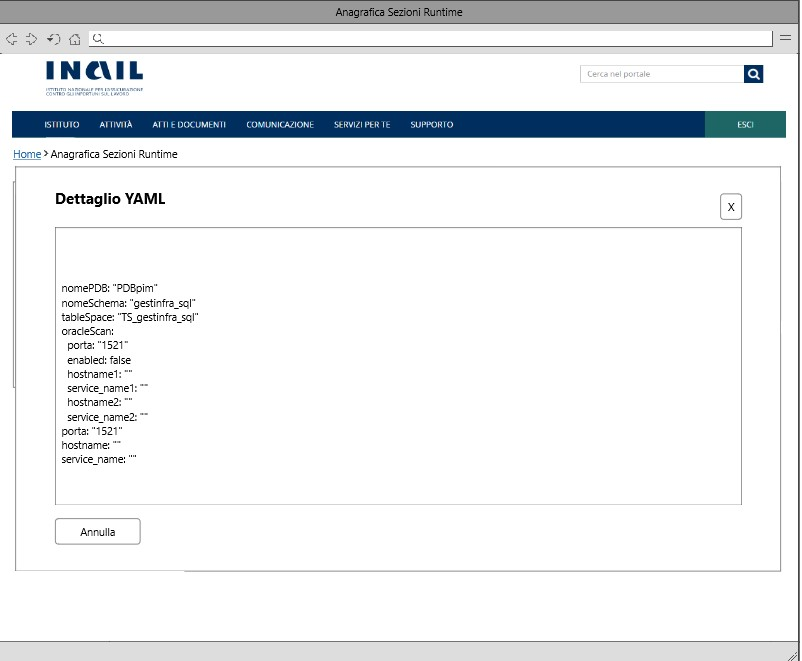

# User Story - Id 20.1 - Gestione Sezione Runtime Environment (Funzionalità CRUD (CREATE)) - Anagrafica Sezioni Runtime

## Descrizione

- COME: utente con ruolo ADMIN;

- DEVO POTER: eseguire la funzionalità di inserimento di una nuova sezione di Runtime Environment associato ad una specifica tipologia componente e tecnologia. 

1. Dall'apposita voce di menu *Anagrafica Sezioni Runtime* accedo alla funzionalità di ricerca delle Runtime Environment;
2. Il sistema visualizza la pagina web della funzionalità di ricerca ([UI 20.1.1](#user-interface-mockup));
3. Clicco su apposito pulsante *Inserisci Nuova Runtime Environment*;
4. Il sistema visualizza la pagina web relativa all'inserimento delle informazioni tali da rappresentare correttamente una nuova sezione di Runtime, come rappresentato in figura ([UI 20.1.2](#user-interface-mockup));
5. Inserisco le informazioni relative alla definizione della Runtime:
   
    |    Input Sezione Runtime Environment            |   Tipo                    | Ob. | Descrizione                                                                             |
    |  ----------------------    |  -----------------------  | --- | --------------------------------------------------------------------------------------- |
    |   Tipologia Componente     |    Elenco di selezione    | SI |Tipologia del componente per il quale i valori presenti nella colonna di selezione dovranno essere caricati dalla tabella TIPO_COMPONENTE con contenuto predefinito e precaricato all'accesso della pagina |
    |   Tecnologia               |    Elenco di selezione    | SI |Tecnologie associate ad una specifica Tipologia componente per il quale i valori presenti nella colonna di selezione dovranno essere caricati dalla tabella TECNOLOGIA con contenuto predefinito e precaricato in funzione della selezione operata sull'elenco Tipologia Componente  |
    |   Generatore Dinamico Sezione Runtime Environment      |    Form Builder   | SI | Form Builder con funzionalità di Drag & Drop per la creazione dinamica della Runtime Environment (il risultato del form verrà espresso mediante un file JSON);     Attraverso il Form Builder per ogni nuovo campo input creato è possibile, mediante un menù di impostazioni, inserire una serie di informazioni associate alle regole validazione input ([UI 20.1.3](#user-interface-mockup)) tra cui: descrizione, nome attributo YAML, obbligatorietà, valore di default, campo di sola lettura, regola di replace e vincolo naming regex (vedi tabella in basso). Un click sul tasto "Salva" confermerà l'operazione generando il file JSON corrispondente |

    |    Campi Input Form Builder            |   Tipo                    | Ob. | Descrizione                                                                                 |
    |  ----------------------    |  -----------------------  | --- | --------------------------------------------------------------------------------------- | 
    |   Nome Attributo YAML      |    Stringa testo libero   | SI | Nome dell'attributo yaml al quale devono essere applicate le regole indicate|
    |   Descrizione              |    Stringa testo libero   | NO | Descrizione dell'attributo yaml |
    |   Obbligatorietà           |    Booleano               | NO | Indica se il campo è obligatorio, valore di dafault = false |
    |   Solo Lettura             |    Booleano               | NO | Indica se il campo è di solo lettura, valore di default = false|
    |   Regola valore default    |    Stringa testo libero   | NO | La stringa che contiene la regola relativa ad un eventuale valore di default |
    |   Regola Replace           |    Stringa testo libero   | NO | La stringa che contiene un eventuale carattere da sostituire nel valore di default (es: _=-,a=b)       | 
    |   Vincolo Naming Regex     |    Stringa testo libero   | NO| La stringa che contiene il vincolo Naming Regex necessaria alla valorizzazione del campo a seconda che la stringa segua o meno un certo pattern (es: ^[a-z][a-zA-Z0-9-/.]+\b$) |
5. Durante le operazioni di generazione del form, l'utente può cliccare sul pulsante *Visualizza YAML*;
    1. Il sistema genera una modale con il frammento YAML generato fino a quel momento (in tempo reale) ([UI 20.1.4](#user-interface-mockup));
6. Ultimate le operazioni di digitazione dati e generazione del form specifico, l'utente può cliccare sull'apposito pulsante *Salva Runtime Environment*;
7. Il sistema esegue un inserimento nella tabella STRUTTURE_RUNTIME per il salvataggio del JSON generato;
8. Il sistema effettua un parsing sul frammento JSON al fine di determinare i nomi degli attributi di runtime presenti nella definizione della sezione;
9. Il sistema inserisce l'elenco degli attributi runtime nella tabella ATTRIBUTI_RUNTIME e inserisce nella tabella REGOLE_VALIDAZIONE_INPUT tutte le regole di validazione definite attraverso il Form Builder;
10. Il sistema visualizza un messaggio di *Operazione eseguita correttamente*;
11. Il sistema visualizza la pagina web della funzionalità di ricerca Runtime.

- AL FINE DI: creare la sezione Runtime Environment per la visualizzazione dinamica del form (generata mediante un JSON), corrispondente alla specifica tipologia componente e tecnologia.

## Riferimenti

Di seguito i riferimenti e/o collegamenti ad altre US citate in questa:

- [User Story - Id 20.2 - Gestione Sezione Runtime Environment (Funzionalità CRUD (READ)) - Anagrafica Sezioni Runtime](us_20.2_gestione_sezione_runtime_environment_(funzionalità_CRUD_read).md)

- [User Story - Id 22 - Integrazione API dell'applicativo RMP per la condivisione delle informazioni di Tipologia Componente/Tecnologia previste](us_22_integrazione_api_RMP_tipologia_componente_tecnologia.md)

## Criteri di accettazione

- DATO: una tipologia componente e una tecnologia,  

- QUANDO: l'utente OPS o ADMIN deve procedere alla creazione del form dinamico per la generazione della sezione Runtime Environment

- QUINDI: il sistema deve permettere:

  - l'immissione di un tipo componente associato ad una tecnologia;
  - la creazione di un form dinamico mediante un Form Builder per la definizione della Runtime Environment e delle regole validazione input;
  - la visualizzazione del frammento YAML generato in tempo reale;
  
  - al termine delle operazioni di inserimento il sistema dovrà aver inserito delle occorrenze nella tabelle STRUTTURE_RUNTIME, ATTRIBUTI_RUNTIME e REGOLE_VALIDAZIONE_INPUT per la parte relativa alle regole di validazione immesse attraverso il Form Builder.

## Controlli e vincoli

Quando avviene l'inserimento di una occorenza in STRUTTURE_RUNTIME deve essere valorizzato obbligatoriamente il tipo di componente e il tipo di tecnologia.

Il pulsante *Visualizza YAML* non sarà cliccabile se non viene valorizzato il tipo di componente e il tipo di tecnologia.

L'immissione del nome attributo YAML attraverso il Form Builder è obbligatoria, diversarmente non sarà possibile definire il nuovo campo input.

Per ogni tipologia componente/tecnologia sarà possibile creare al più una sola sezione di Runtime Environment, diversamente verrà generato un errore.

## Trigger

Esigenza di inserimento del form dinamico per la definizione della struttura Runtime Environment con le opportune regole validazione input associate ad una tipologia componente e tecnologia.

## Pre-Requisiti

L'utente ha eseguito l'accesso autenticandosi sul portale intranet.

Nelle tabelle TIPO_COMPONENTE e TECNOLOGIA devono essere state caricate e relazionate le seguenti informazioni:

| Tipo Componente        | Tecnologia   |  
-----------------------  | -------------|
| Logica Applicativa BE  | springboot   |
| Logica Applicativa BE  | nodejs       |
| Logica Applicativa BE  | dotnet       |
| SPA                    | angular      |
| CDN                    | js-css-html  |
| Api Sincrone           | openapi3     |
| Code Request Esterna   | amq          |  
| Evento Esterno Pub     | amq          |
| Evento Esterno Sub     | amq          |
| Dati SQL               | oracle       |
| Dati SQL               | sqlserver    |
| Dati SQL               | db2luw       |
| Dati SQL               | postgresql   |
| Dati NoSQL             | mongodb      |

N.B: Le suddette Tipologie Componenti e Tecnologie potrebbero variare in base alle api di RMP per la condivisione delle informazioni di Tipologia/Tecnologia previste (vedi [US. 22](us_22_integrazione_api_RMP_tipologia_componente_tecnologia.md)).

## Data Model

Di seguito è descritta la porzione di modello dati (solo titolo tabelle utilizzate) a cui fa riferimento la funzionalità illustrata nella user story:  

- Tabella TECNOLOGIA

- Tabella TIPO_COMPONENTE

- Tabella TECNOLOGIA_TIPO_COMPONENTE

- Tabella STRUTTURE_RUNTIME

- Tabella ATTRIBUTI_RUNTIME

- Tabella REGOLE_VALIDAZIONE_INPUT  

Consultare [Modello dati della soluzione Product Infrastructure Management - PIM - FASE 3](../pages/modello_dati_FASE3.md) per ulteriori approfondimenti sul modello dati predisposto per la FASE 3.

## Diagrammi

Di seguito il sequence diagram che illustra le azioni previste dalla User Story:

 

 

[Download file visio del sequence diagram della user story ](../files/sequence_diagram_us_20.1-20.2.vsdx)

 
 

## User Interface Mockup

- UI 20.1.1

 
 

- UI 20.1.2

- UI 20.1.3

- UI 20.1.4

