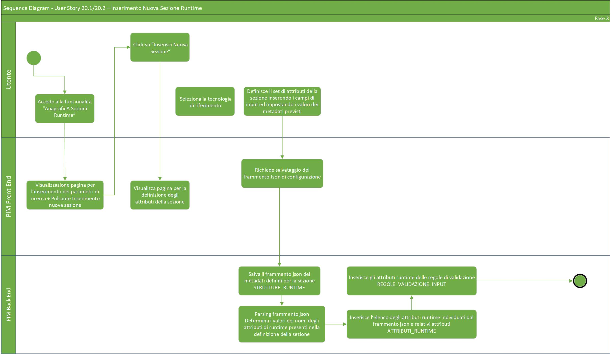
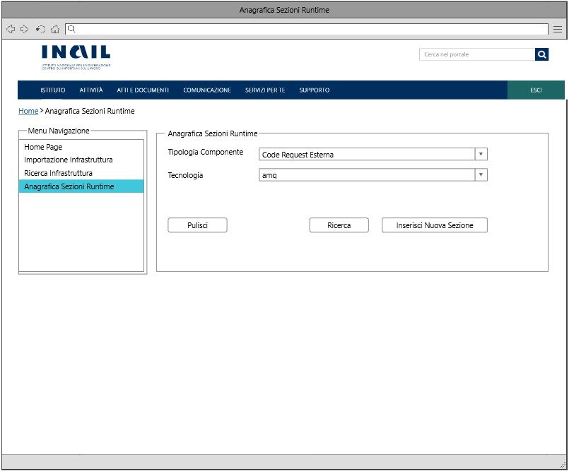
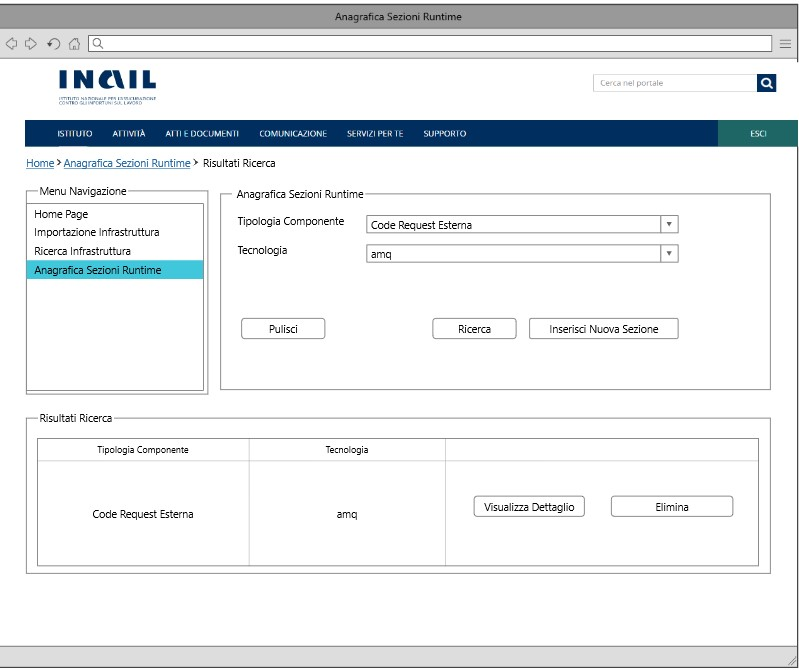

# User Story - Id 20.2 - Gestione Sezione Runtime Environment (Funzionalità CRUD (READ)) - Anagrafica Sezioni Runtime

## Descrizione

- COME: utente con ruolo ADMIN;

- DEVO POTER: eseguire la funzionalità di ricerca di una sezione di Runtime Environment associato ad una specifica tipologia componente e tecnologia.

1. Dall'apposita voce di menu *Anagrafica Sezioni Runtime* accedo alla funzionalità di ricerca delle Runtime inserite a sistema;
2. Il sistema visualizza la pagina web della funzionalità di ricerca ([UI 20.2.1](#user-interface-mockup));
3. Ricerca associata a Tipologia Componente e Tecnologia  
    3.1. Inserisco le informazioni relative a Tipologia Componente e Tecnologia(Campi di FILTRO); 
   (Tipologia Componente e Tecnologia si presentano sotto forma di una ComboBox con le occorrenze già precaricate a sistema e relazionate tra loro come indicato nella [(US 20.1)](us_20.1_gestione_sezione_runtime_environment_(funzionalità_CRUD_create).md); 
    3.2. Clicco su apposito pulsante *Ricerca*; 
    3.3. Il sistema esegue una query sulla base dati interna PIM per il recupero delle informazioni legate al criterio di ricerca; 
    3.4. Il sistema visualizza in basso tutte le occorrenze individuate secondo i parametri di ricerca impostati come rappresentato in figura ([UI 20.2.2](#user-interface-mockup)); 
4. Ricerca in base a differenti criteri: 
    4.1. Non è obligatoria la valorizzazione dei campi tipologia componente/tecnologia; 
    4.2. Clicco direttamente su apposito pulsante *Ricerca*; 
    4.3. Il sistema esegue una query sulla base dati interna PIM per il recupero delle informazioni legate al criterio di ricerca; 
    4.4. Il sistema visualizza in basso tutte le occorrenze individuate nella base dati interna PIM ([UI 20.2.2](#user-interface-mockup)); 
5. Nel caso in cui la ricerca non produrrà alcun risultato il sistema visualizza "Nessuna Sezione Trovata";
6. Il sistema garantirà inoltre la possibilità di visualizzare/effettuare un aggiornamento delle sezioni di Runtime cliccando sull'apposito pulsante *Visualizza Dettaglio* (vedi [US 20.3](us_20.3_gestione_sezione_runtime_environment_(funzionalità_CRUD_update).md)) o effettuare una cancellazione completa cliccando sull'apposito pulsante *Elimina* (vedi [US 20.4](us_20.4_gestione_sezione_runtime_environment_(funzionalità_CRUD_delete).md)).

- AL FINE DI: ricercare tutte le sezioni Runtime Environment inserite a sistema associate ad una specifica tipologia componente e tecnologia.

## Riferimenti

Di seguito i riferimenti e/o collegamenti ad altre US citate in questa:

- [User Story - Id 20.3 - Gestione Sezione Runtime Environment (Funzionalità CRUD (UPDATE)) - Anagrafica Sezioni Runtime](us_20.3_gestione_sezione_runtime_environment_(funzionalità_CRUD_update).md)

- [User Story - Id 20.4 - Gestione Sezione Runtime Environment (Funzionalità CRUD (DELETE)) - Anagrafica Sezioni Runtime](us_20.4_gestione_sezione_runtime_environment_(funzionalità_CRUD_delete).md)

- [User Story - Id 22 - Integrazione API dell'applicativo RMP per la condivisione delle informazioni di Tipologia Componente/Tecnologia previste](us_22_integrazione_api_RMP_tipologia_componente_tecnologia.md)

## Criteri di accettazione

- DATO: un determinato componente e una determinata tecnologia;

- QUANDO: l'utente OPS o ADMIN deve ricercare una sezione Runtime Environment;

- QUINDI: il sistema deve permettere:
  - la ricerca delle sezioni Runtime Environment relazionate alla specifica tipologia componente/tecnologia.
  
## Controlli e vincoli

Per poter valorizzare la ricerca non è necessario inserire nelle apposite sezioni la tipologia componente e la tecnologia ad esso associata. Lasciando i campi vuoti nelle sezioni tipologia componente/tecnologia e cliccando sull'apposito pulsante *Ricerca*, la ricerca verrà comunque effettuata mostrando tutte le sezioni Runtime salvate a sistema.  
Tipologia componente e tecnologia si configurano prioritari nel momento in cui è necessario perfezionare la suddetta.

## Trigger

Esigenza di ricerca delle sezioni Runtime Environment associati ad un determinato componente e tecnologia.

## Pre-Requisiti

L'utente ha eseguito l'accesso autenticandosi sul portale intranet.

Nelle tabelle TIPO_COMPONENTE e TECNOLOGIA devono essere state caricate e relazionate le seguenti informazioni:

| Tipo Componente        | Tecnologia   |  
-----------------------  | -------------|
| Logica Applicativa BE  | springboot   |
| Logica Applicativa BE  | nodejs       |
| Logica Applicativa BE  | dotnet       |
| SPA                    | angular      |
| CDN                    | js-css-html  |
| Api Sincrone           | openapi3     |
| Code Request Esterna   | amq          |  
| Evento Esterno Pub     | amq          |
| Evento Esterno Sub     | amq          |
| Dati SQL               | oracle       |
| Dati SQL               | sqlserver    |
| Dati SQL               | db2luw       |
| Dati SQL               | postgresql   |
| Dati NoSQL             | mongodb      |

N.B: Le suddette Tipologie Componenti e Tecnologie potrebbero variare in base alle api di RMP per la condivisione delle informazioni di Tipologia/Tecnologia previste (vedi [US. 22](us_22_integrazione_api_RMP_tipologia_componente_tecnologia.md)).

## Data Model

Di seguito è descritta la porzione di modello dati (solo titolo tabelle utilizzate) a cui fa riferimento la funzionalità illustrata nella user story:  

- Tabella TECNOLOGIA

- Tabella TIPO_COMPONENTE

- Tabella TECNOLOGIA_TIPO_COMPONENTE

- Tabella STRUTTURE_RUNTIME

- Tabella ATTRIBUTI_RUNTIME

- Tabella REGOLE_VALIDAZIONE_INPUT  

Consultare [Modello dati della soluzione Product Infrastructure Management - PIM - FASE 3](../pages/modello_dati_FASE3.md) per ulteriori approfondimenti sul modello dati predisposto per la FASE 3.

## Diagrammi

Di seguito il sequence diagram che illustra le azioni previste dalla User Story:

 

 

[Download file visio del sequence diagram della user story ](../files/sequence_diagram_us_20.1-20.2.vsdx)

 
 

## User Interface Mockup

- UI 20.2.1

 
 

- UI 20.2.2

