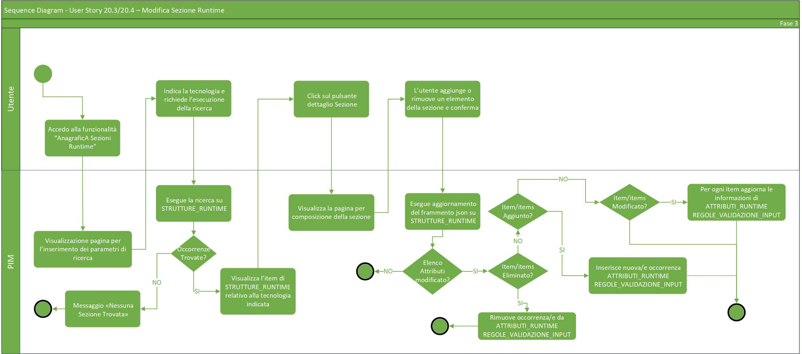
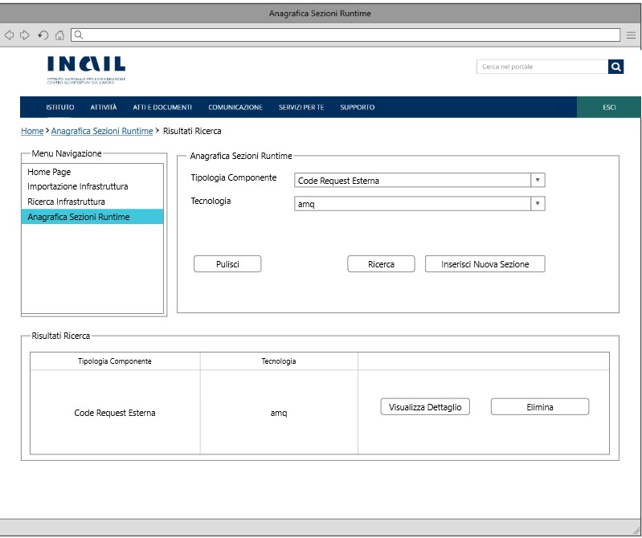

# User Story - Id 20.4 - Gestione Sezione Runtime Environment (Funzionalità CRUD (DELETE)) - Anagrafica Sezioni Runtime

## Descrizione

- COME: utente con ruolo ADMIN;

- DEVO POTER: eseguire la funzionalità di cancellazione della sezione Runtime Environment associata ad una specifica tipologia/tecnologia, precedentemente immesse a sistema;

1. Dall'apposita voce di menu *Anagrafica Sezione Runtime* accedo alla funzionalità di ricerca delle sezioni Runtime ([User Story - Id 20.2 - Gestione Sezione Runtime Environment (Funzionalità CRUD (READ)) - Anagrafica Sezioni Runtime](us_20.2_gestione_sezione_runtime_environment_(funzionalità_CRUD_read).md));
2. Il sistema visualizza la pagina web della funzionalità di ricerca ([UI 20.4.1](#user-interface-mockup));
3. Eseguo la funzionalità specificata nella ([User Story - Id 20.2 - Gestione Sezione Runtime Environment (Funzionalità CRUD (READ)) - Anagrafica Sezioni Runtime](us_20.2_gestione_sezione_runtime_environment_(funzionalità_CRUD_read).md);
4. Dopo che il sistema visualizza tutte le occorrenze individuate secondo i parametri di ricerca impostati come rappresentato in figura ([UI 20.4.2](#user-interface-mockup)) sarà possibile cliccare sull'apposito pulsante *Elimina*;
5. Il sistema visualizza un messaggio: *Sei sicuro di voler rimuovere la runtime selezionata ? SI/NO*;  
    5.1 Se clicco su *SI* l'occorrenza viene cancellata e non sarà più visualizzabile;  
        5.1.1 Il sistema rimuove l'occorrenza dalle tabelle: STRUTTURE_RUNTIME, ATTRIBUTI_RUNTIME e REGOLE_VALIDAZIONE_INPUT;  
        5.1.2 Il sistema visualizza un messaggio di *Operazione eseguita correttamente*;  
    5.2 Se clicco su *NO* il sistema visualizza nuovamente la pagina web della funzionalità di ricerca.  

- AL FINE DI: rimuovere la sezione di Runtime Environment (JSON) associata al determinato componente/tecnologia.

## Riferimenti

Di seguito i riferimenti e/o collegamenti ad altre US citate in questa:

- [User Story - Id 20.2 - Gestione Sezione Runtime Environment (Funzionalità CRUD (READ)) - Anagrafica Sezioni Runtime](us_20.2_gestione_sezione_runtime_environment_(funzionalità_CRUD_read).md)

## Criteri di accettazione

- DATO: almeno un risultato nell'operazione di ricerca Anagrafiche Sezioni Runtime

- QUANDO: l'utente OPS o ADMIN deve cancellare una sezione di Runtime Environment relativa ad un determinato componente/tecnologia.

- QUINDI: il sistema deve permettere:
  - la cancellazione completa della runtime sopra specificata;
  - al termine dell'operazione di cancellazione il sistema dovrà aver rimosso le occorrenze dalle tabelle: STRUTTURE_RUNTIME, ATTRIBUTI_RUNTIME e REGOLE_VALIDAZIONE_INPUT per la parte relativa alle regole di validazione immesse.

## Controlli e vincoli

Per poter effettuare la cancellazione è necessario che sia stata inserita almeno un occorrenza nella tabella STRUTTURE_RUNTIME.

## Trigger

Esigenza di cancellazione della sezione di Runtime Environment associata ad un determinato componente/tecnologia.

## Pre-Requisiti

L'utente ha eseguito l'accesso autenticandosi sul portale intranet.

## Data Model

Di seguito è descritta la porzione di modello dati (solo titolo tabelle utilizzate) a cui fa riferimento la funzionalità illustrata nella user story:  

- Tabella TECNOLOGIA

- Tabella TIPO_COMPONENTE

- Tabella TECNOLOGIA_TIPO_COMPONENTE

- Tabella STRUTTURE_RUNTIME

- Tabella ATTRIBUTI_RUNTIME

- Tabella REGOLE_VALIDAZIONE_INPUT  

Consultare [Modello dati della soluzione Product Infrastructure Management - PIM - FASE 3](../pages/modello_dati_FASE3.md) per ulteriori approfondimenti sul modello dati predisposto per la FASE 3.

## Diagrammi

Di seguito il sequence diagram che illustra le azioni previste dalla User Story:

 

 

[Download file visio del sequence diagram della user story ](../files/sequence_diagram_us_20.3-20.4.vsdx)

 
 

## User Interface Mockup

- UI 20.4.1

 
 

- UI 20.4.2

