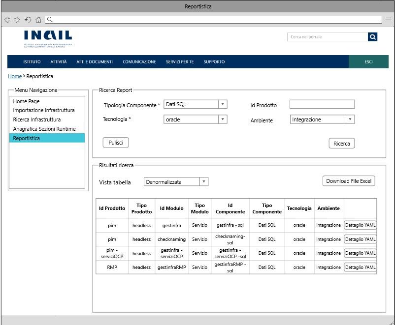

# User Story - Id 21 - Funzionalità di Reportistica

## Descrizione

- COME: utente con ruolo ADMIN;

- DEVO POTER: eseguire la funzionalità di ricerca delle informazioni necessarie alla generazione dei report:

1. L'utente dall'apposita voce di menu *Reportistica* accede alla funzionalità di ricerca delle informazioni necessarie alla generazione dei report;
2. il sistema visualizza la pagina web della funzionalità di ricerca ([UI 21.1](#user-interface-mockup));
3. l'utente procede alla valorizzazione dei campi di ricerca in base alla tabella riportata in basso:

    |    Campo Input             |   Tipo                    | Ob. | Descrizione                                                                                 |
    |  ----------------------    |  -----------------------  | --- | --------------------------------------------------------------------------------------- | 
    |   Tipologia Componente     |    Elenco di selezione    | SI |Tipologia del componente per il quale i valori presenti nella colonna di selezione dovranno essere caricati dalla tabella TIPO_COMPONENTE con contenuto predefinito e precaricato all'accesso della pagina |
    |   Tecnologia               |    Elenco di selezione    | SI |Tecnologie associate ad una specifica Tipologia  componente per il quale i valori presenti nella colonna di selezione dovranno essere caricati dalla tabella TECNOLOGIA con contenuto predefinito e precaricato in funzione della selezione operata sull'elenco Tipologia Componente  |
    |   Id Prodotto              |    Campo di testo         | NO |Id prodotto associato alle infrastrutture censite all'interno dell'applicativo PIM         |
    |   Ambiente                 |    Elenco di selezione    | NO |Ambienti disponibili all'interno dell'applicativo PIM e per il quale le sezioni di runtime environment sono state precedentemente compilate: integrazione/collaudo/certificazione/produzione.

4. l'utente dopo aver inserito le informazioni necessarie alla valorizzazione della ricerca, effettua un click su "Ricerca" per confermare l'operazione;
5. il sistema esegue una query sulla base dati interna PIM per il recupero delle informazioni legate al criterio di ricerca;

*N.B: l'estrazione dei dati per la reppresentazione tabellare può avvenire solamente nel caso in cui le infrastrutture sono presenti nello stato "Definite", "In Esercizio" e/o "Dismesse".* 

6. Se ci sono delle occorrenze presenti a sistema:
    1. il sistema visualizza una tabella di tipo "Denormalizzata" in base al criterio di ricerca impostato, mostrando idProdotto, Tipo Prodotto, Id Modulo, Tipo Modulo, Id Componente, Tipo Componente, Tecnologia e Ambiente ([UI 21.2](#user-interface-mockup));
    2. l'utente attraverso un click sul pulsante *Download File Excel* può scaricare la tabella "Denormalizzata" evidenziata, in un file Excel;
        1. il sistema genera il file Excel e lo rende disponibile al download;
    3. l'utente può, inoltre, modificare la vista della tabella attraverso un elenco di selezione visibile nella parte superiore della tabella, passando dalla vista "Denormalizzata" a "Drill Down";
        1. il sistema visualizza una tabella di tipo "Drill Down" in base al criterio di ricerca impostato, mostrando Tipo Componente, Tecnologia, Id prodotto e Tipo Prodotto con un drill down sulla riga evidenziata per poter espandere la sezione e mostrare di conseguenza Id Modulo, Tipo Modulo, Id Componente e Ambiente ([UI 21.3](#user-interface-mockup));
    4. l'utente, per entrambe le visualizzazioni ("Denormalizzata"/"Drill Down"), può effettuare un click su pulsante *Dettaglio YAML* in corrispondenza della riga selezionata:
        1. il sistema genera una modale con le informazioni della sezione di Runtime Environment ([UI 21.4](#user-interface-mockup));
7. Se non ci sono occorrenze presenti a sistema:
    1. il sistema visualizza un messaggio "Nessuna occorrenza presente a sistema".

- AL FINE DI: poter ricercare tutti i prodotti, moduli e componenti salvati nel sistema PIM con le informazioni della sezione di Runtime Environment per una specifica tipologia Componente e Tecnologia.

## Riferimenti

Di seguito i riferimenti e/o collegamenti ad altre US citate in questa:

- [User Story - Id 22 - Integrazione API dell'applicativo RMP per la condivisione delle informazioni di Tipologia Componente/Tecnologia previste](us_22_integrazione_api_RMP_tipologia_componente_tecnologia.md)

## Criteri di accettazione

- DATO: una tipologia componente, una tecnologia, un eventuale idProdotto e un eventuale ambiente;  

- QUANDO: l'utente OPS o ADMIN deve ricercare delle informazioni/report relative ai prodotti, moduli e componenti con relativa sezione di runtime environment censiti all'interno dell'applicativo PIM;

- QUINDI: il sistema deve permettere:
    - la ricerca dei report sotto forma tabellare (denormalizzata/drill down) in base ai valori di ricerca, che possono essere:
    - Tipologia Componente/Tecnologia (obbligatori) e idProdotto/Ambiente (opzionali).

## Controlli e vincoli

- Per poter abilitare il pulsante *Ricerca* è necessario valorizzare almeno la tipologia componente e la tecnologia.

- L'estrazione dei dati per la visualizzazione delle tabelle ("Denormalizzata"/"Drill Down") può avvenire esclusivamente per le infrastrutture nello stato: "Definita", "In Esercizio" o "Dismessa".

## Trigger

L'operatore OPS ha l'esigenza di identificare tutti i prodotti, moduli, componenti con relativa sezione di Runtime Environment afferrenti a una specifica Tecnologia.

## Pre-Requisiti

L'utente ha eseguito l'accesso autenticandosi sul portale intranet.

Nelle tabelle TIPO_COMPONENTE e TECNOLOGIA devono essere state caricate e relazionate le seguenti informazioni.

| Tipo Componente        | Tecnologia   |  
-----------------------  | -------------|
| Logica Applicativa BE  | springboot   |
| Logica Applicativa BE  | nodejs       |
| Logica Applicativa BE  | dotnet       |
| SPA                    | angular      |
| CDN                    | js-css-html  |
| Api Sincrone           | openapi3     |
| Code Request Esterna   | amq          |  
| Evento Esterno Pub     | amq          |
| Evento Esterno Sub     | amq          |
| Dati SQL               | oracle       |
| Dati SQL               | sqlserver    |
| Dati SQL               | db2luw       |
| Dati SQL               | postgresql   |
| Dati NoSQL             | mongodb      |

N.B: Le suddette Tipologie Componenti e Tecnologie potrebbero variare in base alle api di RMP per la condivisione delle informazioni di Tipologia/Tecnologia previste (vedi [US. 22](us_22_integrazione_api_RMP_tipologia_componente_tecnologia.md)).

## Data Model

Di seguito è descritta la porzione di modello dati (solo titolo tabelle utilizzate) a cui fa riferimento la funzionalità illustrata nella user story:  

- Tabella ISTANZA_BLUEPRINT

- Tabella MODULO_BLUEPRINT

- Tabella COMPONENTE_BLUEPRINT

- Tabella STATO_ISTANZA_BLUEPRINT

- Tabella AMBIENTE_COMPONENTE_BLUEPRINT

Per il caricamento della tipologia componente e tecnologia in fase di input dei dati:

- Tabella TECNOLOGIA

- Tabella TIPO_COMPONENTE

- Tabella TECNOLOGIA_TIPO_COMPONENTE

Consultare [Modello dati della soluzione Product Infrastructure Management - PIM - FASE 3](../pages/modello_dati_FASE3.md) per ulteriori approfondimenti sul modello dati predisposto per la FASE 3.

## Diagrammi

Di seguito il sequence diagram che illustra le azioni previste dalla User Story:

 

 

[Download file visio del sequence diagram della user story ](../files/sequence_diagram_us_21.vsdx)

 
 

## User Interface Mockup

- UI 21.1

 
 

- UI 21.2

 
 

- UI 21.3

 
 

- UI 21.4 

