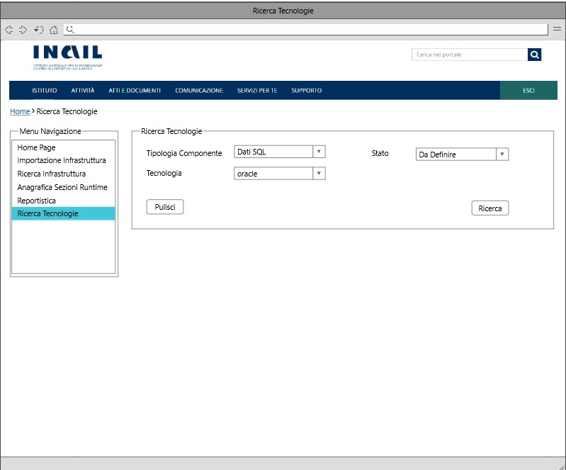

# User Story - Id 23 - Ricerca Tipologie Componenti, Tecnologie, Stato e modifica Stato 

## Descrizione

- COME: utente con ruolo ADMIN;

- DEVO POTER: eseguire la funzionalità di ricerca delle informazioni quali Tipologia Componente, Tecnologie e Stato:

1. L'utente dall'apposita voce di menu *Ricerca Tecnologia* accede alla funzionalità di ricerca;
2. il sistema visualizza la pagina web della funzionalità di ricerca ([UI 23.1](#user-interface-mockup));
3. l'utente procede alla valorizzazione dei campi di ricerca in base alla tabella riportata in basso:

    |    Campo Input             |   Tipo                    | Ob. | Descrizione                                                                                 |
    |  ----------------------    |  -----------------------  | --- | --------------------------------------------------------------------------------------- | 
    |   Tipologia Componente     |    Elenco di selezione    | NO |Tipologia del componente per il quale i valori presenti nella colonna di selezione dovranno essere caricati dalla tabella TIPO_COMPONENTE con contenuto predefinito e precaricato all'accesso della pagina |
    |   Tecnologia               |    Elenco di selezione    | NO |Tecnologie associate ad una specifica Tipologia  componente per il quale i valori presenti nella colonna di selezione dovranno essere caricati dalla tabella TECNOLOGIA con contenuto predefinito e precaricato in funzione della selezione operata sull'elenco Tipologia Componente  |
    |   Stato                    |    Elenco di selezione    | NO |Stato associato alla specifica Tecnologia: Da Definire, Definita, Non Necessaria (per ulteriori approfondimenti, consultare la tabella in basso).

    |STATO    |DESCRIZIONE  |
    |---------|---------|
    |Da Definire      | La struttura Runtime non è stata ancora definita                  |
    |Definita         | La struttura Runtime è stata definita  (VEDI [US. 20.1](us_20.1_gestione_sezione_runtime_environment_(funzionalità_CRUD_create).md))                         |
    |Non Necessaria   | La struttura Runtime non è necessaria per questa Tecnologia [valori impostabile dall'operatore]        |

4. l'utente dopo aver inserito le informazioni necessarie alla valorizzazione della ricerca, effettua un click su "Ricerca" per confermare l'operazione;
5. il sistema esegue una query sulla base dati interna PIM per il recupero delle informazioni legate al criterio di ricerca;

6. Se ci sono delle occorrenze presenti a sistema:
    1. il sistema visualizza una tabella in base al criterio di ricerca impostato, mostrando Tipologia Componente, Tecnologia e Stato ([UI 23.2](#user-interface-mockup));    
    2. Per i risultati con stato *Da Definire* e *Non Necessaria*, l'utente potrà cliccare su *Imposta Stato* per procedere al cambio stato: 
        1. al click, il sistema genera una modale con un riepilogo Tipologia Componente e Tecnologia e una combo box per variare lo stato da *Da Definire* a *Non Necessaria* o viceversa ([UI 23.3](#user-interface-mockup));
        
        *N.B: il cambio stato in *Non Necessaria* impedisce la generazione della sezione runtime environment nella ([US. 20.1](us_20.1_gestione_sezione_runtime_environment_(funzionalità_CRUD_create).md)).*
        
        2. l'utente attraverso un click sul pulsante *Salva* confermerà l'operazione di cambio stato;
        3. il sistema aggiorna l'occorrenza nella tabella: [TECNOLOGIA - Definizione Runtime];
        4. il sistema visualizza un messaggio "Operazione Eseguita Correttamente;
   
        *N.B: tutte le Tecnologie visualizzate con lo stato "Definita" non possono essere modificate di stato (il pulsante "Imposta Stato" non è mostrato); per procedere alla modifica dello stato sarà necessario cancellare la sezione di Runtime Environment associata a quella Tecnologia (vedi [US. 20.4](us_20.4_gestione_sezione_runtime_environment_(funzionalità_CRUD_delete).md)) Dopo la cencellazione, lo stato visualizzato sarà "Da Definire" e di conseguenza di nuovo modificabile.*

7. Se non ci sono occorrenze presenti a sistema:
    1. il sistema visualizza un messaggio "Nessuna occorrenza presente a sistema".

- AL FINE DI: poter ricercare tutte le Tipologie Componenti, Tecnologie e Stati con la possibilità di modifica Stato da parte dell'utente.

## Riferimenti

Di seguito i riferimenti e/o collegamenti ad altre US citate in questa:

- [User Story - Id 20.1 - Gestione Sezione Runtime Environment (Funzionalità CRUD (CREATE)) - Anagrafica Sezioni Runtime](us_20.1_gestione_sezione_runtime_environment_(funzionalità_CRUD_create).md)

- [User Story - Id 20.4 - Gestione Sezione Runtime Environment (Funzionalità CRUD (DELETE)) - Anagrafica Sezioni Runtime](us_20.4_gestione_sezione_runtime_environment_(funzionalità_CRUD_delete).md) 

- [User Story - Id 22 - Integrazione API dell'applicativo RMP per la condivisione delle informazioni di Tipologia Componente/Tecnologia previste](us_22_integrazione_api_RMP_tipologia_componente_tecnologia.md) 

## Criteri di accettazione

- DATO: un eventuale Tipologia Componente, una eventuale Tecnologia e un eventuale stato;

- QUANDO: l'utente OPS o ADMIN deve ricercare delle informazioni relative alle tecnologie pervenute all'interno dell'applicativo PIM e/o procedere alla modifica dello stato delle tecnologie; 

- QUINDI: il sistema deve permettere:
    - la ricerca delle Tipologie Componenti, Tecnologie e stati sotto forma tabellare in base ai valori di ricerca, che possono essere: Tipologia Componente/Tecnologia (opzionali) e stato (opzionali);
    - la modifica dello stato delle Tecnologie da *Da Definire* a *Non Necessaria* o viceversa.

## Controlli e vincoli

- Il pulsante *Ricerca* è sempre abilitato (la ricerca può essere valorizzata anche senza inserire nessuna informazione).

- Il cambio stato in *Non Necessaria* impedisce la generazione della sezione runtime environment nella ([US. 20.1](us_20.1_gestione_sezione_runtime_environment_(funzionalità_CRUD_create).md)).

- Tutte le Tecnologie visualizzate con lo stato "Definita" non possono essere modificate di stato (il pulsante "Imposta Stato" non è mostrato); per procedere alla modifica dello stato sarà necessario cancellare la sezione di Runtime Environment associata a quella tecnologia (vedi [US. 20.4](us_20.4_gestione_sezione_runtime_environment_(funzionalità_CRUD_delete).md))   Dopo la cencellazione, lo stato visualizzato sarà "Da Definire" e di conseguenza di nuovo modificabile.

## Trigger

L'operatore OPS ha l'esigenza di identificare tutte le Tecnologie pervenute all'interno dell'applicativo PIM con relativi stati e/o procedere alla modifica dello stato delle tecnologie;

## Pre-Requisiti

L'utente ha eseguito l'accesso autenticandosi sul portale intranet.

Nelle tabelle TIPO_COMPONENTE e TECNOLOGIA devono essere state caricate e relazionate le seguenti informazioni.

| Tipo Componente        | Tecnologia   |  
-----------------------  | -------------|
| Logica Applicativa BE  | springboot   |
| Logica Applicativa BE  | nodejs       |
| Logica Applicativa BE  | dotnet       |
| SPA                    | angular      |
| CDN                    | js-css-html  |
| Api Sincrone           | openapi3     |
| Code Request Esterna   | amq          |  
| Evento Esterno Pub     | amq          |
| Evento Esterno Sub     | amq          |
| Dati SQL               | oracle       |
| Dati SQL               | sqlserver    |
| Dati SQL               | db2luw       |
| Dati SQL               | postgresql   |
| Dati NoSQL             | mongodb      |

N.B: Le suddette Tipologie Componenti e Tecnologie potrebbero variare in base alle api di RMP per la condivisione delle informazioni di Tipologia/Tecnologia previste (vedi [US. 22](us_22_integrazione_api_RMP_tipologia_componente_tecnologia.md)).

## Data Model

Di seguito è descritta la porzione di modello dati (solo titolo tabelle utilizzate) a cui fa riferimento la funzionalità illustrata nella user story:  

- Tabella TECNOLOGIA

- Tabella TIPO_COMPONENTE

- Tabella TECNOLOGIA_TIPO_COMPONENTE

- Tabella ANAGRAFICA_STATO_DEFINIZIONE_RUNTIME 

Consultare [Modello dati della soluzione Product Infrastructure Management - PIM - FASE 3](../pages/modello_dati_FASE3.md) per ulteriori approfondimenti sul modello dati predisposto per la FASE 3.

## Diagrammi

Di seguito il sequence diagram che illustra le azioni previste dalla User Story:

N/A

## User Interface Mockup

- UI 23.1

 
 

- UI 23.2

 
 

- UI 23.3

