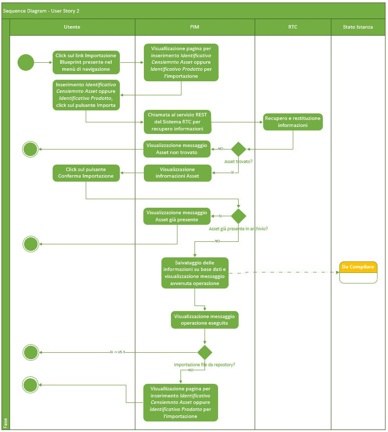
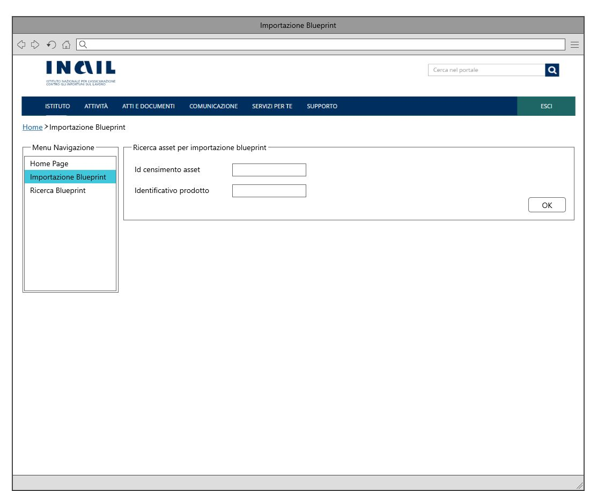
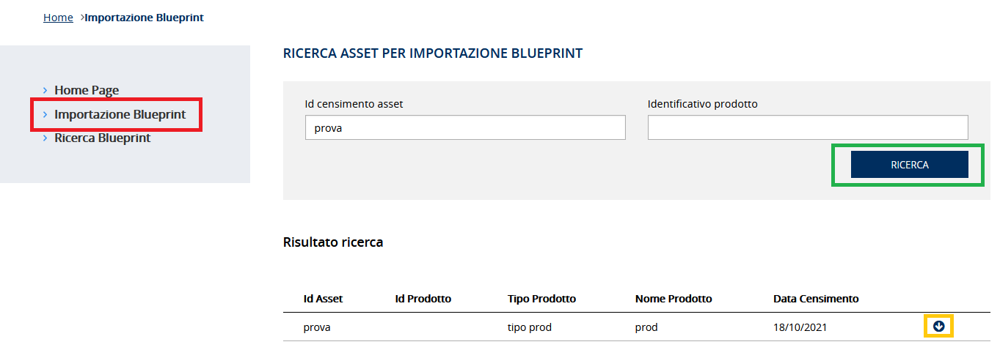
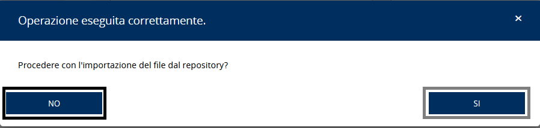

# User Story - Id 2 - Importazione Istanza Blueprint

## Descrizione

- COME: utente con ruolo OPS o con ruolo ADMIN

- DEVO POTER: eseguire la funzionalità di importazione dell'istanza di blueprint associata ad uno specifico asset RTC.
  1. Accedo alla funzionalità mediante apposita voce di menu
  2. Il sistema PIM propone una pagina web per l'inserimento del numero delle'evento di censimento asset oppure l'identificativo del prodotto/asset RTC da importare [(UI 2.1)](#user-interface)
  3. Inserisco il numero delle'evento di censiemnto asset oppure l'identificativo del prodotto/asset RTC in uno dei due appositi campi di input e clicco sul apposito pulsante, almeno uno dei due parametri deve essere valorizzato.
  4. Il sistema PIM richiama il sistema RTC per il recupero delle informazioni legate alle'evento di censimento oppure all'identificativo del prodotto/asset RTC 
   
     Nota: L'interfaccia di scambio con il servizio RTC è in fase di definizione, gli attributi descritti sono parte di una prima ipotesi di analisi.
  5. Se è presente un evento di censimento relativo al codice inserito  
    5.1. il sistema visualizza le informazioni ricevute in input dal sistema RTC in un elenco [(UI 2.2)](#user-interface)  
    5.2. Confermo l'importazione delle informazioni relative alle'evento di censimento e della relativa istanza di blueprint cliccando sul pulsante Importa  
    5.3. Il sistema:  
        5.3.1. Se non sono presenti informazioni per lo stesso evento di censimento asset oppure identificativo del prodotto/asset RTC persiste le informazioni in base dati 
        Per l'evento di censimento importato il sistema crea una occorrenza nelle tabelle ISTANZA_BLUEPRINT e STATO_ISTANZA_BLUEPRINT 
        Il valore dello stato dell'occorrenza inserita in STATO_ISTANZA_BLUEPRINT è *Da Compilare*.
        Il dettaglio delle informazioni che il sistema deve persistere é descritto nella sezione [Data Model della US](#data-model) 
        Produce il messaggio di "Operazione correttamente eseguita! Procedere con l'mportazione del file dal repository? SI / NO 
          5.3.1.1. Se clicco su SI il sistema esegue la US 3 
          5.3.1.2. Se clicco su NO il sistema procede come al punto 2 
        5.3.2. Se sono già presenti informazioni per lo stesso evento di censimento asset oppure identificativo del prodotto/asset RTC 
        il sistema non persiste le informazioni e visualizza il messaggio "evento di censimento asset / identificativo del prodotto/asset RTC da importare risulta già presente in archivio! 
          5.3.1.2. Il sistema procede come al punto 2 
  6. Se non è presente un evento di censimento asset oppure l'identificativo del prodotto/asset RTC relativo al valore inserito  
    6.1. Il sistema visualizza il messaggio "evento di censimento asset / identificativo del prodotto/asset RTC da importare non trovato!" 

- AL FINE DI: poter importare a sistema
  - le informazioni necessarie a stabilire un collegamento tra le informazioni applicative (RTC -> PIM) (codice evento censimento asset, identificativo prodotto)
  - il file di istanza di blueprint associato al ticket (File Istanza Blueprint) e poter così gestire il workflow previsto per la gestione del ciclo di vita dell'istanza di blueprint. Questa funzionalità rappresenta lo step di entry-point del workflow applicativo previsto (US 1).

## Riferimenti

Di seguito i riferimenti e/o collegamenti ad altre US citate in questa

### [User Story - Id 3 - Importazione File Istanza Blueprint](user_stories/../us_3_importazione_file_istanza_blueprint.md)

## Criteri di accettazione

- DATO: un codice evento di censimento asset oppure ad un identificativo del prodotto/asset RTC

- QUANDO: l'utente OPS o ADMIN deve importare una istanza di blueprint relativa ad un evento di censimento asset oppure ad un identificativo del prodotto/asset RTC

- QUINDI: il sistema deve permettere
  - l'importazione delle informazioni necessarie al collegamento e la gestione della Istanza di blueprint associata ad un evento di censimento asset oppure ad un identificativo del prodotto/asset RTC
  - la visualizzazione delle informazioni dell'asset ricevute dal servizio REST del sistema RTC prima della conferma dell'importazione** 
    - *identificativoProdotto*: identificativo del prodotto
    - *tipoProdotto*: tipologia del prodotto
    - *nomeProdotto*: nome del prodotto
    - *descrizioneProdotto*: descrizione del prodotto
    - *dataCensimento*: data censimento su EA di RTC del prodotto
    - *stato*: stato del prodotto (es: attivo) 
    - *urlRepoGit*: url http del repository
  - l'esecuzione dell'importazione in archivio delle informazioni 
  - al termine dell'operazione di importazione il sistema dovrà aver inserito una occorrenza nelle seguenti tabelle: ISTANZA_BLUEPRINT, STAO_ISTANZA_BLUEPRINT
  - il valore dello stato dell'occorrenza inserita in STATO_ISTANZA_BLUEPRINT deve essere: *Da Compilare*.
   
    ** L'interfaccia di scambio con il servizio RTC è in fase di definizione, gli attributi evidenziati sono parte di una prima ipotesi di interfaccia

## Controlli e vincoli

Non presente/i

## Trigger

Esigenza di importazione delle istanze di blueprint architetturali associate ad un codice evento di censimento asset oppure ad un identificativo del prodotto/asset RTC

## Pre-Requisiti

L'utente ha eseguito l'accesso autenticandosi sul portale intranet

## Data Model

Di seguito è descritta la porzione di modello dati a cui fa riferimento la funzionalità illustrata nella user story.  
Al termine dell'operazione di importazione il sistema dovrà aver inserito una occorrenza nelle seguenti tabelle.

- Tabella ISTANZA_BLUEPRINT

|    Attributo             |   Tipo    | Descrizione                                                                                 |
|  ----------------------  |  -------  | ------------------------------------------------------------------------------------------- | 
|   ID_ISTANZA             |    INT    | Identificativo autogenerato                                                                 |
|   ID_CENSIMENTO_ASSET    |  VARCHAR  | Identificativo del censimento del prodotto come assett su EA di RTC                         |
|   ID_PRODOTTO*            |  VARCHAR  | Valore dell'attributo *idProdotto* presente nella testata dell'istanza di blueprint imporata, fornita in input durante l'importazione |
|   TIPO_PRODOTTO*          |  VARCHAR  | Valore dell'attributo *tipoProdotto* presente nella testata dell'istanza di blueprint imporata, fornita in input durante l'importazione |
|   NOME_PRODOTTO*          |  VARCHAR  | Valore dell'attributo *nomeProdotto* presente nella testata dell'istanza di blueprint imporata, fornita in input durante l'importazione |
|   DESCRIZIONE_PRODOTTO*   |  VARCHAR  | Valore dell'attributo *descrizioneProdotto* presente nella testata dell'istanza di blueprint imporata, fornita in input durante l'importazione |
|   DATA_DENSIMENTO*        | TIMESTAMP | Valore dell'attributo *dataCensimento* presente nella testata dell'istanza di blueprint imporata, fornita in input durante l'importazione |
|   FILE_BLUEPRINT_ORIG    |   FILE    | File di istanza di bleuprint associato al censimento e recuperato da GitLab durante l'importazione    |
|   FILE_BLUEPRINT_TARGET  |   FILE    | File di istanza di bleuprint associato elaborato ed archiviato su GitLab con il passaggio di stato in *Archiviato*      |
|   URL_REPOSITORY_GIT     |  VARCHAR  | Valore del path/url del repository git dove presente il file archiviato, generata a partire da un base path url/*idProdotto* / configurazione-prodotto.git |
|   NOME_BRANCH_GIT        |  VARCHAR  | Valore del nome del branch del repository git dove presente il file archiviato. Requisito in fase di definizione, al momento valore fisso = master |
|   DATA_CREAZIONE         | TIMESTAMP | Data di creazione dell'occorrenza in tabella                                                |
|   UTENTE_CREAZIONE       |  VARCHAR  | Utente applicativo che ha eseguito la creazione dell'occorrenza in tabella                  |
|   DATA_ULTIMA_MODIFICA   | TIMESTAMP | Data di ultimo aggiornamento dell'occorrenza in tabella                                     |         
|   UTENTE_ULTIMA_MODIFICA |  VARCHAR  | Utente applicativo che ha eseguito l'ultimo aggiornamento dell'occorrenza in tabella        |

 
* L'interfaccia di scambio con il servizio RTC è in fase di definizione, gli attributi evidenziati sono parte di una prima ipotesi di interfaccia.  
  Il servizio dovrebbe ricevere in input il codice dell'evento di censimento dell'asset e fornire in output le informazioni evidenziate con il carattere * 
 
 

- Tabella STATO_ISTANZA_BLUEPRINT

|    Attributo               |   Tipo    | Descrizione                                                                                 |
|  ----------------------    |  -------  | ------------------------------------------------------------------------------------------- | 
|   IS_STATO_ISTANZA         |    INT    | Identificativo autogenerato                                                                 |
|   ID_ISTANZA               |    INT    | Identificativo dell'occorrenza ISTANZA_BLUEPRINT a cui lo stato fa riferimento (chiave esterna ISTANZA_BLUEPRINT)   |
|   ID_STATO                 |    INT    | Identificativo dell'occorrenza ANAGRAFICA_STATO a cui l'istanza fa riferimento (chaive esterna ANAGRAFICA_STATO) |
|   DATA_CAMBIO_STATO        | TIMESTAMP | Data dell'inserimento dell'occorrenza in tabella, al primo inserimento ed ad ognicambio di stato  | 
|   UTENTE_CAMBIO_STATO      |  VARCHAR  | Utente che ha eseguito l'inserimento dell'occorrenza in tabella, al primo inserimento ed ad ognicambio di stato  |

 
 

## Diagrammi

Di seguito il sequence diagram che illustra le azioni previste dalla User Story
 

 

[Download file visio del sequence diagram della user story ](../files/sequence_diagram_us_2.vsdx)

 
 

## User Interface Mockup

- UI 2.1

 
 

- UI 2.2

 

## Interfaccia Applicativa con Correlazione Chiamate ai Metodi Corrispondenti

Di seguito è riportata l' interfaccia applicativa (screen) dell'importazione Blueprint di PIM prodotta nella FASE1 con conseguente correlazione alle chiamate ai metodi della specifica funzionalità evidenziata, al fine di agevolare lo sviluppo della FASE2.

Al click del RED BOX "Importazione Blueprint" è possibile accedere all'interfaccia per poter importare la Blueprint (FRONT-END). 
Al click del GREEN BOX "Ricerca" verrà richiamato il metodo: POST ricerca Asset. 
Al click del YELLOW BOX "Importa" verrà richiamato il metodo: POST importa Asset con conseguente generazione di una nuova finistra al fine di informare l'utente se l'operazione è avvenuta con successo. Viene inoltre effettuata una richiesta "Procedere con l'importazione del file dal repository" alla quale è possibile rispondere attraverso il BLACK BOX "No" (FRONT-END) o viceversa, attravero il GREY BOX "Si" con richiamo al metodo POST ricerca Istanza Blueprint.

Nella tabella in basso, viene mostrato un riepilogo con relativa chiamata al metodo di tutti i buttons presentati in questa interfaccia con relativo PATH: 

|Colore di riferimento|Pulsante Definito nell'Applicativo  |Tipologia Chiamata  |Nome chiamata | Path |Note|
|---------|---------|---------|---------|---------|---------|
|RED|Importazione Blueprint     |/         |/ |/ |FRONT-END|
|GREEN|Ricerca|POST |ricerca Asset|{{baseUrl}}/pim-api/asset/ricerca |/|
|YELLOW|Importa|POST |importa Asset|{{baseUrl}}/pim-api/asset/:id/importa|/|
|BLACK|No|/|/|/|FRONT-END|
|GREY|Si|POST|ricerca Istanza Blueprint|{{baseUrl}}/pim-api/blueprint/ricerca|Metodo identico a quello riportato nella [User Story - Id 4 - Ricerca Istanza Blueprint](us_4_ricerca_istanza_blueprint.md)|