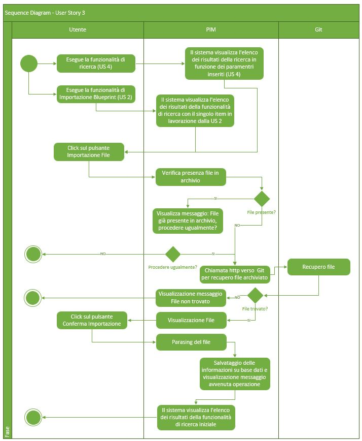
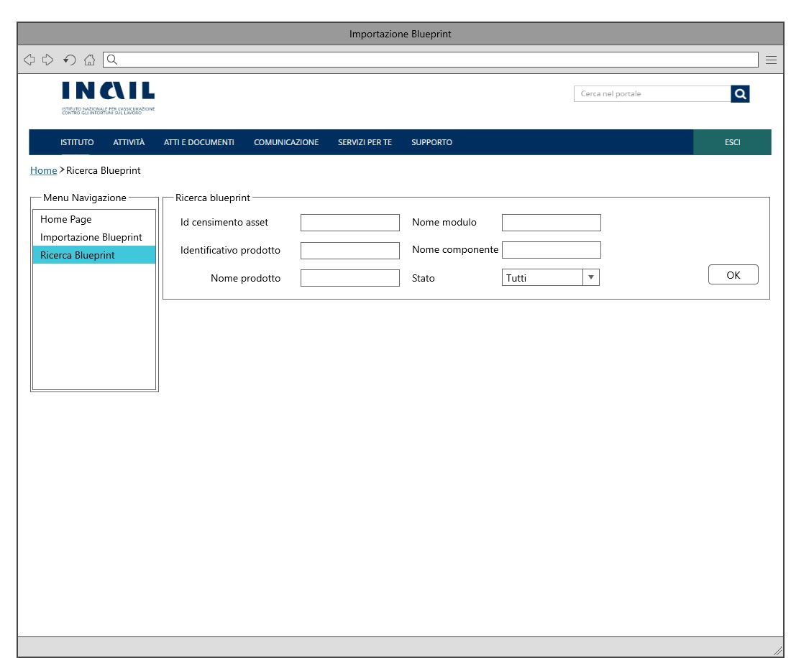
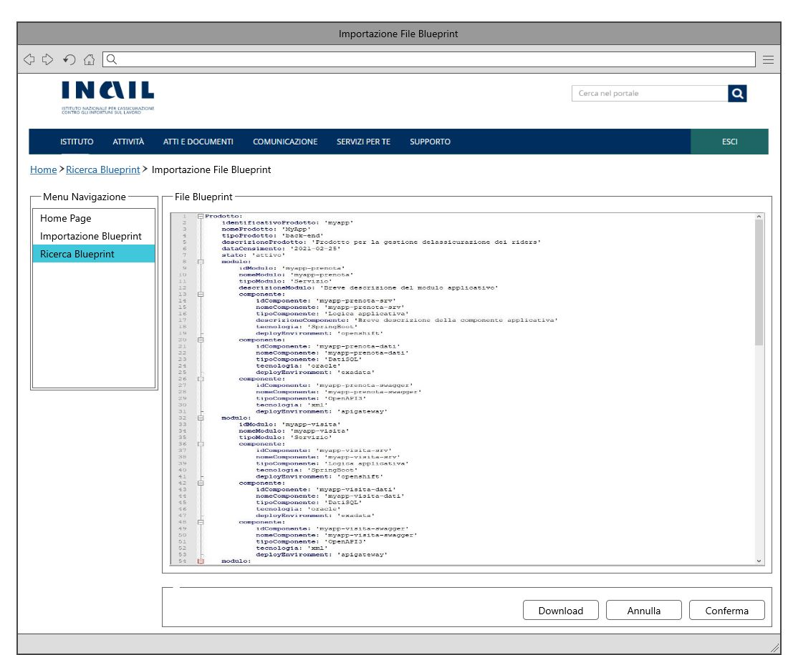
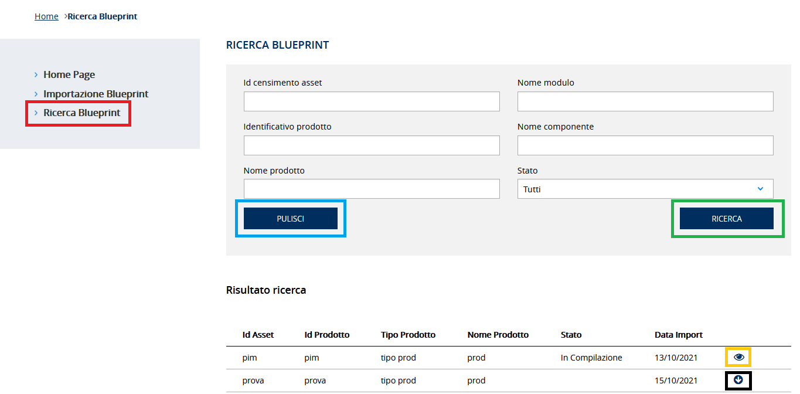
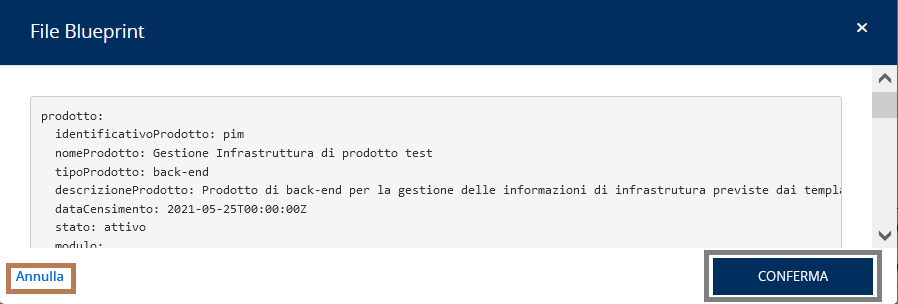
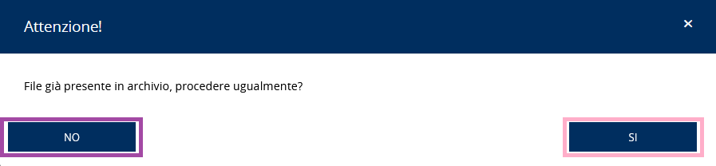

# User Story - Id 3 - Importazione File Istanza Blueprint

## Descrizione

- COME: utente con ruolo OPS o con ruolo ADMIN

- DEVO POTER: eseguire la funzionalità di importazione del file dell'istanza di blueprint.
  1. Accedo alla funzionalità di Ricerca Istanza Blueprint (US 4) 
  2. Eseguo la funzionalità di ricerca per identificare l'evento di censimento asset oppure l'identificativo del prodotto/asset RTC di cui eseguire l'importazione del file dal repository Git. 
    2.1. Il sistema esegue la funzionalità di ricerca in archivio (US 4) 
    2.2. Il sistema visualizza l'elenco dei risultati della ricerca in funzione dei paramentri inseriti [(US 4)](us_4_ricerca_istanza_blueprint.md) 
    2.3. Identifico l'item di interesse dai risultati della ricerca e clicco su apposito pulsante Importazione File. 
         Il pulsante è visibile solo per istanze di blueprint importate in stato *Da Compilare*. 
  3. Oppue accedo alla funzionalità di Importazione Istanza Blueprint dalla [(US 2)](us_2_importazione_istanza_blueprint.md) 
    2.1. Il sistema visualizza l'elenco dei risultati della funzionalità di ricerca con il singolo item in lavorazione [(UI 3.1)](#user-interface)
  4. Clicco sul pulsante Importazione File presente nell'item della griglia visualizzata
  5. Se in archivio il campo PATH_BP_ORIG della tabella ISTANZA_BLUEPRINT è valorizzato il sistema produce il messaggio: File già presente in archivio, procedere ugualmente?
  6. In caso di risposta affermativa il sistema PIM utilizza le informazioni (URL_REPOSITORY_GIT, NOME_BRANCH_GIT) di puntamento al sistema Git (generate con la [US 2)](us_2_importazione_istanza_blueprint.md) per il recupero del file dell'istanza (ISTANZA_BLUEPRINT) dal sistema SCM Git.  
  7. Esegue l'operazione di *git clone* del repository (URL_REPOSITORY_GIT)
  8. Esegue l'operazione di *check-out* del branch (NOME_BRANCH_GIT) indicati in tabella ISTANZA_BLUEPRINT
  9. Esegue l'operazione di *pull* del repository per scaricare il file.
  10. Il sistema visualizza il file recuperato dal repository Git aspettando una conferma per l'importazione [(UI 3.2)](#user-interface)
  11. Se clicco sul pulsante Conferma Importazione posto in coda alla pagina di visualizzaione del file  
    11.1. Il sistema esegue il parsing del file di istanza della blueprint recuperato dal repository e persiste le informazioni in base dati, produce il messaggio di "Operazione correttamente eseguita". Le informazioni persisitite in base dati sono relative all'aggiornamento del campo PATH_BP_ORIG in tabella ISTANZA_BLUEPRINT ed all' inserimento delle occorenze nelle tabelle MODULO_BLUEPRINT e COMPONENTE_BLUEPRINT in funzione del contenuto del file di cui è stato eseguito il parsing 
    11.2. Il sistema torna al punto 2.1
    Il dettaglio delle informazioni che il sistema deve persistere è stato modellato sulla struttura prevista del template delle blueprint e descritto nella sezione [Data Model della US](#data-model) 
  12.  Se clicco sul pulsante Annulla posto in coda alla pagina di visualizzaione del file  
    11.1. Il sistema non esegue l'importazione, chiude la visualizzazione del file e continua a visualizza l'elenco visualizzato ad avvio sequenza
  
- AL FINE DI: poter importare a sistema il file di istanza di blueprint associato ad un evento di censimento asset oppure identificotivo prodotto/asset (File Istanza Blueprint) e poter così gestire il workflow previsto per la gestione del ciclo di vita dell'istanza di blueprint.

## Riferimenti

Di seguito i riferimenti e/o collegamenti ad altre US citate in questa

### [User Story - Id 2 - Importazione Istanza Blueprint](us_2_importazione_istanza_blueprint.md)
### [User Story - Id 4 - Ricerca Istanza Blueprint](us_4_ricerca_istanza_blueprint.md)

## Criteri di accettazione

- DATO: un codice evento di censimento asset oppure ad un identificativo del prodotto/asset RTC

- QUANDO: l'utente OPS o ADMIN deve importare il file di una istanza di blueprint associata 

- QUINDI: il sistema deve permettere
  - l'importazione in archivio del file dell'istanza di blueprint presente sul sistema SCM Git
  - il parsing del file dell'istanza di blueprint presente sul sistema SCM Git ed importato e persistito a sistema
  - al termine dell'operazione di importazione il sistema dovrà aver inserito almeno una occorrenza nelle seguenti tabelle: MODULO_BLUEPRINT, COMPONENTE_BLUEPRINT ed aggioranto una occorrenza nella tabella ISTANZA_BLUEPRINT
   

## Controlli e vincoli

La funzionalità, per cui il pulsante Importazione File, è visibile solo per istanze di blueprint importate in stato *Da Compilare*.

## Trigger

Esigenza di importazione del file delle istanze di blueprint architetturali associate ad un codice evento di censimento asset oppure ad un identificativo del prodotto/asset RTC

## Pre-Requisiti

L'utente ha eseguito l'accesso autenticandosi sul portale intranet

## Data Model

Di seguito è descritta la porzione di modello dati a cui fa riferimento la funzionalità illustrata nella user story.  
Al termine dell'operazione di importazione il sistema dovrà aver inserito almeno una occorrenza nelle seguenti tabelle: MODULO_BLUEPRINT, COMPONENTE_BLUEPRINT ed aggioranto una occorrenza nella tabella ISTANZA_BLUEPRINT.

 
 

- Tabella ISTANZA_BLUEPRINT

|    Attributo             |   Tipo    | Descrizione                                                                                 |
|  ----------------------  |  -------  | ------------------------------------------------------------------------------------------- | 
|   ID_ISTANZA             |    INT    | Identificativo autogenerato                                                                 |
|   ID_CENSIMENTO_ASSET    |  VARCHAR  | Identificativo del censimento del prodotto come assett su EA di RTC                         |
|   ID_PRODOTTO*            |  VARCHAR  | Valore dell'attributo *idProdotto* presente nella testata dell'istanza di blueprint imporata, fornita in input durante l'importazione |
|   TIPO_PRODOTTO*          |  VARCHAR  | Valore dell'attributo *tipoProdotto* presente nella testata dell'istanza di blueprint imporata, fornita in input durante l'importazione |
|   NOME_PRODOTTO*          |  VARCHAR  | Valore dell'attributo *nomeProdotto* presente nella testata dell'istanza di blueprint imporata, fornita in input durante l'importazione |
|   DESCRIZIONE_PRODOTTO*   |  VARCHAR  | Valore dell'attributo *descrizioneProdotto* presente nella testata dell'istanza di blueprint imporata, fornita in input durante l'importazione |
|   DATA_DENSIMENTO*        | TIMESTAMP | Valore dell'attributo *dataCensimento* presente nella testata dell'istanza di blueprint imporata, fornita in input durante l'importazione |
|   FILE_BLUEPRINT_ORIG    |   FILE    | File di istanza di bleuprint associato al censimento e recuperato da GitLab durante l'importazione    |
|   FILE_BLUEPRINT_TARGET  |   FILE    | File di istanza di bleuprint associato elaborato ed archiviato su GitLab con il passaggio di stato in *Archiviato*      |
|   URL_REPOSITORY_GIT     |  VARCHAR  | Valore del path/url del repository git dove presente il file archiviato, generata a partire da un base path url/*idProdotto* / configurazione-prodotto.git |
|   NOME_BRANCH_GIT        |  VARCHAR  | Valore del nome del branch del repository git dove presente il file archiviato. Requisito in fase di definizione, al momento valore fisso = master |
|   DATA_CREAZIONE         | TIMESTAMP | Data di creazione dell'occorrenza in tabella                                                |
|   UTENTE_CREAZIONE       |  VARCHAR  | Utente applicativo che ha eseguito la creazione dell'occorrenza in tabella                  |
|   DATA_ULTIMA_MODIFICA   | TIMESTAMP | Data di ultimo aggiornamento dell'occorrenza in tabella                                     |         
|   UTENTE_ULTIMA_MODIFICA |  VARCHAR  | Utente applicativo che ha eseguito l'ultimo aggiornamento dell'occorrenza in tabella        |

 
 

- Tabella MODULO_BLUEPRINT

|    Attributo               |   Tipo    | Descrizione                                                                                 |
|  ----------------------    |  -------  | ------------------------------------------------------------------------------------------- | 
|   ID_MODULO                |    INT    | Identificativo autogenerato                                                                 |
|   ID_ISTANZA               |    INT    | Identificativo dell'occorrenza ISTANZA_BLUEPRINT a cui lo fa riferimento (chiave esterna ISTANZA_BLUEPRINT)   |
|   ID_MODULO_BP             |  VARCHAR  | Valore dell'attributo *idModulo* presente nella blueprint |
|   NOME_MODULO              |  VARCHAR  | Valore dell'attributo *nomeModulo* presente nella blueprint |
|   TIPO_MODULO              |  VARCHAR  | Valore dell'attributo *tipoModulo* presente nella blueprint |
|   DESCRIZIONER_MODULO      |  VARCHAR  | Valore dell'attributo *descrizioneModulo* presente nella blueprint |

 
 

- Tabella COMPONENTE_BLUEPRINT

|    Attributo               |   Tipo    | Descrizione                                                                                 |
|  ----------------------    |  -------  | ------------------------------------------------------------------------------------------- | 
|   ID_COMPONENTE            |    INT    | Identificativo autogenerato                                                                 |
|   ID_MODULO                |    INT    | Identificativo dell'occorrenza MODULO_BLUEPRINT a cui lo fa riferimento (chiave esterna MODULO_BLUEPRINT)   |
|   ID_COMPONENTE_BP         |  VARCHAR  | Valore dell'attributo *idComponente* presente nella blueprint |
|   NOME_COMPONENTE          |  VARCHAR  | Valore dell'attributo *nomeComponente* presente nella blueprint |
|   TIPO_COMPONENTE          |  VARCHAR  | Valore dell'attributo *tipoComponente* presente nella blueprint |
|   DESCRIZIONER_COMPONENTE  |  VARCHAR  | Valore dell'attributo *descrizioneComponente* presente nella blueprint |
|   TECNOLOGIA               |  VARCHAR  | Valore dell'attributo *tecnologia* presente nella blueprint |
|   DEPLOY_ENVIRONMENT       |  VARCHAR  | Valore dell'attributo *deployEnvironment* presente nella blueprint |
|   RUNTIME_ENVIRONMENT      |  VARCHAR  | Valore dell'attributo *valoreEnvironment* presente nella blueprint |

 
 

## Diagrammi

Di seguito il sequence diagram che illustra le azioni previste dalla User Story
 

 

[Download file visio del sequence diagram della user story ](../files/sequence_diagram_us_3.vsdx)

 
 

## User Interface

- UI 3.1

 
 

- UI 3.2

 
 

## Interfaccia Applicativa con Correlazione Chiamate ai Metodi Corrispondenti

Di seguito è riportata l'interfaccia applicativa (screen) della ricerca Blueprint di PIM prodotta nella FASE1 con conseguente correlazione alla chiamata al metodo della specifica funzionalità evidenziata, al fine di agevolare lo sviluppo della FASE2.

Per l'importazione File Istanza Blueprint, oggetto della corrente US, è necessario fare riferimento al BLACK BOX "Importa" dove verrà richiamato il metodo: GET Blueprint File To Import.

Successivamente, al click, verrà mostrata una finestra per procedere attraverso il GREY BOX "Conferma" all'importazione del file con chiamata al metodo PUT importa Blueprint o all'annullamento attraverso il BROWN BOX "Annulla" (FRONT-END).

Se il file risulta già presente in archivio, viene presentata una nuova finistra al fine di informare l'utente se vuole procedere alla reimportazione: al click del PURPLE BOX "No" (FRONT-END) la finistra verrà chiusa, viceversa, al click del ROSE BOX "Si" verrà richiamato il metodo PUT importa Blueprint.

Nella tabella in basso, viene mostrato un riepilogo con relativa chiamata al metodo di tutti i buttons presentati in questa interfaccia con relativo PATH: 

|Colore di riferimento|Pulsante Definito nell'Applicativo  |Tipologia Chiamata  |Nome chiamata | Path |Note|
|---------|---------|---------|---------|---------|---------|
|RED|Ricerca Blueprint     |/         |/ |/ |vedi [User Story - Id 4 - Ricerca Istanza Blueprint](us_4_ricerca_istanza_blueprint.md)|
|BLUE|Pulisci|/ |/|/|vedi [User Story - Id 4 - Ricerca Istanza Blueprint](us_4_ricerca_istanza_blueprint.md)|
|GREEN|Ricerca|/ |/ |/|vedi [User Story - Id 4 - Ricerca Istanza Blueprint](us_4_ricerca_istanza_blueprint.md)|
|YELLOW|Visualizza Dettaglio|/|/|/|vedi [User Story - Id 5 - Visualizzazione Istanza Blueprint](us_5_visualizzazione_istanza_blueprint.md)
|BLACK|Importa|GET|Blueprint File To Import|{{baseUrl}}/pim-api/blueprint/:id/fileToImport|/|
|GREY|Conferma|PUT|importa Blueprint|{{baseUrl}}/pim-api/blueprint/:id/importa?overwrite=false|/|
|BROWN|Annulla|/|/|/|FRONT-END|
|PURPLE|No|/|/|/|FRONT-END|
|ROSE|Si|PUT|importa Blueprint|{{baseUrl}}/pim-api/blueprint/:id/importa?overwrite=true|/|