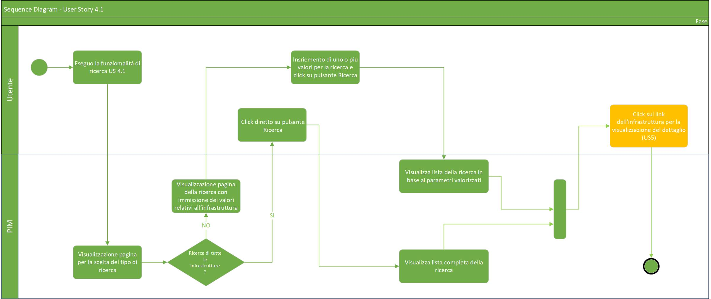

# User Story - Id 4.1 - Ricerca Infrastruttura

## Descrizione

**N.B: La corrente USER STORY è analoga a quella proposta nella FASE1, opportunamente rivista per adattarsi alla nuova terminologia e alle nuove funzionalità proposte nella FASE2.**

- COME: utente con ruolo OPS o con ruolo ADMIN
- DEVO POTER: eseguire la funzionalità di ricerca dell'infrastruttura.

 La ricerca può essere eseguita in base a differenti criteri:
  1. Accedo alla funzionalità mediante apposita voce di menu 
     - Il sistema PIM propone una pagina web e scelgo di eseguire una ricerca utilizzando uno o più campi [(UI 4.1.1)](#interfacce-utente)
     - I valori possono essere editati arbitrariamente 
     - Non è obbligatorio la valorizzazione di tutti i campi, ad esempio può essere inserito anche solo il NOME_PRODOTTO
     - Il sistema esegue una query sulla base dati interna PIM per il recupero delle informazioni legate al criterio di ricerca 
     - Il sistema visualizza una lista di infrastrutture  [(US 5.1)](us_5.1_visualizzazione_infrastruttura_prodotto.md)  che può contenere una o più infrastrutture fisiche di prodotto con i seguenti campi in tabella e rappresentati in figura [(UI 4.1.2)](#interfacce-utente)

 

| CAMPO                 |
| --------------------- |
| ID_PRODOTTO           |
| TIPO_PRODOTTO         |
| NOME_PRODOTTO         |
| STATO                 |
| TAG_GIT
| DATA_CREAZIONE        |

 

   - Il sistema permettere di scegliere una specifica infrastruttura tramite link, quindi:
   - Il sistema esegue una query sulla base dati interna PIM per il recupero delle informazioni

- AL FINE DI: eseguire una ricerca
  - per ricercare le informazioni di un'infrastruttura di prodotto in base a diffferenti valori di ricerca

## Riferimenti

Di seguito i riferimenti e/o collegamenti ad altre US citate in questa

### [User Story - Id 5.1 - Visualizzazione Infrastruttura di prodotto](us_5.1_visualizzazione_infrastruttura_prodotto.md)

## Criteri di accettazione

- **DATO:** Uno o più valori tra NOME_PRODOTTO, ID_PRODOTTO, NOME_MODULO, NOME_COMPONENTE

- **QUANDO:** l'utente OPS o ADMIN deve ricercare una infrastruttura relativa ad un determinato **DATO:**

- **QUINDI:** il sistema deve permettere
    - la ricerca dell'infrastruttura in base ai valori di ricerca, che possono essere:
    - Tutti o uno o più valori tra: NOME_PRODOTTO, ID_PRODOTTO, NOME_MODULO, NOME_COMPONENTE, STATO 
    
## Controlli e vincoli

Non presente/i

## Trigger

Clicco su apposito pulsante di ricerca

## Pre-Requisiti

L'utente ha eseguito l'accesso autenticandosi sul portale intranet

## Data Model

Di seguito è descritta la porzione di modello dati a cui faranno riferimento le funzionalità di ricerca:

### Tabella ISTANZA_BLUEPRINT:

| Attributo              | Tipo      | Descrizione  |
| ---------------------- | --------- | ------------ |
| ID_ISTANZA             | INT       | Identificativo autogenerato |
| ID_PRODOTTO*           | VARCHAR   | Valore dell'attributo *idProdotto* presente nella testata dell'infrastruttura di prodotto importata, fornita in input durante l'importazione                                                                                             |
| TIPO_PRODOTTO*         | VARCHAR   | Valore dell'attributo *tipoProdotto* presente nella testata dell'infrastruttura di prodotto importata, fornita in input durante l'importazione                                                                                           |
| NOME_PRODOTTO*         | VARCHAR   | Valore dell'attributo *nomeProdotto* presente nella testata dell'infrastruttura di prodotto importata, fornita in input durante l'importazione                                                                                           |
| DESCRIZIONE_PRODOTTO*  | VARCHAR   | Valore dell'attributo *descrizioneProdotto* presente nella testata dell'infrastruttura di prodotto importata, fornita in input durante l'importazione                                                                                    |
| DATA_DENSIMENTO*       | TIMESTAMP | Valore dell'attributo *dataCensimento* presente nella testata dell'infrastruttura di prodotto importata, fornita in input durante l'importazione                                                                                         |
| FILE_BLUEPRINT_ORIG    | FILE      | File di infrastruttura di prodotto associato al censimento e recuperato da GitLab durante l'importazione                                                                                                                                |
| FILE_BLUEPRINT_TARGET  | FILE      | File di infrastruttura di prodotto associato elaborato ed archiviato su GitLab con il passaggio di stato in *Archiviato*                                                                                                                |
| URL_REPOSITORY_GIT     | VARCHAR   | Valore del path/url del repository git dove presente il file archiviato, generata a partire da un base path url/*idProdotto* / configurazione-prodotto.git |
| NOME_BRANCH_GIT        | VARCHAR   | Valore del nome del branch del repository git dove presente il file archiviato.      |
| DATA_CREAZIONE         | TIMESTAMP | Data di creazione dell'occorrenza in tabella                                                           |
| UTENTE_CREAZIONE       | VARCHAR   | Utente applicativo che ha eseguito la creazione dell'occorrenza in tabella             |
| DATA_ULTIMA_MODIFICA   | TIMESTAMP | Data di ultimo aggiornamento dell'occorrenza in tabella                         |
| UTENTE_ULTIMA_MODIFICA | VARCHAR   | Utente applicativo che ha eseguito l'ultimo aggiornamento dell'occorrenza in tabella                     |
| DATA_IMPORT_ASSET      | TIMESTAMP | Data di importazione dell'asset di infrastruttura di prodotto       |
| DATA_IMPORT_FILE       | TIMESTAMP | Data di importazione del file di infrastruttura di prodotto       |
| JMS_CORRELATION_ID     | VARCHAR   | JmsCorrelationId identificativo del messaggio in coda       |
| VERSION                | NUMBER    | Number versione       |
| BLUEPRINT              | VARCHAR   | Valore dell'attributo *blueprint* presente nella testate dell'infrastruttura di prodotto importata, fornita in input durante l'importazione      |
| TAG_GIT                | VARCHAR   | Tag Git per la definizione del file di infrastruttura definitivo (tutti i componenti di tutti gli ambienti compilati)               |
| URL_REPOSITORY_GIT_API | VARCHAR   | URL repository Git Api dove è contenuto il file di infrastruttura    |
| VERSIONE_PRODOTTO      | VARCHAR   | Valore dell'attributo *versioneProdotto* presente nella testata dell'infrastruttura di prodotto importata, fornita in input durante l'importazione         |
| ID_STATO               | NUMBER    | Identificativo dell'occorrenza ANAGRAFICA_STATO a cui l'istanza fa riferimento|
| TAG_GIT_CI             | VARCHAR   | Tag Git per la definizione dell'infrastruttura (completa o parziale) relativo all'ambiente CI|
| TAG_GIT_COLL           | VARCHAR   | Tag Git per la definizione dell'infrastruttura (completa o parziale) relativo all'ambiente COLL|
| TAG_GIT_CERT           | VARCHAR   | Tag Git per la definizione dell'infrastruttura (completa o parziale) relativo all'ambiente CERT|
| TAG_GIT_PROD           | VARCHAR   | Tag Git per la definizione dell'infrastruttura (completa o parziale) relativo all'ambiente PROD|

 
 

### Tabella STATO_ISTANZA_BLUEPRINT

|    Attributo               |   Tipo    | Descrizione                                                                                 |
|  ----------------------    |  -------  | ------------------------------------------------------------------------------------------- | 
|   ID_STATO_ISTANZA         |    INT    | Identificativo autogenerato                                                                 |
|   ID_ISTANZA               |    INT    | Identificativo dell'occorrenza ISTANZA_BLUEPRINT a cui lo stato fa riferimento (chiave esterna ISTANZA_BLUEPRINT)|
|   COD_STATO                |    INT    | Identificativo dell'occorrenza ANAGRAFICA_STATO a cui l'istanza fa riferimento (chiave esterna ANAGRAFICA_STATO) |
|   DATA_CAMBIO_STATO        | TIMESTAMP | Data dell'inserimento dell'occorrenza in tabella, al primo inserimento ed ad ogni cambio di stato  | 
|   UTENTE_CAMBIO_STATO      |  VARCHAR  | Utente che ha eseguito l'inserimento dell'occorrenza in tabella, al primo inserimento ed ad ognicambio di stato  |

 
 

### Tabella MODULO_BLUEPRINT:

|    Attributo              |   Tipo    | Descrizione                                                                                 |
|  ----------------------   |  -------  | ------------------------------------------------------------------------------------------- | 
|   ID_MODULO               |    INT    | Identificativo autogenerato                                                                 |
|   ID_ISTANZA              |    INT    | Identificativo dell'occorrenza ISTANZA_BLUEPRINT a cui lo fa riferimento (chiave esterna ISTANZA_BLUEPRINT)   |
|   ID_MODULO_BP            |  VARCHAR  | Valore dell'attributo *idModulo* presente nell'infrastruttura |
|   NOME_MODULO             |  VARCHAR  | Valore dell'attributo *nomeModulo* presente nell'infrastruttura |
|   TIPO_MODULO             |  VARCHAR  | Valore dell'attributo *tipoModulo* presente nell'infrastruttura |
|   VERSIONE_MODULO         |  VARCHAR  | Versione modulo  |
|   PATTERN                 |  VARCHAR  | Valore dell'attributo *pattern* presente nell'infrastruttura di prodotto importata, fornita in input durante l'importazione |
|   DESCRIZIONE_MODULO      |  VARCHAR  | Valore dell'attributo *descrizioneModulo* presente nell'infrastruttura|

 
 

### Tabella COMPONENTE_BLUEPRINT:

|    Attributo               |   Tipo    | Descrizione                                                                                 |
|  ----------------------    |  -------  | ------------------------------------------------------------------------------------------- | 
|   ID_COMPONENTE            |    INT    | Identificativo autogenerato                                                                 |
|   ID_MODULO                |    INT    | Identificativo dell'occorrenza MODULO_BLUEPRINT a cui lo fa riferimento (chiave esterna MODULO_BLUEPRINT)   |
|   ID_COMPONENTE_BP         |  VARCHAR  | Valore dell'attributo *idComponente* presente nell'infrastruttura |
|   NOME_COMPONENTE          |  VARCHAR  | Valore dell'attributo *nomeComponente* presente nell'infrastruttura |
|   TIPO_COMPONENTE          |  VARCHAR  | Valore dell'attributo *tipoComponente* presente nell'infrastruttura |
|   DESCRIZIONE_COMPONENTE   |  VARCHAR  | Valore dell'attributo *descrizioneComponente* presente nell'infrastruttura |
|   DEPLOY_ENVIRONMENT       |  VARCHAR  | Valore dell'attributo *deployEnvironment* presente nell'infrastruttura|
|   CONFIG_REPO_GIT          |  VARCHAR  | Valore dell'attributo *config-repoGit* presente nell'infrastruttura  |
|   LAYER                    |  VARCHAR  | Valore dell'attributo *layer* presente nell'infrastruttura  |
|   REPO_GIT                 |  VARCHAR  | Valore del path/url del repository git dove presente il file archiviato, generata a partire da un base path url/*idProdotto* / configurazione-prodotto.git |
|   STATO                    |  VARCHAR  | /  |
|   TECNOLOGIA               |  VARCHAR  | Tecnologia associata al componente infrastrutturale  |
|   VERSIONE_COMPONENTE      |  VARCHAR  | Valore dell'attributo *versioneComponente* presente nell'infrastruttura |
|   VERSIONE_CONFIG          |  VARCHAR  | Valore dell'attributo *versioneConfig* presente nell'infrastruttura  |

 
 

## Diagrammi

Di seguito il diagramma che illustrano il caso d'uso previsto dalla user story

[Download file visio del diagramma](../files/sequence_diagram_us_4.1.vsdx)

 
 

## Interfacce Utente Mockup

- UI 4.1.1

 
 

- UI 4.1.2

 
 
