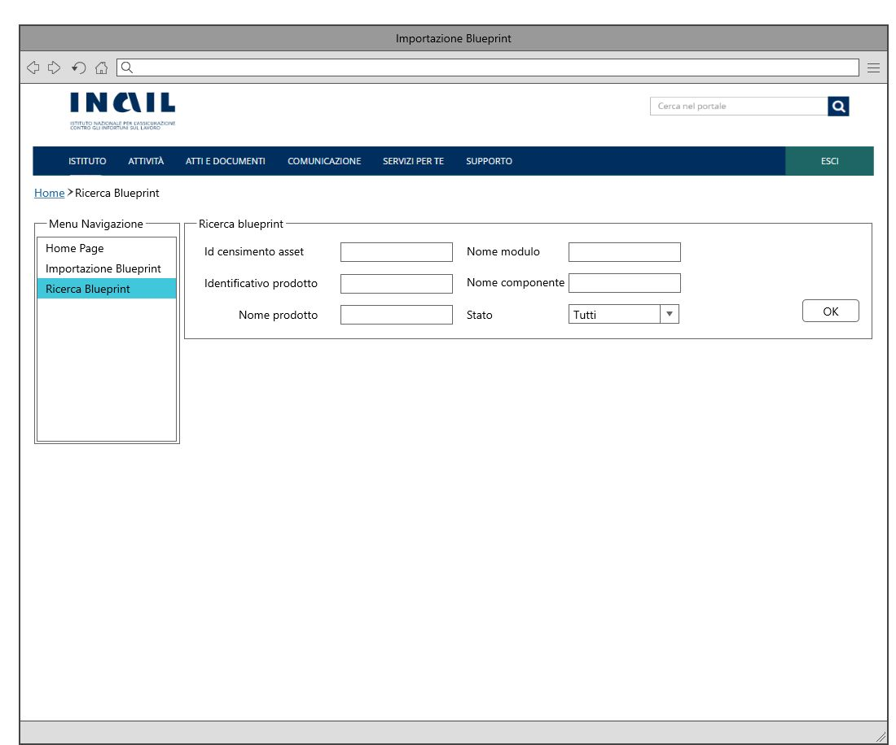

# User Story - Id 4 - Ricerca Istanza Blueprint 

## Descrizione

- COME: utente con ruolo OPS o con ruolo ADMIN
- DEVO POTER: eseguire la funzionalità di ricerca dell'istanza di blueprint.

 La ricerca può essere eseguita con due diverse modalità:
  1. Accedo alla funzionalità mediante apposita voce di menu 
  2. Ricerca associata ad uno specifico "ID Censimento Asset"
     - Il sistema PIM propone una pagina web e scelgo Inserimento di "ID Censimento Asset"
     - Inserisco "ID Censimento Asset" e clicco sul apposito pulsante
     - Il sistema esegue una query sulla base dati interna PIM per il recupero delle informazioni legate a "ID Censimento Asset"
     - Il sistema visualizza le informazioni della blueprint [(US 5)](us_5_visualizzazione_istanza_blueprint.md)
  3. Ricerca in base a differenti criteri
     - Il sistema PIM propone una pagina web e scelgo di eseguire una ricerca utilizzando uno o più campi [(UI 4.1)](#interfacce-utente)
     - I valori possono essere editati arbitrariamente 
     - Non è obbligatorio la valorizzazione di tutti i campi, ad esempio può essere inserito anche solo il NOME_PRODOTTO
     - Il sistema esegue una query sulla base dati interna PIM per il recupero delle informazioni legate al criterio di ricerca 
     - Il sistema visualizza una lista di blueprint che può contenere una o più blueprint con i seguenti campi in tabella e rappresentati in figura [(UI 4.2)](#interfacce-utente)

 

| CAMPO                 |
| --------------------- |
| ID_CENSIMENTO_ASSET   |
| ID_PRODOTTO           |
| TIPO_PRODOTTO         |
| NOME_PRODOTTO         |
| STATO                 |
| DATA_CREAZIONE        |

 

   - Il sistema permettere di scegliere una specifica blueprint tramite link, quindi:
   - Il sistema esegue una query sulla base dati interna PIM per il recupero delle informazioni
   - Il sistema visualizza le stesse informazioni di dettaglio della blueprint della ricerca via "ID Censimento Asset"

- AL FINE DI: eseguire una ricerca
  - per ricercare le informazioni di un'istanza di blueprint in base a diffferenti valori di ricerca

## Riferimenti

Di seguito i riferimenti e/o collegamenti ad altre US citate in questa

### [User Story - Id 5 - Visualizzazione Istanza di Blueprint](../user_stories/us_5_visualizzazione_istanza_blueprint.md)

## Criteri di accettazione

- **DATO:** un "ID Censimento Asset" oppure uno o più valori tra NOME_PRODOTTO, ID_PRODOTTO, NOME_MODULO, NOME_COMPONENTE

- **QUANDO:** l'utente OPS o ADMIN deve ricercare una istanza di blueprint relativa ad un determinato **DATO:**

- **QUINDI:** il sistema deve permettere
    - la ricerca della blueprint in base ai valori di ricerca, che possono essere:
        - "ID Censimento Asset"
        - Tutti o uno o più valori tra: NOME_PRODOTTO, ID_PRODOTTO, NOME_MODULO, NOME_COMPONENTE, STATO 
    

## Controlli e vincoli

Non presente/i

## Trigger

Clicco su apposito pulsante di ricerca

## Pre-Requisiti

L'utente ha eseguito l'accesso autenticandosi sul portale intranet

## Data Model

Di seguito è descritta la porzione di modello dati a cui faranno riferimento le funzionalità di ricerca:

### Tabella ISTANZA_BLUEPRINT

| Attributo              | Tipo      | Descrizione                                                                                                                                                                                                                       |
| ---------------------- | --------- | --------------------------------------------------------------------------------------------------------------------------------------------------------------------------------------------------------------------------------- |
| ID_ISTANZA             | INT       | Identificativo autogenerato                                                                                                                                                                                                       |
| ID_CENSIMENTO_ASSET    | VARCHAR   | Identificativo del censimento del prodotto come assett su EA di RTC                                                                                                                                                               |
| ID_PRODOTTO*           | VARCHAR   | Valore dell'attributo *idProdotto* presente nella testata dell'istanza di blueprint imporata, fornita in input durante l'importazione                                                                                             |
| TIPO_PRODOTTO*         | VARCHAR   | Valore dell'attributo *tipoProdotto* presente nella testata dell'istanza di blueprint imporata, fornita in input durante l'importazione                                                                                           |
| NOME_PRODOTTO*         | VARCHAR   | Valore dell'attributo *nomeProdotto* presente nella testata dell'istanza di blueprint imporata, fornita in input durante l'importazione                                                                                           |
| DESCRIZIONE_PRODOTTO*  | VARCHAR   | Valore dell'attributo *descrizioneProdotto* presente nella testata dell'istanza di blueprint imporata, fornita in input durante l'importazione                                                                                    |
| DATA_DENSIMENTO*       | TIMESTAMP | Valore dell'attributo *dataCensimento* presente nella testata dell'istanza di blueprint imporata, fornita in input durante l'importazione                                                                                         |
| FILE_BLUEPRINT_ORIG    | FILE      | File di istanza di bleuprint associato al censimento e recuperato da GitLab durante l'importazione                                                                                                                                |
| FILE_BLUEPRINT_TARGET  | FILE      | File di istanza di bleuprint associato elaborato ed archiviato su GitLab con il passaggio di stato in *Archiviato*                                                                                                                |
| URL_REPOSITORY_GIT     | VARCHAR   | Valore del path/url del repository git dove presente il file archiviato, generata a partire da un base path url/*idProdotto* / configurazione-prodotto.git |
| NOME_BRANCH_GIT        | VARCHAR   | Valore del nome del branch del repository git dove presente il file archiviato. Requisito in fase di definizione, al momento valore fisso = master                                                                                |
| DATA_CREAZIONE         | TIMESTAMP | Data di creazione dell'occorrenza in tabella                                                           |
| UTENTE_CREAZIONE       | VARCHAR   | Utente applicativo che ha eseguito la creazione dell'occorrenza in tabella                                                                                                                                                        |
| DATA_ULTIMA_MODIFICA   | TIMESTAMP | Data di ultimo aggiornamento dell'occorrenza in tabella                                                                                                                                                                           |
| UTENTE_ULTIMA_MODIFICA | VARCHAR   | Utente applicativo che ha eseguito l'ultimo aggiornamento dell'occorrenza in tabella                                                                                                                                             |
 
 

### Tabella STATO_ISTANZA_BLUEPRINT

|    Attributo               |   Tipo    | Descrizione                                                                                 |
|  ----------------------    |  -------  | ------------------------------------------------------------------------------------------- | 
|   ID_STATO_ISTANZA         |    INT    | Identificativo autogenerato                                                                 |
|   ID_ISTANZA               |    INT    | Identificativo dell'occorrenza ISTANZA_BLUEPRINT a cui lo stato fa riferimento (chiave esterna ISTANZA_BLUEPRINT)   |
|   ID_STATO                 |    INT    | Identificativo dell'occorrenza ANAGRAFICA_STATO a cui l'istanza fa riferimento (chaive esterna ANAGRAFICA_STATO) |
|   DATA_CAMBIO_STATO        | TIMESTAMP | Data dell'inserimento dell'occorrenza in tabella, al primo inserimento ed ad ognicambio di stato  | 
|   UTENTE_CAMBIO_STATO      |  VARCHAR  | Utente che ha eseguito l'inserimento dell'occorrenza in tabella, al primo inserimento ed ad ognicambio di stato  |

 
 

### Tabella MODULO_BLUEPRINT

|    Attributo               |   Tipo    | Descrizione                                                                                 |
|  ----------------------    |  -------  | ------------------------------------------------------------------------------------------- | 
|   ID_MODULO                |    INT    | Identificativo autogenerato                                                                 |
|   ID_ISTANZA               |    INT    | Identificativo dell'occorrenza ISTANZA_BLUEPRINT a cui lo fa riferimento (chiave esterna ISTANZA_BLUEPRINT)   |
|   ID_MODULO_BP             |  VARCHAR  | Valore dell'attributo *idModulo* presente nella blueprint |
|   NOME_MODULO              |  VARCHAR  | Valore dell'attributo *nomeModulo* presente nella blueprint |
|   TIPO_MODULO              |  VARCHAR  | Valore dell'attributo *tipoModulo* presente nella blueprint |
|   DESCRIZIONER_MODULO      |  VARCHAR  | Valore dell'attributo *descrizioneModulo* presente nella blueprint |

 
 

### Tabella COMPONENTE_BLUEPRINT

|    Attributo               |   Tipo    | Descrizione                                                                                 |
|  ----------------------    |  -------  | ------------------------------------------------------------------------------------------- | 
|   ID_COMPONENTE            |    INT    | Identificativo autogenerato                                                                 |
|   ID_MODULO                |    INT    | Identificativo dell'occorrenza MODULO_BLUEPRINT a cui lo fa riferimento (chiave esterna MODULO_BLUEPRINT)   |
|   ID_COMPONENTE_BP         |  VARCHAR  | Valore dell'attributo *idComponente* presente nella blueprint |
|   NOME_COMPONENTE          |  VARCHAR  | Valore dell'attributo *nomeComponente* presente nella blueprint |
|   TIPO_COMPONENTE          |  VARCHAR  | Valore dell'attributo *tipoComponente* presente nella blueprint |
|   DESCRIZIONER_COMPONENTE  |  VARCHAR  | Valore dell'attributo *descrizioneComponente* presente nella blueprint |
|   DEPLOY_ENVIRONMENT       |  VARCHAR  | Valore dell'attributo *deployEnvironment* presente nella blueprint |
|   RUNTIME_ENVIRONMENT      |  VARCHAR  | Valore dell'attributo *runtimeEnvironment* presente nella blueprint |

 
 

## Diagrammi

Di seguito il diagramma che illustrano il caso d'uso previsto dalla user story

[Download file visio del diagramma](../files/sequence_diagram_us_4.vsdx)

 
 

## Interfacce Utente Mockup

- UI 4.1

 
 

- UI 4.2

 
 

## Interfaccia Applicativa con Correlazione Chiamate ai Metodi Corrispondenti

Di seguito è riportata l'interfaccia applicativa (screen) della ricerca Blueprint di PIM prodotta nella FASE1 con conseguente correlazione alla chiamata al metodo della specifica funzionalità evidenziata, al fine di agevolare lo sviluppo della FASE2.

Al click del RED BOX "Ricerca Blueprint" è possibile accedere all'interfaccia per poter ricercare la Blueprint (FRONT-END). 

NOTA BENE: SOLO al primo avvio dell'applicativo, nel momento in cui si clicca sul RED BOX "Ricerca Blueprint" viene richiamato il metodo GET Dt Stato.

Al click del BLUE BOX "Pulisci" è possibile eseguire il reset dei dati sui campi (FRONT-END). 
Al click del GREEN BOX "Ricerca" verrà richiamato il metodo: POST ricerca Istanza Blueprint.  

Nella tabella in basso, viene mostrato un riepilogo con relativa chiamata al metodo di tutti i buttons presentati in questa interfaccia con relativo PATH: 

|Colore di riferimento|Pulsante Definito nell'Applicativo  |Tipologia Chiamata  |Nome chiamata | Path |Note|
|---------|---------|---------|---------|---------|---------|
|RED|Ricerca Blueprint     |/         |/ |/ |FRONT-END|
|BLUE|Pulisci|/ |/|/|FRONT-END|
|GREEN|Ricerca|POST |ricerca Istanza Blueprint|{{baseUrl}}/pim-api/blueprint/ricerca |/|
|YELLOW|Visualizza Dettaglio|/|/|/|vedi [User Story - Id 5 - Visualizzazione Istanza Blueprint](us_5_visualizzazione_istanza_blueprint.md)
|BLACK|Importa|/|/|/|vedi [User Story - Id 3 - Importazione File Istanza Blueprint](us_3_importazione_file_istanza_blueprint.md)|
|/|Non definito|GET|get Dt Stato|{{baseUrl}}/pim-api/blueprint/stato?codice=eu|/|
