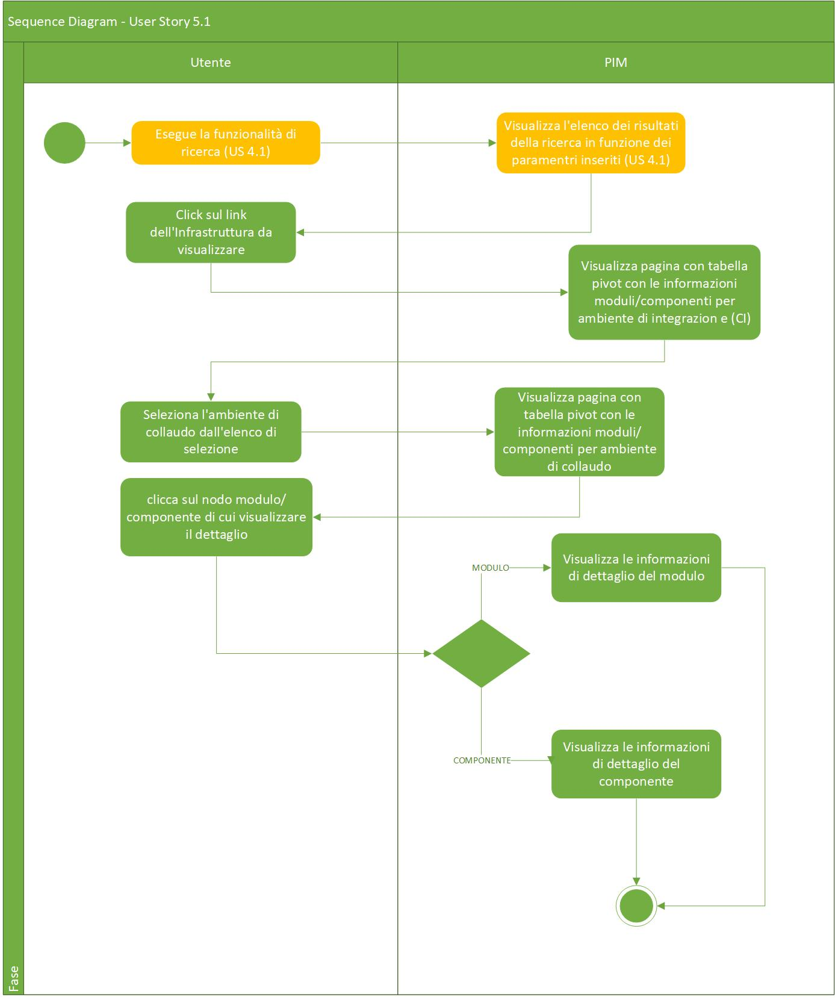
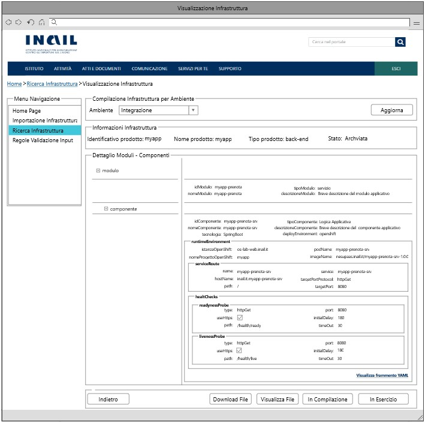

# User Story - Id 5.2 - Visualizzazione Infrastruttura di prodotto

## Descrizione

- COME: utente con ruolo OPS o con ruolo ADMIN

- DEVO POTER: eseguire la funzionalità di visualizzazione dell'infrastruttura di prodotto

1. Accedo alla funzionalità di Ricerca Infrastruttura [(US 4.1)](us_4.1_ricerca_infrastruttura.md) [(UI 5.2.1)](#user-interface)
2. Eseguo la funzionalità di Ricerca Infrastruttura [(US 4.1)](us_4.1_ricerca_infrastruttura.md)
3. Il sistema visualizza una lista di infrastrutture [(UI 5.2.2)](#user-interface)
4. Clicco il pulsante *Visualizza Dettaglio*
5. Il sistema visualizza una nuova pagina che presenta in una tabella pivot le informazioni associate all'infrastruttura e contenute nelle tabelle MODULO_BLUEPRINT, COMPONENTE_BLUEPRINT, AMBIENTE_COMPONENTE_BLUEPRINT per l'ambiente di Integrazione (Continuous Integration), selezionato di default in un elenco di 4 valori previsti per gli ambienti (Integrazione, Collaudo, Certificazione, Produzione)
6. Il sistema visualizza una pagina con tabella pivot non editabile con le informazioni moduli/componenti per l'ambiente selezionato [(UI 5.2.3)](#user-interface)
7. Seleziono il modulo o componente di cui voglio visualizzare il dettaglio:
8.  Il sistema visualizza le informazioni di dettaglio del modulo nel caso di scelta nodo modulo (non editabili)
9.  Il sistema visualizza le informazioni di dettaglio del componente nel caso di scelta nodo componente (non editabili) in un Form generato mediante il Form Renderer dinamico attraverso l'ausilio di un JSON (reperito dalla tabella STRUTTURE_RUNTIME) e opportunamente costruito dal Form Builder per la specifica tipologia componente e tecnologia (vedi ([US. 20.1](us_20.1_gestione_sezione_runtime_environment_(funzionalità_CRUD_create).md)))
10. Clicco sul pulsante YAML
11. Il sistema visualizza su pop-up il frammento YAML della configurazione presente in archivio

- AL FINE DI: visualizzare le informazioni di un'infrastruttura di prodotto

## Riferimenti

Di seguito i riferimenti e collegamenti ad altre US citate in questa

- [User Story - Id 4.1 - Ricerca Infrastruttura](us_4.1_ricerca_infrastruttura.md)
 
- [User Story - Id 6.2 - Compilazione Infrastruttura fisica di prodotto](us_6.2_compilazione_infrastruttura_fisica_di_prodotto.md)

- [User Story - Id 20.1 - Gestione Sezione Runtime Environment (Funzionalità CRUD (CREATE)) - Anagrafica Sezioni Runtime](us_20.1_gestione_sezione_runtime_environment_(funzionalità_CRUD_create).md)

## Criteri di accettazione

- **DATO**: Uno o più valori tra NOME_PRODOTTO, ID_MODULO, ID_COMPONENTE [(US 4.1)](us_4.1_ricerca_infrastruttura.md);

- **QUANDO**: l'utente OPS o ADMIN deve visualizzare una infrastruttura di prodotto relativa ad un determinato **DATO:**;

- **QUINDI**: il sistema deve permettere:
    1. La visualizzazione di una nuova pagina che presenta in una tabella pivot le informazioni associate all'infrastruttura (non editabili).
    2. La visualizzazione di una nuova pagina con le informazioni moduli/componenti per l'ambiente selezionato (non editabili).
    3. La visualizzazione su pop-up del frammento YAML della configurazione presente in archivio.

## Controlli e vincoli

La visualizzazione, ovvero informazioni non editabili, deve avvenire solo per le infrastrutture in stato *Definite*, *In Esercizio*, *Dismessa*. 

Il risultato del comportamento sul click del pulsante *Dettaglio* dipende dallo stato in cui si trova l'infrastruttura.  

Nel caso di stato *Da Compilare*, *In Compilazione* la navigazione mi condurrà alla funzionalità di compilazione. [(US 6.2)](us_6.2_compilazione_infrastruttura_fisica_di_prodotto.md)  

Nel caso di stato *Archiviata*, *In Esercizio*, *Dismessa* la navigazione mi condurrà alla funzionalità di visualizzazione.  

## Trigger

Esigenza di visualizzazione delle infrastrutture architetturali durante le attività previste per la fase di deploy e/o predisposizione

## Pre-Requisiti

L'utente ha eseguito l'accesso autenticandosi sul portale intranet

## Data Model

Di seguito è descritta la porzione di modello dati (solo titolo tabelle utilizzate) a cui fa riferimento la funzionalità illustrata nella user story:  

- Tabella ISTANZA_BLUEPRINT

- Tabella MODULO_BLUEPRINT

- Tabella COMPONENTE_BLUEPRINT

- Tabella STATO_ISTANZA_BLUEPRINT

- Tabella AMBIENTE_COMPONENTE_BLUEPRINT

- Tabella STRUTTURE_RUNTIME

Consultare [Modello dati della soluzione Product Infrastructure Management - PIM - FASE 3](../pages/modello_dati_FASE3.md) per ulteriori approfondimenti sul modello dati predisposto per la FASE 3.

## Diagrammi

Di seguito il sequence diagram che illustra le azioni previste dalla User Story (analogo alla FASE 2):
 

[Download file visio del diagramma](../files/sequence_diagram_us_5.1.vsdx)

 
 

## User Interface Mockup

- UI 5.2.1

 
 

- UI 5.2.2

 
 

- UI 5.2.3

 
 
