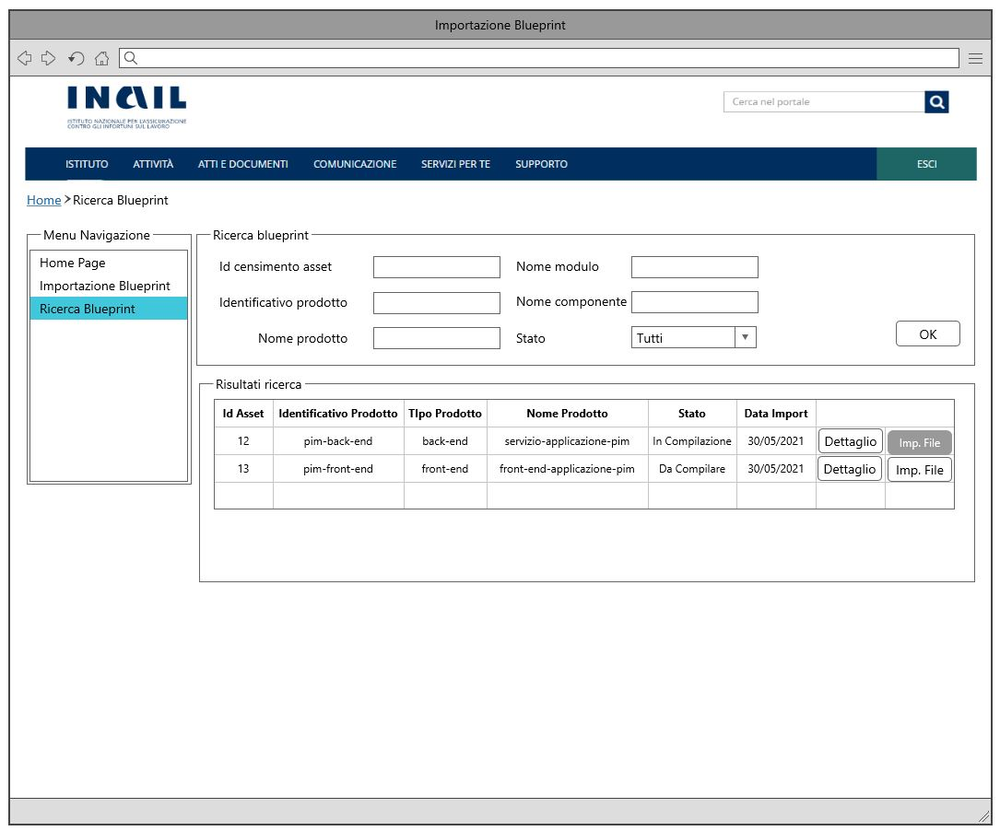

# User Story - Id 5 - Visualizzazione Istanza Blueprint

## Descrizione

- COME: utente con ruolo OPS o con ruolo ADMIN

- DEVO POTER: eseguire la funzionalità di visualizzazione dell'istanza di blueprint

1. Accedo alla funzionalità di Ricerca Istanza Blueprint [(US 4)](us_4_ricerca_istanza_blueprint.md) [(UI 5.1)](#user-interface)
2. Eseguo la funzionalità di Ricerca Istanza Blueprint [(US 4)](us_4_ricerca_istanza_blueprint.md) 
3. Il sistema visualizza una lista di Istance Blueprint [(US 4)](us_4_ricerca_istanza_blueprint.md) [(UI 5.2)](#user-interface)
4. Clicco il pulsante *Dettaglio*
5. Il sistema visualizza una nuova pagina che presenta in una tabella pivot le informazioni associate all'istanza e contenute nelle tabelle MODULO_BLUEPRINT, COMPONENTE_BLUEPRINT, AMBIENTE_COMPONENTE_BLUEPRINT per l'ambiente di Integrazione (Continuous Integration), seleziono di default in un elenco di 4 valori previsti per gli ambienti (Integrazione, Collaudo, Certificazione, Produzione)
6. Il sistema visualizza pagina con tabella pivot non editabile con le informazioni moduli/componenti per l'ambiente selezionato [(UI 5.3)](#user-interface)
7. Seleziono il modulo o componente di cui voglio visualizzare il dettaglio
8.  Il sistema visualizza le informazioni di dettaglio del modulo (non editabili) nel caso di scelta nodo modulo
9.  Il sistema visualizza le informazioni di dettaglio del componente (non editabili) nel caso di scelta nodo componente
10. Clicco sul link Visualizza frammento XML
11. Il sistema visualizza su pop-up il frammento XML della configurazione presente in archivio

- AL FINE DI: visualizzare le informazioni di un'istanza di blueprint

## Riferimenti

Di seguito i riferimenti e collegamenti ad altre US citate in questa

### [User Story - Id 4 - Ricerca Istanza di Blueprint](user_stories/us_4_ricerca_istanza_blueprint.md)

## Criteri di accettazione

- **DATO**: un "ID Censimento Asset" oppure uno o più valori tra NOME_PRODOTTO, NOME_MODULO, NOME_COMPONENTE (US 4)

- **QUANDO**: l'utente OPS o ADMIN deve visualizzare una istanza di blueprint relativa ad un determinato **DATO:**

- **QUINDI**: il sistema deve permettere:
    1. La visualizzazione di una nuova pagina che presenta in una tabella pivot le informazioni ssociate all'istanza (non editabili)
    2. La visualizzazione di una nuova pagina con le informazioni moduli/componenti per l'ambiente selezionato (non editabili)
    3. La visualizzazione su pop-up il frammento XML della configurazione presente in archivio

## Controlli e vincoli

La visualizzazione, ovvero informazioni non editabili, deve avvenire solo per le Istanze Blueprint in stato *Archiviata*, *In Esercizio*, *Dismessa*  
Il risultato del comportamento sul click del pulsante *Dettaglio* dipende dallo stato in cui si trova l'istanza Blueprint.  
Nel caso di stato *Da Compilare*, *In Compilazione* la navigazione mi condurrà alla funzionalità di compilazione. [(US 6)](us_6_compilazione_istanza_blueprint.md) 
Nel caso di stato *Archiviata*, *In Esercizio*, *Dismessa* la navigazione mi condurrà alla funzionalità di visualizzazione.  

## Trigger

Esigenza di visualizzazione delle istanze di blueprint architetturali durante le attività previste per la fase di deploy e/o predisposizione

## Pre-Requisiti

L'utente ha eseguito l'accesso autenticandosi sul portale intranet

## Riferimenti

### [User Story - Id 4 - Ricerca Istanza di Blueprint](../user_stories/us_4_ricerca_istanza_blueprint.md)

## Data Model

Di seguito è descritta la porzione di modello dati a cui faranno riferimento le funzionalità di visualizzazione:

### Tabella ISTANZA_BLUEPRINT

| Attributo              | Tipo      | Descrizione                                                                                                                                                                                                                       |
| ---------------------- | --------- | --------------------------------------------------------------------------------------------------------------------------------------------------------------------------------------------------------------------------------- |
| ID_ISTANZA             | INT       | Identificativo autogenerato                                                                                                                                                                                                       |
| ID_CENSIMENTO_ASSET    | VARCHAR   | Identificativo del censimento del prodotto come assett su EA di RTC                                                                                                                                                               |
| ID_PRODOTTO*           | VARCHAR   | Valore dell'attributo *idProdotto* presente nella testata dell'istanza di blueprint imporata, fornita in input durante l'importazione                                                                                             |
| TIPO_PRODOTTO*         | VARCHAR   | Valore dell'attributo *tipoProdotto* presente nella testata dell'istanza di blueprint imporata, fornita in input durante l'importazione                                                                                           |
| NOME_PRODOTTO*         | VARCHAR   | Valore dell'attributo *nomeProdotto* presente nella testata dell'istanza di blueprint imporata, fornita in input durante l'importazione                                                                                           |
| DESCRIZIONE_PRODOTTO*  | VARCHAR   | Valore dell'attributo *descrizioneProdotto* presente nella testata dell'istanza di blueprint imporata, fornita in input durante l'importazione                                                                                    |
| DATA_DENSIMENTO*       | TIMESTAMP | Valore dell'attributo *dataCensimento* presente nella testata dell'istanza di blueprint imporata, fornita in input durante l'importazione                                                                                         |
| FILE_BLUEPRINT_ORIG    | FILE      | File di istanza di bleuprint associato al censimento e recuperato da GitLab durante l'importazione                                                                                                                                |
| FILE_BLUEPRINT_TARGET  | FILE      | File di istanza di bleuprint associato elaborato ed archiviato su GitLab con il passaggio di stato in *Archiviato*                                                                                                                |
| URL_REPOSITORY_GIT     | VARCHAR   | Valore del path/url del repository git dove presente il file archiviato, generata a partire da un base path url/*idProdotto* / configurazione-prodotto.git|
| NOME_BRANCH_GIT        | VARCHAR   | Valore del nome del branch del repository git dove presente il file archiviato. Requisito in fase di definizione, al momento valore fisso = master                                                                                |
| DATA_CREAZIONE         | TIMESTAMP | Data di creazione dell'occorrenza in tabella                                                                                                                                                                                      |
| UTENTE_CREAZIONE       | VARCHAR   | Utente applicativo che ha eseguito la creazione dell'occorrenza in tabella                                                                                                                                                        |
| DATA_ULTIMA_MODIFICA   | TIMESTAMP | Data di ultimo aggiornamento dell'occorrenza in tabella                                                                                                                                                                           |
| UTENTE_ULTIMA_MODIFICA | VARCHAR   | Utente applicativo che ha eseguito l'ultimo aggiornamento dell'occorrenza in tabella                                                                                                                                             |
 
 

### Tabella MODULO_BLUEPRINT

|    Attributo               |   Tipo    | Descrizione                                                                                 |
|  ----------------------    |  -------  | ------------------------------------------------------------------------------------------- | 
|   ID_MODULO                |    INT    | Identificativo autogenerato                                                                 |
|   ID_ISTANZA               |    INT    | Identificativo dell'occorrenza ISTANZA_BLUEPRINT a cui lo fa riferimento (chiave esterna ISTANZA_BLUEPRINT)   |
|   ID_MODULO_BP             |  VARCHAR  | Valore dell'attributo *idModulo* presente nella blueprint |
|   NOME_MODULO              |  VARCHAR  | Valore dell'attributo *nomeModulo* presente nella blueprint |
|   TIPO_MODULO              |  VARCHAR  | Valore dell'attributo *tipoModulo* presente nella blueprint |
|   DESCRIZIONER_MODULO      |  VARCHAR  | Valore dell'attributo *descrizioneModulo* presente nella blueprint |

 
 

### Tabella COMPONENTE_BLUEPRINT

|    Attributo               |   Tipo    | Descrizione                                                                                 |
|  ----------------------    |  -------  | ------------------------------------------------------------------------------------------- | 
|   ID_COMPONENTE            |    INT    | Identificativo autogenerato                                                                 |
|   ID_MODULO                |    INT    | Identificativo dell'occorrenza MODULO_BLUEPRINT a cui lo fa riferimento (chiave esterna MODULO_BLUEPRINT)   |
|   ID_COMPONENTE_BP         |  VARCHAR  | Valore dell'attributo *idComponente* presente nella blueprint |
|   NOME_COMPONENTE          |  VARCHAR  | Valore dell'attributo *nomeComponente* presente nella blueprint |
|   TIPO_COMPONENTE          |  VARCHAR  | Valore dell'attributo *tipoComponente* presente nella blueprint |
|   DESCRIZIONER_COMPONENTE  |  VARCHAR  | Valore dell'attributo *descrizioneComponente* presente nella blueprint |
|   DEPLOY_ENVIRONMENT       |  VARCHAR  | Valore dell'attributo *deployEnvironment* presente nella blueprint |
|   RUNTIME_ENVIRONMENT      |  VARCHAR  | Valore dell'attributo *runtimeEnvironment* presente nella blueprint |

 
 

### Tabella STATO_ISTANZA_BLUEPRINT

|    Attributo               |   Tipo    | Descrizione                                                                                 |
|  ----------------------    |  -------  | ------------------------------------------------------------------------------------------- | 
|   ID_STATO_ISTANZA         |    INT    | Identificativo autogenerato                                                                 |
|   ID_ISTANZA               |    INT    | Identificativo dell'occorrenza ISTANZA_BLUEPRINT a cui lo stato fa riferimento (chiave esterna ISTANZA_BLUEPRINT)   |
|   ID_STATO                 |    INT    | Identificativo dell'occorrenza ANAGRAFICA_STATO a cui l'istanza fa riferimento (chaive esterna ANAGRAFICA_STATO) |
|   DATA_CAMBIO_STATO        | TIMESTAMP | Data dell'inserimento dell'occorrenza in tabella, al primo inserimento ed ad ognicambio di stato  | 
|   UTENTE_CAMBIO_STATO      |  VARCHAR  | Utente che ha eseguito l'inserimento dell'occorrenza in tabella, al primo inserimento ed ad ognicambio di stato  |

 
 

### Tabella AMBIENTE_COMPONENTE_BLUEPRINT

|    Attributo                |   Tipo    | Descrizione                                                                                 |
|  ----------------------     |  -------  | ------------------------------------------------------------------------------------------- | 
|   ID_AMBIENTE_COMPONENTE    |    INT    | Identificativo autogenerato                                                                 |
|   ID_COMPONENTE             |    INT    | Identificativo dell'occorrenza COMPONENTE_BLUEPRINT a cui lo fa riferimento (chiave esterna COMPONENTE_BLUEPRINT)   |
|   AMBIENTE                  |  VARCHAR  | Valore dell'ambiente per cui è destinato il frammento di configurazione del componente della blueprint (Integrazione | Collaudo | Certificazione | Esercizio) |
|   YAML_OPS_BLUEPRINT_TARGET |  VARCHAR  | Frammento YAML di configurazione del componente della blueprint |
|   DATA_CREAZIONE            | TIMESTAMP | Data di creazione dell'occorrenza in tabella                                                |
|   UTENTE_CREAZIONE          |  VARCHAR  | Utente applicativo che ha eseguito la creazione dell'occorrenza in tabella                  |
|   DATA_ULTIMA_MODIFICA      | TIMESTAMP | Data di ultimo aggiornamento dell'occorrenza in tabella                                     |         
|   UTENTE_ULTIMA_MODIFICA    |  VARCHAR  | Utente applicativo che ha eseguito l'ultimo aggiornamento dell'occorrenza in tabella        |

 
 

## Diagrammi

Di seguito il diagramma che illustrano il caso d'uso previsto dalla user story

[Download file visio del diagramma](../files/sequence_diagram_us_5.vsdx)

 
 

## User Interface Mockup

- UI 5.1

 
 

- UI 5.2

 
 

- UI 5.3

 
 

## Interfaccia Applicativa con Correlazione Chiamate ai Metodi Corrispondenti

Di seguito è riportata l' interfaccia applicativa (screen) della ricerca Blueprint di PIM prodotta nella FASE1 con conseguente correlazione alla chiamata al metodo della specifica funzionalità evidenziata, al fine di agevolare lo sviluppo della FASE2.

Per la "Visualizzazione Istanza Blueprint", oggetto della corrente US, è necessario fare riferimento al YELLOW BOX "Visualizza Dettaglio" dove veranno richiamati i metodi: GET read Istanza Blueprint e GET Dt Ambiente. 

A questo punto sarà possibile visualizzare il file Blueprint ad esso associato: 

Nella tabella in basso, viene mostrato un riepilogo con relativa chiamata al metodo di tutti i buttons presentati in queste interfacce con relativo PATH: 

|Colore di riferimento|Pulsante Definito nell'Applicativo  |Tipologia Chiamata  |Nome chiamata | Path |Note|
|---------|---------|---------|---------|---------|---------|
|YELLOW|Visualizza Dettaglio|GET |read Istanza Blueprint     get Dt Ambiente |{{baseUrl}}/pim-api/blueprint/:id     {{baseUrl}}/pim-api/blueprint/ambiente?codice=eu |/|
|RED|Ricerca Blueprint     |/         |/ |/ |FRONT-END|
|BLUE|Pulisci|/ |/|/|FRONT-END|
|GREEN|Ricerca|/ |/ |/|vedi [User Story - Id 4 - Ricerca Istanza Blueprint](us_4_ricerca_istanza_blueprint.md)|
|BLACK|Importa|/|/|/|vedi [User Story - Id 3 - Importazione File Istanza Blueprint](us_3_importazione_file_istanza_blueprint.md)|
