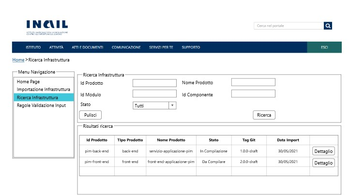
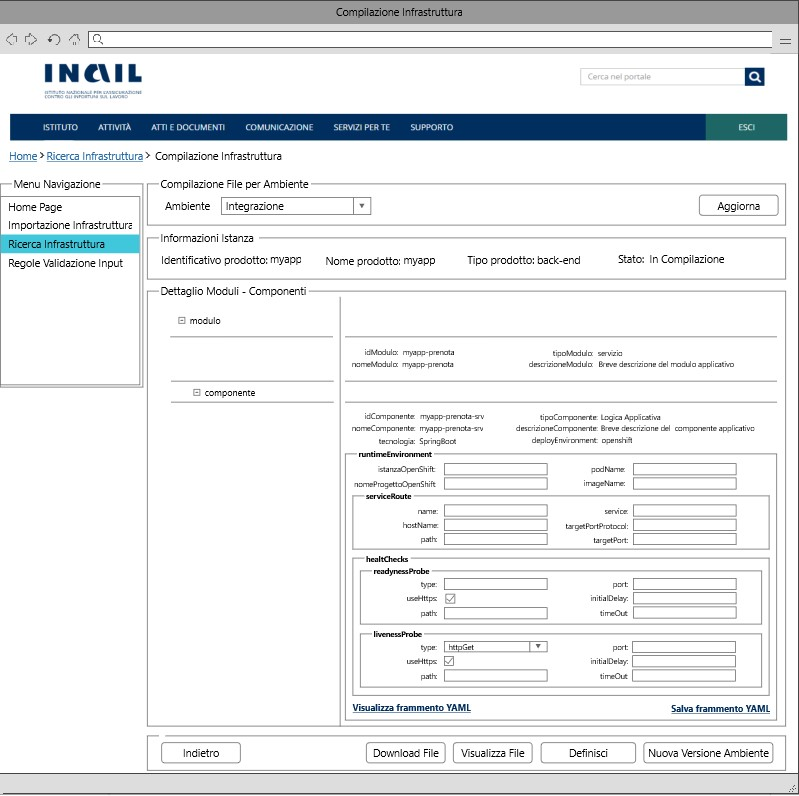

# User Story - Id 6.1 - Compilazione Infrastruttura fisica di prodotto 

## Descrizione

**N.B: La corrente USER STORY è analoga a quella proposta nella FASE1, opportunamente rivista per adattarsi alla nuova terminologia e alle nuove funzionalità proposte nella FASE2.**

- COME: utente con ruolo OPS o con ruolo ADMIN

- DEVO POTER: eseguire la funzionalità di compilazione delle configurazioni dei componenti definiti nel file dell'infrastruttura di prodotto per uno specifico ambiente.
  
  1. Accedo alla funzionalità di Ricerca Infrastruttura [US. 4.1](us_4.1_ricerca_infrastruttura.md) ed eseguo la funzionalità di ricerca. [(UI 6.1.1)](#user-interface-mockup-analoghi-alla-fase1)
  2. Il sistema esegue la funzionalità di ricerca in archivio [US. 4.1](us_4.1_ricerca_infrastruttura.md)
  3. Il sistema visualizza l'elenco dei risultati della ricerca in funzione dei paramentri inseriti [(UI 6.1.2)](#user-interface-mockup-analoghi-alla-fase1)
  4. Identifico l'item di interesse dai risultati della ricerca e clicco il pulsante *Dettaglio*. 
  5. Il sistema visualizza una nuova pagina che presenta in una tabella pivot le informazioni associate all'infrastruttura e contenute nelle tabelle MODULO_BLUEPRINT, COMPONENTE_BLUEPRINT, AMBIENTE_COMPONENTE_BLUEPRINT per l'ambiente di Integrazione ed in un elenco di selezione i valori previsti per gli ambienti caricando le occorrenze dalla tabella ANAGRAFICA_AMBIENTE_ISTANZA_BLUEPRINT. [(UI 6.1.3)](#user-interface-mockup-analoghi-alla-fase1)
  6. Se non sono presenti item associati nella tabella AMBIENTE_COMPONENTE_BLUEPRINT, per ogni item di componente il sistema deve permettere l'iserimento delle informazioni per uno specifico ambiente selezionato definite per il frammento YAML di configurazione per la tipologia del componente [per le casistiche previste vedi Controlli e vincoli](#controlli-e-vincoli).
  7. Clicco sul nodo modulo/componente di cui vuole impostare la configurazione
  8.  Se il nodo cliccato rientra in una delle tipologie gestite  
    8.1. Il sistema visualizza una riga sottostante con una sezione per l'inserimento delle informazioni previste dalla tipologia del componente selezionato più una CheckBox "Disponibile" comune a tutti i componenti per segnalare l'eventuale disponibilità dell'infrastruttura della componente e un pulsante Salva, per il salvataggio delle informazioni relative ad una singola tipologia compilata.    
    **N.B 1: Durante la fase di compilazione, verranno garantiti una serie di aiuti alla compilazione solo nel caso in cui verranno precaricate nella sezione “Regole Validazione Input” (vedi US:18.1/18.2/18.3/18.4) una serie di informazioni tra cui: valore di default, vincolo naming regex, obligatorietà, sola lettura, ecc.**  
    **N.B 2: Se i campi non vengono compilati (condizione di obbligatorietà non rispettata) e/o non vengono compilati correttamente (inserimento di un carattere non gestito) e/o non vengono valorizzati nel modo corretto (non rispettato valore di default/vincolo naming regex) secondo quanto preventivamente riportato in “Regole Validazione Input" (vedi US:18.1/18.2/18.3/18.4) verranno generati degli errori, visibili in elenco nella parte in alto della finestra popup o nella parte sottostante del campo.**  
  9. Al termine delle operazioni di inserimento delle informazioni di una singola tipologia clicco sul pulsante Salva
  10. Il sistema persiste il frammeto YAML e l'ambiente di riferimento in tabella AMBIENTE_COMPONENTE_BLUEPRINT per il singolo item di configurazione componente compilato dall'utente. 
    Il dettaglio delle informazioni che il sistema deve persistere è stato modellato sulla struttura prevista per le infrastrutture e descritto nella sezione [Data Model della US](#data-model) 
  11. Il sistema visualizza il messaggio: "Operazione eseguita con successo!"
 
- AL FINE DI: poter definire gli item di configurazione dei componenti definiti nel file dell'infrastruttura logica di prodotto per uno specifico ambiente.

## Riferimenti

Di seguito i riferimenti e/o collegamenti ad altre US citate in questa

### [User Story - Id 4.1 - Ricerca Infrastruttura](us_4.1_ricerca_infrastruttura.md)
### [User Story - Id 5.1 - Visualizzazione Infrastruttura di prodotto](us_5.1_visualizzazione_infrastruttura_prodotto.md)
### [User Story - Id 16 - Compilazione Tipi di Componenti e Naming Convention](us_16_compilazione_tipi_di_componenti_e_naming_convention.md)
### [User Story - Id 18.1 - Gestione Naming Convention (Funzionalità CRUD (CREATE))](us_18.1_gestione_naming_convention_(funzionalità_CRUD_create).md)
### [User Story - Id 18.2 - Gestione Naming Convention (Funzionalità CRUD (READ))](us_18.2_gestione_naming_convention_(funzionalità_CRUD_read).md)
### [User Story - Id 18.3 - Gestione Naming Convention (Funzionalità CRUD (UPDATE))](us_18.3_gestione_naming_convention_(funzionalità_CRUD_update).md)
### [User Story - Id 18.4 - Gestione Naming Convention (Funzionalità CRUD (DELETE))](us_18.4_gestione_naming_convention_(funzionalità_CRUD_delete).md)

## Criteri di accettazione

- DATO: un opportuno file YAML

- QUANDO: l'utente OPS o ADMIN deve importare il file di un infrastruttura logica di prodotto associata

- QUINDI: il sistema deve permettere:
  - la compilazione delle configurazioni dei componenti definiti nel file dell'infrastruttura logica di prodotto per uno specifico ambiente
  - al termine delle operazioni di compilazione il sistema dovrà aver inserito almeno una occorrenza nelle seguenti tabelle: AMBIENTE_COMPONENTE_BLUEPRINT

## Controlli e vincoli

La funzionalità di compilazione è utilizzabile solo per le infrastrutture logiche di prodotto importate in stato *Da Compilare*, *In Compilazione*.  
Il risultato del comportamento sul click del pulsante *Dettaglio* dipende dallo stato in cui si trova l'infrastruttura logica di prodotto.  
Nel caso di stato *Da Compilare*, *In Compilazione* la navigazione mi condurrà alla funzionalità di compilazione.  
Nel caso di stato *Definita*, *In Esercizio*, *Dismessa* la navigazione mi condurrà alla funzionalità di visualizzazione. [(US 5.1)](us_5.1_visualizzazione_infrastruttura_prodotto.md)]

Di seguito è riportata l'attuale tipologia di componenti e tecnologie previste per la FASE2:
 

| Tipo Componente        | Tecnologia   |  
-----------------------  | -------------|
| Logica Applicativa BE  | springboot   |
| Logica Applicativa BE  | nodejs       |
| Logica Applicativa BE  | dotnet       |
| SPA                    | angular      |
| CDN                    | js-css-html  |
| Api Sincrone           | openapi3     |
| Code Request Esterna   | amq          |  
| Evento Esterno Pub     | amq          |
| Evento Esterno Sub     | amq          |
| Dati SQL               | oracle       |
| Dati SQL               | sqlserver    |
| Dati SQL               | db2luw       |
| Dati SQL               | postgresql   |
| Dati NoSQL             | mongodb      |

 
I riferimenti alle informazioni di dettaglio sugli attributi previsti per i frammenti yaml delle specifiche tipologie sono riportati nella:

[User Story - Id 16 - Compilazione Tipi di Componenti e Naming Convention](us_16_compilazione_tipi_di_componenti_e_naming_convention.md).
 
 

## Trigger

Esigenza di compilazione delle configurazioni dei componenti definiti nel file dell'infrastruttura logica di prodotto per uno specifico ambiente

## Pre-Requisiti

L'utente ha eseguito l'accesso autenticandosi sul portale intranet

## Data Model

Di seguito è descritta la porzione di modello dati a cui fa riferimento la funzionalità illustrata nella user story.  
La lettura dei dati per la visualizzazione della tabella pivot viene eseguita accedendo in lettura alle tabelle MODULO_BLUEPRINT, COMPONENTE_BLUEPRINT, AMBIENTE_COMPONENTE_BLUEPRINT  
Al termine delle operazioni di compilazione il sistema dovrà aver inserito almeno una occorrenza nelle seguenti tabelle: AMBIENTE_COMPONENTE_BLUEPRINT

 
 

### tabella ANAGRAFICA_AMBIENTE_ISTANZA_BLUEPRINT

|    Attributo               |   Tipo    | Descrizione                                                                                  |
|  ----------------------    |  -------  | -------------------------------------------------------------------------------------------  |
|   COD_AMBIENTE             |    INT    | Codice alfanumerico che idenfica l'ambiente                                                  |
|   DESCRIZIONE_AMBIENTE     |  VARCHAR  | Descrizione dell'ambiente di riferimento                                                     |
|   PRIORITY                 |  NUMBER   | Priorità/ordine da assegnare agli ambienti                                                   |

 

* I valori previsti in tabella sono quelli relativi agli ambienti previsti per le infrastrutture di prodotto, di seguito sono elencati il codice e la descrizione
(CI - Integrazione, COLL - Collaudo, CERT - Certificazione, PROD - Produzione)

 
 

### Tabella MODULO_BLUEPRINT:

|    Attributo              |   Tipo    | Descrizione                                                                                 |
|  ----------------------   |  -------  | ------------------------------------------------------------------------------------------- | 
|   ID_MODULO               |    INT    | Identificativo autogenerato                                                                 |
|   ID_ISTANZA              |    INT    | Identificativo dell'occorrenza ISTANZA_BLUEPRINT a cui lo fa riferimento (chiave esterna ISTANZA_BLUEPRINT)   |
|   ID_MODULO_BP            |  VARCHAR  | Valore dell'attributo *idModulo* presente nell'infrastruttura |
|   NOME_MODULO             |  VARCHAR  | Valore dell'attributo *nomeModulo* presente nell'infrastruttura |
|   TIPO_MODULO             |  VARCHAR  | Valore dell'attributo *tipoModulo* presente nell'infrastruttura |
|   VERSIONE_MODULO         |  VARCHAR  | Versione modulo  |
|   PATTERN                 |  VARCHAR  | Valore dell'attributo *pattern* presente nell'infrastruttura di prodotto importata, fornita in input durante l'importazione |
|   DESCRIZIONE_MODULO      |  VARCHAR  | Valore dell'attributo *descrizioneModulo* presente nell'infrastruttura|

 
 

### Tabella COMPONENTE_BLUEPRINT:

|    Attributo               |   Tipo    | Descrizione                                                                                 |
|  ----------------------    |  -------  | ------------------------------------------------------------------------------------------- | 
|   ID_COMPONENTE            |    INT    | Identificativo autogenerato                                                                 |
|   ID_MODULO                |    INT    | Identificativo dell'occorrenza MODULO_BLUEPRINT a cui lo fa riferimento (chiave esterna MODULO_BLUEPRINT)   |
|   ID_COMPONENTE_BP         |  VARCHAR  | Valore dell'attributo *idComponente* presente nell'infrastruttura |
|   NOME_COMPONENTE          |  VARCHAR  | Valore dell'attributo *nomeComponente* presente nell'infrastruttura |
|   TIPO_COMPONENTE          |  VARCHAR  | Valore dell'attributo *tipoComponente* presente nell'infrastruttura |
|   DESCRIZIONE_COMPONENTE   |  VARCHAR  | Valore dell'attributo *descrizioneComponente* presente nell'infrastruttura |
|   DEPLOY_ENVIRONMENT       |  VARCHAR  | Valore dell'attributo *deployEnvironment* presente nell'infrastruttura|
|   CONFIG_REPO_GIT          |  VARCHAR  | Valore dell'attributo *config-repoGit* presente nell'infrastruttura  |
|   LAYER                    |  VARCHAR  | Valore dell'attributo *layer* presente nell'infrastruttura  |
|   REPO_GIT                 |  VARCHAR  | Valore del path/url del repository git dove presente il file archiviato, generata a partire da un base path url/*idProdotto* / configurazione-prodotto.git  |
|   STATO                    |  VARCHAR  | /  |
|   TECNOLOGIA               |  VARCHAR  | Tecnologia associata al componente infrastrutturale  |
|   VERSIONE_COMPONENTE      |  VARCHAR  | Valore dell'attributo *versioneComponente* presente nell'infrastruttura |
|   VERSIONE_CONFIG          |  VARCHAR  | Valore dell'attributo *versioneConfig* presente nell'infrastruttura  |

 
 

### Tabella AMBIENTE_COMPONENTE_BLUEPRINT: 

|    Attributo                |   Tipo    | Descrizione                                                                                 |
|  ----------------------     |  -------  | ------------------------------------------------------------------------------------------- | 
|   ID_AMBIENTE_COMPONENTE    |    INT    | Identificativo autogenerato                                                                 |
|   ID_COMPONENTE             |    INT    | Identificativo dell'occorrenza COMPONENTE_BLUEPRINT a cui lo fa riferimento (chiave esterna COMPONENTE_BLUEPRINT)   |
|   COD_AMBIENTE                  |  VARCHAR  | Valore dell'ambiente per cui è destinato il frammento di configurazione del componente dell'infrastruttura di prodotto (Integrazione | Collaudo | Certificazione | Esercizio) |
|   YAML_OPS_BLUEPRINT_TARGET |  VARCHAR  | Frammento YAML di configurazione del componente dell'infrastruttura di prodotto |
|   DATA_CREAZIONE            | TIMESTAMP | Data di creazione dell'occorrenza in tabella                                                |
|   UTENTE_CREAZIONE          |  VARCHAR  | Utente applicativo che ha eseguito la creazione dell'occorrenza in tabella                  |
|   DATA_ULTIMA_MODIFICA      | TIMESTAMP | Data di ultimo aggiornamento dell'occorrenza in tabella                                     |         
|   UTENTE_ULTIMA_MODIFICA    |  VARCHAR  | Utente applicativo che ha eseguito l'ultimo aggiornamento dell'occorrenza in tabella        |

 
 

### Tabella REGOLE_VALIDAZIONE_INPUT:

|Attributo  |Tipo  |Descrizione  |
|---------|---------|---------|
|ID     |INT         |Identificativo autogenerato           |
|ID_TIPO_COMPONENTE     |INT         |Identificativo dell'occorrenza TIPO_COMPONENTE a cui lo stato fa riferimento (chiave esterna TIPO_COMPONENTE)          |
|ID_TECNOLOGIA     |INT         |Identificativo dell'occorrenza TECNOLOGIA a cui lo stato fa riferimento (chiave esterna TECNOLOGIA)          |
|NOME_ATTRIBUTO_YAML     |NAVARCHAR         |Nome dell'attributo contenuto nel file YAML         |
|DESCRIZIONE     |NAVARCHAR         |Eventuale descrizione specifica attribuita all'attributo YAML (Non obligatoria)         |
|VINCOLO_NAMING_REGEX     |NAVARCHAR         |Vincolo Naming Convention (Non obligatorio). Se non è stato specificato nessun vincolo il campo rimane vuoto (NULL)        |
|REGOLA_NAMING_CONVENTION |NAVARCHAR         |Regola Naming Convention (Non obligatoria). Se non è stata specificata nessuna regola di naming il campo rimane vuoto (NULL)         |
|OBLIGATORIETA'     |BOOLEAN         |Eventuale obligatorietà del valore (Specificare SI/NO)          |
|REGOLA_VALORE_DEFAULT     |NAVARCHAR         |Valore predefinito da applicare. (Non obligatorio) Se non è stato specificato nessun valore di default il campo rimane vuoto (NULL)         |
|DATA_CREAZIONE     |TIMESTAMP         |Data di creazione dell'occorrenza in tabella           |
|UTENTE_CREAZIONE     |VARCHAR         |Utente applicativo che ha eseguito la creazione dell'occorrenza in tabella         |
|UTENTE_MODIFICA     |VARCHAR          |Data di ultimo aggiornamento dell'occorrenza in tabella          |
|DATA_ULTIMA_MODIFICA     |TIMESTAMP   |Utente applicativo che ha eseguito l'ultimo aggiornamento dell'occorrenza in tabella         |
|NOME_TECNOLOGIA|VARCHAR |Nome della tecnologia associata alla regola di validazione |
|NOME_TIPO_COMPONENTE|VARCHAR |Nome del tipo componente associata alla regola di validazione |
|READ_ONLY|BOOLEAN|Eventuale valore di sola lettura (Specificare SI/NO)|
|REPLACE_REGEX|VARCHAR|Carattere/i da sostituire nel valore di default|

## Diagrammi

Di seguito il sequence diagram che illustra le azioni previste dalla User Story:
 

 

[Download file visio del sequence diagram della user story ](../files/sequence_diagram_us_6.1.vsdx)

 
 

## User Interface Mockup (Analoghi alla FASE1)

- UI 6.1.1

 
 

- UI 6.1.2

 
 

- UI 6.1.3

 
 