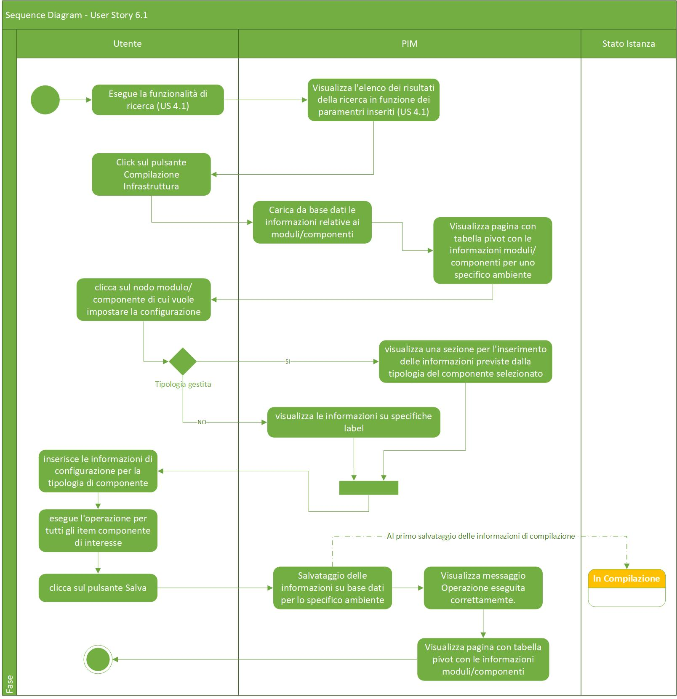

# User Story - Id 6.2 - Compilazione Infrastruttura fisica di prodotto

## Descrizione

- COME: utente con ruolo OPS o con ruolo ADMIN

- DEVO POTER: eseguire la funzionalità di compilazione delle configurazioni dei componenti definiti nel file dell'infrastruttura di prodotto per uno specifico ambiente.
  
  1. Accedo alla funzionalità di Ricerca Infrastruttura [US. 4.1](us_4.1_ricerca_infrastruttura.md) ed eseguo la funzionalità di ricerca. [(UI 6.2.1)](#user-interface-mockup)
  2. Il sistema esegue la funzionalità di ricerca in archivio [US. 4.1](us_4.1_ricerca_infrastruttura.md)
  3. Il sistema visualizza l'elenco dei risultati della ricerca in funzione dei paramentri inseriti [(UI 6.2.2)](#user-interface-mockup)
  4. Identifico l'item di interesse dai risultati della ricerca e clicco il pulsante * Visualizza Dettaglio*. 
  5. Il sistema visualizza una nuova pagina che presenta in una tabella pivot le informazioni associate all'infrastruttura e contenute nelle tabelle MODULO_BLUEPRINT, COMPONENTE_BLUEPRINT, AMBIENTE_COMPONENTE_BLUEPRINT per l'ambiente di Integrazione ed in un elenco di selezione i valori previsti per gli ambienti caricando le occorrenze dalla tabella ANAGRAFICA_AMBIENTE_ISTANZA_BLUEPRINT. [(UI 6.2.3)](#user-interface-mockup)
  6. Se non sono presenti item associati nella tabella AMBIENTE_COMPONENTE_BLUEPRINT, per ogni item di componente il sistema deve permettere l'iserimento delle informazioni per uno specifico ambiente selezionato definite per il frammento YAML di configurazione per la tipologia del componente [per le casistiche previste vedi Controlli e vincoli](#controlli-e-vincoli).
  7. Clicco sul nodo modulo/componente di cui vuole impostare la configurazione
  8.  Se il nodo cliccato rientra in una delle tipologie gestite:  
    8.1. Il sistema genera dinamicamente le Form associate alla specifica tipologia componente e tecnologia mediante un Form Renderer renderizzato attraverso un JSON (reperito dalla tabella STRUTTURE_RUNTIME) e costruito mediante il Form  Builder specificato nella ([US 20.1](us_20.1_gestione_sezione_runtime_environment_(funzionalità_CRUD_create).md)). 
    8.2. Il sistema renderizza, inoltre, una CheckBox "Disponibile" comune a tutti i componenti per segnalare l'eventuale disponibilità dell'infrastruttura della componente e un pulsante Salva, per il salvataggio delle informazioni relative ad una singola tipologia compilata.    
    
    **N.B 1: Durante la fase di compilazione, verranno garantiti una serie di aiuti alla compilazione solo nel caso in cui verranno precaricate nella sezione “Anagrafica Sezione Runtime” (vedi US:20.1/20.2/20.3/20.4) una serie di informazioni tra cui: valore di default, vincolo naming regex, obligatorietà, sola lettura, ecc.**  
    **N.B 2: Se i campi non vengono compilati (condizione di obbligatorietà non rispettata) e/o non vengono valorizzati nel modo corretto (non rispettato valore di default/vincolo naming regex) secondo quanto preventivamente riportato in “Anagrafica Sezione Runtime" (vedi US:20.1/20.2/20.3/20.4) verranno generati degli errori, visibili in elenco nella parte in alto della finestra popup o nella parte sottostante del campo.**  

  9. Al termine delle operazioni di inserimento delle informazioni di una singola tipologia clicco sul pulsante Salva
  10. Il sistema persiste il frammeto YAML e l'ambiente di riferimento in tabella AMBIENTE_COMPONENTE_BLUEPRINT per il singolo item di configurazione componente compilato dall'utente. 
    Il dettaglio delle informazioni che il sistema deve persistere è stato modellato sulla struttura prevista per le infrastrutture e descritto nella sezione [Data Model della US](#data-model) 
  11. Il sistema visualizza il messaggio: "Operazione eseguita con successo!"
 
- AL FINE DI: poter definire gli item di configurazione dei componenti definiti nel file dell'infrastruttura logica di prodotto per uno specifico ambiente.

## Riferimenti

Di seguito i riferimenti e/o collegamenti ad altre US citate in questa

### [User Story - Id 4.1 - Ricerca Infrastruttura](us_4.1_ricerca_infrastruttura.md)

### [User Story - Id 16 - Compilazione Tipi di Componenti e Naming Convention](us_16_compilazione_tipi_di_componenti_e_naming_convention.md)

### [User Story - Id 20.1 - Gestione Sezione Runtime Environment (Funzionalità CRUD (CREATE)) - Anagrafica Sezioni Runtime](us_20.1_gestione_sezione_runtime_environment_(funzionalità_CRUD_create).md)
### [User Story - Id 20.2 - Gestione Sezione Runtime Environment (Funzionalità CRUD (READ)) - Anagrafica Sezioni Runtime](us_20.2_gestione_sezione_runtime_environment_(funzionalità_CRUD_read).md)
### [User Story - Id 20.3 - Gestione Sezione Runtime Environment (Funzionalità CRUD (UPDATE)) - Anagrafica Sezioni Runtime](us_20.3_gestione_sezione_runtime_environment_(funzionalità_CRUD_update).md)
### [User Story - Id 20.4 - Gestione Sezione Runtime Environment (Funzionalità CRUD (DELETE)) - Anagrafica Sezioni Runtime](us_20.4_gestione_sezione_runtime_environment_(funzionalità_CRUD_delete).md)

## Criteri di accettazione

- DATO: un opportuno file YAML

- QUANDO: l'utente OPS o ADMIN deve importare il file di un infrastruttura logica di prodotto associata

- QUINDI: il sistema deve permettere:
  - la compilazione delle configurazioni dei componenti definiti nel file dell'infrastruttura logica di prodotto per uno specifico ambiente
  - al termine delle operazioni di compilazione il sistema dovrà aver inserito almeno una occorrenza nelle seguenti tabelle: AMBIENTE_COMPONENTE_BLUEPRINT

## Controlli e vincoli

La funzionalità di compilazione è utilizzabile solo per le infrastrutture logiche di prodotto importate in stato *Da Compilare*, *In Compilazione*.  
Il risultato del comportamento sul click del pulsante *Visualizza Dettaglio* dipende dallo stato in cui si trova l'infrastruttura logica di prodotto.  

Nel caso di stato *Da Compilare*, *In Compilazione* la navigazione mi condurrà alla funzionalità di compilazione.  

Nel caso di stato *Definita*, *In Esercizio*, *Dismessa* la navigazione mi condurrà alla funzionalità di visualizzazione. [(US 5.2)](us_5.2_visualizzazione_infrastruttura_prodotto.md)]

Di seguito è riportata l'attuale tipologia di componenti e tecnologie previste dalla FASE2 in poi:
 

| Tipo Componente        | Tecnologia   |  
-----------------------  | -------------|
| Logica Applicativa BE  | springboot   |
| Logica Applicativa BE  | nodejs       |
| Logica Applicativa BE  | dotnet       |
| SPA                    | angular      |
| CDN                    | js-css-html  |
| Api Sincrone           | openapi3     |
| Code Request Esterna   | amq          |  
| Evento Esterno Pub     | amq          |
| Evento Esterno Sub     | amq          |
| Dati SQL               | oracle       |
| Dati SQL               | sqlserver    |
| Dati SQL               | db2luw       |
| Dati SQL               | postgresql   |
| Dati NoSQL             | mongodb      |

N.B: Le suddette Tipologie Componenti e Tecnologie potrebbero variare in base alle api di RMP per la condivisione delle informazioni di Tipologia/Tecnologia previste (US. da definire).

 
I riferimenti alle informazioni di dettaglio sugli attributi previsti per i frammenti yaml delle specifiche tipologie sono riportati nella:

- [User Story - Id 16 - Compilazione Tipi di Componenti e Naming Convention](us_16_compilazione_tipi_di_componenti_e_naming_convention.md)
 
 

## Trigger

Esigenza di compilazione delle configurazioni dei componenti definiti nel file dell'infrastruttura logica di prodotto per uno specifico ambiente.

## Pre-Requisiti

L'utente ha eseguito l'accesso autenticandosi sul portale intranet

## Data Model

Di seguito è descritta la porzione di modello dati (solo titolo tabelle utilizzate) a cui fa riferimento la funzionalità illustrata nella user story:  
La lettura dei dati per la visualizzazione della tabella pivot viene eseguita accedendo in lettura alle tabelle MODULO_BLUEPRINT, COMPONENTE_BLUEPRINT, AMBIENTE_COMPONENTE_BLUEPRINT  
Al termine delle operazioni di compilazione il sistema dovrà aver inserito almeno una occorrenza nelle seguenti tabelle: AMBIENTE_COMPONENTE_BLUEPRINT.

 
 

- tabella ANAGRAFICA_AMBIENTE_ISTANZA_BLUEPRINT

- Tabella MODULO_BLUEPRINT

- Tabella COMPONENTE_BLUEPRINT

- Tabella AMBIENTE_COMPONENTE_BLUEPRINT

- Tabella STRUTTURE_RUNTIME

- Tabella ATTRIBUTI_RUNTIME

- Tabella REGOLE_VALIDAZIONE_INPUT

Consultare [Modello dati della soluzione Product Infrastructure Management - PIM - FASE 3](../pages/modello_dati_FASE3.md) per ulteriori approfondimenti sul modello dati predisposto per la FASE 3.

## Diagrammi

Di seguito il sequence diagram che illustra le azioni previste dalla User Story (analogo alla FASE 2):
 

 

[Download file visio del sequence diagram della user story ](../files/sequence_diagram_us_6.1.vsdx)

 
 

## User Interface Mockup

- UI 6.2.1

 
 

- UI 6.2.2

 
 

- UI 6.2.3

 
 