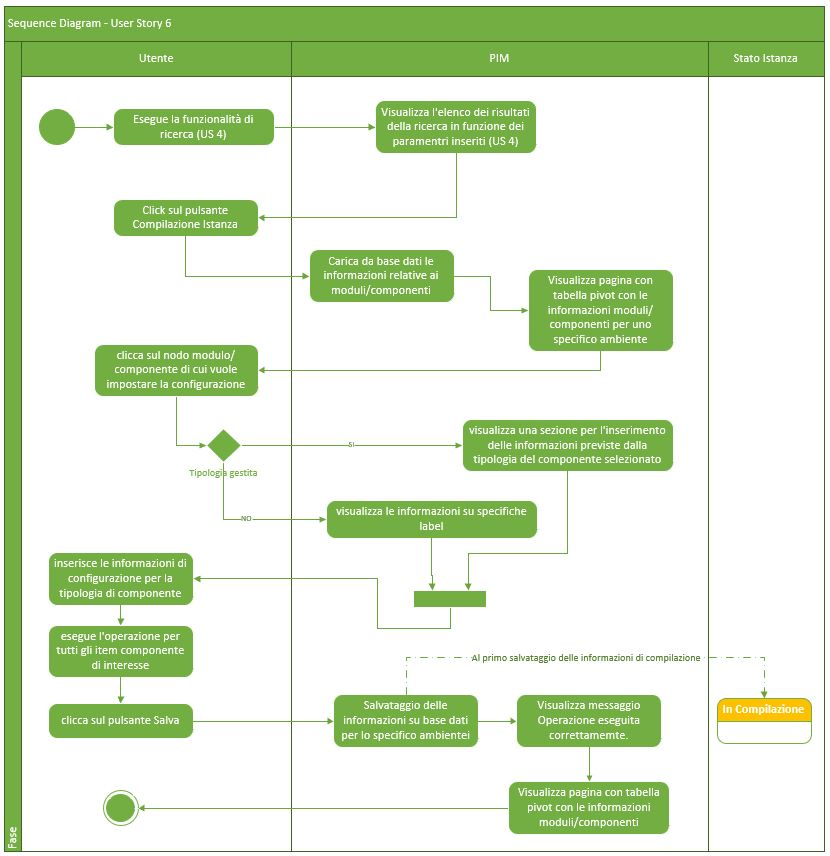
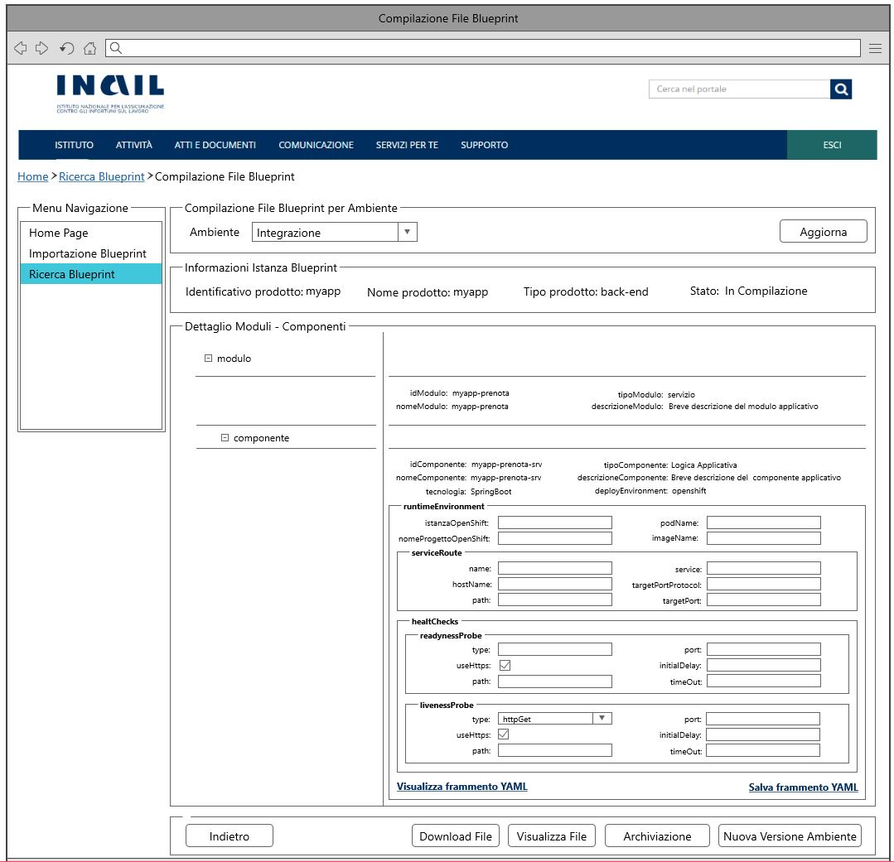
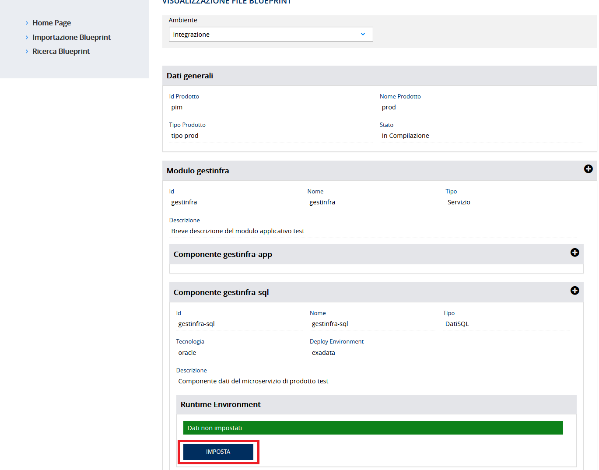
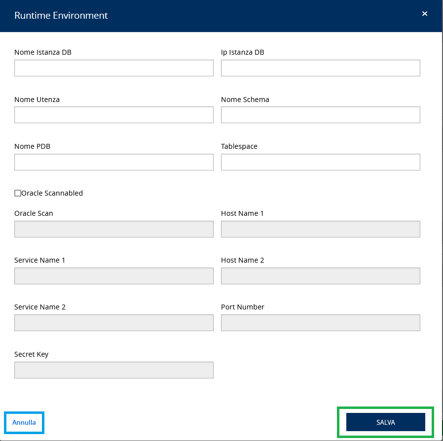
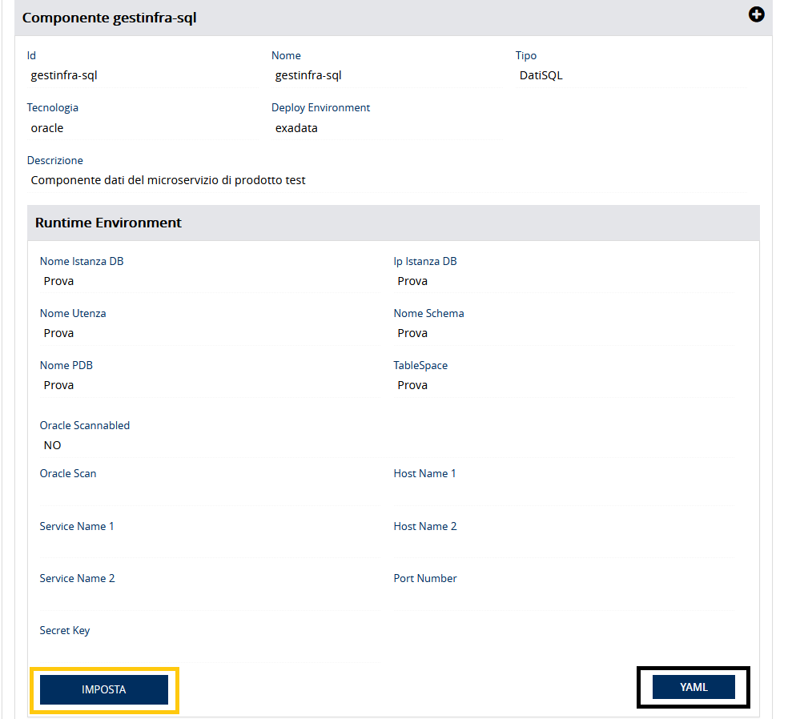
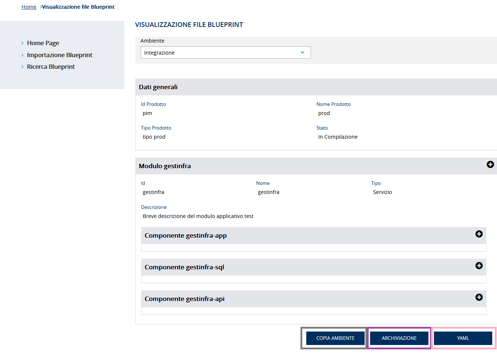
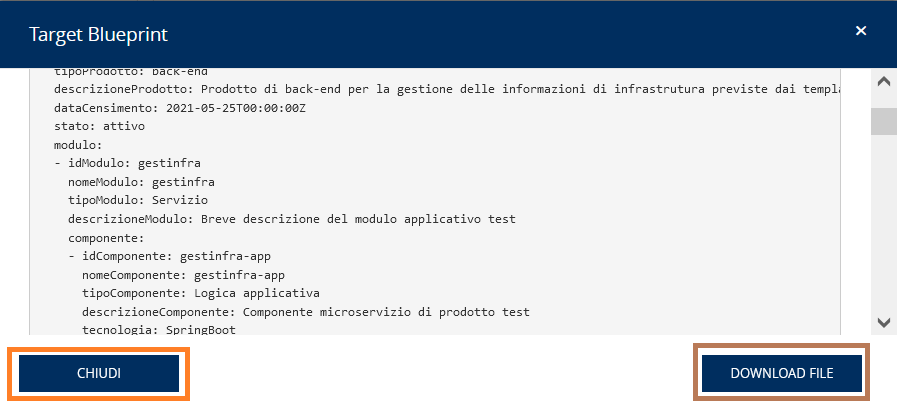

# User Story - Id 6 - Compilazione Istanza Blueprint 

## Descrizione

- COME: utente con ruolo OPS o con ruolo ADMIN

- DEVO POTER: eseguire la funzionalità di compilazione delle configurazioni dei componenti definiti nel file dell'istanza di blueprint per uno specifico ambiente.
  
  1. Accedo alla funzionalità di Ricerca Istanza Blueprint [(US 4)](us_4_ricerca_istanza_blueprint.md) ed eseguo la funzionalità di ricerca per identificare il censimento asset oppure l'identificativo del prodotto/asset RTC di cui eseguire la compilazione. [(UI 6.1)](#user-interface)
  2. Il sistema esegue la funzionalità di ricerca in archivio [(US 4)](us_4_ricerca_istanza_blueprint.md) 
  3. Il sistema visualizza l'elenco dei risultati della ricerca in funzione dei paramentri inseriti (US 4) [(UI 6.2)](#user-interface)
  4. Identifico l'item di interesse dai risultati della ricerca e clicco il pulsante *Dettaglio*. 
  5. Il sistema visualizza una nuova pagina che presenta in una tabella pivot le informazioni associate all'istanza e contenute nelle tabelle MODULO_BLUEPRINT, COMPONENTE_BLUEPRINT, AMBIENTE_COMPONENTE_BLUEPRINT per l'ambiente di Integrazione ed in un elenco di selezione i valori previsti per gli ambienti caricando le occorrenze dalla tabella ANAGRAFICA_AMBIENTE_ISTANZA_BLUEPRINT. [(UI 6.3)](#user-interface)
  6. Se non sono presenti item associati nella tabella AMBIENTE_COMPONENTE_BLUEPRINT, per ogni item di componente il sistema deve permettere l'iserimento delle infomrazioni per uno specifico ambiente selezionato definite per il frammento YAML di configurazione per la tipologia del componente [per le casistiche previste vedi Controlli e vincoli](#controlli-e-vincoli).
  7. Clicco sul nodo modulo/componente di cui vuole impostare la configurazione
  8.  Se il nodo cliccato rientra in una delle tipologie gestite  
    8.1. Il sistema visualizza una riga sottostante con una sezione per l'inserimento delle informazioni previste dalla tipologia del componente selezionato ed un pulsante Salva, per il salvataggio delle informazioni relative ad una singola tipologia compilata.
  9.  Se il nodo cliccato non rientra in una delle tipologie gestite  
    9.1. Il sistema visualizza una riga sottostante con il messaggio: tipologia non gestita 
  10. Al termine delle operazioni di inserimento delle informazioni di una singola tipologia clicco sul pulsante Salva
  11. Il sistema persiste il frammeto YAML e l'ambiente di riferimento in tabella AMBIENTE_COMPONENTE_BLUEPRINT per il singolo item di configurazione componente compilato dall'utente. 
    Il dettaglio delle informazioni che il sistema deve persistere è stato modellato sulla struttura prevista del template delle blueprint e descritto nella sezione [Data Model della US](#data-model) 
  12. Il sistema visualizza il messaggio: "Operazione eseguita con successo!"
 
- AL FINE DI: poter definire gli item di configurazione dei componenti definiti nel file dell'istanza di blueprint per uno specifico ambiente.

## Riferimenti

Di seguito i riferimenti e/o collegamenti ad altre US citate in questa

### [User Story - Id 2 - Importazione Istanza Blueprint](us_2_importazione_istanza_blueprint.md)
### [User Story - Id 4 - Ricerca Istanza Blueprint](us_4_ricerca_istanza_blueprint.md)

## Criteri di accettazione

- DATO: un codice evento di censimento asset oppure ad un identificativo del prodotto/asset RTC

- QUANDO: l'utente OPS o ADMIN deve importare il file di una istanza di blueprint associata 

- QUINDI: il sistema deve permettere:
  - la compilazione delle configurazioni dei componenti definiti nel file dell'istanza di blueprint per uno specifico ambiente
  - al termine delle operazioni di compilazione il sistema dovrà aver inserito almeno una occorrenza nelle seguenti tabelle: AMBIENTE_COMPONENTE_BLUEPRINT

 

## Controlli e vincoli

La funzionalità di compilazione è utilizzabile solo per istanze di blueprint importate in stato *Da Compilare*, *In Compilazione*.  
Il risultato del comportamento sul click del pulsante *Dettaglio* dipende dallo stato in cui si trova l'istanza Blueprint.  
Nel caso di stato *Da Compilare*, *In Compilazione* la navigazione mi condurrà alla funzionalità di compilazione.  
Nel caso di stato *Archiviata*, *In Esercizio*, *Dismessa* la navigazione mi condurrà alla funzionalità di visualizzazione. [(US 5)]  (us_5_visualizzazione_istanza_blueprint.md)

Di seguito è riportata l'attuale tipologia di componenti previsti per i template di bleuprint e l'indicazione delle casistiche in scope all'applicazione.
 

|     | Tipo Componente          | Cod. Tipo Componente | Tecnologia   | Deploy Environemt  | In Scope | 
| --- | -----------------------  | -------------------- |------------- | ------------------ | -------- |  
|  1  |   Logica Applicativa     |   ms                 | Spring-Boot  | openshift          |    SI    | 
|  2  |   Logica Applicativa     |   ms                 | NodeJS       | openshift          |    NO    | 
|  3  |   Logica Applicativa     |   ms                 | DotNet       | openshift          |    NO    | 
|  4  |   UI Applicativa         |   spa                | Angular      | Apache             |    SI    | 
|  4  |   UI Applicativa         |   cdn                | CDN          | Apache             |    NO    | 
|  5  |   Api sincrone           |   api                | OpenApi3     | apigateway         |    SI    | 
|  6  |   Code request           |   que                | AMQ          | broker             |    SI    | 
|  7  |   Code Pub               |   pub                | AMQ          | broker             |    NO    | 
|  8  |   Code Sub               |   sub                | AMQ          | broker             |    NO    | 
|  9  |   DatiSQL                |   sql                | Oracle       | sql                |    SI    | 
|  10 |   DatiSQL                |   sql                | SQL Server   | sql                |    NO    | 
|  11 |   DatiSQL                |   sql                | DB2 Luw      | sql                |    NO    | 
|  12 |   DatiSQL                |   sql                | Postgresql   | sql                |    NO    | 
|  13 |   DatiNoSQL              |   nosql              | MongoDB      | nosql              |    NO    | 

 

Per le casisitiche contrassegnate in scope dovrà essere prevista la opssibilità di eseguire la compilazione delle configurazione del componente da parte dell'utente.
 
Di seguito i riferimento alle informazioni di dettaglio sugli attributi previsti per i frammenti yaml delle specifiche tipologie.
 

### [9.5. Tipologie di componenti e relative tecnologie previste per una Blueprint Architetturale](/pages/tipologie_componenti_blueprint_architetturale.md)
### [9.6. Frammento YAML di configurazione componente - Tipologia: Logica Applicativa - Tecnologia: Spring-Boot](pages/farmmento_yaml_tipo_logica_app_tech_springboot.md)
### [9.7. Frammento YAML di configurazione componente - Tipologia: UI Applicativa - Tecnologia: Angular](pages/farmmento_yaml_tipo_ui_app_tech_angular.md)
### [9.8. Frammento YAML di configurazione componente - Tipologia: Api Sincorne - Tecnologia: OpenApi3](pages/farmmento_yaml_tipo_apisync_tech_openapi3.md)
### [9.9. Frammento YAML di configurazione componente - Tipologia: DatiSQL - Tecnologia: Oracle](pages/farmmento_yaml_tipo_datisql_tech_oracle.md)
### [9.10. Frammento YAML di configurazione componente - Tipologia: Code request - Tecnologia: AMQ](pages/farmmento_yaml_tipo_code_req_tech_amq.md)

                         
 

## Trigger

Esigenza di compilazione delle configurazioni dei componenti definiti nel file dell'istanza di blueprint per uno specifico ambiente

## Pre-Requisiti

L'utente ha eseguito l'accesso autenticandosi sul portale intranet

## Data Model

Di seguito è descritta la porzione di modello dati a cui fa riferimento la funzionalità illustrata nella user story.  
La lettura dei dati per la visualizzazione della tabella pivot viene eseguita accedendo in lettura alle tabelle MODULO_BLUEPRINT, COMPONENTE_BLUEPRINT, AMBIENTE_COMPONENTE_BLUEPRINT  
Al termine delle operazioni di compilazione il sistema dovrà aver inserito almeno una occorrenza nelle seguenti tabelle: AMBIENTE_COMPONENTE_BLUEPRINT

 
 

### Tabelle:
- tabella ANAGRAFICA_AMBIENTE_ISTANZA_BLUEPRINT

|    Attributo               |   Tipo    | Descrizione                                                                                  |
|  ----------------------    |  -------  | -------------------------------------------------------------------------------------------  | 
|   ID_AMBIENTE              |    INT    | Identificativo                                                                               |
|   COD_AMBIENTE             |    INT    | Codice alfanumerico che idenfica l'ambiente                                                  |
|   DESCRIZIONE_AMBIENTE     |  VARCHAR  | Descrizione dell'ambiente di riferimento                                                     |

 
* I valori previsti in tabella sono quelli relativi agli ambienti previsti per le istanze di blueprint, di seguito sono elencati il codice e la descrizione
  (ci - Integrazione, coll - Collaudo, cert - Certificazione, prod - Produzione)

 
 

- Tabella MODULO_BLUEPRINT

|    Attributo               |   Tipo    | Descrizione                                                                                 |
|  ----------------------    |  -------  | ------------------------------------------------------------------------------------------- | 
|   ID_MODULO                |    INT    | Identificativo autogenerato                                                                 |
|   ID_ISTANZA               |    INT    | Identificativo dell'occorrenza ISTANZA_BLUEPRINT a cui lo fa riferimento (chiave esterna ISTANZA_BLUEPRINT)   |
|   ID_MODULO_BP             |  VARCHAR  | Valore dell'attributo *idModulo* presente nella blueprint |
|   NOME_MODULO              |  VARCHAR  | Valore dell'attributo *nomeModulo* presente nella blueprint |
|   TIPO_MODULO              |  VARCHAR  | Valore dell'attributo *tipoModulo* presente nella blueprint |
|   DESCRIZIONER_MODULO      |  VARCHAR  | Valore dell'attributo *descrizioneModulo* presente nella blueprint |

 
 

- Tabella COMPONENTE_BLUEPRINT

|    Attributo               |   Tipo    | Descrizione                                                                                 |
|  ----------------------    |  -------  | ------------------------------------------------------------------------------------------- | 
|   ID_COMPONENTE            |    INT    | Identificativo autogenerato                                                                 |
|   ID_MODULO                |    INT    | Identificativo dell'occorrenza MODULO_BLUEPRINT a cui lo fa riferimento (chiave esterna MODULO_BLUEPRINT)   |
|   ID_COMPONENTE_BP         |  VARCHAR  | Valore dell'attributo *idComponente* presente nella blueprint |
|   NOME_COMPONENTE          |  VARCHAR  | Valore dell'attributo *nomeComponente* presente nella blueprint |
|   TIPO_COMPONENTE          |  VARCHAR  | Valore dell'attributo *tipoComponente* presente nella blueprint |
|   DESCRIZIONER_COMPONENTE  |  VARCHAR  | Valore dell'attributo *descrizioneComponente* presente nella blueprint |
|   TECNOLOGIA               |  VARCHAR  | Valore dell'attributo *tecnologia* presente nella blueprint |
|   DEPLOY_ENVIRONMENT       |  VARCHAR  | Valore dell'attributo *deployEnvironment* presente nella blueprint |
|   RUNTIME_ENVIRONMENT      |  VARCHAR  | Valore dell'attributo *runtimeEnvironment* presente nella blueprint |

 
 

- AMBIENTE_COMPONENTE_BLUEPRINT 

|    Attributo                |   Tipo    | Descrizione                                                                                 |
|  ----------------------     |  -------  | ------------------------------------------------------------------------------------------- | 
|   ID_AMBIENTE_COMPONENTE    |    INT    | Identificativo autogenerato                                                                 |
|   ID_COMPONENTE             |    INT    | Identificativo dell'occorrenza COMPONENTE_BLUEPRINT a cui lo fa riferimento (chiave esterna COMPONENTE_BLUEPRINT)   |
|   AMBIENTE                  |  VARCHAR  | Valore dell'ambiente per cui è destinato il frammento di configurazione del componente della blueprint (Integrazione | Collaudo | Certificazione | Esercizio) |
|   YAML_OPS_BLUEPRINT_TARGET |   CLOB    | Frammento YAML di configurazione del componente della blueprint |
|   DATA_CREAZIONE            | TIMESTAMP | Data di creazione dell'occorrenza in tabella                                                |
|   UTENTE_CREAZIONE          |  VARCHAR  | Utente applicativo che ha eseguito la creazione dell'occorrenza in tabella                  |
|   DATA_ULTIMA_MODIFICA      | TIMESTAMP | Data di ultimo aggiornamento dell'occorrenza in tabella                                     |         
|   UTENTE_ULTIMA_MODIFICA    |  VARCHAR  | Utente applicativo che ha eseguito l'ultimo aggiornamento dell'occorrenza in tabella        |

 
 

## Diagrammi

Di seguito il sequence diagram che illustra le azioni previste dalla User Story
 

 

[Download file visio del sequence diagram della user story ](../files/sequence_diagram_us_6.vsdx)

 
 

## User Interface Mockup 

- UI 6.1

 
 

- UI 6.2

 
 

- UI 6.3

 
 

## Interfaccia Applicativa con Correlazione Chiamate ai Metodi Corrispondenti

Di seguito è riportata l'interfaccia applicativa (screen) Compilazione Istanza Blueprint di PIM prodotta nella FASE1 con conseguente correlazione alle chiamate ai metodi della specifica funzionalità evidenziata, al fine di agevolare lo sviluppo della FASE2.

Per la "Compilazione Istanza Blueprint", oggetto della corrente US, dopo aver correttamente importato il file di istanza sarà possibile procedere alla sua compilazione.

La struttura viene caratterizzata da una sezione corrispondente a Dati generali, Modulo/i, Componente/i. Per ogni tipologia componenti è possibile compilare l'opportuna sezione Runtime Environment cliccando sul RED BOX "Imposta" (FRONT-END).

La finestra generata al click del pulsante "Imposta" permette l'inserimento dei dati, con la possibilità di annullare l'immissione cliccando sul BLUE BOX "Annulla" (FRONT-END) o confermarla attraverso il GREEN BOX "Salva" che richiamerà a sua volta il metodo PUT insert Or Update Ambiente Componente 1/2/3/4 a seconda della tipologia di componente (Vedi Tabella in basso).

|Tipologia Componente  |Tipologia Chiamata|Nome Chiamata Corrispondente  |Path|
|---------|---------|---------|---------|
|ambiente-amq-coderequest      |PUT         |insert Or Update Ambiente Componente|{{baseUrl}}/pim-api/blueprint/componente/:id/ambiente-amq-coderequest/:codiceAmbiente|
|ambiente-logicapp-springboot  |PUT         |insert Or Update Ambiente Componente 1|{{baseUrl}}/pim-api/blueprint/componente/:id/ambiente-logicapp-springboot/:codiceAmbiente|
|ambiente-logicapp-angular     |PUT         |insert Or Update Ambiente Componente 2|{{baseUrl}}/pim-api/blueprint/componente/:id/ambiente-logicapp-angular/:codiceAmbiente|
|ambiente-sql-oracle           |PUT         |insert Or Update Ambiente Componente 3|{{baseUrl}}/pim-api/blueprint/componente/:id/ambiente-sql-oracle/:codiceAmbiente|
|ambiente-xml-openapi3         |PUT         |insert Or Update Ambiente Componente 4|{{baseUrl}}/pim-api/blueprint/componente/:id/ambiente-xml-openapi3/:codiceAmbiente|

Dopo aver salvato le informazioni per ogni tipologia componente, è possibile cliccare sul YELLOW BOX "Imposta" (FRONT-END) per procedere alla reimpostazione dei dati o cliccare sul BLACK BOX "YAML" (FRONT-END) per visualizzare il frammento YAML relativo alla tipologia di componente selezionata. 

Infine, è possibile effettuare effettuare rispettivamente le seguenti funzionalità: 

- GREY BOX "Copia Ambiente": vedi [User Story - Id 7 - Compilazione Istanza Blueprint - Generazione Versione - Ambiente](us_7_compilazione_istanza_blueprint_gen_versione.md). 
- PURPLE BOX "Archiviazione": vedi [User Story - Id 8 - Archviazione Istanza Blueprint](us_8_archiviazione_istanza_blueprint.md)
- ROSE BOX "YAML": visualizzazione (attraverso una nuova finistra "Target Blueprint") dello YAML completo comprensivo di tutto il prodotto, dei moduli e dei componenti (compreso la parte di runtime Environment) richiamato con il metodo GET File Blueprint Target. La videata mostra altri 2 buttons: un ORANGE BOX "Chiudi" (FRONT-END) per la chiusura della finestra e un BROWN BOX "Download File" (FRONT-END) per il download del file. 

 
 

Nella tabella in basso, viene mostrato un riepilogo con relativa chiamata al metodo di tutti i buttons presentati in queste interfacce con relativo PATH: 

|Colore di riferimento|Pulsante Definito nell'Applicativo  |Tipologia Chiamata  |Nome chiamata | Path |Note|
|---------|---------|---------|---------|---------|---------|
|RED/YELLOW|Imposta |/    |/    |/|FRONT-END    |
|BLUE|Annulla |/    |/    |/|FRONT-END    |
|GREEN|Salva |PUT    |insert Or Update Ambiente Componente 1/2/3/4      |{{baseUrl}}/pim-api/blueprint/componente/:id/ambiente-amq-coderequest/:codiceAmbiente   {{baseUrl}}/pim-api/blueprint/componente/:id/ambiente-logicapp-springboot/:codiceAmbiente     {{baseUrl}}/pim-api/blueprint/componente/:id/ambiente-logicapp-angular/:codiceAmbiente     {{baseUrl}}/pim-api/blueprint/componente/:id/ambiente-sql-oracle/:codiceAmbiente     {{baseUrl}}/pim-api/blueprint/componente/:id/ambiente-xml-openapi3/:codiceAmbiente |
|BLACK|YAML |/    |/    |/|FRONT-END    |
|GREY|Copia Ambiente |/    |/    |/|vedi [User Story - Id 7 - Compilazione Istanza Blueprint - Generazione Versione - Ambiente](us_7_compilazione_istanza_blueprint_gen_versione.md)   |
|PURPLE|Archiviazione |/    |/    |/|vedi [User Story - Id 8 - Archviazione Istanza Blueprint](us_8_archiviazione_istanza_blueprint.md)    |
|ROSE|YAML |GET    |File Blueprint Target    |{{baseUrl}}/pim-api/blueprint/:id/targetFile|/    |
|ORANGE|Chiudi |/    |/    |/|FRONT-END   |
|BROWN|Download File |/    |/    |/|FRONT-END   |
