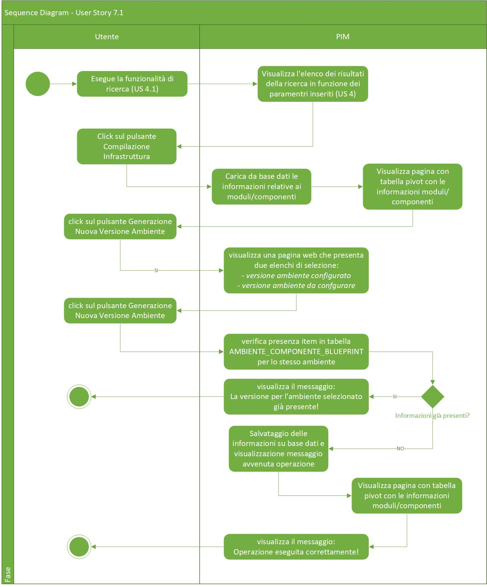
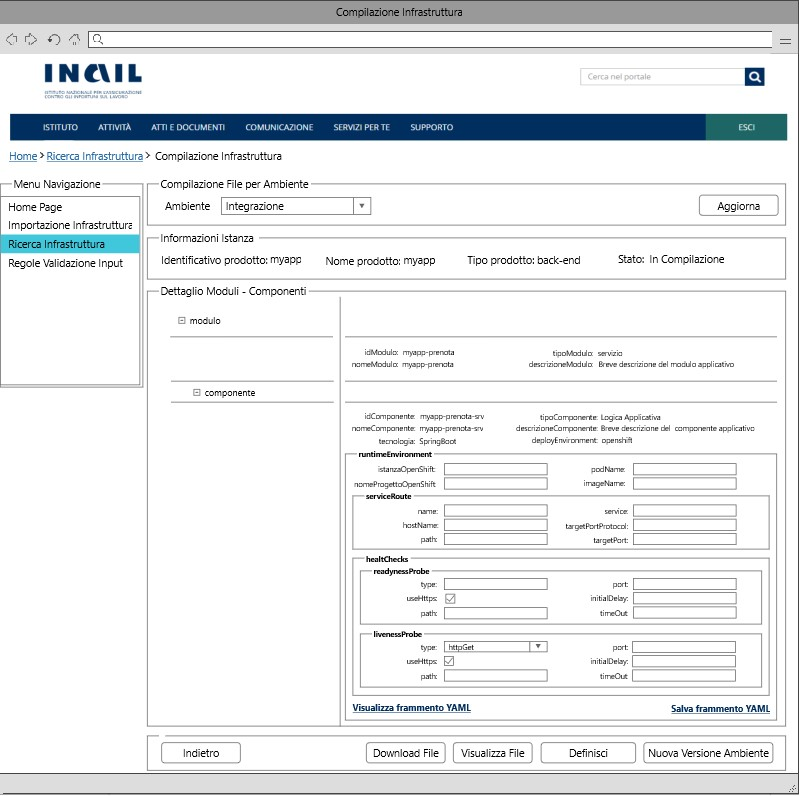
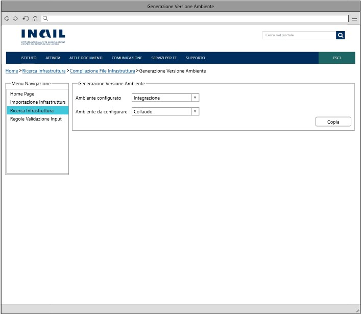

# User Story - Id 7.1 - Compilazione Infrastruttura di prodotto - Generazione Versione - Ambiente

## Descrizione

**N.B: La corrente USER STORY è analoga a quella proposta nella FASE1, opportunamente rivista per adattarsi alla nuova terminologia e alle nuove funzionalità proposte nella FASE2.**

- COME: utente con ruolo OPS o con ruolo ADMIN

- DEVO POTER: eseguire la funzionalità di compilazione delle configurazioni dei componenti definiti nel file dell'infrastruttura di prodotto per uno specifico ambiente.
  1. Accedo alla funzionalità di Ricerca Infrastruttura di prodotto [(US 4.1)](us_4.1_ricerca_infrastruttura.md) ed eseguo la funzionalità di ricerca.
  2. Il sistema visualizza l'elenco dei risultati della ricerca in funzione dei paramentri inseriti [(US 4.1)](us_4.1_ricerca_infrastruttura.md)  [(UI 7.1.1)](#user-interface)
  3. Identifico l'item di interesse dai risultati della ricerca e clicco su apposito pulsante *Visualizza Dettaglio*. 
     Il pulsante è visibile solo per istanze di blueprint importate in stato *Da Compilare*, *In Compilazione*
  4. Il sistema visualizza una nuova pagina che presenta in una tabella pivot le informazioni associate all'infrastruttura e contenute nelle tabelle MODULO_BLUEPRINT, COMPONENTE_BLUEPRINT, AMBIENTE_COMPONENTE_BLUEPRINT per l'ambiente di Integrazione ed in un elenco di selezione i 4 valori previsti per gli ambienti (Integrazione, Collaudo, Certificazione, Esercizio). [(UI 7.1.2)](#user-interface)
  5. Clicco sul pulsante Genera Nuova Versione Ambiente
  6. Il sistema visualizza una pagina web che presenta due elenchi di selezione [(UI 7.1.3)](#user-interface): 
     Uno è quello relativo alle *versione ambiente configurato*  in archivio per l'infrastruttura di prodotto corrente in lavorazione. 
     L'altro è quello relativo alla *versione ambiente da confgurare* che si vuole creare, prelevando le occorrenze dalla tabella ANAGRAFICA_AMBIENTE_ISTANZA_BLUEPRINT.  
  7. Seleziono un item dall'elenco delle versioni-ambiente già presenti in archivio (es. Integrazione)
  8. Seleziono un item dall'elenco delle versioni-ambiente target (es. Collaudo)
  9. Clicco sul pulsante Genera Nuova Versione Ambiente
  10. Se *sono* già presenti item nella tabella AMBIENTE_COMPONENTE_BLUEPRINT per lo stesso ambiente 
    11.1. Il sistema produce il messaggio: "La versione per l'ambiente selezionato già presente!"
  11. Se *non sono* già presenti item nella tabella per lo stesso ambiente 
   11.1. Il sistema esegue la copia dei frammenti YAML delle configurazioni già presenti in archivio in tabella AMBIENTE_COMPONENTE_BLUEPRINT per la versione-ambiente selezionata e le inserisce in tabella AMBIENTE_COMPONENTE_BLUEPRINT come nuova versione-ambiente per l'ambiente target indicato. 
   11.2. Il sistema visualizza la pagina web che presenta la tabella pivot con le informazioni associate appena inserite in archivio e contenute nelle tabelle MODULO_BLUEPRINT, COMPONENTE_BLUEPRINT, AMBIENTE_COMPONENTE_BLUEPRINT per l'ambiente target indicato durante la generazione della versione-ambiente. [(UI 7.1.2)](#user-interface) 
   11.3. Il sistema produce il messaggio: Operazione eseguita correttamente! 
 
- AL FINE DI: poter definire gli item di configurazione dei componenti definiti nel file dell'infrastruttura di prodotto per uno specifico ambiente.

 

## Riferimenti

Di seguito i riferimenti e/o collegamenti ad altre US citate in questa

### [User Story - Id 4.1 - Ricerca Infrastruttura](us_4.1_ricerca_infrastruttura.md)
### [[User Story - Id 6 - Compilazione Istanza di Blueprint](user_stories/us_6_compilazione_istanza_blueprint.md)](us_6.1_compilazione_infrastruttura_fisica_di_prodotto.md)

## Criteri di accettazione

- DATO: un opportuno file YAML

- QUANDO: l'utente OPS o ADMIN deve importare il file di una infrastruttura di prodotto associata

- QUINDI: il sistema deve permettere:
  - la compilazione delle configurazioni dei componenti definiti nel file dell'infrastruttura di prodotto per uno specifico ambiente
  - al termine delle operazioni di compilazione il sistema dovrà aver inserito almeno una occorrenza nelle seguenti tabelle: AMBIENTE_COMPONENTE_BLUEPRINT

 

## Controlli e vincoli

La funzionalità è utilizzabile, per cui il pulsante è visibile, solo per infrastrutture di prodotto importate in stato *Da Compilare*, *In Compilazione*

Di seguito è riportata l'attuale tipologia di componenti previsti e l'indicazione delle casistiche in scope all'applicazione.
 
Per tali casisitiche dovrà essere prevista la possibilità di eseguire la compilazione delle configurazione del componente da parte dell'utente.
 

| Tipo Componente        | Tecnologia   |  
-----------------------  | -------------|
| Logica Applicativa BE  | springboot   |
| Logica Applicativa BE  | nodejs       |
| Logica Applicativa BE  | dotnet       |
| SPA                    | angular      |
| CDN                    | js-css-html  |
| Api Sincrone           | openapi3     |
| Code Request Esterna   | amq          |  
| Evento Esterno Pub     | amq          |
| Evento Esterno Sub     | amq          |
| Dati SQL               | oracle       |
| Dati SQL               | sqlserver    |
| Dati SQL               | db2luw       |
| Dati SQL               | postgresql   |
| Dati NoSQL             | mongodb      |

 
 

## Trigger

Esigenza di compilazione delle configurazioni dei componenti definiti nel file dell'infrastruttura di prodotto per uno specifico ambiente

## Pre-Requisiti

L'utente ha eseguito l'accesso autenticandosi sul portale intranet

## Data Model

Di seguito è descritta la porzione di modello dati a cui fa riferimento la funzionalità illustrata nella user story.  
La lettura dei dati per la visualizzazione della tabella pivot viene eseguita accedendo in lettura alle tabelle ISTANZA_BLUEPRINT MODULO_BLUEPRINT, COMPONENTE_BLUEPRINT, AMBIENTE_COMPONENTE_BLUEPRINT  
La lettura dei dati per il caricamento dell'elenco di selezione relativo all'ambiente target viene eseguita accedendo alla tabella ANAGRAFICA_AMBIENTE_ISTANZA_BLUEPRINT
Al termine delle operazioni di compilazione il sistema dovrà aver inserito almeno una occorrenza nelle seguenti tabelle: AMBIENTE_COMPONENTE_BLUEPRINT

 
 

### Tabella ANAGRAFICA_AMBIENTE_ISTANZA_BLUEPRINT

|    Attributo               |   Tipo    | Descrizione                                                                                  |
|  ----------------------    |  -------  | -------------------------------------------------------------------------------------------  | 
|   COD_AMBIENTE             |    INT    | Codice alfanumerico che idenfica l'ambiente                                                  |
|   DESCRIZIONE_AMBIENTE     |  VARCHAR  | Descrizione dell'ambiente di riferimento                                                     |
|   PRIORITY                 |  NUMBER   | Priorità/ordine da assegnare agli ambienti |

 
* I valori previsti in tabella sono quelli relativi agli ambienti previsti per le infrastrutture di prodotto, di seguito sono elencati il codice e la descrizione
  (CI - Integrazione, COLL - Collaudo, CERT - Certificazione, PROD - Produzione)

 
 

### Tabella MODULO_BLUEPRINT:

|    Attributo              |   Tipo    | Descrizione                                                                                 |
|  ----------------------   |  -------  | ------------------------------------------------------------------------------------------- | 
|   ID_MODULO               |    INT    | Identificativo autogenerato                                                                 |
|   ID_ISTANZA              |    INT    | Identificativo dell'occorrenza ISTANZA_BLUEPRINT a cui lo fa riferimento (chiave esterna ISTANZA_BLUEPRINT)   |
|   ID_MODULO_BP            |  VARCHAR  | Valore dell'attributo *idModulo* presente nell'infrastruttura |
|   NOME_MODULO             |  VARCHAR  | Valore dell'attributo *nomeModulo* presente nell'infrastruttura |
|   TIPO_MODULO             |  VARCHAR  | Valore dell'attributo *tipoModulo* presente nell'infrastruttura |
|   VERSIONE_MODULO         |  VARCHAR  | Versione modulo  |
|   PATTERN                 |  VARCHAR  | Valore dell'attributo *pattern* presente nell'infrastruttura di prodotto importata, fornita in input durante l'importazione |
|   DESCRIZIONE_MODULO      |  VARCHAR  | Valore dell'attributo *descrizioneModulo* presente nell'infrastruttura|

 
 

### Tabella COMPONENTE_BLUEPRINT:

|    Attributo               |   Tipo    | Descrizione                                                                                 |
|  ----------------------    |  -------  | ------------------------------------------------------------------------------------------- | 
|   ID_COMPONENTE            |    INT    | Identificativo autogenerato                                                                 |
|   ID_MODULO                |    INT    | Identificativo dell'occorrenza MODULO_BLUEPRINT a cui lo fa riferimento (chiave esterna MODULO_BLUEPRINT)   |
|   ID_COMPONENTE_BP         |  VARCHAR  | Valore dell'attributo *idComponente* presente nell'infrastruttura |
|   NOME_COMPONENTE          |  VARCHAR  | Valore dell'attributo *nomeComponente* presente nell'infrastruttura |
|   TIPO_COMPONENTE          |  VARCHAR  | Valore dell'attributo *tipoComponente* presente nell'infrastruttura |
|   DESCRIZIONE_COMPONENTE   |  VARCHAR  | Valore dell'attributo *descrizioneComponente* presente nell'infrastruttura |
|   DEPLOY_ENVIRONMENT       |  VARCHAR  | Valore dell'attributo *deployEnvironment* presente nell'infrastruttura|
|   CONFIG_REPO_GIT          |  VARCHAR  | Valore dell'attributo *config-repoGit* presente nell'infrastruttura  |
|   LAYER                    |  VARCHAR  | Valore dell'attributo *layer* presente nell'infrastruttura  |
|   REPO_GIT                 |  VARCHAR  | Valore del path/url del repository git dove presente il file archiviato, generata a partire da un base path url/*idProdotto* / configurazione-prodotto.git  |
|   STATO                    |  VARCHAR  | /  |
|   TECNOLOGIA               |  VARCHAR  | Tecnologia associata al componente infrastrutturale  |
|   VERSIONE_COMPONENTE      |  VARCHAR  | Valore dell'attributo *versioneComponente* presente nell'infrastruttura |
|   VERSIONE_CONFIG          |  VARCHAR  | Valore dell'attributo *versioneConfig* presente nell'infrastruttura  |

 
 

### AMBIENTE_COMPONENTE_BLUEPRINT 

|    Attributo                |   Tipo    | Descrizione                                                                                 |
|  ----------------------     |  -------  | ------------------------------------------------------------------------------------------- | 
|   ID_AMBIENTE_COMPONENTE    |    INT    | Identificativo autogenerato                                                                 |
|   ID_COMPONENTE             |    INT    | Identificativo dell'occorrenza COMPONENTE_BLUEPRINT a cui lo fa riferimento (chiave esterna COMPONENTE_BLUEPRINT)   |
|   COD_AMBIENTE                  |  VARCHAR  | Valore dell'ambiente per cui è destinato il frammento di configurazione del componente (Integrazione | Collaudo | Certificazione | Esercizio) |
|   YAML_OPS_BLUEPRINT_TARGET |  VARCHAR  | Frammento YAML di configurazione del componente dell'infrastruttura di prodotto |
|   DATA_CREAZIONE            | TIMESTAMP | Data di creazione dell'occorrenza in tabella                                                |
|   UTENTE_CREAZIONE          |  VARCHAR  | Utente applicativo che ha eseguito la creazione dell'occorrenza in tabella                  |
|   DATA_ULTIMA_MODIFICA      | TIMESTAMP | Data di ultimo aggiornamento dell'occorrenza in tabella                                     |         
|   UTENTE_ULTIMA_MODIFICA    |  VARCHAR  | Utente applicativo che ha eseguito l'ultimo aggiornamento dell'occorrenza in tabella        |

 
 

## Diagrammi

Di seguito il sequence diagram che illustra le azioni previste dalla User Story
 

 

[Download file visio del sequence diagram della user story ](../files/sequence_diagram_us_7.1.vsdx)

## User Interface Mockup

- UI 7.1.1

 
 

- UI 7.1.2

 
 

- UI 7.1.3

