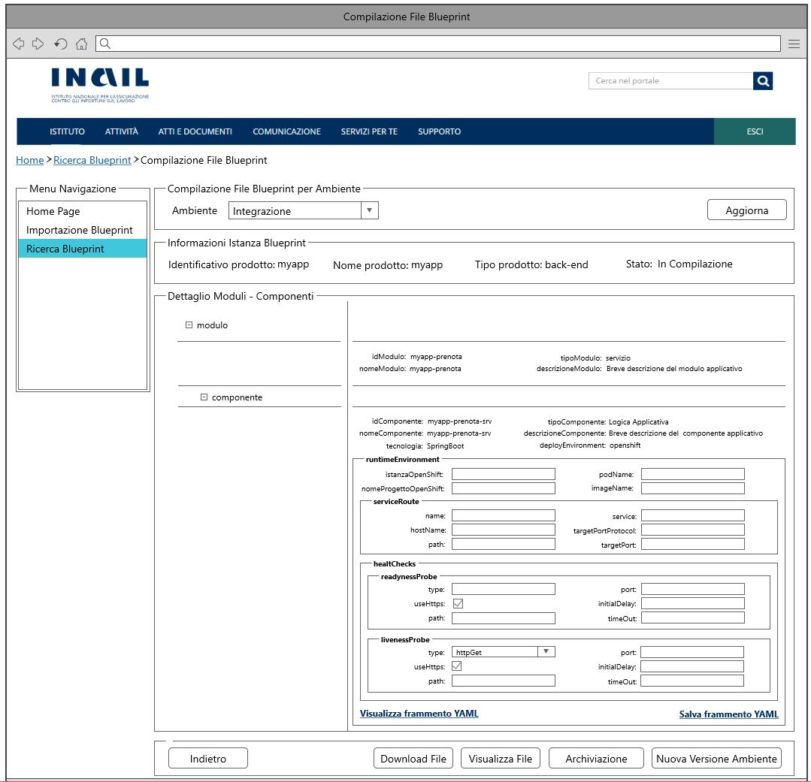
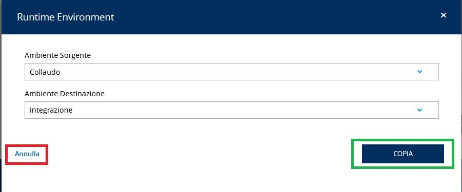

# User Story - Id 7 - Compilazione Istanza Blueprint - Generazione Versione - Ambiente

## Descrizione

- COME: utente con ruolo OPS o con ruolo ADMIN

- DEVO POTER: eseguire la funzionalità di compilazione delle configurazioni dei componenti definiti nel file dell'istanza di blueprint per uno specifico ambiente.
  1. Accedo alla funzionalità di Ricerca Istanza Blueprint [(US 4)](us_4_ricerca_istanza_blueprint.md) ed eseguo la funzionalità di ricerca per identificare l'evento di censimento asset oppure l'identificativo del prodotto/asset RTC di cui eseguire l'importazione del file dal repository Git.
  2. Il sistema esegue la funzionalità di ricerca in archivio [(US 4)](us_4_ricerca_istanza_blueprint.md)
  3. Il sistema visualizza l'elenco dei risultati della ricerca in funzione dei paramentri inseriti [(US 4)](us_4_ricerca_istanza_blueprint.md) [(UI 7.1)](#user-interface)
  4. Identifico l'item di interesse dai risultati della ricerca e clicco su apposito pulsante Compilazione. 
     Il pulsante è visibile solo per istanze di blueprint importate in stato *Da Compilare*, *In Compilazione*
  5. Il sistema visualizza una nuova pagina che presenta in una tabella pivot le informazioni associate all'istanza e contenute nelle tabelle MODULO_BLUEPRINT, COMPONENTE_BLUEPRINT, AMBIENTE_COMPONENTE_BLUEPRINT per l'ambiente di Integrazione ed in un elenco di selezione i 4 valori previsti per gli ambienti (Integrazione, Collaudo, Certificazione, Esercizio). [(UI 7.2)](#user-interface)
  6. Clicco sul pulsante Genera Nuova Versione Ambiente
  7. Il sistema visualizza una pagina web che presenta due elenchi di selezione [(UI 7.3)](#user-interface): 
     Uno è quello relativo alle *versione ambiente configurato*  in archivio per l'istanza di blueprint corrente in lavorazione. 
     L'altro è quello relativo alla *versione ambiente da confgurare* che si vuole creare, prelevando le occorrenze dalla tabella ANAGRAFICA_AMBIENTE_ISTANZA_BLUEPRINT. 
  8. Seleziono un item dall'elenco delle versioni-ambiente già presenti in archivio (es. Integrazione)
  9. Seleziono un item dall'elenco delle versioni-ambiente target (es. Collaudo)
  10. Clicco sul pulsante Genera Nuova Versione Ambiente
  11. Se *sono* già presenti item nella tabella AMBIENTE_COMPONENTE_BLUEPRINT per lo stesso ambiente 
    11.1. Il sistema produce il messaggio: "La versione per l'ambiente selezionato già presente!"
  12. Se *non sono* già presenti item nella tabella per lo stesso ambiente 
   12.1. Il sistema esegue la copia dei frammenti YAML delle configurazioni già presenti in archivio in tabella AMBIENTE_COMPONENTE_BLUEPRINT per la versione-ambiente selezionata e le inserisce in tabella AMBIENTE_COMPONENTE_BLUEPRINT come nuova versione-ambiente per l'ambiente target indicato. 
   12.2. Il sistema visualizza la pagina web che presenta la tabella pivot con le informazioni associate appena inserite in archivio e contenute nelle tabelle MODULO_BLUEPRINT, COMPONENTE_BLUEPRINT, AMBIENTE_COMPONENTE_BLUEPRINT per l'ambiente target indicato durante la generazione della versione-ambiente. [(UI 7.2)](#user-interface) 
   12.3. Il sistema produce il messaggio: Operazione eseguita correttamente! 
 
- AL FINE DI: poter definire gli item di configurazione dei componenti definiti nel file dell'istanza di blueprint per uno specifico ambiente.

 

## Riferimenti

Di seguito i riferimenti e/o collegamenti ad altre US citate in questa

### [User Story - Id 4 - Ricerca Istanza Blueprint](us_4_ricerca_istanza_blueprint.md)
### [User Story - Id 6 - Compilazione Istanza di Blueprint](user_stories/us_6_compilazione_istanza_blueprint.md)

## Criteri di accettazione

- DATO: un codice evento di censimento asset oppure ad un identificativo del prodotto/asset RTC

- QUANDO: l'utente OPS o ADMIN deve importare il file di una istanza di blueprint associata 

- QUINDI: il sistema deve permettere:
  - la compilazione delle configurazioni dei componenti definiti nel file dell'istanza di blueprint per uno specifico ambiente
  - al termine delle operazioni di compilazione il sistema dovrà aver inserito almeno una occorrenza nelle seguenti tabelle: AMBIENTE_COMPONENTE_BLUEPRINT

 

## Controlli e vincoli

La funzionalità è utilizzabile, per cui il pulsante è visibile, solo per istanze di blueprint importate in stato *Da Compilare*, *In Compilazione*

Di seguito è riportata l'attuale tipologia di componenti previsti per i template di bleuprint e l'indicazione delle casistiche in scope all'applicazione.
 
Per tali casisitiche dovrà essere prevista la opssibilità di eseguire la compilazione delle configurazione del componente da parte dell'utente.
 

|    Tipo Componente       |   Tecnologia    | Deploy Environemt     |  In Scope  |  Riferimento                   |
|  ----------------------  |  -------------  | --------------------  |  --------  |  ----------------------------- |
|   Logica Applicativa     |   Spring-Boot   | openshift             |     SI     |                                | 
|   Logica Applicativa     |   NodeJS        | openshift             |     NO     |                                |           
|   Logica Applicativa     |   DotNet        | openshift             |     NO     |                                |
|   Logica Applicativa     |   Angular       | Apache                |     SI     |                                |
|   Api sincrone           |   OpenApi3      | apigateway            |     SI     |                                |
|   Code request           |   AMQ           | broker                |     SI     |                                | 
|   DatiSQL                |   Oracle        | sql                   |     NO     |                                | 
|   DatiSQL                |   SQL Serve     | sql                   |     NO     |                                | 
|   DatiSQL                |   DB2 Luw       | sql                   |     NO     |                                | 
|   DatiSQL                |   Postgresql    | sql                   |     NO     |                                | 
|   DatiNoSQL              |   MongoDB       | nosql                 |     NO     |                                | 

                         
 

## Trigger

Esigenza di compilazione delle configurazioni dei componenti definiti nel file dell'istanza di blueprint per uno specifico ambiente

## Pre-Requisiti

L'utente ha eseguito l'accesso autenticandosi sul portale intranet

## Data Model

Di seguito è descritta la porzione di modello dati a cui fa riferimento la funzionalità illustrata nella user story.  
La lettura dei dati per la visualizzazione della tabella pivot viene eseguita accedendo in lettura alle tabelle ISTANZA_BLUEPRINT MODULO_BLUEPRINT, COMPONENTE_BLUEPRINT, AMBIENTE_COMPONENTE_BLUEPRINT  
La lettura dei dati per il caricamento dell'elenco di selezione relativo all'ambiente target viene eseguita accedendo alla tabella ANAGRAFICA_AMBIENTE_ISTANZA_BLUEPRINT
Al termine delle operazioni di compilazione il sistema dovrà aver inserito almeno una occorrenza nelle seguenti tabelle: AMBIENTE_COMPONENTE_BLUEPRINT

 
 

### Tabella ANAGRAFICA_AMBIENTE_ISTANZA_BLUEPRINT

|    Attributo               |   Tipo    | Descrizione                                                                                  |
|  ----------------------    |  -------  | -------------------------------------------------------------------------------------------  | 
|   ID_AMBIENTE              |    INT    | Identificativo                                                                               |
|   COD_AMBIENTE             |    INT    | Codice alfanumerico che idenfica l'ambiente                                                  |
|   DESCRIZIONE_AMBIENTE     |  VARCHAR  | Descrizione dell'ambiente di riferimento                                                     |

 
* I valori previsti in tabella sono quelli relativi agli ambienti previsti per le istanze di blueprint, di seguito sono elencati il codice e la descrizione
  (ci - Integrazione, coll - Collaudo, cert - Certificazione, prod - Produzione)

 
 

- Tabella MODULO_BLUEPRINT

|    Attributo               |   Tipo    | Descrizione                                                                                 |
|  ----------------------    |  -------  | ------------------------------------------------------------------------------------------- | 
|   ID_MODULO                |    INT    | Identificativo autogenerato                                                                 |
|   ID_ISTANZA               |    INT    | Identificativo dell'occorrenza ISTANZA_BLUEPRINT a cui lo fa riferimento (chiave esterna ISTANZA_BLUEPRINT)   |
|   ID_MODULO_BP             |  VARCHAR  | Valore dell'attributo *idModulo* presente nella blueprint |
|   NOME_MODULO              |  VARCHAR  | Valore dell'attributo *nomeModulo* presente nella blueprint |
|   TIPO_MODULO              |  VARCHAR  | Valore dell'attributo *tipoModulo* presente nella blueprint |
|   DESCRIZIONER_MODULO      |  VARCHAR  | Valore dell'attributo *descrizioneModulo* presente nella blueprint |

 
 

- Tabella COMPONENTE_BLUEPRINT

|    Attributo               |   Tipo    | Descrizione                                                                                 |
|  ----------------------    |  -------  | ------------------------------------------------------------------------------------------- | 
|   ID_COMPONENTE            |    INT    | Identificativo autogenerato                                                                 |
|   ID_MODULO                |    INT    | Identificativo dell'occorrenza MODULO_BLUEPRINT a cui lo fa riferimento (chiave esterna MODULO_BLUEPRINT)   |
|   ID_COMPONENTE_BP         |  VARCHAR  | Valore dell'attributo *idComponente* presente nella blueprint |
|   NOME_COMPONENTE          |  VARCHAR  | Valore dell'attributo *nomeComponente* presente nella blueprint |
|   TIPO_COMPONENTE          |  VARCHAR  | Valore dell'attributo *tipoComponente* presente nella blueprint |
|   DESCRIZIONER_COMPONENTE  |  VARCHAR  | Valore dell'attributo *descrizioneComponente* presente nella blueprint |
|   TECNOLOGIA               |  VARCHAR  | Valore dell'attributo *tecnologia* presente nella blueprint |
|   DEPLOY_ENVIRONMENT       |  VARCHAR  | Valore dell'attributo *deployEnvironment* presente nella blueprint |
|   RUNTIME_ENVIRONMENT      |  VARCHAR  | Valore dell'attributo *runtimeEnvironment* presente nella blueprint |

 
 

- AMBIENTE_COMPONENTE_BLUEPRINT 

|    Attributo                |   Tipo    | Descrizione                                                                                 |
|  ----------------------     |  -------  | ------------------------------------------------------------------------------------------- | 
|   ID_AMBIENTE_COMPONENTE    |    INT    | Identificativo autogenerato                                                                 |
|   ID_COMPONENTE             |    INT    | Identificativo dell'occorrenza COMPONENTE_BLUEPRINT a cui lo fa riferimento (chiave esterna COMPONENTE_BLUEPRINT)   |
|   AMBIENTE                  |  VARCHAR  | Valore dell'ambiente per cui è destinato il frammento di configurazione del componente della blueprint (Integrazione | Collaudo | Certificazione | Esercizio) |
|   YAML_OPS_BLUEPRINT_TARGET |  VARCHAR  | Frammento YAML di configurazione del componente della blueprint |
|   DATA_CREAZIONE            | TIMESTAMP | Data di creazione dell'occorrenza in tabella                                                |
|   UTENTE_CREAZIONE          |  VARCHAR  | Utente applicativo che ha eseguito la creazione dell'occorrenza in tabella                  |
|   DATA_ULTIMA_MODIFICA      | TIMESTAMP | Data di ultimo aggiornamento dell'occorrenza in tabella                                     |         
|   UTENTE_ULTIMA_MODIFICA    |  VARCHAR  | Utente applicativo che ha eseguito l'ultimo aggiornamento dell'occorrenza in tabella        |

 
 

## Diagrammi

Di seguito il sequence diagram che illustra le azioni previste dalla User Story
 

 

[Download file visio del sequence diagram della user story ](../files/sequence_diagram_us_7.vsdx)

## User Interface Mockup

- UI 7.1

 
 

- UI 7.2

 
 

- UI 7.3

 
 

## Interfaccia Applicativa con Correlazione Chiamate ai Metodi Corrispondenti

Di seguito è riportata l'interfaccia applicativa (screen) Compilazione Istanza Blueprint Gen Versione di PIM prodotta nella FASE1 con conseguente correlazione alla chiamata al metodo della specifica funzionalità evidenziata, al fine di agevolare lo sviluppo della FASE2.

Per la "Compilazione Istanza Blueprint Gen Versione", oggetto della corrente US, dopo aver correttamente compilato le informazioni inerenti a uno specifico ambiente (Integrazione/Collaudo/Certificazione/Produzione), è possibile effettuare la copia delle stesse informazioni su altro ambiente.

Per farlo è necessario cliccare sul GREY BOX "Copia Ambiente" (FRONT-END) che genera a sua volta una schermata con due ComboBox al fine di selezionare  l'ambiente sorgente (quello da cui andremo a prelevare le informazioni da copiare) e l' ambiente di destinazione (quello in cui andremo ad immettere le informazioni copiate). La finestra mostra inoltre due buttons: 

- RED BOX "Annulla" per chiudere la finestra (FRONT_END). 
- GREEN BOX "Copia" per confermare la copia con conseguente chiamata al metodo PUT copiaAmbiente.

 
 

Nella tabella in basso, viene mostrato un riepilogo con relativa chiamata al metodo di tutti i buttons presentati in queste interfacce con relativo PATH: 

|Colore di riferimento|Pulsante Definito nell'Applicativo  |Tipologia Chiamata  |Nome chiamata | Path |Note|
|---------|---------|---------|---------|---------|---------|
|PURPLE|Archiviazione|/ |/ |/ |vedi [User Story - Id 8 - Archviazione Istanza Blueprint](us_8_archiviazione_istanza_blueprint.md)|
|ROSE|YAML|/ |/ |/ |vedi [User Story - Id 6 - Compilazione Istanza Blueprint](us_6_compilazione_istanza_blueprint.md)|
|GREY|Copia Ambiente| | | |FRONT-END |
|RED|Annulla| | | |FRONT-END |
|GREEN|Copia|PUT |dismetti |{{baseUrl}}/pim-api/blueprint/:id/copiaAmbiente |/|