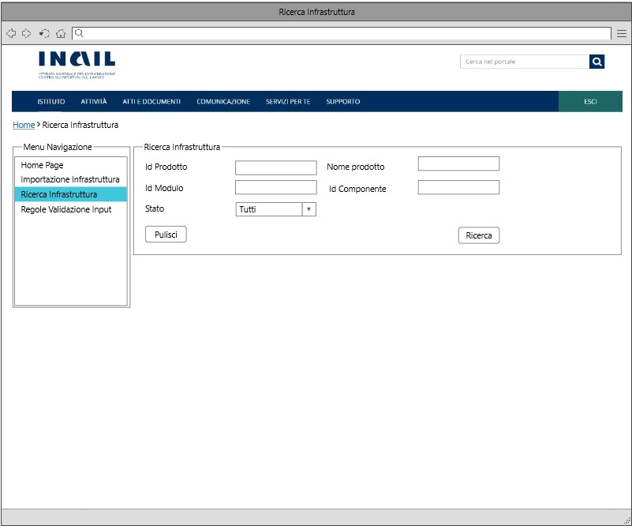

# User Story - Id 8.1 - Definizione Infrastruttura Prodotto

## Descrizione

**N.B: La corrente USER STORY è analoga a quella proposta nella FASE1, opportunamente rivista per adattarsi alla nuova terminologia e alle nuove funzionalità proposte nella FASE2.**

- COME: utente con ruolo OPS o con ruolo ADMIN

- DEVO POTER: eseguire la funzionalità di compilazione delle configurazioni dei componenti definiti nel file dell'infrastruttura di prodotto per uno specifico ambiente.
  1. Accedo alla funzionalità di Ricerca Infrastruttura [(US 4.1)](us_4.1_ricerca_infrastruttura.md) ed eseguo la funzionalità di ricerca [(UI 8.1.1)](#user-interface)
  2. Il sistema esegue la funzionalità di ricerca in archivio [(US 4.1)](us_4.1_ricerca_infrastruttura.md)
  3. Il sistema visualizza l'elenco dei risultati della ricerca in funzione dei paramentri inseriti [(US 4.1)](us_4.1_ricerca_infrastruttura.md)[(UI 8.1.2)](#user-interface)
  4. Identifico l'item di interesse dai risultati della ricerca: 
    4.1. clicco su apposito pulsante *Dettaglio* per una istanza in stato *In Compilazione* [(UI 8.1.3)](#user-interface)  
    4.2. il sistema esegue la [US 6.1](us_6.1_compilazione_infrastruttura_fisica_di_prodotto.md)  
  5. Sulla pagina visualizzata, clicco il pulsante *Definisci*, visibile solo se lo stato dell'infrastruttura è in stato *In Compilazione*.
  6. Il sistema:  
    6.1. Recupera le informazioni dei frammenti YAML (YAML_OPS_BLUEPRINT_TARGET) dalle occorrenze di AMBIENTE_COMPONENTE_BLUEPRINT associate all'infrastruttura di prodotto 
    6.2. Recupera il file originale (FILE_BLUEPRINT_ORIG) associato all'occorrenza dell'infrastruttura di prodotto presente in tabella ISTANZA_BLUEPRINT 
    6.3. Genera il nuovo file di infrastruttura introducendo in una copia del file originale tutti i frammenti YAML delle sezioni *runtimeEnvironment* dei componenti presenti in tabella AMBIENTE_COMPONENTE_BLUEPRINT. 
    6.4. Salva il nuovo file generato (FILE_BLUEPRINT_TARGET) in tabella ISTANZA_BLUEPRINT 
    6.5. Esegue l'operazione di *git clone* del repository (URL_REPOSITORY_GIT) 
    6.6. Esegue l'operazione di *git check-out* del branch (NOME_BRANCH_GIT) indicati in tabella ISTANZA_BLUEPRINT 
    6.7. Esegue l'operazione di *git commit* e *git push* del file compilato (FILE_BLUEPRINT_TARGET) sul repository Git. 
    6.8. Cambia lo stato dell'istanza inserendo una nuova occorrenza nella tabella STATO_ISTANZA_BLUEPRINT con stato *Definita* 
        Il dettaglio delle informazioni che il sistema deve persistere è stato modellato sulla struttura prevista del template delle infrastrutture e descritto nella sezione [Data Model della US](#data-model) 
    6.9. Applica un opportuna versione del *tagGit* al fine di identificare la corretta versione del file di infrastruttura che si sta definenendo associato all'ambiente di riferimento:    
          6.9.1. Per poter applicare la strategia di tag prevista nelle tabelle in basso ([Definizione TAG GIT (Esempio)](#definizione-tag-git-esempio)) è necessario tenere traccia del valore della quarta cifra numerica (1.0.0.N) che dovrà essere incrementata di 1 ad ogni operazione di definizione del file con contenuto parziale o completo eseguita dall'utente. (Il tutto viene stabilito attraverso l'attributo "Disponibilità", specificata all'interno di ogni componente, che deve essere valorizzata a true; se il componente è disponibile, a seguito di una definizione avverrà un incremento della quarta cifra)  
          6.9.2. Sarà necessario tenere traccia conseguentemente anche dell'ambiente di riferimento associato (ci/coll/prod/cert).  
          6.9.3. Infine, il sistema genera delle occorrenze nella tabella (ISTANZA BLUEPRINT - tagGit CI/COLL/CERT/PROD) ogni qualvolta il file di infrastruttura viene definito (parziale o completo) per lo specifico ambiente di riferimento.  
          6.9.4. Il sistema crea anche una nuova occorrenza nella tabella (ISTANZA BLUEPRINT - Tag Git) valorizzato con l'ultimo Tag Git generato dal sistema, al fine di riutilizzarlo come Tag di partenza in caso di ricompilazione.   
  7.  Il sistema visualizza il messaggio: "Operazione eseguita correttamente!" 
- AL FINE DI: archiviare il file associato all'occorrenza dell'infrastruttura di prodotto compilata (FILE_BLUEPRINT_TARGET) sul sistema SCM.

### Definizione TAG GIT (Esempio)

Tag Iniziale: 1.0.0-draft

**Ambiente CI (Continuos Integration):** 

|Versione                                    |Tag Associato      |
|---------                                   |---------          |
|1° Definizione Parziale                     |1.0.0.1-ci-draft   |
|2° Definizione Parziale                     |1.0.0.2-ci-draft   |
|3° Definizione Parziale                     |1.0.0.3-ci-draft   |
|n-esima Definizione Parziale                |1.0.0.n-ci-draft   |
|1° Definizione Definitiva                   |1.0.0.1-ci         |
|2° Definizione Definitiva                   |1.0.0.2-ci         |
|3° Definizione Definitiva                   |1.0.0.3-ci         |
|n-esima Definizione Definitiva              |1.0.0.n-ci         |

**Ambiente COLL (Collaudo):** 

|Versione   |Tag Associato   |
|---------|---------|
|1° Definizione Parziale     |1.0.0.1-coll-draft         |
|2° Definizione Parziale     |1.0.0.2-coll-draft         |
|3° Definizione Parziale     |1.0.0.3-coll-draft         |
|n-esima Definizione Parziale|1.0.0.n-coll-draft         |
|1° Definizione Definitiva   |1.0.0.1-coll               |
|2° Definizione Definitiva   |1.0.0.2-coll               |
|3° Definizione Definitiva   |1.0.0.3-coll               |
|n-esima Definizione Definitiva   |1.0.0.n-coll               |

**Ambiente CERT (Certificazione):** 

|Versione               |Tag Associato   |
|---------              |---------|
|1° Definizione Parziale     |1.0.0.1-cert-draft         |
|2° Definizione Parziale     |1.0.0.2-cert-draft         |
|3° Definizione Parziale     |1.0.0.3-cert-draft         |
|n-esima Definizione Parziale|1.0.0.n-cert-draft         |
|1° Definizione Definitiva      |1.0.0.1-cert           |
|2° Definizione Definitiva      |1.0.0.2-cert           |
|3° Definizione Definitiva      |1.0.0.3-cert           |
|n-esima Definizione Definitiva      |1.0.0.n-cert           |

**Ambiente PROD (Produzione):** 

|Versione   |Tag Associato   |
|---------|---------|
|1° Definizione Parziale     |1.0.0.1-prod-draft         |
|2° Definizione Parziale     |1.0.0.2-prod-draft         |
|3° Definizione Parziale     |1.0.0.3-prod-draft         |
|n-esima Definizione Parziale|1.0.0.n-prod-draft         |
|1° Definizione Definitiva      |1.0.0.1-prod         |
|2° Definizione Definitiva      |1.0.0.1-prod         |
|3° Definizione Definitiva      |1.0.0.3-prod         |
|n-esima Definizione Definitiva |1.0.0.n-prod         |

**N.B: La gestione parziale o definitiva è demandata alla valorizzazione della checkbox ("Disponibilità" = true) nella sezione di compilazione di ciascun componente per ogni ambiente [(US 6.1)](us_6.1_compilazione_infrastruttura_fisica_di_prodotto.md); se non tutti i componenti vengono resi disponibili si fa riferimento ad una compilazione parziale, viceversa se tutti i componenti vengono resi disponibili si fa riferimento ad una compilazione definitiva. In entrambi i casi (compilazione parziale o definitiva) sarà sempre possibile riprocedere alla compilazione e alla successiva ridefinizione con opportuno incremento del Tag Git come riportato nelle tabelle dei rispettivi ambienti.**

*Le ultime versioni definitive (per ogni ambiente) saranno quelle presentate con il Tag Git con il valore della quarta cifra più alto: (1.0.0.n-ci - 1.0.0.n-coll - 1.0.0.n-cert - 1.0.0.n-prod ).*
    
## Riferimenti

Di seguito i riferimenti e/o collegamenti ad altre US citate in questa

### [User Story - Id 4.1 - Ricerca Infrastruttura](us_4.1_ricerca_infrastruttura.md)
### [User Story - Id 6.1 - Compilazione Infrastruttura fisica di prodotto](us_6.1_compilazione_infrastruttura_fisica_di_prodotto.md)

## Criteri di accettazione

- DATO: un opportuno file YAML

- QUANDO: l'utente OPS o ADMIN ha ultimato la compilazione delle informazioni per tutti gli ambienti previsti e deve definire il file di una infrastruttura di prodotto generato ed in archivio sul sistema SCM Git.

- QUINDI:
  - Il sistema deve permettere di definire il file associato all'occorrenza dell'infrastruttura di prodotto compilata (FILE_BLUEPRINT_TARGET) sul sistema SCM Git
  - Al termine delle operazioni il sistema dovrà aver inserito una occorrenza nelle seguenti tabelle: STATO_ISTANZA_BLUEPRINT  

 

## Controlli e vincoli

Al momento sono previsti i seguenti controlli/vincoli:
- Il passaggio di stato a *Definita* pùo essere eseguito solo per le istanze in stato *In Compilazione*

## Trigger

Esigenza di finalizzare la compilazione delle configurazioni dei componenti definiti nel file dell'infrastruttura di prodotto e definire il file sul sistema SCM Git.

## Pre-Requisiti

L'utente ha eseguito l'accesso autenticandosi sul portale intranet

## Data Model

Di seguito è descritta la porzione di modello dati a cui fa riferimento la funzionalità illustrata nella user story.  

 
 

### Tabella ISTANZA_BLUEPRINT:

| Attributo              | Tipo      | Descrizione  |
| ---------------------- | --------- | ------------ |
| ID_ISTANZA             | INT       | Identificativo autogenerato |
| ID_PRODOTTO*           | VARCHAR   | Valore dell'attributo *idProdotto* presente nella testata dell'infrastruttura di prodotto importata, fornita in input durante l'importazione                                                                                             |
| TIPO_PRODOTTO*         | VARCHAR   | Valore dell'attributo *tipoProdotto* presente nella testata dell'infrastruttura di prodotto importata, fornita in input durante l'importazione                                                                                           |
| NOME_PRODOTTO*         | VARCHAR   | Valore dell'attributo *nomeProdotto* presente nella testata dell'infrastruttura di prodotto importata, fornita in input durante l'importazione                                                                                           |
| DESCRIZIONE_PRODOTTO*  | VARCHAR   | Valore dell'attributo *descrizioneProdotto* presente nella testata dell'infrastruttura di prodotto importata, fornita in input durante l'importazione                                                                                    |
| DATA_DENSIMENTO*       | TIMESTAMP | Valore dell'attributo *dataCensimento* presente nella testata dell'infrastruttura di prodotto importata, fornita in input durante l'importazione                                                                                         |
| FILE_BLUEPRINT_ORIG    | FILE      | File di infrastruttura di prodotto associato al censimento e recuperato da GitLab durante l'importazione                                                                                                                                |
| FILE_BLUEPRINT_TARGET  | FILE      | File di infrastruttura di prodotto associato elaborato ed archiviato su GitLab con il passaggio di stato in *Archiviato*                                                                                                                |
| URL_REPOSITORY_GIT     | VARCHAR   | Valore del path/url del repository git dove presente il file archiviato, generata a partire da un base path url/*idProdotto* / configurazione-prodotto.git |
| NOME_BRANCH_GIT        | VARCHAR   | Valore del nome del branch del repository git dove presente il file archiviato.      |
| DATA_CREAZIONE         | TIMESTAMP | Data di creazione dell'occorrenza in tabella                                                           |
| UTENTE_CREAZIONE       | VARCHAR   | Utente applicativo che ha eseguito la creazione dell'occorrenza in tabella             |
| DATA_ULTIMA_MODIFICA   | TIMESTAMP | Data di ultimo aggiornamento dell'occorrenza in tabella                         |
| UTENTE_ULTIMA_MODIFICA | VARCHAR   | Utente applicativo che ha eseguito l'ultimo aggiornamento dell'occorrenza in tabella                     |
| DATA_IMPORT_ASSET      | TIMESTAMP | Data di importazione dell'asset di infrastruttura di prodotto       |
| DATA_IMPORT_FILE       | TIMESTAMP | Data di importazione del file di infrastruttura di prodotto       |
| JMS_CORRELATION_ID     | VARCHAR   | JmsCorrelationId identificativo del messaggio in coda       |
| VERSION                | NUMBER    | Number versione       |
| BLUEPRINT              | VARCHAR   | Valore dell'attributo *blueprint* presente nella testate dell'infrastruttura di prodotto importata, fornita in input durante l'importazione      |
| TAG_GIT                | VARCHAR   | Tag Git per la definizione del file di infrastruttura definitivo (tutti i componenti di tutti gli ambienti compilati)               |
| URL_REPOSITORY_GIT_API | VARCHAR   | URL repository Git Api dove è contenuto il file di infrastruttura    |
| VERSIONE_PRODOTTO      | VARCHAR   | Valore dell'attributo *versioneProdotto* presente nella testata dell'infrastruttura di prodotto importata, fornita in input durante l'importazione         |
| ID_STATO               | NUMBER    | Identificativo dell'occorrenza ANAGRAFICA_STATO a cui l'istanza fa riferimento|
| TAG_GIT_CI             | VARCHAR   | Tag Git per la definizione dell'infrastruttura (completa o parziale) relativo all'ambiente CI|
| TAG_GIT_COLL           | VARCHAR   | Tag Git per la definizione dell'infrastruttura (completa o parziale) relativo all'ambiente COLL|
| TAG_GIT_CERT           | VARCHAR   | Tag Git per la definizione dell'infrastruttura (completa o parziale) relativo all'ambiente CERT|
| TAG_GIT_PROD           | VARCHAR   | Tag Git per la definizione dell'infrastruttura (completa o parziale) relativo all'ambiente PROD|

 
 

### Tabella STATO_ISTANZA_BLUEPRINT

|    Attributo               |   Tipo    | Descrizione                                                                                 |
|  ----------------------    |  -------  | ------------------------------------------------------------------------------------------- | 
|   ID_STATO_ISTANZA         |    INT    | Identificativo autogenerato                                                                 |
|   ID_ISTANZA               |    INT    | Identificativo dell'occorrenza ISTANZA_BLUEPRINT a cui lo stato fa riferimento (chiave esterna ISTANZA_BLUEPRINT)|
|   COD_STATO                |    INT    | Identificativo dell'occorrenza ANAGRAFICA_STATO a cui l'istanza fa riferimento (chiave esterna ANAGRAFICA_STATO) |
|   DATA_CAMBIO_STATO        | TIMESTAMP | Data dell'inserimento dell'occorrenza in tabella, al primo inserimento ed ad ogni cambio di stato  | 
|   UTENTE_CAMBIO_STATO      |  VARCHAR  | Utente che ha eseguito l'inserimento dell'occorrenza in tabella, al primo inserimento ed ad ognicambio di stato  |

 
 

## Diagrammi

Di seguito il sequence diagram che illustra le azioni previste dalla User Story
 

 

[Download file visio del sequence diagram della user story ](../files/sequence_diagram_us_8.1.vsdx)

 
 

## User Interface Mockup

- UI 8.1.1

 
 

- UI 8.1.2

 
 

- UI 8.1.3

 
 